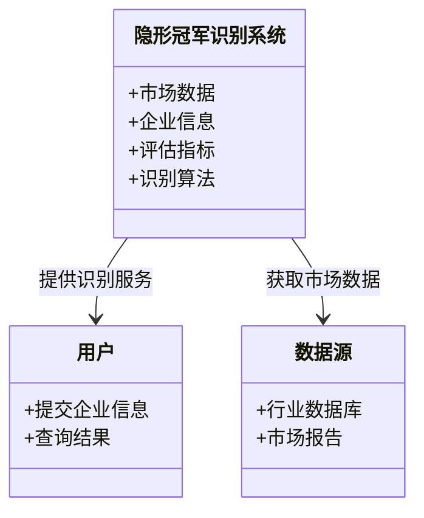

                 


```markdown
# 彼得林奇的"隐形冠军"在服务业中的发掘

> 关键词：隐形冠军、服务业、彼得林奇、投资策略、系统分析、领域模型

> 摘要：本文深入探讨了彼得林奇提出的“隐形冠军”概念在服务业中的应用，通过系统分析和案例研究，揭示了隐形冠军在不同服务领域的特点、识别方法和竞争优势，提供了从理论到实践的详细指导。

---

# 第一部分: 引言

## 1.1 隐形冠军的概念与背景
### 1.1.1 隐形冠军的定义
- 隐形冠军是指在特定市场中表现优异但不为大众所熟知的企业。
- 这些企业专注于细分市场，具有强大的竞争力和市场影响力。

### 1.1.2 隐形冠军在服务业中的重要性
- 服务业是隐形冠军的重要领域，尤其是金融、医疗和零售等行业。
- 隐形冠军在服务业中能够通过专注和创新实现长期成功。

### 1.1.3 研究隐形冠军的意义
- 帮助投资者识别潜在的高回报企业。
- 为服务业企业提供成长和发展的策略。

## 1.2 本书的目的与结构
### 1.2.1 本书的核心目标
- 探讨隐形冠军在服务业中的特点和成功因素。
- 提供识别和评估隐形冠军的方法。

### 1.2.2 本书的章节安排
- 从理论到实践，结合系统分析和案例研究。
- 包括引言、核心概念、行业分析、识别方法、系统设计和总结。

### 1.2.3 本书的阅读方法
- 每章均包含理论分析、案例研究和系统设计。
- 鼓励读者结合实际案例进行深入思考。

---

# 第二部分: 隐形冠军的核心概念与理论基础

## 2.1 隐形冠军的特点与属性
### 2.1.1 隐形冠军的核心特征
- 细分市场专注：专注于特定领域，成为该领域的领导者。
- 高质量与创新：通过创新和卓越的服务质量赢得客户。
- 稳定的财务表现：持续的盈利能力，具备长期发展潜力。

### 2.1.2 隐形冠军的市场定位
- 细分市场的领导者：在特定市场中占据主导地位。
- 高客户忠诚度：通过优质服务建立长期客户关系。

### 2.1.3 理论基础
- 市场细分理论：将市场划分为更小的细分市场，专注于特定领域。
- 长尾理论：通过服务长尾市场实现持续增长。

## 2.2 隐形冠军与传统冠军的对比
### 2.2.1 传统冠军的定义与特点
- 传统冠军通常指行业中的大型企业，市场份额广，但可能在细分市场中缺乏竞争力。
- 例如：大型连锁银行在零售银行市场中占据主导地位，但在某些细分领域可能不如隐形冠军。

### 2.2.2 隐形冠军与传统冠军的异同
- 隐形冠军专注于特定细分市场，而传统冠军可能在多个市场领域分散资源。
- 隐形冠军通常更灵活，能够更快适应市场变化。

### 2.2.3 隐形冠军的独特优势
- 更高的专注度：能够更深入地理解客户需求，提供更优质的服务。
- 更强的创新动力：由于资源有限，隐形冠军更倾向于通过创新来提升竞争力。

## 2.3 隐形冠军的理论基础
### 2.3.1 市场细分理论
- 市场细分通过将整体市场划分为更小、更具体的子市场，使企业能够专注于特定领域。
- 通过市场细分，企业可以更好地满足特定客户群体的需求。

### 2.3.2 长尾理论
- 长尾理论认为，大量分布在“尾部”的产品或服务，虽然单一产品的销量有限，但整体销量却可以与“头部”产品相媲美。
- 在服务业中，隐形冠军通常位于“长尾”部分，通过专注于特定市场实现持续增长。

### 2.3.3 小众市场优势
- 专注于小众市场意味着更少的竞争压力和更高的利润率。
- 隐形冠军能够在小众市场中建立强大的品牌忠诚度和客户关系。

---

# 第三部分: 服务业中的隐形冠军分析

## 3.1 服务业隐形冠军的行业分布
### 3.1.1 零售业中的隐形冠军
- 例如：某些专注于特定商品或服务的零售企业，通过提供差异化服务赢得客户。
- 他们可能在某个特定区域或特定客户群体中占据主导地位。

### 3.1.2 金融服务业中的隐形冠军
- 例如：专注于中小企业融资的金融服务机构，通过提供个性化服务赢得市场。
- 这些机构可能在特定金融产品或服务领域具有强大的竞争力。

### 3.1.3 医疗健康业中的隐形冠军
- 例如：专注于特定疾病治疗或健康管理的医疗机构。
- 这些机构可能通过提供高品质的医疗服务吸引特定客户群体。

## 3.2 服务业隐形冠军的成功因素
### 3.2.1 专注领域的选择
- 成功的隐形冠军通常会选择一个能够长期保持竞争优势的细分市场。
- 这个市场需要有一定的规模和潜力，同时竞争相对不激烈。

### 3.2.2 服务质量与创新
- 隐形冠军通常会投入大量的资源用于服务创新，以满足特定客户群体的需求。
- 通过持续改进服务质量，隐形冠军能够更好地留住客户。

### 3.2.3 客户关系管理
- 隐形冠军通常会建立强大的客户关系管理系统，通过深入了解客户需求，提供个性化的服务。
- 长期稳定的客户关系是隐形冠军成功的重要保障。

## 3.3 服务业隐形冠军的挑战与机遇
### 3.3.1 行业竞争压力
- 隐形冠军可能面临来自传统冠军和其他竞争对手的压力。
- 特别是在市场逐渐萎缩或竞争加剧的情况下，隐形冠军需要不断创新以保持竞争力。

### 3.3.2 技术创新带来的机会
- 技术进步为服务业隐形冠军提供了新的机会，例如通过数字化转型提升服务效率和客户体验。
- 利用新技术，隐形冠军可以更好地满足客户的需求，提高市场竞争力。

### 3.3.3 市场扩展的可能性
- 隐形冠军在成功巩固本地市场后，可以考虑向其他市场扩展。
- 通过市场扩展，隐形冠军可以进一步扩大市场份额，实现更高速度的增长。

---

# 第四部分: 隐形冠军的识别与评估

## 4.1 隐形冠军的识别标准
### 4.1.1 市场占有率
- 隐形冠军通常在特定市场中占据较高的市场份额。
- 但这并不意味着市场份额高即为隐形冠军，还需要考虑市场定位和竞争情况。

### 4.1.2 产品或服务的独特性
- 隐形冠军通常提供差异化的产品或服务，能够在竞争中脱颖而出。
- 例如：某些金融机构提供独特的金融产品，满足特定客户群体的需求。

### 4.1.3 企业规模与影响力
- 隐形冠军通常规模适中，能够在特定市场中占据重要地位。
- 与传统冠军相比，隐形冠军的规模较小，但影响力不可忽视。

## 4.2 隐形冠军的评估工具
### 4.2.1 市场分析工具
- 使用市场分析工具（如SWOT分析）评估企业的市场地位。
- 通过分析企业的优势、劣势、机会和威胁，确定其是否具备隐形冠军的潜力。

### 4.2.2 财务指标分析
- 评估企业的财务健康状况，包括利润率、资产负债率等指标。
- 隐形冠军通常具备稳定的财务表现，能够持续盈利。

### 4.2.3 客户满意度评估
- 通过客户满意度调查，评估企业提供的服务质量。
- 高客户满意度是隐形冠军的重要特征之一。

## 4.3 隐形冠军的培育与成长
### 4.3.1 核心竞争力的构建
- 确定企业的核心竞争力，专注于提升核心能力。
- 例如：零售企业专注于客户体验，金融服务机构专注于风险管理。

### 4.3.2 企业文化的塑造
- 培养专注、创新和客户至上的企业文化。
- 这种文化能够支持企业长期专注于特定市场，不断提升服务质量。

### 4.3.3 战略规划与执行
- 制定清晰的战略规划，明确企业的发展目标和路径。
- 通过有效执行战略，确保企业能够实现长期稳定发展。

---

# 第五部分: 系统分析与架构设计方案

## 5.1 问题场景介绍
### 5.1.1 服务业隐形冠军识别的复杂性
- 隐形冠军的识别需要综合考虑多个因素，包括市场定位、产品质量、客户满意度等。
- 这种复杂性要求我们采用系统化的分析方法。

### 5.1.2 系统化解决方案的需求
- 需要构建一个综合性的系统，能够整合各种数据和信息，支持隐形冠军的识别和评估。

## 5.2 系统功能设计
### 5.2.1 领域模型（Mermaid 类图）


### 5.2.2 系统功能模块
- 数据采集模块：收集企业信息、市场数据等。
- 评估模块：根据评估指标对企业和市场数据进行分析，识别潜在的隐形冠军。
- 结果展示模块：将识别结果以可视化形式展示给用户。

## 5.3 系统架构设计
### 5.3.1 分层架构设计
- 数据层：存储企业信息、市场数据等。
- 业务逻辑层：实现评估算法和业务逻辑。
- 表现层：展示系统输出的结果。

### 5.3.2 技术选型
- 前端：使用React或Vue.js实现动态交互界面。
- 后端：采用Spring Boot或Django框架，结合RESTful API实现数据接口。
- 数据库：使用MySQL或MongoDB存储结构化和非结构化数据。

## 5.4 系统接口设计
### 5.4.1 数据接口
- 提供RESTful API接口，允许其他系统或用户查询隐形冠军识别结果。
- 例如：GET /api/invisible_champions 查询特定行业的隐形冠军列表。

### 5.4.2 用户接口
- 提供友好的用户界面，允许用户提交企业信息并查看识别结果。
- 支持图表和表格形式的结果展示，便于用户理解和分析。

## 5.5 系统交互设计
### 5.5.1 用户登录与信息提交
- 用户登录系统后，提交企业的基本信息和市场数据。
- 系统将数据存入数据库，并启动评估流程。

### 5.5.2 评估结果展示
- 系统完成评估后，将结果以图表或表格形式展示给用户。
- 用户可以根据结果进一步分析和决策。

---

# 第六部分: 项目实战

## 6.1 环境安装
### 6.1.1 安装Python
- 下载并安装Python 3.8或更高版本。
- 安装Python环境管理工具（如virtualenv）。

### 6.1.2 安装依赖库
- 使用pip安装所需的依赖库，例如：
  ```
  pip install flask
  pip install pandas
  pip install matplotlib
  ```

## 6.2 系统核心实现源代码
### 6.2.1 数据采集模块
```python
import pandas as pd

def load_market_data():
    # 加载市场数据
    data = pd.read_csv('market_data.csv')
    return data

def load_company_info():
    # 加载企业信息
    data = pd.read_csv('company_info.csv')
    return data
```

### 6.2.2 评估模块
```python
def assess隐形冠军(data):
    # 数据预处理
    data = data.dropna()
    data = data.drop_duplicates()
    
    # 计算市场占有率
    market_share = data['market_share'].mean()
    
    # 评估产品质量
    product_quality = data['product_quality'].mean()
    
    # 综合评估
    score = (market_share + product_quality) / 2
    return score
```

### 6.2.3 结果展示模块
```python
import matplotlib.pyplot as plt

def visualize_results(scores):
    plt.bar(range(len(scores)), scores)
    plt.title('隐形冠军识别结果')
    plt.xlabel('企业编号')
    plt.ylabel('评分')
    plt.show()
```

## 6.3 代码应用解读与分析
### 6.3.1 数据加载与预处理
- 使用Pandas加载市场数据和企业信息。
- 删除空值和重复数据，确保数据的准确性。

### 6.3.2 评估算法实现
- 计算市场占有率和产品质量的平均值，作为评估的重要指标。
- 通过综合评分确定潜在的隐形冠军。

### 6.3.3 结果可视化
- 使用Matplotlib绘制柱状图，直观展示各企业的评分情况。
- 评分高的企业更有可能成为隐形冠军。

## 6.4 实际案例分析和详细讲解剖析
### 6.4.1 案例背景
- 以某家专注于医疗健康服务的企业为例，分析其是否具备隐形冠军的特征。

### 6.4.2 数据分析
- 通过数据分析工具，评估该企业的市场占有率和客户满意度。
- 结合行业报告，判断其是否具备隐形冠军的潜力。

### 6.4.3 结果讨论
- 讨论该企业在特定市场中的地位和竞争优势。
- 提出进一步优化的建议，帮助企业在未来实现更大的发展。

## 6.5 项目小结
### 6.5.1 项目总结
- 介绍了系统分析与实战项目的整体流程。
- 强调了理论与实践相结合的重要性。

### 6.5.2 项目成果
- 成功构建了一个能够识别服务业隐形冠军的系统。
- 提供了从理论到实践的详细指导。

### 6.5.3 项目意义
- 帮助投资者和企业识别潜在的隐形冠军。
- 为服务业企业提供了一个科学的评估和成长策略。

---

# 第七部分: 总结

## 7.1 核心内容回顾
### 7.1.1 隐形冠军的定义与重要性
- 隐形冠军是在特定市场中表现优异但不为大众所熟知的企业。
- 它们通过专注、创新和优质服务赢得市场和客户。

### 7.1.2 服务业中的隐形冠军
- 隐形冠军在服务业中具有重要的地位，尤其是在零售、金融和医疗等行业。
- 它们通过专注于特定市场和提供差异化服务实现长期成功。

## 7.2 最佳实践 tips
### 7.2.1 理论学习
- 深入理解隐形冠军的核心概念和理论基础。
- 通过案例分析，掌握隐形冠军在不同服务领域的特点。

### 7.2.2 系统设计
- 学习系统的整体架构设计和功能模块实现。
- 熟悉数据采集、评估和结果展示的全过程。

### 7.2.3 实战项目
- 将理论知识应用到实际项目中，通过实战提升技术能力和解决问题的能力。
- 通过实际案例分析，巩固所学知识，提高分析和决策能力。

## 7.3 小结
### 7.3.1 本文总结
- 本文深入探讨了隐形冠军在服务业中的应用，通过系统分析和案例研究，揭示了隐形冠军的特点、识别方法和竞争优势。
- 提供了从理论到实践的详细指导，帮助读者更好地理解和应用隐形冠军的概念。

### 7.3.2 未来展望
- 随着市场环境的变化和技术的进步，隐形冠军的概念和应用将不断扩展。
- 未来的研究可以进一步探索隐形冠军在新兴服务领域的应用，如人工智能、物联网等领域。

## 7.4 注意事项
### 7.4.1 理论与实践结合
- 在实际应用中，要注意理论与实践的结合，避免纸上谈兵。
- 通过不断实践，提升自己的技术水平和解决问题的能力。

### 7.4.2 数据分析的重要性
- 数据分析是识别隐形冠军的关键步骤，必须确保数据的准确性和完整性。
- 学习和掌握数据分析工具和技术，是成为隐形冠军识别专家的重要基础。

### 7.4.3 持续学习与创新
- 服务业是一个不断变化的领域，隐形冠军需要不断创新以保持竞争力。
- 通过持续学习和关注行业动态，保持对隐形冠军概念和方法的更新。

## 7.5 拓展阅读
### 7.5.1 推荐书籍
- 《彼得·林奇的投资哲学》
- 《长尾理论》
- 《服务营销》

### 7.5.2 推荐文章
- 隐形冠军的识别与评估方法
- 服务业数字化转型与隐形冠军的机遇
- 隐形冠军在新兴服务领域的应用

### 7.5.3 推荐视频
- 隐形冠军与服务业的系统分析
- 服务业数字化转型的实践案例
- 隐形冠军识别工具的使用与优化

---

# 作者：AI天才研究院/AI Genius Institute & 禅与计算机程序设计艺术/Zen And The Art of Computer Programming
```

