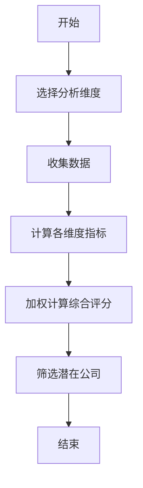
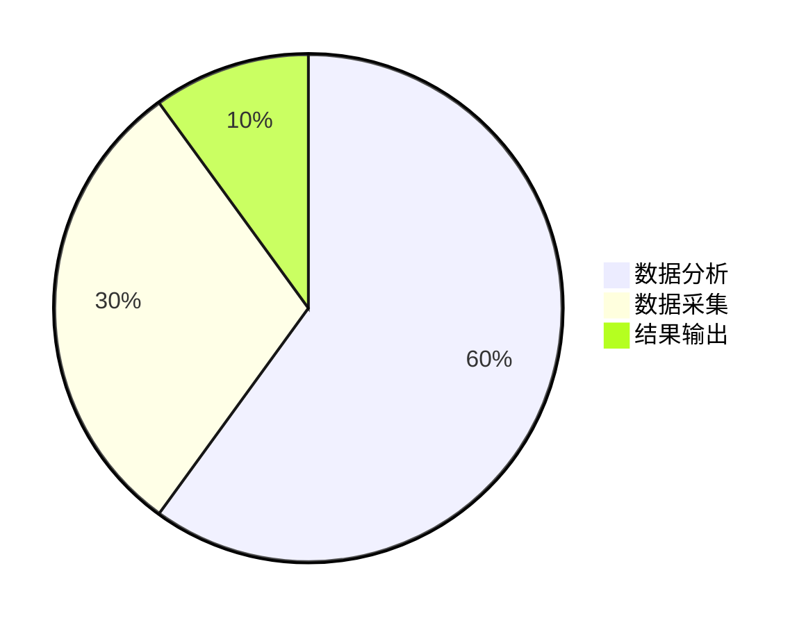
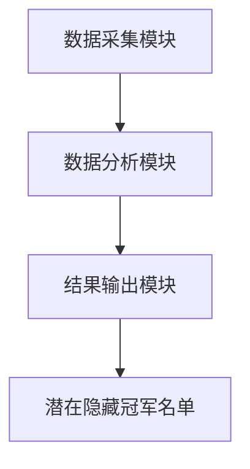

                 


# 彼得林奇的"隐藏冠军"发掘技巧

> 关键词：隐藏冠军，彼得林奇，投资策略，财务指标，系统架构，算法模型

> 摘要：本文详细阐述了彼得林奇的“隐藏冠军”投资理念，通过分析其核心概念、识别方法、系统架构和实际案例，帮助读者掌握如何发现和投资这些潜力巨大的企业。

---

## 第一章 引言：彼得林奇与“隐藏冠军”投资理念

### 1.1 彼得林奇的投资哲学

#### 1.1.1 彼得林奇的生平简介

彼得·林奇（Peter Lynch）是美国著名的职业棒球运动员和投资家，以其在棒球界和金融界的双重成就而闻名。他在棒球领域是波士顿红袜队的明星投手，在金融领域则是富达投资集团的传奇基金经理。林奇的投资理念以基本面分析和长期持有为核心，强调寻找那些具有持续竞争优势和成长潜力的公司。

#### 1.1.2 隐藏冠军的定义与特点

“隐藏冠军”是指那些在特定行业中表现卓越，但尚未被广泛认知的公司。这些公司通常具有强大的竞争优势、稳定的财务状况和良好的成长潜力。与市场上的热门股票不同，隐藏冠军往往处于被低估的状态，具有较高的投资价值。

#### 1.1.3 隐藏冠军的投资价值

隐藏冠军的投资价值在于其潜在的高回报和低风险。由于这些公司尚未被市场充分挖掘，投资者可以在较早阶段介入，获得超额收益。同时，隐藏冠军通常具有较高的壁垒和竞争优势，能够在市场中长期保持领先地位。

### 1.2 隐藏冠军的核心理念

#### 1.2.1 隐藏冠军的定义

隐藏冠军是指那些在特定市场或行业中占据领先地位，但未被广泛认知的公司。这些公司通常具有强大的竞争优势、稳定的财务状况和良好的成长潜力。

#### 1.2.2 隐藏冠军的特点

- **行业领先地位**：在特定行业中占据领先地位，具有较高的市场份额。
- **竞争优势明显**：拥有独特的竞争优势，如技术、品牌、成本优势等。
- **财务状况稳健**：具有稳定的盈利能力、健康的资产负债表和良好的现金流。
- **成长潜力大**：具备较高的增长潜力，能够在未来几年内实现持续增长。

#### 1.2.3 隐藏冠军的投资逻辑

隐藏冠军的投资逻辑基于基本面分析和长期投资理念。投资者需要深入研究公司的财务状况、行业地位、竞争优势和管理团队，寻找那些具有持续增长潜力的公司。

### 1.3 隐藏冠军与传统投资策略的区别

#### 1.3.1 传统投资策略的局限性

传统投资策略往往关注市场趋势、短期波动和市场情绪，忽视了公司的基本面和长期发展潜力。这种方法可能导致投资者在市场波动中做出错误决策，错失长期投资机会。

#### 1.3.2 隐藏冠军的独特优势

隐藏冠军的独特优势在于其长期增长潜力和低估状态。通过深入分析公司的基本面，投资者可以在市场低估时介入，获得超额收益。

#### 1.3.3 隐藏冠军的适用场景

隐藏冠军适用于长期投资者和价值投资者。对于那些愿意花时间研究公司基本面的投资者来说，隐藏冠军提供了较高的回报潜力。

---

## 第二章 隐藏冠军的核心概念与分析框架

### 2.1 隐藏冠军的核心概念

#### 2.1.1 隐藏冠军的定义

隐藏冠军是指那些在特定行业中表现卓越，但尚未被广泛认知的公司。这些公司通常具有强大的竞争优势和成长潜力。

#### 2.1.2 隐藏冠军的特点

- **行业领先地位**：在特定行业中占据领先地位。
- **竞争优势明显**：具有技术、品牌或成本优势。
- **财务状况稳健**：盈利能力稳定，资产负债表健康。
- **成长潜力大**：具备较高的增长潜力。

#### 2.1.3 隐藏冠军的属性特征对比

| 特性                | 隐藏冠军          | 传统投资标的      |
|---------------------|-------------------|-------------------|
| 行业地位            | 特定行业领先      | 无特定行业限制    |
| 竞争优势            | 明显             | 无明显竞争优势    |
| 财务状况            | 稳健             | 不一定稳健        |
| 成长潜力            | 高               | 一般或低          |

#### 2.1.4 隐藏冠军的ER实体关系图

```mermaid
erDiagram
    customer[客户] {
        id : integer
        name : string
        email : string
    }
    company[公司] {
        id : integer
        name : string
        industry : string
    }
    investment[投资] {
        id : integer
        customer_id : integer
        company_id : integer
        amount : float
        date : date
    }
    customer --> investment : 投资于
    company --> investment : 被投资于
```

### 2.2 隐藏冠军的分析框架

#### 2.2.1 隐藏冠军的分析维度

- **财务指标**：盈利能力、成长性、估值等。
- **行业分析**：行业地位、竞争格局、发展趋势。
- **竞争优势**：技术、品牌、成本等。

#### 2.2.2 隐藏冠军的分析流程

1. **初步筛选**：根据行业地位和财务指标筛选潜在公司。
2. **深入分析**：研究公司的竞争优势、管理团队和成长潜力。
3. **投资决策**：综合分析结果，决定是否投资。

#### 2.2.3 隐藏冠军的分析工具

- **财务报表分析**：利润表、资产负债表、现金流量表。
- **行业分析工具**：市场研究报告、行业趋势分析。
- **竞争优势分析**：波特五力模型、价值链分析。

---

## 第三章 隐藏冠军的识别方法与算法原理

### 3.1 隐藏冠军的识别方法

#### 3.1.1 财务指标分析

- **盈利能力**：净利润率、ROE。
- **成长性**：收入增长率、净利润增长率。
- **估值**：市盈率、市净率。

#### 3.1.2 行业分析

- **行业地位**：市场份额、行业排名。
- **竞争格局**：行业集中度、竞争对手分析。
- **发展趋势**：行业增长率、未来前景。

#### 3.1.3 竞争优势分析

- **技术优势**：技术创新、专利数量。
- **品牌优势**：品牌知名度、客户忠诚度。
- **成本优势**：成本控制、供应链优势。

### 3.2 隐藏冠军识别算法的数学模型

#### 3.2.1 算法原理

隐藏冠军识别算法基于多维度的综合评价，通过加权计算各维度指标，筛选出具有较高潜力的公司。

#### 3.2.2 数学模型

$$
\text{综合评分} = \sum (\text{权重}_i \times \text{指标}_i)
$$

其中，权重和指标的具体数值需要根据实际情况确定。

#### 3.2.3 算法流程图



---

## 第四章 隐藏冠军的系统分析与架构设计

### 4.1 隐藏冠军的系统分析

#### 4.1.1 系统分析框架

- **输入**：公司数据、行业数据。
- **处理**：数据清洗、特征提取、模型计算。
- **输出**：潜在隐藏冠军名单。

#### 4.1.2 系统功能设计

- **数据采集**：从数据库或API获取公司数据。
- **数据分析**：计算各维度指标，生成综合评分。
- **结果输出**：输出潜在隐藏冠军名单。

#### 4.1.3 系统架构设计



### 4.2 隐藏冠军的系统架构图



---

## 第五章 隐藏冠军的项目实战

### 5.1 隐藏冠军的项目实战

#### 5.1.1 环境安装与配置

- **工具**：Python、Pandas、Matplotlib。
- **数据源**：公司财务数据、行业报告。

#### 5.1.2 核心代码实现

```python
import pandas as pd

def calculate_companies(filePath):
    df = pd.read_csv(filePath)
    df['综合评分'] = df['净利润率'] * 0.4 + df['收入增长率'] * 0.3 + df['ROE'] * 0.3
    top_companies = df[df['综合评分'] > 70].sort_values('综合评分', ascending=False)
    return top_companies

# 示例使用
result = calculate_companies('companies.csv')
print(result.head())
```

#### 5.1.3 代码解读与分析

上述代码从CSV文件中读取公司数据，计算综合评分，并筛选出评分高于70的公司。综合评分基于净利润率、收入增长率和ROE计算，权重分别为40%、30%和30%。

### 5.2 隐藏冠军的案例分析

#### 5.2.1 案例背景介绍

以某行业的中小公司为例，分析其是否为隐藏冠军。

#### 5.2.2 案例分析过程

1. **数据采集**：获取公司过去5年的财务数据。
2. **数据分析**：计算财务指标，分析行业地位。
3. **综合评分**：计算综合评分，筛选潜在公司。

#### 5.2.3 案例结果与总结

通过分析，该公司被识别为隐藏冠军，具备较高的投资价值。

---

## 第六章 隐藏冠军的最佳实践与总结

### 6.1 最佳实践

- **持续学习**：不断更新知识，适应市场变化。
- **深入研究**：全面分析公司的基本面。
- **长期持有**：避免短期波动，获取长期收益。

### 6.2 总结

彼得林奇的隐藏冠军理念为投资者提供了发现潜在高回报公司的方法。通过系统分析和深入研究，投资者可以在市场中找到那些被低估的优质企业。

### 6.3 注意事项

- **风险管理**：分散投资，降低风险。
- **持续监控**：定期评估投资组合。
- **避免过度自信**：客观分析，避免情绪化决策。

### 6.4 拓展阅读

- 彼得林奇的其他著作。
- 投资分析的相关书籍。
- 金融市场的最新研究。

---

## 作者信息

作者：AI天才研究院/AI Genius Institute & 禅与计算机程序设计艺术 /Zen And The Art of Computer Programming

---

通过以上内容，我们系统地介绍了彼得林奇的“隐藏冠军”投资理念，从理论到实践，帮助读者掌握如何发现和投资这些潜力巨大的公司。

