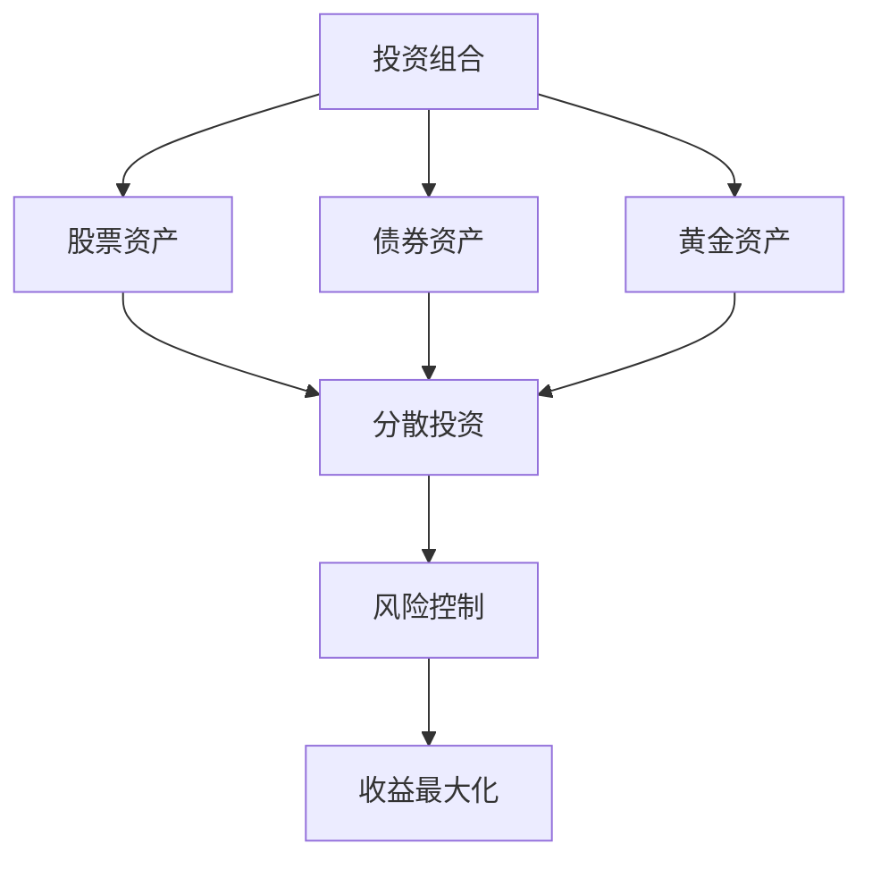

                 

# 彼得林奇的风险管理原则

> 关键词：风险管理，彼得·林奇，投资原则，风险分散，投资组合优化

> 摘要：本文深入探讨了彼得·林奇的风险管理原则，分析了其在投资中的应用，通过数学模型和实际案例展示了如何通过分散投资、避免过度集中和关注长期趋势来实现稳健的投资回报。

---

## 引言

### 1.1 彼得·林奇的背景介绍

彼得·林奇（Peter Lynch）是美国著名的投资专家，曾任富达投资管理公司的基金经理，管理着麦哲伦基金，取得了卓越的投资业绩。他提出了许多独特的风险管理原则，强调通过分散投资和长期趋势分析来控制风险。

---

## 风险管理的核心概念与联系

### 2.1 风险与收益的关系

在投资中，风险和收益是密不可分的。彼得·林奇认为，高收益往往伴随着高风险，但通过合理的风险管理，可以在控制风险的前提下实现收益最大化。

### 2.2 投资组合的风险分散原理

风险分散是彼得·林奇风险管理的核心思想。通过将资金分散投资于不同的资产类别、行业和地理区域，可以有效降低单一资产带来的风险。

### 2.3 彼得·林奇风险管理原则的独特性

彼得·林奇的风险管理原则注重长期趋势分析和对市场情绪的把握，强调在市场恐慌时寻找低估资产，在市场狂热时保持冷静。

---

## 彼得·林奇风险管理原则的核心算法原理

### 3.1 风险分散算法

风险分散算法通过将投资组合分散到多个不相关的资产，降低整体组合的波动性。例如，将资金分配到股票、债券、房地产等多种资产中，以分散市场风险。

### 3.2 投资组合优化算法

投资组合优化算法通过数学模型计算出最优的资产配置，以最大化收益并最小化风险。常用夏普比率（Sharpe Ratio）来衡量投资组合的超额收益与风险之比。

$$ \text{夏普比率} = \frac{E[r_p] - r_f}{\sigma_p} $$

其中，$E[r_p]$是投资组合的预期收益，$r_f$是无风险利率，$\sigma_p$是投资组合的波动率。

---

## 项目实战：构建风险管理投资组合

### 4.1 项目介绍

我们以构建一个包含股票、债券和黄金的投资组合为例，展示如何应用彼得·林奇的风险管理原则。

### 4.2 系统架构设计

### 4.3 投资组合优化

通过分析市场状况，确定各资产的配置比例。例如，在市场上涨周期，增加股票配置；在市场下跌周期，增加债券和黄金配置。

### 4.4 实际案例分析

假设2023年市场预测为中性，投资组合配置为股票60%、债券30%、黄金10%。通过定期监控各资产的表现，调整配置比例以应对市场变化。

---

## 总结

彼得·林奇的风险管理原则为投资者提供了在复杂市场环境中稳健投资的策略。通过风险分散、长期趋势分析和动态调整，投资者可以在控制风险的前提下实现收益最大化。

---

## 作者

作者：AI天才研究院/AI Genius Institute & 禅与计算机程序设计艺术 /Zen And The Art of Computer Programming

---

本文通过详细分析彼得·林奇的风险管理原则，结合数学模型和实际案例，为读者提供了在投资中应用这些原则的实用指南。希望读者能够通过本文，掌握风险管理的核心思想，并在实际投资中灵活运用这些策略。

