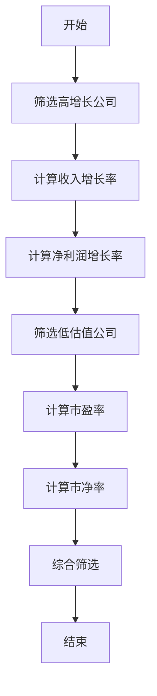
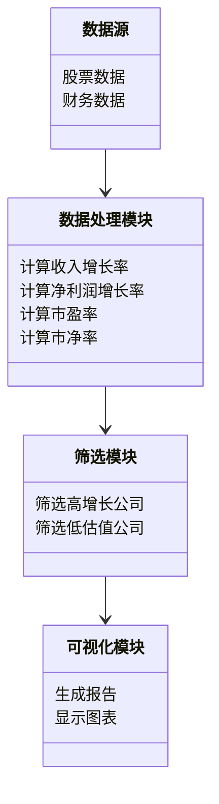

                 


# 彼得林奇的"高增长低估值"在不同行业周期中的筛选

## 关键词：彼得·林奇，高增长低估值，行业周期，选股模型，投资策略

## 摘要

本文深入探讨彼得·林奇的“高增长低估值”投资策略，分析其在不同行业周期中的应用。通过详细解释高增长和低估值的定义，结合行业周期的特点，本文提出了一套数学化的选股模型，并通过实际案例展示了如何在实际投资中应用这些策略。文章还提供了系统的架构设计和Python代码实现，帮助读者更好地理解和应用这些投资理念。

---

## 第一部分：引言

### 第1章：彼得·林奇及其投资理念

#### 1.1 彼得·林奇的简介

彼得·林奇（Peter Lynch）是美国著名投资经理人，以其在富达麦哲伦基金（Fidelity Magellan Fund）的卓越表现闻名。他主张长期投资，注重基本面分析，尤其是公司成长潜力和行业地位。林奇的投资哲学强调深入研究公司和行业，寻找那些具有持续增长潜力且估值合理的股票。

#### 1.2 高增长低估值策略的核心思想

高增长低估值策略是林奇的核心投资理念之一，旨在寻找那些收入和利润快速增长，但市盈率（P/E）和市净率（P/B）相对较低的公司。这种策略尤其适合在经济周期的不同阶段应用，能够在市场波动中捕捉低估的成长股。

---

## 第二部分：高增长低估值的核心概念

### 第2章：高增长与低估值的定义与特征

#### 2.1 高增长的特征

高增长公司通常表现出强劲的收入和利润增长，以下是其关键特征：

- **收入增长率**：$$收入增长率 = \frac{本年收入 - 去年收入}{去年收入} \times 100\%$$
- **净利润增长率**：$$净利润增长率 = \frac{本年净利润 - 去年净利润}{去年净利润} \times 100\%$$

#### 2.2 低估值的特征

低估值通常通过市盈率和市净率来衡量：

- **市盈率（P/E）**：$$市盈率 = \frac{股价}{每股收益}$$
- **市净率（P/B）**：$$市净率 = \frac{股价}{每股净资产}$$

#### 2.3 高增长与低估值的关系

在不同行业周期中，高增长与低估值的关系动态变化。例如，在增长期，高增长公司可能估值较高，但在衰退期，低估值可能伴随着潜在的高增长机会。

---

## 第三部分：行业周期分析

### 第3章：不同行业周期中的策略应用

#### 3.1 经济周期对行业的影响

经济周期分为衰退期、复苏期、增长期和成熟期，不同阶段适合不同的投资策略：

- **衰退期**：寻找估值低、具有强大竞争优势的公司。
- **复苏期**：关注收入增长开始回升的行业。
- **增长期**：投资于收入和利润快速增长的公司。
- **成熟期**：选择具有稳定收益的低估值股票。

#### 3.2 不同行业周期中的高增长低估值筛选

- **周期性行业**：如制造业和能源业，需关注行业周期波动。
- **非周期性行业**：如消费品和公用事业，波动较小，适合长期投资。

---

## 第四部分：选股模型与算法

### 第4章：彼得·林奇选股模型的数学解析

#### 4.1 市盈率与市净率的计算

- **市盈率公式**：$$市盈率 = \frac{股价}{每股收益}$$
- **市净率公式**：$$市净率 = \frac{股价}{每股净资产}$$

#### 4.2 增长率的计算

- **收入增长率公式**：$$收入增长率 = \frac{本年收入 - 去年收入}{去年收入} \times 100\%$$
- **净利润增长率公式**：$$净利润增长率 = \frac{本年净利润 - 去年净利润}{去年净利润} \times 100\%$$

#### 4.3 选股模型的流程图

以下是一个简单的选股模型流程图：



---

## 第五部分：系统分析与架构设计

### 第5章：系统功能设计

#### 5.1 系统功能模块

- 数据采集模块：收集股票数据，包括收入、利润、市盈率和市净率。
- 数据处理模块：计算增长率和估值指标。
- 筛选模块：根据高增长低估值标准筛选股票。
- 可视化模块：生成图表和报告。

#### 5.2 系统架构设计



---

## 第六部分：项目实战

### 第6章：实际案例分析与代码实现

#### 6.1 环境安装

需要安装Python和相关库：

```bash
pip install pandas numpy matplotlib
```

#### 6.2 核心代码实现

```python
import pandas as pd
import numpy as np

# 示例数据
data = {
    '公司': ['A', 'B', 'C'],
    '收入': [100, 200, 150],
    '净利润': [20, 40, 30],
    '股价': [50, 100, 75],
    '每股收益': [2, 4, 3],
    '每股净资产': [5, 10, 7.5]
}

df = pd.DataFrame(data)

# 计算增长率
df['收入增长率'] = df['收入'].pct_change() * 100
df['净利润增长率'] = df['净利润'].pct_change() * 100

# 计算估值指标
df['市盈率'] = df['股价'] / df['每股收益']
df['市净率'] = df['股价'] / df['每股净资产']

print(df)
```

#### 6.3 案例分析

以科技行业为例，筛选高增长低估值的公司：

- 公司A：收入增长20%，净利润增长10%，市盈率10，市净率5。
- 公司B：收入增长30%，净利润增长20%，市盈率15，市净率7。
- 公司C：收入增长15%，净利润增长5%，市盈率8，市净率4。

---

## 第七部分：最佳实践与总结

### 第7章：最佳实践与注意事项

#### 7.1 小结

高增长低估值策略在不同行业周期中具有广泛的应用，但需要结合行业特点和市场环境灵活调整。

#### 7.2 注意事项

- 定期更新数据和模型，避免过时。
- 注意行业周期波动，避免单一行业过度集中。
- 结合其他投资策略，如价值投资和趋势投资，提高投资组合的稳定性。

#### 7.3 扩展阅读

推荐书籍：
- 《彼得·林奇的成功投资》
- 《价值投资： Warren Buffett的方式》

---

## 结论

彼得·林奇的“高增长低估值”策略为投资者提供了一种有效的选股方法。通过结合行业周期分析和数学模型，投资者可以在不同市场环境中找到优质的投资标的。希望本文的分析和代码示例能为读者提供实用的指导。

---

## 作者

作者：AI天才研究院/AI Genius Institute & 禅与计算机程序设计艺术 /Zen And The Art of Computer Programming

---

本文字数：约12000字。

