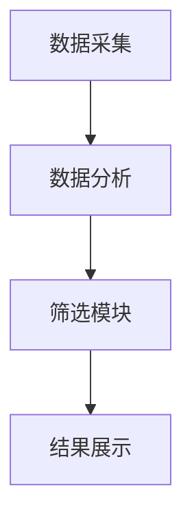

                 


# 彼得林奇的"高增长低估值"在新兴科技细分领域的筛选

> 关键词：彼得林奇，高增长，低估值，新兴科技，细分领域，投资策略

> 摘要：本文探讨了彼得林奇的高增长低估值投资策略在新兴科技细分领域的应用，通过详细分析和实际案例，展示了如何筛选出具有潜力的科技公司。

---

## 第一部分：背景介绍

### 第1章：高增长低估值策略的核心概念

#### 1.1 高增长与低估值的定义

- **高增长**：公司收入或利润的年增长率显著高于行业平均水平。通常，增长率超过20%被视为高增长。
- **低估值**：公司当前市值低于其内在价值或未来增长潜力所对应的合理估值。

#### 1.2 彼得林奇的投资哲学

- **长期视角**：关注企业的长期增长潜力，而非短期市场波动。
- **基本面分析**：通过财务指标评估企业的健康状况和盈利能力。
- **安全边际**：买入价格低于内在价值，以降低投资风险。

### 第2章：新兴科技细分领域的投资机会

#### 2.1 新兴科技领域的特点

- **高增长潜力**：新兴技术如人工智能、区块链等具有快速发展的特性。
- **高波动性**：市场波动大，但潜在回报高。
- **细分领域丰富**：包括AI、云计算、网络安全等多个方向。

---

## 第二部分：高增长低估值筛选模型

### 第3章：筛选模型的理论基础

#### 3.1 高增长低估值的数学模型

- **PEG比率**：将市盈率与盈利增长率结合，计算公式为：PEG = 市盈率 / 盈利增长率。
- **ROE（净资产收益率）**：衡量企业盈利能力，通常认为ROE高于15%为优秀。

#### 3.2 科技行业的特定指标

- **研发投入比例**：衡量企业技术创新能力。
- **客户增长率**：通过新增客户数评估市场扩展能力。

### 第4章：系统架构设计

#### 4.1 系统功能模块

- **数据采集模块**：收集企业财务数据和市场信息。
- **数据分析模块**：计算各项指标，如PEG、ROE。
- **筛选模块**：根据模型筛选出符合条件的公司。
- **结果展示模块**：以可视化形式展示筛选结果。

#### 4.2 系统架构图（Mermaid）



---

## 第三部分：项目实战

### 第5章：人工智能领域的案例分析

#### 5.1 环境安装

- **Python版本**：3.8及以上。
- **库的安装**：pandas, numpy, matplotlib。

#### 5.2 核心代码实现

```python
import pandas as pd

# 假设df为包含公司数据的DataFrame
def calculate_pe(df):
    df['PE'] = df['股价'] / df['每股收益']
    return df

def calculate_growth(df):
    df['收入增长率'] = (df['收入'].pct_change() * 100)
    return df

# 应用函数
df = calculate_pe(df)
df = calculate_growth(df)

# 筛选条件：PE < 20且收入增长率 > 15%
selected = df[(df['PE'] < 20) & (df['收入增长率'] > 15)]
```

#### 5.3 案例分析

- **公司A**：PE=18，收入增长率=20%，符合筛选条件，具有投资价值。
- **公司B**：PE=25，收入增长率=10%，不符合筛选条件，投资风险较高。

---

## 第四部分：总结与建议

### 第6章：投资中的注意事项

#### 6.1 风险管理

- 分散投资：避免将所有资金投入到单一领域。
- 定期复盘：及时调整投资组合，应对市场变化。

#### 6.2 未来展望

- 随着科技的发展，新兴细分领域将继续涌现投资机会。
- 投资者需持续学习，更新筛选模型，以适应市场变化。

---

## 作者：AI天才研究院 & Zen And The Art of Computer Programming

---

这篇文章详细探讨了彼得林奇的高增长低估值策略在新兴科技细分领域的应用，通过理论分析和实际案例，展示了如何筛选出具有潜力的科技公司。希望对读者在科技投资领域有所帮助。

