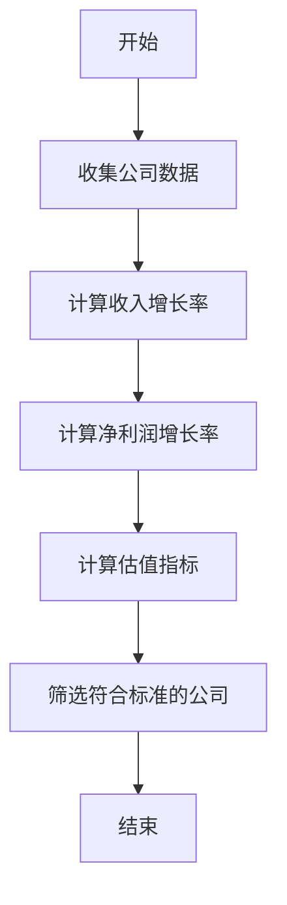
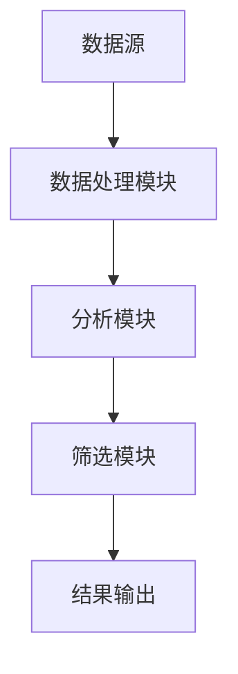

                 


# 彼得林奇的"高增长低估值"在新兴科技股中的筛选标准

## 关键词：彼得林奇、高增长低估值、新兴科技股、投资筛选标准、股票分析、投资策略

## 摘要：本文深入探讨了彼得林奇的高增长低估值投资理念，并将其应用于新兴科技股的筛选标准。通过详细分析高增长低估值的定义、数学模型和实际案例，本文为投资者提供了一套系统化的筛选方法，帮助他们在科技股投资中做出明智决策。

---

# 第1章: 彼得林奇投资理念的背景与核心思想

## 1.1 彼得林奇的生平简介
- 彼得·林奇的职业生涯：富达投资管理公司、共同基金领域的卓越表现
- 林奇的投资哲学：价值投资与成长投资的结合

## 1.2 高增长低估值的定义与核心要素
- 高增长的定义：收入增长率、净利润增长率
- 低估值的定义：市盈率、市净率、市销率
- 平衡点：如何在高增长与低估值之间找到最佳结合点

## 1.3 高增长低估值投资理念的核心逻辑
- 市场情绪与估值的关系：市场的非理性与估值的波动
- 公司成长性与股价的关系：成长驱动股价长期上涨
- 高增长低估值的长期收益潜力：通过低估的价格买入高增长公司，实现超额收益

---

# 第2章: 高增长低估值在新兴科技股中的筛选标准

## 2.1 新兴科技股的特点与风险
- 行业周期：科技行业的波动性与成长性并存
- 竞争格局：技术迭代快，竞争激烈
- 风险因素：高波动性、技术风险、政策风险

## 2.2 高增长低估值筛选标准的具体指标
- 收入增长率：年收入同比增长率，衡量公司业务扩张能力
- 净利润增长率：净利润同比增长率，反映盈利能力提升
- 市盈率：股价与每股收益的比率，衡量估值水平
- 市净率：股价与每股净资产的比率，适用于资产密集型行业
- 市销率：股价与每股营业收入的比率，适用于高增长公司

## 2.3 新兴科技股的行业分析与筛选策略
- 行业周期分析：处于成长期的科技行业更具投资价值
- 竞争优势分析：技术壁垒、市场占有率、创新能力
- 财务指标分析：关注收入增长与利润增长的匹配性
- 市场情绪分析：避免过度拥挤的市场，寻找被低估的标的

---

# 第3章: 高增长低估值筛选标准的数学模型与算法原理

## 3.1 高增长低估值的数学模型
### 3.1.1 收入增长率模型
$$
收入增长率 = \frac{收入_t - 收入_{t-1}}{收入_{t-1}}
$$

### 3.1.2 净利润增长率模型
$$
净利润增长率 = \frac{净利润_t - 净利润_{t-1}}{净利润_{t-1}}
$$

### 3.1.3 估值指标模型
$$
市盈率 = \frac{股价}{每股收益}
$$
$$
市净率 = \frac{股价}{每股净资产}
$$
$$
市销率 = \frac{股价}{每股营业收入}
$$

## 3.2 算法原理与流程图
### 3.2.1 算法流程图


---

# 第4章: 新兴科技股的系统分析与架构设计

## 4.1 问题场景介绍
- 新兴科技股投资的复杂性与挑战
- 系统化分析的必要性

## 4.2 系统功能设计
- 数据收集模块：获取公司财务数据与行业信息
- 分析模块：计算增长率与估值指标
- 筛选模块：基于标准筛选目标公司

## 4.3 系统架构设计


---

# 第5章: 项目实战与案例分析

## 5.1 环境安装与数据准备
- 数据源：公开财报数据、股价数据
- 工具：Python、Pandas、Matplotlib

## 5.2 核心实现源代码
```python
import pandas as pd
import matplotlib.pyplot as plt

# 示例数据
data = {
    '公司': ['A', 'B', 'C'],
    '收入': [100, 200, 150],
    '净利润': [20, 30, 25],
    '股价': [50, 60, 45],
    '每股收益': [2, 3, 1.5]
}

df = pd.DataFrame(data)

# 计算收入增长率
df['收入增长率'] = df['收入'].pct_change() * 100

# 计算净利润增长率
df['净利润增长率'] = df['净利润'].pct_change() * 100

# 计算市盈率
df['市盈率'] = df['股价'] / df['每股收益']

print(df)
```

## 5.3 实际案例分析
- 案例1：某科技公司收入增长率为30%，市盈率为20，符合高增长低估值标准
- 案例2：某科技公司收入增长率为10%，市盈率为40，不符合标准

---

# 第6章: 投资策略与风险管理

## 6.1 投资策略
- 分散投资：避免过度集中
- 定期复评：根据最新数据调整投资组合

## 6.2 风险管理
- 设置止损点：控制单笔投资的亏损上限
- 风险分散：通过投资不同行业和公司降低风险

## 6.3 注意事项
- 避免追涨杀跌：理性分析市场情绪
- 长期视角：高增长低估值需要时间验证

---

# 第7章: 结论与展望

## 7.1 结论
- 彼得林奇的高增长低估值理念在新兴科技股中具有实用价值
- 系统化的筛选方法能够提高投资效率

## 7.2 展望
- 结合人工智能技术优化筛选模型
- 持续关注科技行业的创新与发展

---

# 作者：AI天才研究院 & 禅与计算机程序设计艺术

