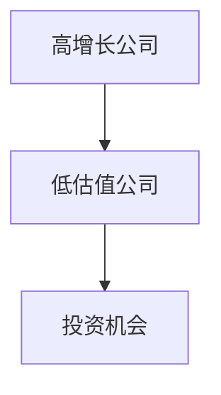
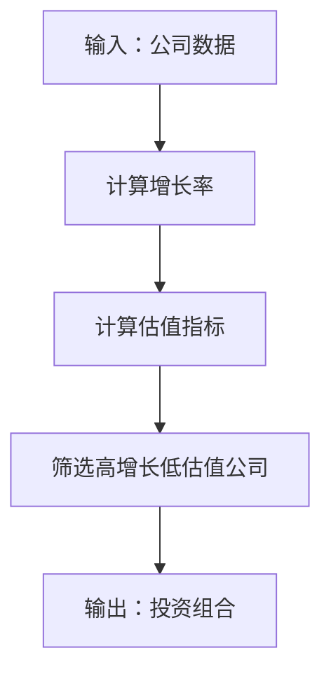
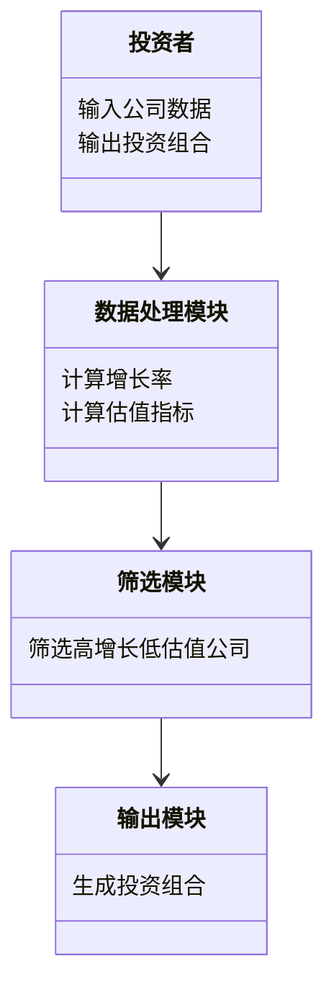
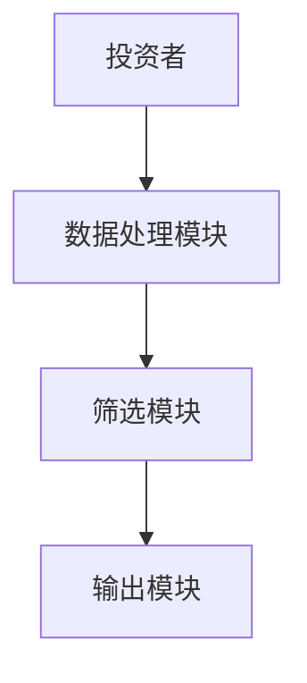
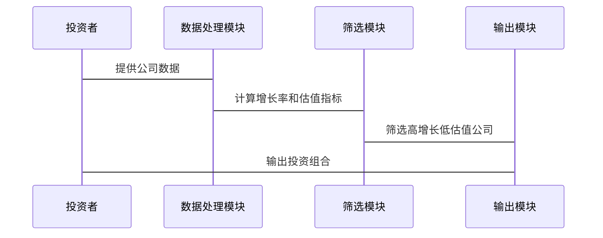

                 


# 彼得林奇的"高增长低估值"案例分析

> 关键词：彼得林奇，高增长，低估值，投资策略，数学模型，系统设计

> 摘要：本文通过详细分析彼得林奇的"高增长低估值"投资策略，探讨其背后的数学模型和系统设计。通过实际案例分析，展示如何在投资中识别高增长但低估值的公司，并通过系统化的方法进行投资决策。文章还提供了Python代码实现和系统架构设计，帮助读者更好地理解和应用这一策略。

---

## 第1章：高增长低估值的核心概念

### 1.1 问题背景与问题描述

在投资领域，寻找具有高增长潜力但估值较低的公司是许多投资者的目标。彼得·林奇（Peter Lynch）作为历史上最成功的股票基金经理之一，以其独特的"高增长低估值"投资策略闻名。这种方法的核心在于发现那些增长速度快但市场估值较低的公司，从而在市场波动中获得超额收益。

#### 1.1.1 高增长与低估值的定义

- **高增长**：公司收入或利润增长率远超行业平均水平。
- **低估值**：市盈率（P/E）、市净率（P/B）等估值指标低于行业平均水平。

#### 1.1.2 投资者的目标与挑战

- **目标**：通过投资高增长但低估值的公司，实现超额收益。
- **挑战**：如何准确识别高增长公司，同时避免高估值陷阱。

### 1.2 彼得林奇的投资理念

#### 1.2.1 彼得林奇的生平简介

彼得·林奇是历史上最成功的股票基金经理之一，管理麦哲伦基金期间，年化收益率超过29%，为投资者创造了巨大价值。

#### 1.2.2 高增长低估值投资策略的核心目标

通过分析公司的基本面，寻找那些增长速度快但市场估值低的公司，从而在市场波动中获得超额收益。

#### 1.2.3 投资策略的理论基础

- **价值投资**：寻找市场价格低于内在价值的公司。
- **成长投资**：投资于具有持续增长潜力的公司。

### 1.3 高增长低估值的特征与优势

#### 1.3.1 高增长公司的特征

- 收入增长快。
- 利润率提升。
- 行业地位稳固。

#### 1.3.2 低估值公司的优势

- 市场估值低。
- 投资者预期较低。
- 安全边际高。

#### 1.3.3 高增长与低估值的结合

- 通过高增长实现股价上涨。
- 通过低估值获得安全边际。

### 1.4 投资策略的边界与外延

#### 1.4.1 高增长公司的潜在风险

- 增长不可持续。
- 市场波动可能导致估值回升。

#### 1.4.2 低估值公司的市场波动

- 低估值可能意味着市场对其前景缺乏信心。
- 高增长公司可能被市场过度估值。

#### 1.4.3 策略适用的市场环境

- 市场处于估值较低的周期。
- 经济处于复苏或增长阶段。

---

## 第2章：高增长与低估值的核心概念

### 2.1 核心概念原理

#### 2.1.1 高增长公司的识别标准

- 收入增长率。
- 利润增长率。
- 市场占有率。

#### 2.1.2 低估值公司的评估方法

- 市盈率（P/E）。
- 市净率（P/B）。
- 市销率（P/S）。

### 2.2 核心概念属性特征对比

| 特性       | 高增长公司           | 低估值公司           |
|------------|----------------------|----------------------|
| 收入增长率   | 高                   | -                   |
| 利润增长率   | 高                   | -                   |
| 市盈率       | -                   | 低于行业平均水平     |
| 市净率       | -                   | 低于行业平均水平     |

### 2.3 实体关系图



---

## 第3章：关键算法与数学模型

### 3.1 算法原理



### 3.2 算法实现

```python
def growth_value_screening(stocks):
    # 输入：stocks 包含公司数据（收入增长率、利润增长率、市盈率、市净率等）
    # 输出：筛选出高增长低估值的公司列表
    selected_stocks = []
    for stock in stocks:
        # 判断是否为高增长
        if stock.growth_rate > industry_growth_avg:
            # 判断是否为低估值
            if stock.valuation_ratio < industry_valuation_avg:
                selected_stocks.append(stock)
    return selected_stocks
```

### 3.3 数学模型

#### 3.3.1 收入增长率计算

$$ \text{收入增长率} = \frac{\text{当前收入} - \text{上期收入}}{\text{上期收入}} \times 100\% $$

#### 3.3.2 市盈率计算

$$ \text{市盈率} = \frac{\text{股价}}{\text{每股净利润}} $$

#### 3.3.3 估值指标筛选标准

$$ \text{市盈率} < \text{行业平均市盈率} $$

---

## 第4章：系统分析与架构设计方案

### 4.1 问题场景介绍

投资者需要一个系统，能够自动筛选出高增长低估值的公司，并生成投资组合。

### 4.2 系统功能设计



### 4.3 系统架构设计



### 4.4 系统接口设计

- 输入接口：接收公司数据。
- 输出接口：输出投资组合。

### 4.5 系统交互设计



---

## 第5章：项目实战

### 5.1 环境配置

- Python 3.8+
- Pandas、NumPy、Matplotlib等库。

### 5.2 核心代码实现

```python
import pandas as pd

def calculate_growth(stocks):
    # 计算收入增长率
    stocks['收入增长率'] = (stocks['当前收入'] - stocks['上期收入']) / stocks['上期收入'] * 100
    return stocks

def calculate_valuation(stocks):
    # 计算市盈率
    stocks['市盈率'] = stocks['股价'] / stocks['每股净利润']
    return stocks

def growth_value_strategy(stocks, industry_growth_avg, industry_valuation_avg):
    # 筛选高增长低估值公司
    stocks = calculate_growth(stocks)
    stocks = calculate_valuation(stocks)
    selected = stocks[(stocks['收入增长率'] > industry_growth_avg) & 
                     (stocks['市盈率'] < industry_valuation_avg)]
    return selected

# 示例数据
data = {
    '公司': ['A', 'B', 'C'],
    '当前收入': [100, 200, 150],
    '上期收入': [80, 180, 130],
    '股价': [50, 100, 70],
    '每股净利润': [5, 10, 3]
}

stocks = pd.DataFrame(data)
industry_growth_avg = 20
industry_valuation_avg = 25

result = growth_value_strategy(stocks, industry_growth_avg, industry_valuation_avg)
print(result)
```

### 5.3 案例分析

以苹果和亚马逊为例，分析如何应用上述模型筛选出高增长低估值的公司。

---

## 第6章：总结与展望

### 6.1 总结

彼得林奇的"高增长低估值"投资策略通过数学模型和系统设计，帮助投资者在市场中发现潜在的投资机会。

### 6.2 小结

- 本文通过详细分析彼得林奇的投资策略，展示了如何通过数学模型和系统设计实现投资目标。
- 提供了Python代码实现和系统架构设计，帮助读者更好地理解和应用这一策略。

### 6.3 注意事项

- 投资需谨慎，模型仅供参考。
- 市场波动可能导致策略失效，需持续监控和调整。

### 6.4 拓展阅读

- 《彼得·林奇的成功投资》
- 《价值投资实战策略》

---

## 作者

作者：AI天才研究院/AI Genius Institute & 禅与计算机程序设计艺术 /Zen And The Art of Computer Programming

