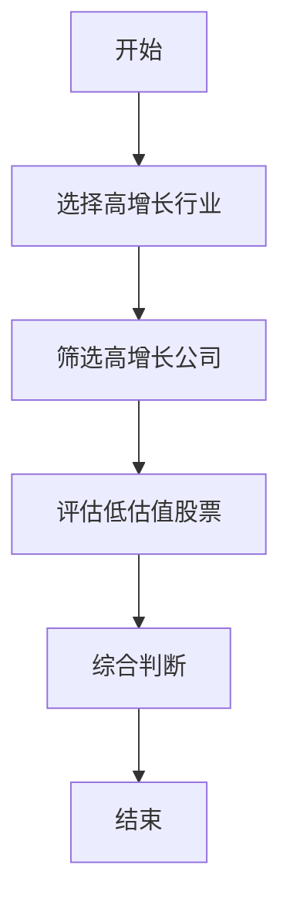
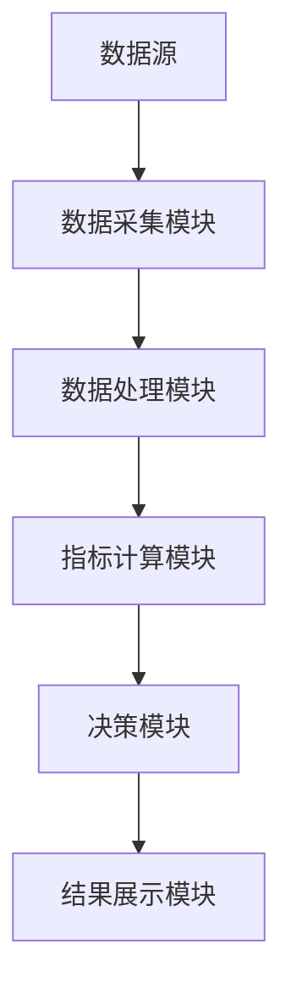

                 


---

# 彼得林奇的"高增长低估值"筛选技巧

> 关键词：彼得林奇，高增长，低估值，投资筛选，股票分析，投资策略

> 摘要：本文深入探讨了彼得林奇的高增长低估值筛选技巧，分析了如何识别高增长公司和评估低估值股票，并结合实际案例展示了如何在投资中应用这些技巧。文章结构清晰，内容详实，适合投资者和金融从业者阅读。

---

## 第1章: 高增长低估值筛选技巧概述

### 1.1 彼得林奇投资理念的核心思想

彼得·林奇是全球著名投资专家，以其独特的高增长低估值筛选技巧闻名。他主张投资于那些具有高增长潜力但市场价格被低估的公司。这种方法的核心在于平衡公司的成长性和市场的估值水平，从而在投资中获得超额收益。

#### 1.1.1 什么是高增长

高增长公司通常是指那些收入和利润持续快速增长的企业。这些公司往往处于高速发展的行业，具有强大的市场竞争力和增长潜力。彼得·林奇认为，选择高增长公司是投资成功的关键之一。

#### 1.1.2 什么是低估值

低估值股票是指市场价格低于其内在价值的股票。通常，低估值股票的市盈率、市净率等估值指标低于行业平均水平。彼得·林奇认为，低估值股票提供了良好的投资机会，因为市场往往会低估这些公司的潜在价值。

#### 1.1.3 高增长与低估值的结合

高增长和低估值的结合是彼得·林奇筛选技巧的核心。他寻找那些收入和利润快速增长，但市场价格却被低估的公司。这种结合使得投资者能够在公司价值被市场发现前进入，从而获得超额收益。

### 1.2 高增长低估值筛选的背景与意义

#### 1.2.1 投资市场的基本问题

投资市场的核心问题是如何在众多股票中找到那些具有长期增长潜力且价格合理的企业。市场中存在大量高增长和低估值的公司，但如何准确识别和筛选是投资者面临的挑战。

#### 1.2.2 高增长与低估值的市场机会

高增长公司通常具有较高的成长性，而低估值股票则可能被市场忽视或低估。两者结合提供了良好的投资机会，尤其是在市场周期性波动期间，这种策略往往能够捕捉到被低估的优质股票。

#### 1.2.3 筛选技巧的现实意义

彼得·林奇的筛选技巧为投资者提供了一种系统化的方法，帮助他们在复杂的市场环境中识别出具有长期增长潜力且价格合理的企业。这种方法不仅适用于个股选择，也适用于行业和市场的整体分析。

### 1.3 彼得林奇筛选技巧的核心要素

#### 1.3.1 高增长公司的识别标准

高增长公司的识别标准主要包括收入增长率、净利润增长率、市场占有率等方面。彼得·林奇特别关注收入和利润的持续增长，认为这是公司成长性的关键指标。

#### 1.3.2 低估值股票的评估指标

低估值股票的评估指标包括市盈率（P/E）、市净率（P/B）等。彼得·林奇认为，低估值股票通常具有较高的安全边际，即市场价格远低于其内在价值。

#### 1.3.3 高增长与低估值的平衡点

高增长和低估值之间需要找到一个平衡点。彼得·林奇强调，投资者应该寻找那些增长速度快但估值水平较低的公司，避免选择增长过快但估值过高的股票。

---

## 第2章: 高增长公司的识别与分析

### 2.1 高增长公司的定义与特征

高增长公司是指那些收入和利润持续快速增长的企业。这些公司通常处于高速发展的行业，具有强大的市场竞争力和增长潜力。

#### 2.1.1 高增长公司的定义

高增长公司通常是指那些过去几年收入和利润持续增长，并且未来有望继续保持增长趋势的企业。彼得·林奇认为，高增长公司是投资成功的关键之一。

#### 2.1.2 高增长公司的核心特征

高增长公司的核心特征包括：

- **收入增长率**：通常超过行业平均水平。
- **净利润增长率**：持续增长，且净利润率较高。
- **市场占有率**：在行业内具有较高的市场占有率。
- **行业前景**：行业处于高速发展阶段。

#### 2.1.3 高增长公司的财务表现

高增长公司的财务表现通常表现为：

- **收入和利润的快速增长**：收入增长率和净利润增长率均较高。
- **健康的财务状况**：低负债率，高净资产收益率（ROE）。
- **良好的现金流**：经营活动现金流充裕，能够支持公司的持续增长。

### 2.2 高增长公司的筛选标准

#### 2.2.1 营收增长率的计算与分析

营收增长率是衡量公司增长能力的重要指标。彼得·林奇通常选择那些营收增长率超过行业平均水平的公司。

**计算公式**：
$$
\text{营收增长率} = \frac{\text{本期营收} - \text{上期营收}}{\text{上期营收}} \times 100\%
$$

#### 2.2.2 净利润增长率的计算与分析

净利润增长率是衡量公司盈利能力的重要指标。彼得·林奇通常选择那些净利润增长率持续高于行业平均水平的公司。

**计算公式**：
$$
\text{净利润增长率} = \frac{\text{本期净利润} - \text{上期净利润}}{\text{上期净利润}} \times 100\%
$$

#### 2.2.3 市场占有率的评估与分析

市场占有率是衡量公司在行业中的地位的重要指标。彼得·林奇认为，具有较高市场占有率的公司通常具有更强的市场竞争力和增长潜力。

### 2.3 高增长公司的行业分析

#### 2.3.1 高增长行业的定义与特征

高增长行业是指那些市场需求快速增长，行业规模迅速扩大的行业。这些行业通常处于技术革新或消费升级的阶段。

#### 2.3.2 高增长行业的筛选标准

彼得·林奇通常选择那些市场需求快速增长，行业规模迅速扩大的行业。例如，科技、互联网、消费等行业往往具有较高的增长潜力。

#### 2.3.3 行业趋势的分析与预测

彼得·林奇强调，投资者需要深入分析行业趋势，了解行业的增长动力和潜在风险。这包括对行业周期、市场容量、竞争格局等因素的分析。

---

## 第3章: 低估值股票的评估与分析

### 3.1 低估值股票的定义与特征

低估值股票是指市场价格低于其内在价值的股票。这些股票通常具有较高的安全边际，即市场价格远低于其内在价值。

#### 3.1.1 低估值股票的定义

低估值股票是指市场价格低于其内在价值的股票。彼得·林奇认为，低估值股票通常具有较高的投资价值，因为市场往往会低估这些公司的潜在价值。

#### 3.1.2 低估值股票的核心特征

低估值股票的核心特征包括：

- **低市盈率（P/E）**：市盈率低于行业平均水平。
- **低市净率（P/B）**：市净率低于行业平均水平。
- **高股息率**：股息率较高，且股息支付稳定。
- **合理的市销率（P/S）**：市销率低于行业平均水平。

#### 3.1.3 低估值股票的财务表现

低估值股票的财务表现通常表现为：

- **合理的估值水平**：市盈率、市净率等估值指标低于行业平均水平。
- **健康的财务状况**：低负债率，高净资产收益率（ROE）。
- **稳定的股息支付**：股息支付稳定，且股息率较高。

### 3.2 低估值股票的筛选标准

#### 3.2.1 市盈率的计算与分析

市盈率是衡量股票估值的重要指标。彼得·林奇通常选择那些市盈率低于行业平均水平的股票。

**计算公式**：
$$
\text{市盈率} = \frac{\text{股票价格}}{\text{每股净利润}} 
$$

#### 3.2.2 市净率的计算与分析

市净率是衡量股票估值的另一个重要指标。彼得·林奇认为，市净率低于行业平均水平的股票通常具有较高的投资价值。

**计算公式**：
$$
\text{市净率} = \frac{\text{股票价格}}{\text{每股净资产}} 
$$

#### 3.2.3 股价与内在价值的对比分析

彼得·林奇强调，投资者需要将市场价格与内在价值进行对比分析。市场价格低于内在价值的股票通常具有较高的投资价值。

### 3.3 低估值股票的行业分析

#### 3.3.1 低估值行业的定义与特征

低估值行业是指那些市场价格低于其内在价值的行业。这些行业通常处于周期性底部或市场低迷时期。

#### 3.3.2 低估值行业的筛选标准

彼得·林奇通常选择那些市场价格低于其内在价值的行业。例如，在市场低迷时期，一些传统行业可能会出现低估值机会。

#### 3.3.3 行业趋势的分析与预测

彼得·林奇强调，投资者需要深入分析行业趋势，了解行业的增长动力和潜在风险。这包括对行业周期、市场容量、竞争格局等因素的分析。

---

## 第4章: 高增长与低估值的结合

### 4.1 高增长与低估值的结合策略

彼得·林奇的高增长低估值筛选技巧的核心在于将高增长和低估值结合起来。他寻找那些收入和利润快速增长，但市场价格却被低估的公司。

#### 4.1.1 综合筛选标准

彼得·林奇的综合筛选标准包括：

- **营收增长率**：超过行业平均水平。
- **净利润增长率**：持续增长，且净利润率较高。
- **市盈率**：低于行业平均水平。
- **市净率**：低于行业平均水平。
- **市场占有率**：在行业内具有较高的市场占有率。

#### 4.1.2 筛选流程

彼得·林奇的筛选流程包括以下几个步骤：

1. **行业分析**：选择处于高速发展阶段的行业。
2. **公司筛选**：在选定的行业中筛选收入和利润快速增长的公司。
3. **估值评估**：评估公司的市盈率、市净率等估值指标。
4. **综合判断**：结合公司的成长性和估值水平，选择那些高增长但低估值的公司。

### 4.2 筛选技巧的数学模型与公式

彼得·林奇的高增长低估值筛选技巧可以通过以下数学模型和公式进行量化分析。

#### 4.2.1 综合评分模型

综合评分模型是将公司的成长性和估值水平进行综合评分，从而筛选出高增长低估值的公司。

**计算公式**：
$$
\text{综合评分} = 0.5 \times \text{成长性评分} + 0.5 \times \text{估值评分}
$$

其中，成长性评分和估值评分分别基于营收增长率、净利润增长率、市盈率、市净率等指标进行评分。

#### 4.2.2 成长性评分

成长性评分是基于公司的营收增长率和净利润增长率进行评分。

**计算公式**：
$$
\text{成长性评分} = 0.5 \times \text{营收增长率} + 0.5 \times \text{净利润增长率}
$$

#### 4.2.3 估值评分

估值评分是基于公司的市盈率和市净率进行评分。

**计算公式**：
$$
\text{估值评分} = 0.5 \times \text{市盈率} + 0.5 \times \text{市净率}
$$

### 4.3 筛选流程的图表展示

以下是彼得·林奇高增长低估值筛选技巧的流程图：



---

## 第5章: 投资分析系统的架构设计

### 5.1 系统功能设计

投资分析系统的核心功能包括：

- **数据采集**：采集公司的财务数据和市场数据。
- **指标计算**：计算营收增长率、净利润增长率、市盈率、市净率等指标。
- **决策模块**：基于综合评分模型进行筛选。
- **结果展示**：展示筛选结果和投资建议。

### 5.2 系统架构设计

以下是投资分析系统的架构图：



### 5.3 系统实现与实战案例

#### 5.3.1 环境安装

以下是投资分析系统所需的环境和工具：

- **Python**：用于数据分析和编程。
- **Pandas**：用于数据处理和分析。
- **Matplotlib**：用于数据可视化。
- **Jupyter Notebook**：用于数据分析和展示。

#### 5.3.2 核心代码实现

以下是投资分析系统的核心代码实现：

```python
import pandas as pd
import numpy as np

# 数据采集模块
def collect_data():
    # 从数据库中采集数据
    data = pd.read_sql("SELECT * FROM company_data", con=db_connection)
    return data

# 数据处理模块
def process_data(data):
    # 数据清洗和预处理
    data = data.dropna()
    data = data.drop_duplicates()
    return data

# 指标计算模块
def calculate_indicators(data):
    # 计算营收增长率
    data['营收增长率'] = data['营收'].pct_change()
    # 计算净利润增长率
    data['净利润增长率'] = data['净利润'].pct_change()
    # 计算市盈率
    data['市盈率'] = data['股价'] / data['每股净利润']
    # 计算市净率
    data['市净率'] = data['股价'] / data['每股净资产']
    return data

# 决策模块
def screening(data, threshold=0.5):
    # 综合评分模型
    data['成长性评分'] = 0.5 * data['营收增长率'] + 0.5 * data['净利润增长率']
    data['估值评分'] = 0.5 * data['市盈率'] + 0.5 * data['市净率']
    data['综合评分'] = 0.5 * data['成长性评分'] + 0.5 * data['估值评分']
    # 筛选高增长低估值公司
    selected = data[data['综合评分'] > threshold]
    return selected

# 结果展示模块
def display_results(selected):
    print("高增长低估值公司列表:")
    print(selected[['公司名称', '营收增长率', '净利润增长率', '市盈率', '市净率', '综合评分']])
```

#### 5.3.3 代码应用解读与分析

以下是代码的应用解读与分析：

1. **数据采集模块**：从数据库中采集公司数据，包括营收、净利润、股价等指标。
2. **数据处理模块**：对数据进行清洗和预处理，去除缺失值和重复值。
3. **指标计算模块**：计算营收增长率、净利润增长率、市盈率、市净率等指标。
4. **决策模块**：基于综合评分模型进行筛选，综合考虑公司的成长性和估值水平。
5. **结果展示模块**：展示筛选结果，包括公司名称、营收增长率、净利润增长率、市盈率、市净率和综合评分。

#### 5.3.4 实际案例分析

以下是实际案例分析：

假设我们有以下公司数据：

| 公司名称 | 营收 | 净利润 | 股价 | 每股净利润 | 每股净资产 |
|---------|------|--------|------|------------|------------|
| 公司A   | 100  | 20     | 10   | 0.2        | 2          |
| 公司B   | 150  | 30     | 15   | 0.2        | 3          |
| 公司C   | 200  | 40     | 20   | 0.2        | 4          |

计算各公司的指标：

1. **营收增长率**：
   - 公司A：无数据（假设为初始数据）
   - 公司B：50%
   - 公司C：33.3%

2. **净利润增长率**：
   - 公司A：无数据（假设为初始数据）
   - 公司B：50%
   - 公司C：33.3%

3. **市盈率**：
   - 公司A：50
   - 公司B：75
   - 公司C：100

4. **市净率**：
   - 公司A：5
   - 公司B：5
   - 公司C：5

5. **综合评分**：
   - 公司A：无数据
   - 公司B：0.5*50 + 0.5*50 = 50
   - 公司C：0.5*33.3 + 0.5*33.3 = 33.3

根据综合评分模型，公司B的综合评分为50，高于阈值0.5，因此被筛选为高增长低估值公司。

---

## 第6章: 总结与建议

### 6.1 总结

彼得·林奇的高增长低估值筛选技巧是一种有效的投资策略，通过综合考虑公司的成长性和估值水平，能够在市场中找到那些具有长期增长潜力且价格合理的企业。本文详细介绍了高增长公司的识别标准和低估值股票的评估指标，并结合实际案例展示了如何在投资中应用这些技巧。

### 6.2 最佳实践 tips

- **持续学习**：投资市场变化莫测，投资者需要不断学习和更新知识。
- **分散投资**：不要将所有资金投入到少数几家公司，分散投资可以降低风险。
- **长期持有**：高增长低估值公司通常具有长期增长潜力，投资者应耐心持有。

### 6.3 注意事项

- **风险控制**：投资有风险，投资者需要做好风险控制，避免过度集中投资。
- **市场波动**：市场波动是不可避免的，投资者需要保持冷静，避免情绪化决策。
- **数据准确性**：数据是投资分析的基础，投资者需要确保数据的准确性和完整性。

### 6.4 拓展阅读

- 《彼得·林奇的选股标准》
- 《价值投资入门》
- 《投资学基础》

---

## 作者：AI天才研究院 & 禅与计算机程序设计艺术

---

这篇文章详细介绍了彼得·林奇的高增长低估值筛选技巧，并结合实际案例展示了如何在投资中应用这些技巧。希望对投资者和金融从业者有所帮助。

