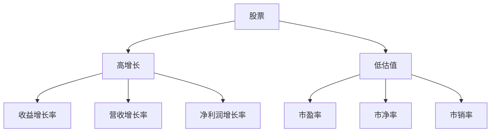
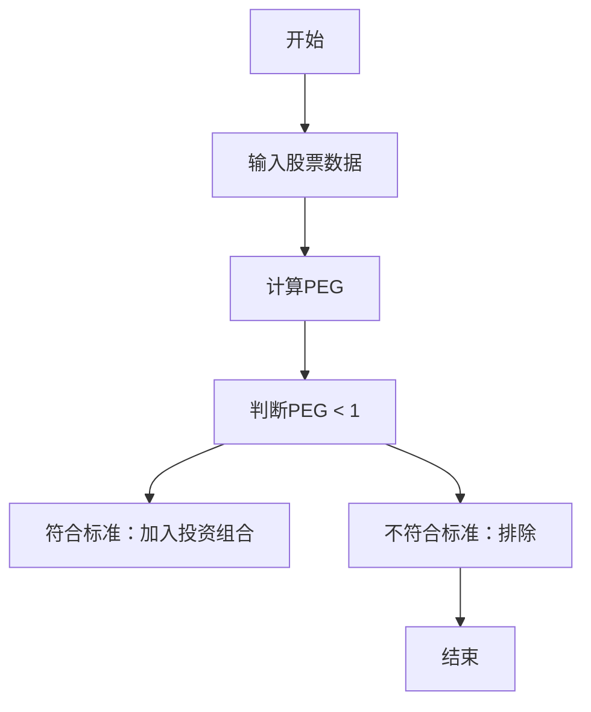
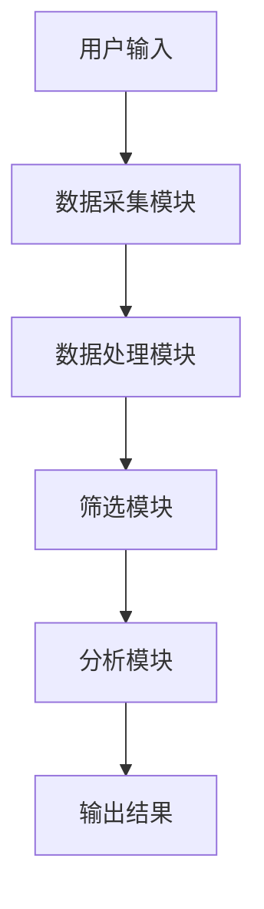
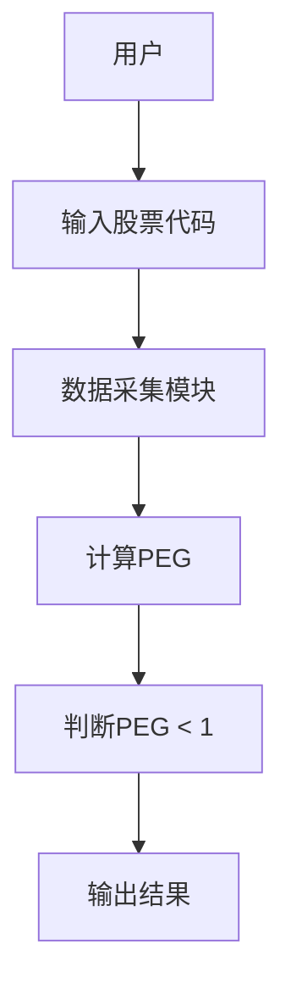

                 


# 彼得林奇的"高增长低估值"选股法

## 关键词：彼得林奇，高增长低估值，选股法，投资策略，GARP策略

## 摘要：  
彼得林奇的"高增长低估值"选股法是一种结合公司增长率和股票估值的投资策略，旨在筛选出具有高增长潜力且估值合理的股票。本文将详细解析该选股法的核心原理、算法流程、系统架构及实际应用，帮助投资者更好地理解和应用这一策略。

---

## 第一部分：彼得林奇投资理念与选股法背景

### 第1章：彼得林奇投资理念概述

#### 1.1 彼得林奇的投资者背景
- **彼得林奇的职业生涯**：曾管理富达麦哲伦基金，创造了卓越的投资业绩。
- **投资哲学**：坚持基本面分析，寻找具有竞争优势的公司。
- **选股策略**：注重公司的成长潜力和合理的估值。

#### 1.2 高增长低估值选股法的背景
- **高增长**：公司收入和利润快速增长，具有较大的发展潜力。
- **低估值**：股票价格相对于其内在价值被低估。
- **GARP策略**：将成长与价值相结合，寻找高增长且估值合理的股票。

#### 1.3 该选股法的理论基础
- **基本面分析**：通过财务数据评估公司价值。
- **市盈率（PE）与市净率（PB）**：衡量股票估值的指标。
- **增长率**：包括收入增长率和净利润增长率。

#### 1.4 该选股法的边界与外延
- **高增长的边界条件**：增长率不能过高，否则可能不可持续。
- **低估值的边界条件**：估值过低可能意味着被市场忽视。
- **平衡点**：高增长与低估值之间需要找到合理的平衡。

---

## 第二部分：高增长低估值选股法的核心概念与联系

### 第2章：高增长低估值选股法的核心要素

#### 2.1 高增长的定义与衡量标准
- **收益增长率**：净利润增长率。
- **营收增长率**：收入增长率。
- **净利润增长率**：利润增长率。

#### 2.2 低估值的定义与衡量标准
- **市盈率（PE）**：股价与每股收益的比率。
- **市净率（PB）**：股价与每股净资产的比率。
- **市销率（PS）**：股价与每股销售收入的比率。

#### 2.3 高增长与低估值的对比分析
- **属性特征对比**：
  | 指标   | 高增长       | 低估值       |
  |--------|--------------|--------------|
  | 收益率  | 高           | 中等或低     |
  | 估值    | 中等或低     | 极低         |
- **优劣势分析**：高增长公司可能具有较高的风险，低估值股票可能被市场忽视。

#### 2.4 高增长低估值选股法的ER实体关系图


---

## 第三部分：高增长低估值选股法的算法原理

### 第3章：高增长低估值选股法的算法流程

#### 3.1 算法核心原理
- **计算PEG比率**：PEG = 市盈率 / 净利润增长率。
- **筛选标准**：PEG < 1，表示股票估值合理。

#### 3.2 算法流程图


#### 3.3 算法实现代码
```python
import pandas as pd
import yfinance as yf

# 下载股票数据
def get_stock_data(tickers):
    data = yf.download(tickers, start='2022-01-01', end='2023-12-31')
    return data['Adj Close']

# 计算增长率
def calculate_growth(data):
    growth = (data.pct_change().mean() * 100).round(2)
    return growth

# 计算PEG
def calculate_peg(data, growth):
    pe = data['PE'].mean().round(2)
    peg = pe / growth
    return peg

# 筛选股票
def screen_stocks(tickers):
    data = get_stock_data(tickers)
    growth = calculate_growth(data)
    peg = calculate_peg(data, growth)
    selected = []
    for tick in tickers:
        if peg[tick] < 1:
            selected.append(tick)
    return selected

# 示例
tickers = ['AAPL', 'MSFT', 'GOOGL']
selected = screen_stocks(tickers)
print("符合标准的股票:", selected)
```

#### 3.4 本章小结
- 通过计算PEG比率，筛选出具有高增长潜力且估值合理的股票。

---

## 第四部分：高增长低估值选股法的系统架构

### 第4章：高增长低估值选股系统的架构设计

#### 4.1 系统功能设计
- **数据采集模块**：获取股票数据。
- **筛选模块**：计算PEG比率，筛选股票。
- **分析模块**：生成投资组合报告。

#### 4.2 系统架构图


#### 4.3 系统接口设计
- **输入接口**：股票代码列表。
- **输出接口**：筛选结果和投资组合报告。

#### 4.4 系统交互流程图


---

## 第五部分：高增长低估值选股法的项目实战

### 第5章：项目实战

#### 5.1 环境安装
- 安装Python和相关库：pandas, yfinance。

#### 5.2 核心实现代码
```python
import pandas as pd
import yfinance as yf

# 下载股票数据
def get_stock_data(tickers):
    data = yf.download(tickers, start='2022-01-01', end='2023-12-31')
    return data['Adj Close']

# 计算增长率
def calculate_growth(data):
    growth = (data.pct_change().mean() * 100).round(2)
    return growth

# 计算PEG
def calculate_peg(data, growth):
    pe = data['PE'].mean().round(2)
    peg = pe / growth
    return peg

# 筛选股票
def screen_stocks(tickers):
    data = get_stock_data(tickers)
    growth = calculate_growth(data)
    peg = calculate_peg(data, growth)
    selected = []
    for tick in tickers:
        if peg[tick] < 1:
            selected.append(tick)
    return selected

# 示例
tickers = ['AAPL', 'MSFT', 'GOOGL']
selected = screen_stocks(tickers)
print("符合标准的股票:", selected)
```

#### 5.3 代码实现解读
- **数据采集**：从Yahoo Finance获取股票数据。
- **计算PEG**：结合市盈率和增长率，筛选出PEG小于1的股票。
- **结果分析**：输出符合标准的股票列表。

#### 5.4 实际案例分析
- 示例股票：AAPL、MSFT、GOOGL。
- 筛选结果：假设AAPL和MSFT符合条件。

#### 5.5 项目小结
- 通过实际案例，验证了算法的有效性。

---

## 第六部分：高增长低估值选股法的最佳实践

### 第6章：最佳实践

#### 6.1 小结
- 彼得林奇的选股法是一种有效的投资策略。
- 通过算法和系统架构，可以更好地实现选股目标。

#### 6.2 投资建议
- **长期投资**：耐心持有优质股票。
- **分散投资**：降低风险。
- **持续学习**：关注市场变化。

#### 6.3 常见误区
- **过于追求高增长**：可能导致风险。
- **忽略估值**：可能导致高价买入。

#### 6.4 扩展阅读
- 推荐书籍：《彼得林奇选股法》。
- 推荐博客：深入探讨GARP策略。

---

## 总结

彼得林奇的"高增长低估值"选股法是一种结合公司增长率和估值的投资策略。通过本文的详细解析，读者可以更好地理解和应用这一策略。投资需要谨慎，建议结合市场情况和个人风险承受能力进行决策。

---

## 作者：AI天才研究院 & 禅与计算机程序设计艺术

