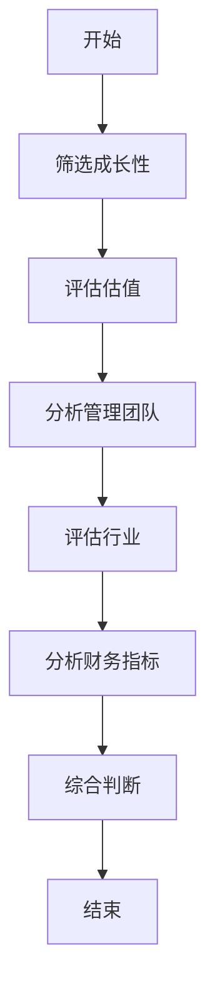
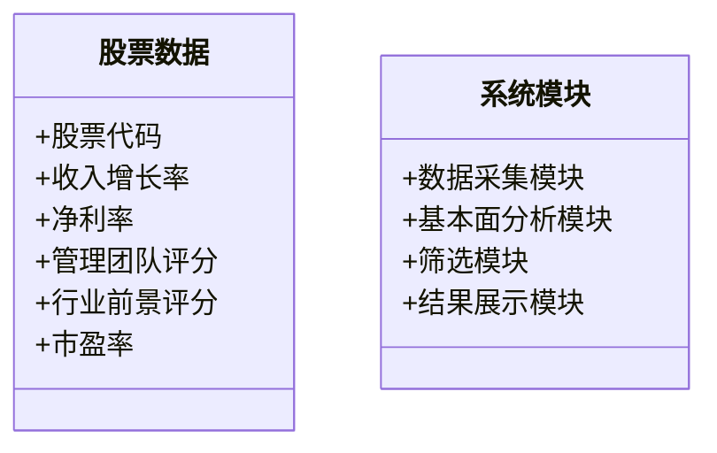
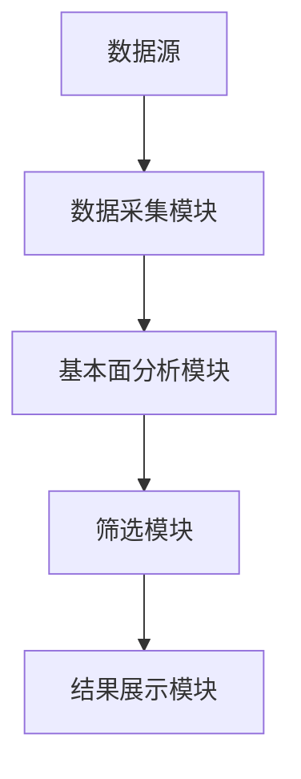

                 


# 彼得林奇选股策略解析

> 关键词：彼得林奇，选股策略，成长性，估值，基本面分析，投资哲学

> 摘要：本文详细解析了彼得林奇的选股策略，从其投资哲学、核心概念到具体算法和系统架构，结合实际案例和项目实战，帮助读者深入理解并应用这一经典投资策略。

---

# 第一部分：彼得林奇选股策略背景与基础

## 第1章：彼得林奇与选股策略概述

### 1.1 彼得林奇的生平与投资理念

#### 1.1.1 彼得林奇的生平简介
彼得·林奇（Peter Lynch）是20世纪80年代美国著名的基金经理，以其在富达麦哲伦基金（Fidelity Magellan Fund）的卓越表现而闻名。他在任职期间，基金年平均回报率达到29%，远超市场平均水平。

#### 1.1.2 彼得林奇的投资哲学
彼得林奇的投资哲学以“买入并持有”为核心，强调长期投资和价值发现。他认为，成功的投资取决于对公司的深入了解，而非市场波动。

#### 1.1.3 彼得林奇选股策略的核心思想
彼得林奇的选股策略注重基本面分析，关注公司的成长性和估值的合理性。他认为，投资者应选择那些具有持续增长潜力且估值合理的公司。

### 1.2 彼得林奇选股策略的背景

#### 1.2.1 20世纪80年代的美国股市背景
20世纪80年代，美国股市经历了高速增长期，彼得林奇正是在这一时期崭露头角。当时，市场波动较大，但许多优质公司开始显现长期增长潜力。

#### 1.2.2 彼得林奇选股策略的形成过程
彼得林奇在富达麦哲伦基金的任职期间，通过深入分析公司基本面，逐步形成了以成长性和估值为核心的投资策略。

#### 1.2.3 彼得林奇策略的适用性与局限性
彼得林奇策略适用于长期投资，尤其在成长型企业中表现优异。然而，其对市场波动的忽视可能导致短期损失。

### 1.3 彼得林奇选股策略的核心目标

#### 1.3.1 理解彼得林奇选股的长期目标
彼得林奇的目标是通过长期持有优质股票，实现超越市场的回报率。

#### 1.3.2 彼得林奇选股策略的短期目标
短期目标是筛选出具有成长性和合理估值的公司，构建优质的投资组合。

#### 1.3.3 彼得林奇策略与投资者目标的匹配性
彼得林奇策略适合长期投资者，尤其是那些能够承受短期波动的投资者。

### 1.4 本章小结

#### 1.4.1 彼得林奇选股策略的主要特点
- 以基本面分析为核心
- 注重成长性和估值
- 长期投资策略

#### 1.4.2 彼得林奇策略的核心要素
- 成长性
- 估值
- 管理团队
- 行业分析
- 财务指标

#### 1.4.3 本章内容的总结与展望
本章介绍了彼得林奇的生平、投资哲学和选股策略的核心思想，为后续章节奠定了基础。

---

## 第2章：彼得林奇选股策略的核心概念

### 2.1 彼得林奇选股策略的基本框架

#### 2.1.1 选股的基本思路
彼得林奇的选股思路围绕基本面分析展开，重点关注公司的成长性和估值。

#### 2.1.2 选股的核心要素
- 成长性
- 估值
- 管理团队
- 行业
- 财务指标

#### 2.1.3 选股策略的逻辑结构
1. 筛选成长性高的公司
2. 分析管理团队
3. 评估行业地位
4. 计算财务指标
5. 综合判断估值是否合理

### 2.2 彼得林奇选股策略的核心概念

#### 2.2.1 成长性分析
- 定义：公司收入和利润的持续增长能力
- 关键指标：收入增长率、净利润增长率

#### 2.2.2 估值分析
- 定义：公司股票价格是否合理
- 关键指标：市盈率（P/E）、市净率（P/B）

#### 2.2.3 管理团队分析
- 管理层的能力和稳定性是公司长期发展的关键因素

#### 2.2.4 行业分析
- 行业前景和竞争格局影响公司的成长潜力

#### 2.2.5 财务指标分析
- 关键指标：毛利率、净利率、资产负债率

### 2.3 彼得林奇选股策略的核心要素对比分析

#### 2.3.1 成长性与估值的对比
- 成长性高的公司可能估值较高，但长期回报潜力大

#### 2.3.2 管理团队与行业分析的对比
- 管理团队决定了公司的执行能力，行业决定了公司的成长空间

#### 2.3.3 财务指标与其他因素的对比
- 财务指标是量化分析的基础，其他因素提供定性支持

### 2.4 彼得林奇选股策略的核心要素关系图


### 2.5 本章小结

#### 2.5.1 核心概念的总结
彼得林奇选股策略的核心在于基本面分析，尤其是成长性和估值。

#### 2.5.2 核心要素之间的关系
各要素相互关联，共同决定公司的投资价值。

#### 2.5.3 本章内容的回顾与思考
通过分析核心概念，读者可以更好地理解彼得林奇策略的内在逻辑。

---

## 第3章：彼得林奇选股策略的算法原理

### 3.1 彼得林奇选股策略的算法框架

#### 3.1.1 算法的基本思路
通过筛选成长性高、估值合理的公司，构建投资组合。

#### 3.1.2 算法的核心步骤
1. 筛选成长性高的公司
2. 分析管理团队
3. 评估行业地位
4. 计算财务指标
5. 综合判断估值是否合理

#### 3.1.3 算法的实现流程
1. 数据采集
2. 基本面分析
3. 筛选和排序
4. 综合判断

### 3.2 算法原理的Mermaid流程图



### 3.3 算法实现的Python代码

```python
def peter_lynch_strategy(stock_data):
    # 筛选成长性
    growth_stocks = stock_data[stock_data['收入增长率'] > 5]
    # 评估估值
    low_valuation = growth_stocks[growth_stocks['市盈率'] < 15]
    # 分析管理团队
    strong_management = low_valuation[low_valuation['管理团队评分'] > 8]
    # 评估行业
    good_industry = strong_management[strong_management['行业前景评分'] > 7]
    # 分析财务指标
    strong_financials = good_industry[good_industry['净利率'] > 8]
    return strong_financials
```

### 3.4 算法实现的数学模型

$$
\text{综合评分} = 0.4 \times \text{收入增长率} + 0.3 \times \text{净利率} + 0.3 \times \text{管理团队评分}
$$

---

## 第4章：彼得林奇选股策略的系统架构

### 4.1 问题场景介绍

#### 4.1.1 问题背景
投资者需要一个高效的系统来筛选和分析股票，以便快速做出投资决策。

#### 4.1.2 项目介绍
设计一个基于彼得林奇策略的选股系统，帮助投资者快速筛选出符合条件的股票。

### 4.2 系统功能设计

#### 4.2.1 领域模型Mermaid类图



#### 4.2.2 系统架构设计Mermaid架构图



### 4.3 项目实战

#### 4.3.1 环境安装
安装Python和必要的库，如pandas、numpy。

#### 4.3.2 核心实现代码

```python
import pandas as pd
import numpy as np

def calculate_growth_score(revenue_growth):
    return (revenue_growth - 5) / 10

def calculate_profitability_score(net_margin):
    return (net_margin - 5) / 10

def calculate_management_score(management_score):
    return management_score / 10

def calculate_industry_score(industry_score):
    return industry_score / 10

def peter_lynch_strategy(stock_data):
    stock_data['成长性评分'] = stock_data['收入增长率'].apply(calculate_growth_score)
    stock_data['盈利能力评分'] = stock_data['净利率'].apply(calculate_profitability_score)
    stock_data['管理团队评分'] = stock_data['管理团队评分'].apply(calculate_management_score)
    stock_data['行业前景评分'] = stock_data['行业前景评分'].apply(calculate_industry_score)
    
    stock_data['综合评分'] = 0.4 * stock_data['成长性评分'] + 0.3 * stock_data['盈利能力评分'] + 0.3 * stock_data['管理团队评分']
    
    return stock_data[stock_data['综合评分'] > 0.7]
```

#### 4.3.3 案例分析
假设我们有以下数据：

| 股票代码 | 收入增长率 | 净利率 | 管理团队评分 | 行业前景评分 | 市盈率 |
|----------|-----------|--------|--------------|--------------|--------|
| AAPL     | 10%       | 12%    | 8            | 7            | 15     |
| MSFT     | 8%        | 10%    | 9            | 6            | 18     |
| GOOGL    | 6%        | 15%    | 7            | 8            | 20     |

计算综合评分：

$$
\text{AAPL的综合评分} = 0.4 \times 0.5 + 0.3 \times 0.6 + 0.3 \times 0.8 = 0.2 + 0.18 + 0.24 = 0.62
$$

由于综合评分低于0.7，AAPL不符合筛选条件。

### 4.4 本章小结

#### 4.4.1 系统架构的总结
设计了一个高效的选股系统，帮助投资者快速筛选股票。

#### 4.4.2 项目实现的关键点
- 数据采集
- 基本面分析
- 综合评分计算

---

## 第5章：彼得林奇选股策略的最佳实践

### 5.1 最佳实践 Tips

#### 5.1.1 理解彼得林奇策略的核心思想
彼得林奇策略注重长期投资，关注公司的基本面。

#### 5.1.2 筛选股票的关键指标
- 收入增长率
- 净利率
- 管理团队评分
- 行业前景评分

#### 5.1.3 风险管理
分散投资，避免过度集中。

### 5.2 小结

#### 5.2.1 彼得林奇策略的总结
彼得林奇策略是一种有效的长期投资策略，注重基本面分析。

#### 5.2.2 实践中的注意事项
- 定期复盘
- 保持耐心
- 避免情绪化决策

### 5.3 注意事项

#### 5.3.1 避免过度简化
彼得林奇策略需要综合分析，不能仅看单一指标。

#### 5.3.2 适应市场变化
策略需根据市场变化进行调整。

### 5.4 拓展阅读

#### 5.4.1 彼得林奇的经典书籍
《彼得林奇选股之道》

#### 5.4.2 其他相关书籍
《投资学精要》

---

## 第6章：彼得林奇选股策略的扩展总结

### 6.1 总结彼得林奇选股策略的要点

#### 6.1.1 成长性的重要性
公司收入和利润的持续增长是投资成功的关键。

#### 6.1.2 估值的合理性
合理估值是确保投资回报的重要因素。

#### 6.1.3 长期投资的重要性
耐心持有优质股票是实现长期收益的关键。

### 6.2 展望彼得林奇选股策略的未来发展

#### 6.2.1 结合现代技术
利用大数据和人工智能优化选股策略。

#### 6.2.2 适应市场变化
根据市场变化调整策略，保持其有效性。

#### 6.2.3 教育与普及
将彼得林奇策略传授给更多投资者，帮助他们实现财务自由。

### 6.3 本章小结

#### 6.3.1 彼得林奇策略的核心要点
- 成长性
- 估值
- 长期投资

#### 6.3.2 策略的未来发展
结合现代技术，优化和创新。

---

## 作者：AI天才研究院/AI Genius Institute & 禅与计算机程序设计艺术 /Zen And The Art of Computer Programming

---

感谢您的阅读，希望本文能帮助您深入理解彼得林奇选股策略，并将其应用于实际投资中。

