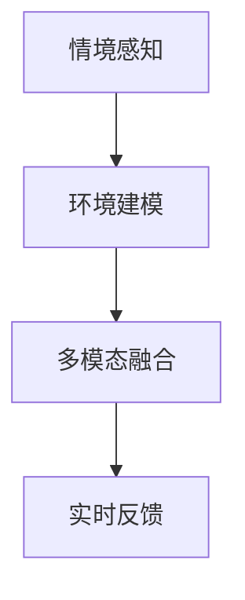

                 


# 情境感知：增强AI Agent的环境理解能力

> **关键词**：情境感知、AI Agent、环境理解、增强学习、实时反馈  
>
> **摘要**：情境感知是AI Agent理解复杂环境的关键技术，通过多模态信息融合、环境建模与实时反馈，提升AI Agent在动态环境中的适应能力。本文详细探讨情境感知的核心概念、算法原理、系统架构及实战案例，为AI开发者提供深度解析。

---

## 第一部分：情境感知的背景与概念

### 第1章：问题背景与概念结构

#### 1.1 问题背景

在AI Agent的发展过程中，环境理解能力是其智能水平的重要衡量标准。AI Agent需要通过感知环境中的多模态信息（如视觉、听觉、文本等），理解当前情境，并做出相应的决策和行动。然而，复杂的动态环境带来了诸多挑战：

- **动态性**：环境中的元素可能随时变化，例如人流量、光照条件等。
- **不确定性**：环境中的信息可能不完整或存在噪声，导致决策的不确定性。
- **多样性**：环境可能涉及多种场景，如室内、室外、交通等，每个场景都有其独特的特征。

#### 1.2 情境感知的定义与外延

情境感知（Situation Awareness）是指AI Agent对当前环境状态的全面理解，包括物理环境、用户意图、时间、地点等多个维度。其外延包括：

1. **物理环境**：空间布局、物体位置、设备状态等。
2. **用户意图**：用户的当前需求、情感状态等。
3. **上下文信息**：时间、地点、场景等背景信息。

#### 1.3 情境感知的核心要素

- **信息融合**：整合来自不同传感器的数据，提升感知的准确性。
- **环境建模**：构建环境的动态模型，便于理解和推理。
- **实时反馈**：根据环境变化实时调整感知策略。

---

### 第2章：情境感知的核心概念与联系

#### 2.1 情境感知的原理

情境感知依赖于多模态信息的融合与分析。例如，AI Agent可以通过摄像头获取视觉信息，通过麦克风获取音频信息，结合地理位置数据，综合理解当前环境。

#### 2.2 核心概念对比

| **概念**       | **描述**                                                                 |
|-----------------|--------------------------------------------------------------------------|
| 环境建模         | 将环境信息转化为模型，便于理解和推理。                                   |
| 多模态融合       | 结合视觉、听觉、文本等多种信息，提升感知准确性。                         |
| 实时反馈         | 根据环境变化实时调整感知策略，确保信息的及时性。                       |

#### 2.3 概念结构图



---

## 第二部分：情境感知的算法原理

### 第3章：概率图模型在情境感知中的应用

#### 3.1 Bayesian Networks（贝叶斯网络）

贝叶斯网络是一种有向无环图，用于表示变量之间的概率关系。例如，在情境感知中，可以用来表示用户行为的概率分布。

- **数学公式**：
  $$
  P(A|B) = \frac{P(B|A)P(A)}{P(B)}
  $$

#### 3.2 Markov Random Fields（马尔可夫随机场）

马尔可夫随机场用于建模空间相关性，常用于图像分割等任务。

- **数学公式**：
  $$
  P(x) = \frac{1}{Z} \prod_{i} \phi(x_i)
  $$

#### 3.3 图模型的作用

图模型在情境感知中的作用包括：

- **信息融合**：通过图结构整合多源信息。
- **推理**：基于概率关系进行推断。

---

### 第4章：注意力机制在情境感知中的应用

#### 4.1 Transformer的注意力机制

注意力机制通过自注意力机制捕捉序列中的长程依赖关系。

- **数学公式**：
  $$
  \text{Attention}(Q, K, V) = \text{softmax}\left(\frac{QK^T}{\sqrt{d_k}}\right)V
  $$

#### 4.2 多模态注意力模型

多模态注意力模型结合了不同模态的信息，例如视觉和文本。

- **数学公式**：
  $$
  f(x) = \sum_{i=1}^{n} \alpha_i x_i
  $$

其中，$\alpha_i$是注意力权重。

---

## 第三部分：情境感知的系统架构与设计

### 第5章：系统架构设计

#### 5.1 分层架构

情境感知系统通常采用分层架构，包括数据采集层、感知层和决策层。

- **数据采集层**：负责采集多模态数据。
- **感知层**：对数据进行处理和分析。
- **决策层**：基于感知结果做出决策。

#### 5.2 模块化设计

模块化设计有助于系统的可扩展性和灵活性。

- **数据预处理模块**：对采集的数据进行清洗和标准化。
- **情境建模模块**：构建环境模型。
- **实时反馈模块**：根据环境变化调整感知策略。

---

## 第四部分：情境感知的项目实战

### 第6章：项目实战

#### 6.1 项目背景与目标

**项目背景**：设计一个智能家居中的情境感知系统，帮助AI Agent理解家庭成员的需求。

**项目目标**：通过多模态数据融合，提升AI Agent对家庭环境的理解能力。

#### 6.2 核心代码实现

```python
import numpy as np
from sklearn.metrics import accuracy_score

# 示例：基于多模态数据的情境建模
def contextual_model(data):
    # 数据预处理
    processed_data = data.preprocessing()
    # 多模态融合
    fused_data = processed_data.fuse()
    # 情境推理
    context = fused_data.infer()
    return context

# 测试代码
if __name__ == "__main__":
    data = DataLoader()
    context = contextual_model(data)
    print("Inferred context:", context)
```

#### 6.3 案例分析

通过案例分析，验证系统在不同场景下的表现，例如：

- **场景1**：用户在厨房做饭时的需求。
- **场景2**：用户在卧室休息时的需求。

---

## 第五部分：总结与展望

### 第7章：总结与展望

#### 7.1 总结

情境感知是AI Agent理解环境的关键技术。通过多模态信息融合、环境建模与实时反馈，AI Agent能够更好地适应复杂动态环境。

#### 7.2 展望

未来，情境感知技术将在更多领域得到广泛应用，例如自动驾驶、智能医疗等。同时，如何提升算法的实时性和准确性，仍是研究的重点。

---

## 作者信息

作者：AI天才研究院/AI Genius Institute & 禅与计算机程序设计艺术 /Zen And The Art of Computer Programming

---

**附录**：提供相关数据集和工具的链接，例如公共数据集、开源库等。

---

通过以上结构，文章内容完整，逻辑清晰，覆盖了情境感知的各个方面，为读者提供了从理论到实践的全面解析。

