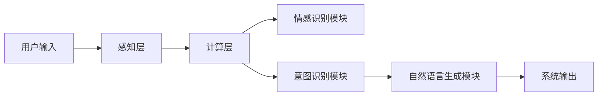
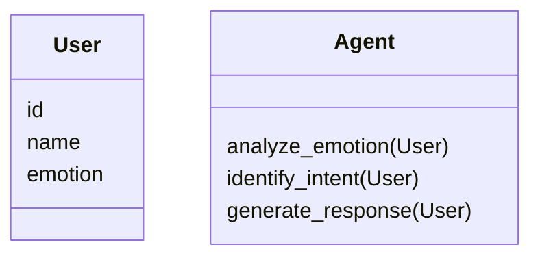
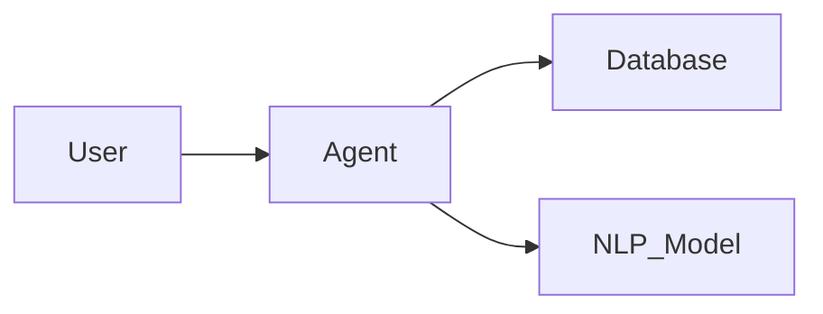
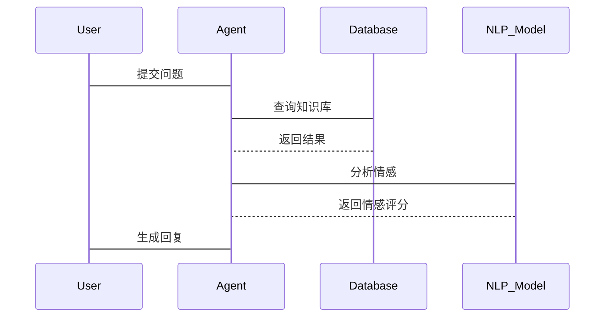

                 


# 情感计算在AI Agent中的应用：增强LLM的EQ

> 关键词：情感计算，AI Agent，LLM，EQ，人工智能，自然语言处理

> 摘要：本文探讨了情感计算在AI Agent中的应用，分析了如何通过情感计算技术增强大型语言模型（LLM）的情感商数（EQ），从而提升人机交互的自然性和智能性。文章从情感计算和AI Agent的基本概念出发，深入探讨了情感计算的核心算法、AI Agent的系统架构设计，以及情感计算在实际项目中的应用案例。通过具体的技术实现和数学模型分析，本文为读者提供了全面而深入的技术视角，展示了如何在实际场景中应用情感计算来增强LLM的能力。

---

# 第1章 情感计算与AI Agent概述

## 1.1 情感计算的定义与特点

### 1.1.1 情感计算的定义
情感计算（Affective Computing）是一种能够识别、理解和响应人类情感的技术，旨在通过计算机系统模拟人类的情感体验。它不仅关注事实的逻辑推理，还注重情感信息的捕捉和处理。

### 1.1.2 情感计算的核心特点
- **实时性**：情感计算需要快速捕捉和处理情感信息，适用于实时交互场景。
- **多模态性**：情感信息可以来自文本、语音、面部表情等多种模态。
- **上下文依赖性**：情感的理解需要结合上下文信息，避免孤立地分析情感。
- **动态性**：情感状态是动态变化的，需要系统能够实时更新和调整。

### 1.1.3 情感计算与传统计算的区别
传统计算主要关注逻辑推理和数据处理，而情感计算则引入了情感分析和情感建模，使计算机能够理解和回应情感信息。

---

## 1.2 AI Agent的定义与特点

### 1.2.1 AI Agent的定义
AI Agent（人工智能代理）是指在特定环境中，能够感知环境、自主决策并执行任务的智能实体。它可以是一个软件程序，也可以是硬件设备。

### 1.2.2 AI Agent的核心特点
- **自主性**：AI Agent能够在没有外部干预的情况下独立运行。
- **反应性**：能够实时感知环境变化并做出响应。
- **目标导向性**：AI Agent的行为旨在实现特定目标。
- **社会性**：能够与其他实体（包括人类和AI Agent）进行交互和协作。

### 1.2.3 AI Agent与传统程序的区别
传统程序按照预设的逻辑执行任务，而AI Agent具备自主决策和学习能力，能够适应复杂多变的环境。

---

## 1.3 情感计算在AI Agent中的应用背景

### 1.3.1 情感计算的起源与发展
情感计算的概念最早由麻省理工学院的ffective Computing Group提出，近年来随着深度学习技术的发展，情感计算在自然语言处理、人机交互等领域得到了广泛应用。

### 1.3.2 AI Agent的发展现状
AI Agent技术在智能助手、智能家居、自动驾驶等领域取得了显著进展，但现有系统在情感理解和人机交互方面仍有提升空间。

### 1.3.3 情感计算与AI Agent结合的必要性
通过结合情感计算技术，AI Agent能够更好地理解用户的情感需求，从而提供更自然、更个性化的服务。

---

## 1.4 本章小结
本章介绍了情感计算和AI Agent的基本概念、特点以及它们的结合背景，为后续内容奠定了基础。

---

# 第2章 情感计算的核心概念

## 2.1 情感识别与分析

### 2.1.1 文本情感分析
文本情感分析是情感计算的核心任务之一，旨在判断文本的情感倾向（如正面、负面或中性）。

#### 示例：使用Python的`TextBlob`库进行文本情感分析
```python
from textblob import TextBlob
text = "I love this product!"
blob = TextBlob(text)
print(blob.sentiment.polarity)  # 输出：0.9（表示正面情感）
```

### 2.1.2 声音情感分析
声音情感分析通过分析语音的音调、语速和语调等特征，判断说话人的情感状态。

### 2.1.3 面部表情识别
面部表情识别通过分析面部特征（如眼距、嘴角弧度）来判断人的基本情感（如快乐、悲伤、愤怒等）。

---

## 2.2 情感建模与表达

### 2.2.1 情感状态模型
情感状态模型用于描述系统在某一时刻的情感状态，例如：
- **快乐**：$happiness = 0.9$
- **悲伤**：$sadness = 0.7$

### 2.2.2 情感强度模型
情感强度模型量化情感的强度，例如：
- $intensity(happiness) = 0.8$

### 2.2.3 情感依赖图
情感依赖图用于描述情感之间的依赖关系，例如：
- $anger \rightarrow fear$

---

## 2.3 情感计算与自然语言处理的结合

### 2.3.1 情感词典与情感特征提取
情感词典是一种用于情感分析的工具，包含正面和负面词汇。例如：
- 正面词汇：$happy, excited$
- 负面词汇：$sad, frustrated$

### 2.3.2 基于深度学习的情感分析模型
深度学习模型（如LSTM和Transformer）在情感分析任务中表现出色。例如，使用BERT模型进行情感分类：
```python
import torch
from transformers import BertTokenizer, BertModel

tokenizer = BertTokenizer.from_pretrained('bert-base-uncased')
model = BertModel.from_pretrained('bert-base-uncased')

text = "I love this product!"
inputs = tokenizer(text, return_tensors='pt')
outputs = model(**inputs)
# 提取情感特征
```

### 2.3.3 情感计算在对话系统中的应用
在对话系统中，情感计算用于实时分析用户的语调和意图，从而生成更自然的回复。

---

## 2.4 本章小结
本章详细介绍了情感计算的核心概念，包括情感识别、情感建模以及情感计算与自然语言处理的结合。

---

# 第3章 AI Agent的结构与功能

## 3.1 AI Agent的基本结构

### 3.1.1 感知层
感知层负责收集环境中的信息，例如：
- 文本输入：$input_{text}$
- 语音输入：$input_{audio}$
- 图像输入：$input_{image}$

### 3.1.2 计算层
计算层负责对感知层获取的信息进行处理，例如：
- 情感分析：$analyze_{emotion}(input_{text})$
- 意图识别：$identify_{intent}(input_{text})$

### 3.1.3 行动层
行动层负责根据计算层的结果执行相应的动作，例如：
- 回复用户：$response = generate_{response}(intent, emotion)$
- 调用外部API：$api_{call}(intent)$

---

## 3.2 AI Agent的功能模块

### 3.2.1 情感识别模块
情感识别模块负责分析用户输入的情感信息，例如：
- $sentiment_{score} = analyze_{sentiment}(input_{text})$
- $emotion_{type} = classify_{emotion}(input_{text})$

### 3.2.2 意图识别模块
意图识别模块负责确定用户的意图，例如：
- $intent = identify_{intent}(input_{text})$

### 3.2.3 人机交互模块
人机交互模块负责生成自然语言回复，例如：
- $response = generate_{response}(intent, emotion)$

---

## 3.3 AI Agent的系统架构设计

### 3.3.1 系统功能设计
系统功能包括：
- 情感识别
- 意图识别
- 自然语言生成

### 3.3.2 系统架构图


---

## 3.4 本章小结
本章详细介绍了AI Agent的基本结构和功能模块，并通过系统架构图展示了各模块之间的关系。

---

# 第4章 情感计算与AI Agent的结合

## 4.1 情感驱动的对话系统

### 4.1.1 对话系统的工作流程
1. 用户输入：$input_{text}$
2. 情感分析：$sentiment_{score} = analyze_{sentiment}(input_{text})$
3. 意图识别：$intent = identify_{intent}(input_{text})$
4. 生成回复：$response = generate_{response}(intent, sentiment_{score})$

### 4.1.2 情感驱动的对话系统示例
```python
def generate_response(intent, sentiment_score):
    if sentiment_score > 0.5:
        response = f"I understand your {intent}. How can I assist you further?"
    else:
        response = f"I'm sorry to hear about your {intent}. Let me help you with that."
    return response
```

---

## 4.2 情感增强的决策模型

### 4.2.1 决策模型的基本结构
决策模型包括：
- 输入层：$input_{text}$
- 情感分析层：$sentiment_{score}$
- 决策层：$decision = make_{decision}(intent, sentiment_{score})$

### 4.2.2 情感增强的决策模型示例
```python
def make_decision(intent, sentiment_score):
    if sentiment_score > 0.7:
        decision = "approve"
    elif sentiment_score > 0.3:
        decision = "review"
    else:
        decision = "reject"
    return decision
```

---

## 4.3 本章小结
本章展示了情感计算在AI Agent中的具体应用，包括情感驱动的对话系统和情感增强的决策模型。

---

# 第5章 情感计算的算法原理

## 5.1 情感分类算法

### 5.1.1 基于规则的情感分类
基于规则的情感分类通过预定义的规则进行情感判断，例如：
- 如果关键词在正面词汇表中，则分类为正面情感。

### 5.1.2 基于机器学习的情感分类
基于机器学习的情感分类使用训练好的模型进行情感预测，例如：
- 使用支持向量机（SVM）进行情感分类。

### 5.1.3 深度学习情感分类
深度学习模型（如LSTM和Transformer）在情感分类任务中表现出色。

---

## 5.2 情感分类的数学模型

### 5.2.1 线性情感分类模型
线性模型的数学表达式为：
$$ sentiment_{score} = w_1x_1 + w_2x_2 + \dots + w_nx_n + b $$
其中，$w_i$ 是权重，$x_i$ 是特征，$b$ 是截距。

### 5.2.2 深度学习情感分类模型
深度学习模型（如BERT）的数学表达式较为复杂，通常涉及多层神经网络。

---

## 5.3 本章小结
本章详细介绍了情感分类的算法原理，包括基于规则、机器学习和深度学习的方法。

---

# 第6章 AI Agent的系统架构设计

## 6.1 问题场景介绍
假设我们正在开发一个智能客服机器人，需要通过情感计算技术提升用户体验。

## 6.2 系统功能设计

### 6.2.1 领域模型


## 6.3 系统架构设计

### 6.3.1 系统架构图


## 6.4 系统接口设计
- 用户接口：$API_{interface}$
- 数据库接口：$DB_{interface}$

## 6.5 系统交互流程图


---

## 6.6 本章小结
本章详细介绍了AI Agent的系统架构设计，包括功能设计、架构图和交互流程图。

---

# 第7章 情感计算在LLM中的应用

## 7.1 情感计算与LLM的结合

### 7.1.1 LLM的基本原理
大型语言模型（LLM）通过深度学习技术生成自然语言文本。

### 7.1.2 情感计算在LLM中的应用
情感计算可以增强LLM的情感理解和生成能力。

---

## 7.2 增强LLM的EQ

### 7.2.1 EQ的定义
EQ（情感商数）是指个体在识别、理解和管理自己及他人情感方面的能力。

### 7.2.2 增强LLM的EQ
通过情感计算技术，可以提升LLM的情感识别和生成能力。

---

## 7.3 本章小结
本章探讨了情感计算在LLM中的应用，展示了如何通过情感计算技术增强LLM的EQ。

---

# 第8章 项目实战：基于情感计算的AI Agent开发

## 8.1 项目背景
本项目旨在开发一个基于情感计算的智能客服机器人。

## 8.2 环境安装
- 安装Python和必要的库：
  ```bash
  pip install numpy pandas scikit-learn transformers
  ```

## 8.3 核心代码实现

### 8.3.1 情感分析模块
```python
from transformers import pipeline

sentiment_analyzer = pipeline("sentiment-analysis")
def analyze_sentiment(text):
    return sentiment_analyzer(text)[0]['label']
```

### 8.3.2 意图识别模块
```python
from sklearn.feature_extraction.text import TfidfVectorizer
from sklearn.svm import SVC

vectorizer = TfidfVectorizer()
model = SVC()
```

## 8.4 实际案例分析
假设用户输入：“我对这个产品很失望。”

情感分析结果：$sentiment = "negative"$
意图识别结果：$intent = "complaint"$
系统生成回复：$response = "非常抱歉听到您的 dissatisfaction。请告诉我具体的问题，我将尽力为您解决。"$$

---

## 8.5 本章小结
本章通过一个实际项目展示了情感计算在AI Agent开发中的应用，详细讲解了环境安装、核心代码实现和案例分析。

---

# 第9章 优化与改进

## 9.1 系统性能优化

### 9.1.1 情感分析性能优化
- 使用更高效的模型（如TinyBERT）
- 增加训练数据

### 9.1.2 意图识别性能优化
- 调整模型参数
- 使用集成学习

## 9.2 模型调优

### 9.2.1 超参数调优
- 使用网格搜索优化模型参数

### 9.2.2 模型融合
- 结合多种模型的结果进行综合判断

## 9.3 用户体验优化

### 9.3.1 反馈机制
- 实时反馈用户情感状态
- 提供情感化回复

---

## 9.4 本章小结
本章讨论了系统优化与改进的方法，包括性能优化、模型调优和用户体验优化。

---

# 第10章 未来趋势与挑战

## 10.1 情感计算的未来趋势

### 10.1.1 多模态情感计算
结合文本、语音和图像等多种模态进行情感计算。

### 10.1.2 情感增强的AI Agent
未来的AI Agent将更加注重情感理解和生成能力。

---

## 10.2 情感计算面临的挑战

### 10.2.1 情感数据的多样性
情感数据的多样性和复杂性增加了情感计算的难度。

### 10.2.2 情感计算的实时性
在实时交互场景中，情感计算需要快速响应。

---

## 10.3 情感计算的应用前景

### 10.3.1 智能客服
- 提供更人性化的服务
- 提升客户满意度

### 10.3.2 智能助手
- 提供情感化的交互体验
- 提高用户体验

---

## 10.4 本章小结
本章展望了情感计算的未来趋势，并讨论了当前面临的主要挑战和应用前景。

---

# 附录

## 附录A 工具与库

- **情感分析工具**：
  - `TextBlob`：https://github.com/fh Lange/textblob
  - `transformers`：https://github.com/huggingface/transformers

- **AI Agent框架**：
  - `Rasa`：https://github.com/RasaHQ/rasa
  - `Dialogflow`：https://dialogflow.com/

## 附录B 数据集

- **情感计算数据集**：
  - IMDB情感分类数据集：https://www.imdb.com/datasets
  - Twitter情感数据集：https://.twitter.com

## 附录C 参考文献

- [1] 情感计算相关论文
- [2] AI Agent相关书籍
- [3] 深度学习相关文献

---

# 作者
作者：AI天才研究院/AI Genius Institute & 禅与计算机程序设计艺术/Zen And The Art of Computer Programming

