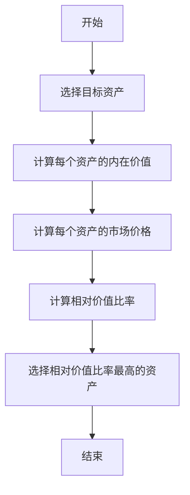
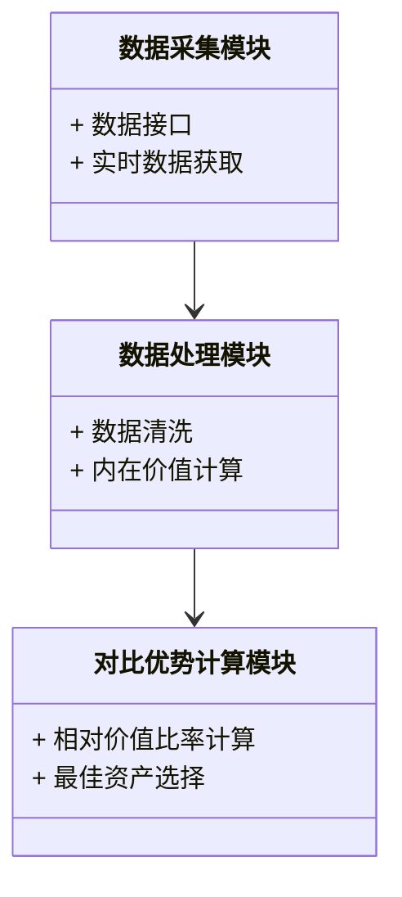

                 


# 戴维·德雷曼的对比优势投资法

## 关键词：对比优势投资法、投资策略、德雷曼、投资理论、资产配置、数学模型、Python代码

## 摘要：  
本文深入探讨戴维·德雷曼的对比优势投资法，从理论基础到数学模型，再到实际应用，系统地分析了这一投资策略的核心原理和实现方法。文章结合技术语言和逻辑推理，详细介绍了对比优势的概念、算法步骤、系统架构，并通过实际案例展示其在投资决策中的应用。通过本文，读者可以全面理解对比优势投资法的优势及其在现代投资中的重要地位。

---

## 第1章：背景介绍

### 1.1 投资学的基础知识
1.1.1 资产的定义与分类  
- 资产是投资者拥有的资源，包括股票、债券、房地产等。  
- 资产可以分为流动性资产、固定资产、金融资产等。  

1.1.2 投资的基本原理  
- 投资的目的是通过资产配置实现收益最大化。  
- 风险与收益成正比，是投资决策的核心考量。  

1.1.3 投资市场的基本结构  
- 一级市场：新资产发行的市场。  
- 二级市场：资产交易的市场，如股票交易所。  

### 1.2 对比优势投资法的起源与发展  
1.2.1 对比优势的定义  
- 对比优势是指在多个资产中，选择相对价值最高的资产进行投资。  

1.2.2 德雷曼的理论基础  
- 德雷曼提出，资产的相对价值可以通过比较其市场价格与内在价值来确定。  

1.2.3 对比优势在投资中的应用  
- 通过对比不同资产的相对价值，优化投资组合，降低风险。  

---

## 第2章：对比优势的核心概念

### 2.1 对比优势的定义与原理
2.1.1 对比优势的定义  
- 对比优势是指在两个或多个资产中，选择具有更高相对价值的资产。  

2.1.2 对比优势的原理  
- 通过比较资产的市场价格与内在价值，确定其相对优势。  
- 相对优势高的资产具有更大的投资潜力。  

### 2.2 对比优势与其他投资方法的对比

| 投资方法       | 基于因素                | 优缺点                           |
|----------------|-------------------------|----------------------------------|
| 均值-方差模型   | 风险与收益的均衡         | 计算复杂，需大量历史数据         |
| 技术分析        | 价格和成交量的变化       | 主观性强，依赖分析师的经验         |
| 基本分析        | 公司基本面               | 周期长，需深入研究公司财务         |
| 对比优势投资法  | 资产的相对价值           | 简单易行，适合快速决策           |

---

## 第3章：对比优势的数学模型与算法

### 3.1 对比优势的数学表达

$$ \text{相对价值比率} = \frac{\text{资产价值}}{\text{市场价值}} $$

其中：
- 资产价值是指资产的内在价值，通常通过现金流折现法计算。  
- 市场价值是指资产的当前市场价格。  

### 3.2 对比优势的算法实现



### 3.3 Python代码实现

```python
def calculate_relative_value(asset_value, market_value):
    return asset_value / market_value

# 示例数据
assets = ['股票A', '股票B', '股票C']
asset_values = [100, 150, 90]
market_values = [80, 120, 85]

# 计算相对价值比率
relative_values = {}
for i in range(len(assets)):
    relative_values[assets[i]] = calculate_relative_value(asset_values[i], market_values[i])

# 找出相对价值最高的资产
max_ratio = max(relative_values.values())
best_asset = [k for k, v in relative_values.items() if v == max_ratio][0]

print(f"最佳投资资产为：{best_asset}")
```

---

## 第4章：系统分析与架构设计

### 4.1 系统功能设计

#### 4.1.1 数据采集模块
- 从股票交易所获取实时数据。  
- 数据包括资产的市场价格和历史数据。  

#### 4.1.2 数据处理模块
- 清洗数据，计算资产的内在价值。  
- 使用现金流折现法计算内在价值。  

#### 4.1.3 对比优势计算模块
- 计算相对价值比率，确定最佳投资资产。  

### 4.2 系统架构设计



---

## 第5章：项目实战

### 5.1 环境安装与配置

```bash
# 安装Python和必要库
pip install pandas numpy matplotlib
```

### 5.2 核心代码实现

```python
import pandas as pd
import numpy as np

def calculate_intrinsic_value(earnings, growth_rate, discount_rate):
    return earnings * (1 + growth_rate) / discount_rate

# 示例数据
data = {
    '资产': ['股票A', '股票B', '股票C'],
    '收益': [10, 15, 8],
    '增长率': [0.1, 0.05, 0.15],
    '贴现率': [0.08, 0.08, 0.08]
}

df = pd.DataFrame(data)

# 计算内在价值
df['内在价值'] = df.apply(lambda x: calculate_intrinsic_value(x['收益'], x['增长率'], x['贴现率']), axis=1)

# 计算相对价值比率
market_values = [80, 120, 85]
relative_values = {}
for i in range(len(df)):
    asset = df.iloc[i]['资产']
    iv = df.iloc[i]['内在价值']
    mv = market_values[i]
    relative_values[asset] = iv / mv

# 找出相对价值最高的资产
max_ratio = max(relative_values.values())
best_asset = [k for k, v in relative_values.items() if v == max_ratio][0]

print(f"最佳投资资产为：{best_asset}")
```

---

## 第6章：总结与展望

### 6.1 最佳实践
- 定期更新资产数据，确保计算的准确性。  
- 结合其他投资策略，如技术分析，提高投资决策的准确性。  

### 6.2 小结
对比优势投资法是一种简单有效的投资策略，通过相对价值分析，帮助投资者在复杂市场中做出明智决策。  

### 6.3 注意事项
- 数据来源的可靠性直接影响计算结果，需确保数据准确。  
- 投资有风险，需根据自身风险承受能力进行投资。  

### 6.4 拓展阅读
- 《投资学基础》  
- 《德雷曼投资策略精解》  

---

## 作者：AI天才研究院/AI Genius Institute & 禅与计算机程序设计艺术 /Zen And The Art of Computer Programming

---

这篇文章详细介绍了戴维·德雷曼的对比优势投资法，从理论到实践，结合技术语言和逻辑推理，帮助读者全面理解这一投资策略的核心原理和应用方法。

