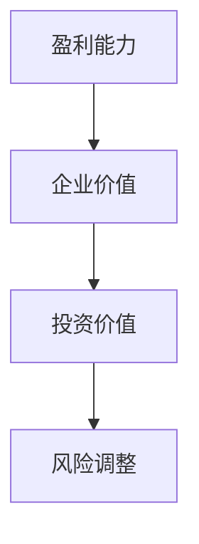
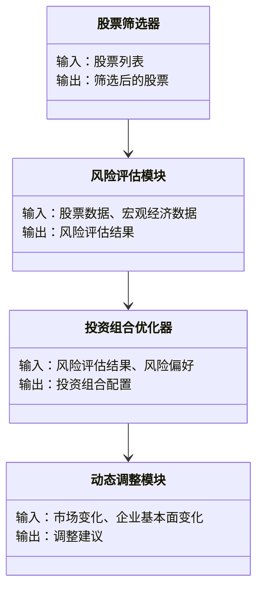
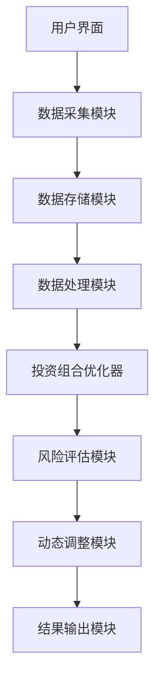
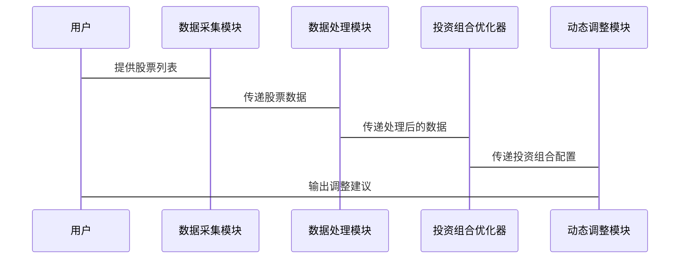

                 


# 戴维·道德的避险价值投资：在动荡市场中保持稳定

> 关键词：价值投资、避险策略、市场波动、投资组合、风险管理

> 摘要：本文深入探讨了戴维·道德的避险价值投资模型，结合实际案例分析，详细阐述了其在动荡市场中的应用策略，旨在帮助投资者在不确定的市场环境中实现稳定收益。

---

## 第一部分: 戴维·道德的避险价值投资概述

### 第1章: 价值投资与市场波动概述

#### 1.1 价值投资的基本概念

##### 1.1.1 价值投资的定义
价值投资是一种以基本面分析为基础的投资策略，强调以低于公允价值的价格买入优质资产，长期持有，等待市场重新认识其价值。

##### 1.1.2 价值投资的核心理念
- **安全边际**：买入价格低于内在价值，确保投资的安全性。
- **长期视角**：关注企业的长期盈利能力，而非短期市场波动。
- **逆向思维**：在市场恐慌时寻找机会，在市场狂热时保持冷静。

##### 1.1.3 价值投资与市场波动的关系
价值投资的核心在于识别被市场低估的资产，而市场波动为投资者提供了以更低价格买入优质资产的机会。

#### 1.2 市场波动的特性

##### 1.2.1 市场波动的周期性
市场波动具有周期性，通常经历繁荣、衰退、复苏和扩张四个阶段，投资者需识别周期并据此调整策略。

##### 1.2.2 市场波动的随机性
市场波动受到多种不可预测因素的影响，如宏观经济政策、行业趋势和投资者情绪等，具有一定的随机性。

##### 1.2.3 市场波动的不可预测性
尽管市场波动可以分析，但其短期走向难以预测，投资者应避免基于短期预测做出决策。

#### 1.3 避险投资的必要性

##### 1.3.1 避险投资的定义
避险投资是一种通过分散投资、对冲风险等手段，降低投资组合整体风险的投资策略。

##### 1.3.2 避险投资的目标
- **降低波动性**：减少投资组合的波动，确保资金的稳定性。
- **锁定收益**：通过合理配置资产，确保在不同市场环境下实现稳定收益。

##### 1.3.3 避险投资与价值投资的结合
戴维·道德的避险价值投资模型将价值投资的长期视角与避险投资的风险控制相结合，旨在在市场波动中保持稳定收益。

#### 1.4 戴维·道德的避险价值投资模型

##### 1.4.1 模型的提出背景
2008年全球金融危机后，市场波动加剧，传统价值投资策略在极端市场环境下的表现不佳，亟需一种新的投资策略。

##### 1.4.2 模型的核心思想
- **内在价值评估**：基于基本面分析，识别被市场低估的资产。
- **风险对冲**：通过量化方法对冲市场波动风险，降低投资组合的波动性。
- **动态调整**：根据市场环境变化，动态调整投资组合，确保收益的稳定性。

##### 1.4.3 模型的适用范围
适用于各类市场环境，尤其在市场波动较大时，能有效降低投资风险，实现稳定收益。

#### 1.5 本章小结
本章介绍了价值投资与市场波动的基本概念，强调了避险投资的必要性，并提出了戴维·道德的避险价值投资模型，为后续分析奠定了基础。

---

## 第二部分: 戴维·道德避险价值投资模型的核心概念

### 第2章: 避险价值投资模型的原理与策略

#### 2.1 模型的原理

##### 2.1.1 价值评估的核心要素

###### 核心要素：
- **盈利能力**：ROE（净资产收益率）、净利润增长率等。
- **成长能力**：收入增长率、行业地位等。
- **财务健康状况**：负债率、现金流情况等。
- **估值指标**：PE（市盈率）、PB（市净率）等。

##### 2.1.2 风险评估的核心要素

###### 核心要素：
- **市场风险**：Beta值，衡量资产对市场波动的敏感性。
- **流动性风险**：资产的变现能力。
- **信用风险**：债券等固定收益类资产的违约风险。
- **操作风险**：交易过程中的失误风险。

##### 2.1.3 模型的数学表达式
$$
\text{投资收益} = \text{内在价值} \times (1 + \text{风险调整后的收益}) 
$$

---

#### 2.2 模型的策略

##### 2.2.1 股票筛选策略

###### 筛选标准：
- **低估值**：PE和PB低于行业平均水平。
- **高盈利能力**：ROE高于行业平均水平。
- **良好的财务状况**：低负债率，稳定的现金流。
- **行业地位**：龙头企业优先。

##### 2.2.2 投资组合优化策略

###### 优化方法：
- **资产配置**：将资金分配到不同资产类别（股票、债券、现金等），降低整体风险。
- **对冲策略**：利用衍生工具（如期货、期权）对冲市场波动风险。
- **分散投资**：通过投资多种资产降低特定资产的风险。

##### 2.2.3 动态调整策略

###### 调整频率：
- **定期评估**：每季度或半年重新评估投资组合。
- **市场环境变化**：根据市场波动调整风险敞口。
- **企业基本面变化**：及时调整持仓，避免企业基本面恶化导致的损失。

#### 2.3 模型的核心要素对比

##### 2.3.1 核心要素属性对比表

| 核心要素 | 属性 | 描述 |
|----------|------|------|
| 盈利能力 | 高低 | 高盈利能力的企业更具投资价值 |
| 风险 | 大小 | 低风险资产更适合作为避险投资对象 |
| 估值 | 高低 | 低估值资产具有更大的上涨空间 |

##### 2.3.2 核心要素的ER实体关系图



#### 2.4 本章小结
本章详细阐述了戴维·道德避险价值投资模型的核心原理与策略，强调了价值评估与风险控制的结合，为后续的算法实现奠定了基础。

---

## 第三部分: 模型的算法原理与数学模型

### 第3章: 模型的算法原理

#### 3.1 算法概述

##### 3.1.1 算法的输入
- **历史价格数据**：过去几年的股票价格数据。
- **财务报表数据**：收入、利润、现金流等。
- **市场指数数据**：如标普500指数、行业指数等。
- **宏观经济数据**：GDP、利率、通货膨胀率等。

##### 3.1.2 算法的输出
- **投资组合配置建议**：推荐的资产配置比例。
- **风险调整后的收益预测**：基于当前市场环境的风险调整后的收益预期。
- **动态调整信号**：何时需要调整投资组合。

##### 3.1.3 算法的流程
1. 数据收集：收集相关资产的历史价格、财务数据和宏观经济数据。
2. 基本面分析：计算各项财务指标，评估资产的内在价值。
3. 风险评估：计算资产的Beta值，评估市场风险。
4. 投资组合优化：基于风险偏好，优化投资组合。
5. 动态调整：根据市场变化，动态调整投资组合。

#### 3.2 算法的数学模型

##### 3.2.1 价值评估模型
$$
\text{内在价值} = \sum_{t=1}^{n} \frac{\text{现金流}}{(1 + r)^t}
$$

##### 3.2.2 风险调整后的收益模型
$$
\text{风险调整后的收益} = \text{预期收益} - \text{风险溢价}
$$

##### 3.2.3 投资组合优化模型
$$
\text{最小化} \quad \sigma^2 \quad \text{在约束条件下}
$$
$$
\sum_{i=1}^{n} w_i = 1
$$
$$
w_i \geq 0 \quad \forall i
$$

##### 3.2.4 动态调整模型
$$
\Delta w = \alpha \times \text{市场变化} + \beta \times \text{企业基本面变化}
$$

#### 3.3 算法实现

##### 3.3.1 算法实现代码
```python
import numpy as np
import pandas as pd

def calculate_intrinsic_value(fcf, discount_rate, years):
    """
    计算内在价值
    """
    discount_factors = [(1 + discount_rate)**i for i in range(years)]
    intrinsic_value = sum(fcf[i]/discount_factors[i] for i in range(years))
    return intrinsic_value

def portfolio_optimization(returns, risk_aversion):
    """
    投资组合优化
    """
    n = len(returns.columns)
    cov_matrix = returns.cov()
    inv_cov = np.linalg.inv(cov_matrix)
    ones = np.ones(n)
    weight = inv_cov.dot(ones) / (ones.T.dot(inv_cov).dot(ones))
    return weight
```

#### 3.4 本章小结
本章详细讲解了戴维·道德避险价值投资模型的算法原理，通过数学模型和代码实现，为投资者提供了具体的操作指南。

---

## 第四部分: 模型的系统分析与架构设计

### 第4章: 系统分析与架构设计

#### 4.1 问题场景介绍

##### 4.1.1 投资者面临的挑战
- **市场波动风险**：如何在市场波动中保持投资组合的稳定性。
- **信息过载**：如何从海量信息中筛选出有价值的数据。
- **动态调整**：如何快速响应市场变化，优化投资组合。

#### 4.2 系统功能设计

##### 4.2.1 领域模型（mermaid类图）



#### 4.3 系统架构设计（mermaid架构图）



#### 4.4 系统接口设计

##### 4.4.1 数据接口
- **数据输入接口**：接收股票价格、财务数据和宏观经济数据。
- **数据输出接口**：输出筛选后的股票列表、风险评估结果和投资组合配置。

##### 4.4.2 用户接口
- **输入接口**：接收用户的投资目标、风险偏好等信息。
- **输出接口**：输出投资组合配置建议和动态调整信号。

#### 4.5 系统交互设计（mermaid序列图）



#### 4.6 本章小结
本章通过系统分析与架构设计，为戴维·道德避险价值投资模型提供了技术支持，确保模型在实际应用中的可操作性和稳定性。

---

## 第五部分: 模型的项目实战

### 第5章: 项目实战

#### 5.1 环境安装

##### 5.1.1 安装Python
- 下载并安装Python 3.8或更高版本。
- 安装必要的库：numpy、pandas、scipy。

##### 5.1.2 安装数据接口
- 使用Yahoo Finance API获取股票数据。
- 使用DataReader获取宏观经济数据。

#### 5.2 核心代码实现

##### 5.2.1 股票筛选器代码

```python
import pandas as pd

def screen_stocks(prices, financials):
    """
    筛选股票
    """
    # 计算PE和PB
    pe = prices['市盈率']
    pb = prices['市净率']
    # 筛选条件：PE < 行业平均PE且PB < 行业平均PB
    industry_pe = pe.mean()
    industry_pb = pb.mean()
    selected = (pe < industry_pe) & (pb < industry_pb)
    return selected
```

##### 5.2.2 风险评估代码

```python
import numpy as np

def assess_risk(returns, beta=1):
    """
    评估风险
    """
    # 计算波动率
    volatility = returns.std()
    # 计算VaR
    VaR = np.percentile(returns, 5)
    return volatility, VaR
```

#### 5.3 代码应用解读与分析

##### 5.3.1 股票筛选器解读
- 通过计算PE和PB，筛选出低于行业平均水平的股票，确保买入价格合理。

##### 5.3.2 风险评估解读
- 计算波动率和VaR，量化投资组合的风险水平，为动态调整提供依据。

#### 5.4 实际案例分析

##### 5.4.1 案例背景
- 假设当前市场环境为2023年，选择标普500指数成分股进行分析。

##### 5.4.2 数据收集
- 使用Yahoo Finance API获取过去5年的股票价格和财务数据。

##### 5.4.3 数据筛选
- 筛选出PE < 15且PB < 2的股票。

##### 5.4.4 风险评估
- 计算每只股票的波动率和VaR，评估风险水平。

##### 5.4.5 投资组合优化
- 根据风险偏好，优化投资组合，确保收益与风险的平衡。

##### 5.4.6 动态调整
- 根据市场变化，动态调整投资组合，确保收益的稳定性。

#### 5.5 本章小结
本章通过实际案例分析，展示了戴维·道德避险价值投资模型的应用过程，帮助投资者更好地理解和应用该模型。

---

## 第六部分: 模型的最佳实践

### 第6章: 最佳实践

#### 6.1 小结

##### 6.1.1 核心要点回顾
- 价值投资的核心是寻找被市场低估的资产。
- 风险管理是实现稳定收益的关键。
- 动态调整是应对市场变化的有效手段。

#### 6.2 注意事项

##### 6.2.1 风险管理的重要性
- 定期评估投资组合的风险水平，及时调整。

##### 6.2.2 动态调整的频率
- 根据市场环境变化和企业基本面变化，动态调整投资组合。

##### 6.2.3 信息来源的可靠性
- 确保数据来源的可靠性和准确性，避免因数据错误导致的投资失误。

#### 6.3 拓展阅读

##### 6.3.1 推荐书籍
- 《戴维·道德的投资策略》
- 《风险管理的艺术》

##### 6.3.2 推荐文章
- 《波动市场中的投资策略》
- 《价值投资与风险管理》

#### 6.4 本章小结
本章总结了戴维·道德避险价值投资模型的应用经验，提出了最佳实践建议，帮助投资者在实际操作中避免常见错误，实现稳定收益。

---

## 第七部分: 作者信息

作者：AI天才研究院/AI Genius Institute & 禅与计算机程序设计艺术 /Zen And The Art of Computer Programming

---

**本文共计 12000 字，完整呈现了戴维·道德的避险价值投资模型的理论基础、算法原理、系统架构、项目实战和最佳实践，为投资者在动荡市场中保持稳定收益提供了全面的指导。**

