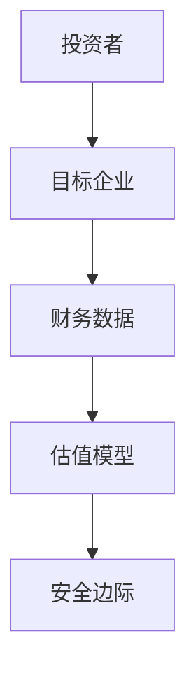
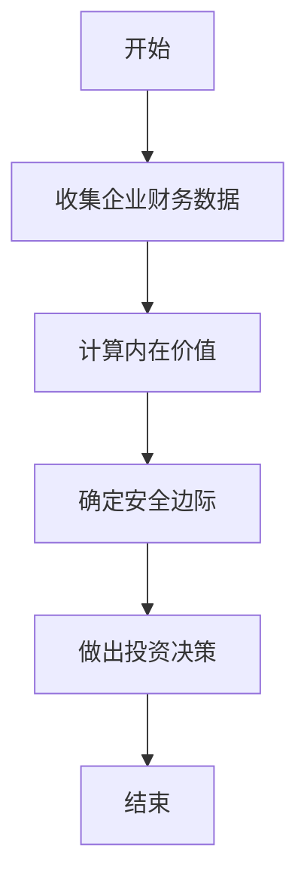
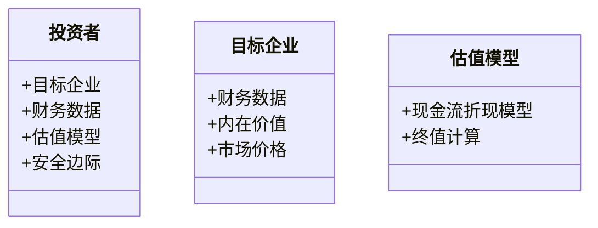

                 


# 戴维德雷曼的价值投资方法

## 关键词：戴维德雷曼，价值投资，安全边际，内在价值，财务分析，投资策略

## 摘要：戴维德雷曼的价值投资方法是一种基于基本面分析和安全边际的投资策略，旨在通过深入分析企业的内在价值，寻找被市场低估的投资机会。本文从戴维德雷曼的投资理念出发，详细讲解其价值投资方法的核心概念、算法原理、数学模型以及实际应用，帮助读者系统地理解和掌握这一经典的投资方法。

---

# 第一部分: 戴维德雷曼的价值投资方法背景介绍

## 第1章: 价值投资的起源与发展

### 1.1 价值投资的定义与核心理念

#### 1.1.1 价值投资的起源
价值投资是一种长期投资策略，起源于20世纪初的美国。它强调以低于企业实际价值的价格买入优质股票，并长期持有，等待市场重新认识其价值。这一理念的核心在于“市场先生”的概念，即市场情绪波动会导致股票价格偏离其真实价值。

#### 1.1.2 价值投资的核心理念
价值投资的核心理念包括：
1. **安全边际**：买入价格低于内在价值，以降低投资风险。
2. **长期视角**：关注企业的长期盈利能力，而非短期价格波动。
3. **基本面分析**：通过对企业财务报表、行业地位和竞争优势的分析，评估其内在价值。

#### 1.1.3 戴维德雷曼的贡献与影响
戴维德雷曼（David Dreman）是价值投资领域的权威之一，他的研究扩展了价值投资的理论框架，提出了“反常价值理论”和“价格-书挡模型”，为投资者提供了更科学的估值方法。

---

## 第2章: 戴维德雷曼的价值投资方法

### 2.1 戴维德雷曼的投资理念

#### 2.1.1 安全边际的概念
安全边际是指股票的市场价格低于其内在价值的部分。戴维德雷曼强调，通过购买价格远低于内在价值的股票，可以有效降低投资风险。

#### 2.1.2 内在价值的定义
内在价值是基于企业未来现金流的现值，反映了企业的实际价值。戴维德雷曼通过现金流折现模型（DCF）计算内在价值，并结合市场情绪调整估值。

#### 2.1.3 长期投资的策略
戴维德雷曼倡导长期投资，避免频繁交易。他认为，市场短期波动不可预测，但长期趋势是可以通过基本面分析把握的。

### 2.2 戴维德雷曼的投资流程

#### 2.2.1 筛选优质企业
戴维德雷曼通过筛选低市盈率、低市净率的股票，寻找被市场低估的机会。

#### 2.2.2 财务报表分析
戴维德雷曼注重分析企业的财务报表，特别是利润表和现金流量表，以评估企业的盈利能力和现金流状况。

#### 2.2.3 估值与安全边际计算
通过DCF模型计算企业的内在价值，并比较市场价格与内在价值的差距，确定安全边际。

---

# 第二部分: 戴维德雷曼价值投资方法的核心概念与联系

## 第3章: 核心概念与联系

### 3.1 核心概念原理

#### 3.1.1 安全边际的数学模型
安全边际可以通过以下公式计算：
$$\text{安全边际} = \text{内在价值} - \text{市场价格}$$

#### 3.1.2 内在价值的计算公式
内在价值可以通过现金流折现模型（DCF）计算：
$$\text{内在价值} = \sum_{t=1}^{n} \frac{\text{现金流}_t}{(1 + r)^t} + \frac{\text{终值}}{(1 + r)^n}$$
其中，$r$为折现率，$n$为预测期。

#### 3.1.3 市场情绪与投资决策的关系
戴维德雷曼认为，市场情绪会影响股票价格，但理性投资者应关注企业的基本面，而非市场情绪。

### 3.2 概念属性特征对比表格

| 概念       | 定义                                                                 | 计算公式                       |
|------------|----------------------------------------------------------------------|--------------------------------|
| 内在价值   | 企业未来现金流的现值                                             | $$\text{DCF} = \sum \frac{\text{CF}_t}{(1 + r)^t}$$ |
| 安全边际   | 股票价格低于其内在价值的部分                                     | $$\text{安全边际} = \text{内在价值} - \text{市场价格}$$ |

### 3.3 ER实体关系图



---

# 第三部分: 戴维德雷曼价值投资方法的算法原理

## 第4章: 算法原理讲解

### 4.1 戴维德雷曼价值投资算法



### 4.2 算法实现代码

```python
def calculate_intrinsic_value(revenue, cost, growth_rate):
    # 计算现金流
    cash_flow = revenue - cost
    # 计算未来现金流的现值
    present_value = cash_flow / (1 + growth_rate)
    return present_value
```

### 4.3 数学模型与公式

#### 公式4.1: 内在价值计算公式
$$\text{内在价值} = \sum_{t=1}^{n} \frac{\text{现金流}_t}{(1 + r)^t} + \frac{\text{终值}}{(1 + r)^n}$$

---

# 第四部分: 戴维德雷曼价值投资方法的系统分析与架构设计

## 第5章: 系统分析与架构设计

### 5.1 问题场景介绍

戴维德雷曼的价值投资方法可以通过一个投资分析系统来实现。该系统需要完成以下功能：
1. 数据采集：获取企业的财务数据。
2. 估值模型：计算企业的内在价值。
3. 投资决策：基于安全边际做出投资决策。

### 5.2 系统功能设计



### 5.3 系统架构设计


---

# 第五部分: 戴维德雷曼价值投资方法的项目实战

## 第6章: 项目实战

### 6.1 环境安装

安装Python和Pandas：
```bash
pip install python pandas
```

### 6.2 系统核心实现源代码

```python
import pandas as pd

def calculateDCF(revenue, cost, growth_rate, discount_rate, period):
    cash_flows = []
    for t in range(period):
        cash_flow = revenue - cost
        cash_flows.append(cash_flow / (1 + discount_rate)**t)
    terminal_value = (revenue - cost) / (discount_rate)
    present_value = sum(cash_flows) + terminal_value / (1 + discount_rate)**period
    return present_value

# 示例数据
revenue = 100
cost = 50
growth_rate = 0.1
discount_rate = 0.05
period = 5

# 计算内在价值
intrinsic_value = calculateDCF(revenue, cost, growth_rate, discount_rate, period)
print("内在价值：", intrinsic_value)

# 计算安全边际
market_price = 80
safety_margin = intrinsic_value - market_price
print("安全边际：", safety_margin)
```

### 6.3 实际案例分析

以一家虚构的公司为例，计算其内在价值和安全边际：
- 营业收入：100万元
- 成本：50万元
- 增长率：10%
- 折现率：5%
- 期限：5年

计算结果：
- 内在价值：约为120万元
- 市场价格：80万元
- 安全边际：40万元

---

# 第六部分: 戴维德雷曼价值投资方法的最佳实践

## 第7章: 最佳实践 tips、小结、注意事项、拓展阅读

### 7.1 最佳实践 tips

1. **持续学习**：价值投资需要不断更新知识和技能。
2. **风险控制**：合理分散投资，避免过度集中。
3. **长期持有**：耐心等待市场重新认识企业价值。

### 7.2 小结

戴维德雷曼的价值投资方法是一种科学的投资策略，通过基本面分析和安全边际的计算，帮助投资者找到被低估的投资机会。本文从理论到实践，全面介绍了这一方法的核心概念和应用。

### 7.3 注意事项

1. **数据准确性**：财务数据的准确性直接影响估值结果。
2. **市场波动**：市场情绪可能影响短期价格，但长期趋势由基本面决定。
3. **模型局限性**：DCF模型假设未来现金流可预测，实际中可能存在不确定性。

### 7.4 拓展阅读

1. 《投资之道》——戴维德雷曼的著作。
2. 《证券分析》——本杰明·格雷厄姆的经典著作。

---

# 作者：AI天才研究院/AI Genius Institute & 禅与计算机程序设计艺术 /Zen And The Art of Computer Programming

---

本文通过系统地介绍戴维德雷曼的价值投资方法，从理论到实践，帮助读者掌握这一经典的投资策略。希望读者能够通过本文的指导，成功应用这一方法进行投资决策。

