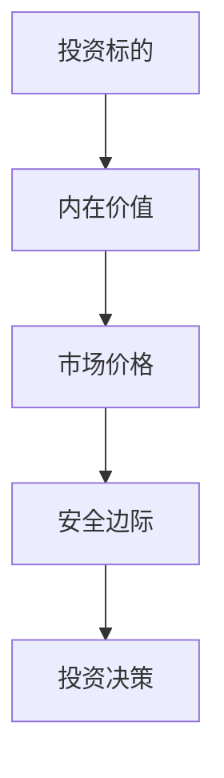
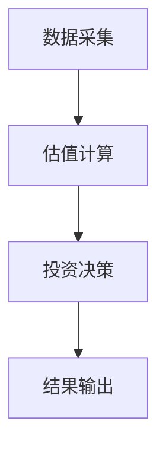
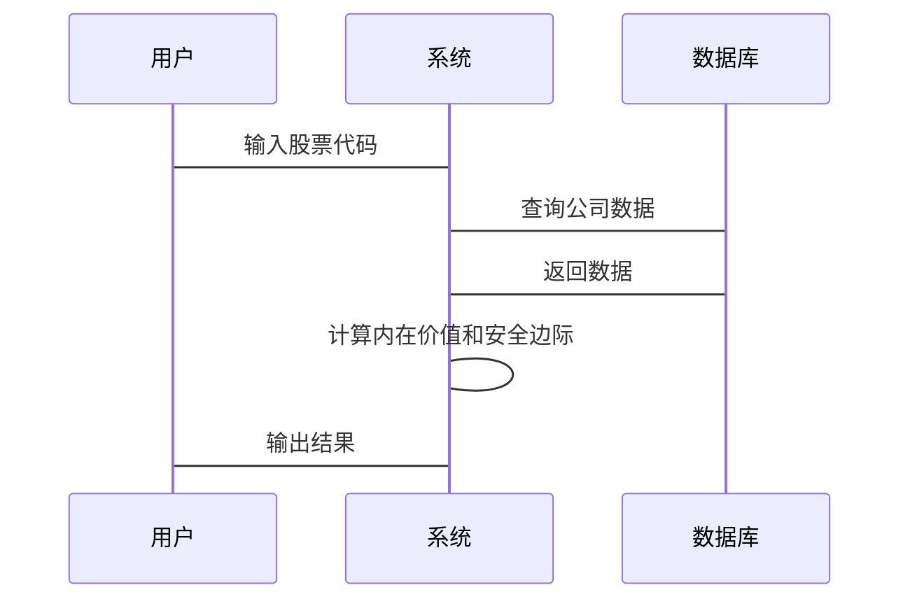

                 


# 托比亚斯·卡尔莱尔的新兴市场价值投资

## 关键词：托比亚斯·卡尔莱尔, 价值投资, 新兴市场, 投资策略, 安全边际, 内在价值

## 摘要：  
托比亚斯·卡尔莱尔是价值投资领域的杰出代表，他在新兴市场中的投资策略以安全边际和内在价值为核心。本文将逐步分析卡尔莱尔的价值投资理念，探讨其在新兴市场的应用，包括数学模型、算法原理和系统架构设计。通过案例分析和实战指导，帮助读者理解并应用卡尔莱尔的投资策略。

---

## 第一部分：背景介绍

### 第1章：价值投资的基本概念

#### 1.1 价值投资的起源与核心理念

- **投资的定义与分类**  
  投资是将资金投入某个项目或资产，期望在未来获得收益或资本增值的行为。根据投资对象的不同，可以分为股票、债券、房地产等多种类型。

- **价值投资的起源与发展**  
  价值投资起源于20世纪30年代，由本杰明·格雷厄姆和戴维·多德提出。格雷厄姆的学生彼得·林奇和约翰·邓普顿进一步发展了这一理论。

- **托比亚斯·卡尔莱尔的价值投资理念**  
  卡尔莱尔继承并发扬了格雷厄姆的价值投资思想，强调以低于内在价值的价格买入优质股票，注重安全边际和长期投资。

#### 1.2 新兴市场的特点与投资机会

- **新兴市场的定义与分类**  
  新兴市场是指经济快速发展但尚未完全工业化的国家，如中国、印度、巴西等。这些市场具有高增长潜力，但也伴随着较高的风险。

- **新兴市场的投资机会与风险**  
  新兴市场通常具有较高的经济增长率，但同时也面临政策风险、市场波动大、信息不透明等问题。

- **托比亚斯·卡尔莱尔对新兴市场的独特见解**  
  卡尔莱尔认为，新兴市场中许多公司具有较高的内在价值，但由于市场不成熟和信息不对称，这些公司的股票往往被低估，这为价值投资者提供了机会。

---

## 第二部分：核心概念与联系

### 第2章：价值投资的核心概念

#### 2.1 安全边际的概念与计算

- **安全边际的定义**  
  安全边际是指股票的市场价格低于其内在价值的部分，是投资者在投资时的安全空间。安全边际越大，投资风险越小。

- **安全边际的计算方法**  
  安全边际 = 内在价值 - 市场价格

- **安全边际与投资风险的关系**  
  安全边际越大，投资者在面对市场波动时的抗风险能力越强。因此，选择具有较大安全边际的股票是价值投资的重要原则。

#### 2.2 内在价值的评估与比较

- **内在价值的定义**  
  内在价值是指公司未来现金流的现值，反映了公司的真实价值。

- **内在价值的评估方法**  
  内在价值可以通过DCF模型（现金流折现模型）来计算，考虑公司的未来现金流和贴现率。

- **内在价值与市场价格的比较**  
  当市场价格低于内在价值时，股票具有投资价值。反之，则应避免投资。

#### 2.3 价值投资的核心要素对比表

| 核心要素       | 定义与特征                   |
|----------------|------------------------------|
| 投资标的       | 具有持续盈利能力和成长性的公司 |
| 内在价值       | 公司未来现金流的现值         |
| 安全边际       | 内在价值与市场价格的差额       |
| 市场价格       | 当前股票的市场价格           |



---

## 第三部分：算法原理讲解

### 第3章：价值投资的数学模型与算法

#### 3.1 内在价值的评估模型

- **现金流折现模型（DCF模型）**  
  DCF模型通过预测公司的未来现金流，并将其折现为现值，以计算内在价值。

  $$ \text{内在价值} = \sum_{t=1}^{n} \frac{\text{现金流}_t}{(1 + r)^t} + \frac{\text{终值}}{(1 + r)^n} $$

  其中，r是折现率，n是预测的年数。

- **市盈率与市净率模型**  
  市盈率（P/E）= 市场价格 / 每股收益  
  市净率（P/B）= 市场价格 / 每股净资产

- **股息率模型**  
  股息率 = 每股股息 / 市场价格

#### 3.2 投资组合优化的数学公式

- **马科维茨均值-方差模型**  
  该模型通过优化投资组合的收益与风险，找到最优资产配置。

  $$ \text{目标函数：} \min \sigma^2 \quad \text{约束条件：} \sum w_i r_i = \mu $$

  其中，\( \sigma^2 \) 是组合的方差，\( w_i \) 是资产i的权重，\( r_i \) 是资产i的预期收益，\( \mu \) 是目标收益。

- **投资组合优化的数学推导**  
  通过拉格朗日乘数法，可以求解上述优化问题。

#### 3.3 算法实现与案例分析

- **现金流折现模型的Python代码**

  ```python
  def calculate_intrinsic_value(fcf, discount_rate):
      # 假设永续增长率为g
      g = 0.05
      terminal_value = fcf * (1 + g) / (discount_rate - g)
      intrinsic_value = terminal_value / (1 + discount_rate)
      return intrinsic_value
  ```

  其中，`fcf` 是自由现金流，`discount_rate` 是折现率。

- **案例分析与结果解读**  
  以某新兴市场的公司为例，计算其内在价值和安全边际，判断是否具备投资价值。

---

## 第四部分：系统分析与架构设计方案

### 第4章：价值投资分析系统的构建

#### 4.1 系统功能设计

- **系统功能模块划分**  
  系统分为数据采集、估值计算、投资决策三个模块。

- **系统功能流程图**



- **系统功能的领域模型**


#### 4.2 系统架构设计

- **系统架构设计图**


- **系统接口设计与交互**



---

## 第五部分：项目实战

### 第5章：价值投资分析系统的实现

#### 5.1 环境安装与配置

- 安装Python和相关库（如Pandas、NumPy、Plotly）。

#### 5.2 系统核心实现源代码

- **估值模块代码**

  ```python
  def calculate_intrinsic_value(fcf, discount_rate):
      g = 0.05
      terminal_value = fcf * (1 + g) / (discount_rate - g)
      intrinsic_value = terminal_value / (1 + discount_rate)
      return intrinsic_value
  ```

- **数据可视化代码**

  ```python
  import matplotlib.pyplot as plt
  plt.plot(data, label='市场价格')
  plt.plot(data, label='内在价值')
  plt.legend()
  plt.show()
  ```

#### 5.3 代码应用解读与分析

- 解释代码的功能和实现细节，展示如何通过代码实现内在价值的计算和可视化。

#### 5.4 实际案例分析与详细讲解

- 以某新兴市场的公司为例，详细分析其投资价值，展示计算过程和结果。

#### 5.5 项目小结

- 总结项目的实现过程，强调系统的优势和局限性。

---

## 第六部分：最佳实践、小结、注意事项、拓展阅读

### 第6章：投资实战中的注意事项

#### 6.1 投资实战中的注意事项

- **风险管理**  
  价值投资者需要严格控制风险，避免过度集中投资。

- **持续学习**  
  投资者需要不断学习市场动态和公司信息，及时调整投资策略。

- **耐心与纪律**  
  价值投资需要长期持有的耐心和纪律，避免短期波动的干扰。

### 第7章：小结与拓展阅读

#### 7.1 小结

- 本文详细介绍了托比亚斯·卡尔莱尔的价值投资理念，分析了其在新兴市场的应用，并通过系统架构设计和项目实战，展示了如何将理论应用于实践。

#### 7.2 拓展阅读

- 推荐阅读托比亚斯·卡尔莱尔的经典著作《价值投资入门》和本杰明·格雷厄姆的《证券分析》。

---

## 作者：AI天才研究院/AI Genius Institute & 禅与计算机程序设计艺术 /Zen And The Art of Computer Programming

