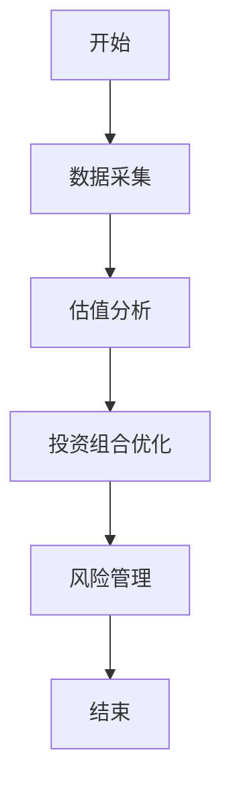

                 


# 托马斯·卡普兰的创新型价值投资方法

> **关键词**：价值投资、托马斯·卡普兰、投资方法、创新策略、系统架构、案例分析  
> **摘要**：本文详细介绍了托马斯·卡普兰的创新型价值投资方法，从背景到核心概念，再到数学模型和系统架构，最后通过案例分析进行深入探讨。

---

## 第1章：价值投资的背景与概念

### 1.1 价值投资的基本概念

#### 1.1.1 投资的基本原理
投资是将资金投入特定资产以期获得收益的行为。投资的基本原理包括资产配置、风险管理和收益最大化。资产配置决定了投资组合的结构，风险管理确保在波动中保持稳定，而收益最大化则是投资者追求的核心目标。

#### 1.1.2 价值投资的定义与核心理念
价值投资是一种通过分析企业的内在价值，寻找市场价格低于内在价值的证券进行投资的方法。其核心理念是买入被市场低估的资产，长期持有，等待其价值回归。

#### 1.1.3 价值投资与其它投资方法的对比
- **成长投资**：注重企业未来增长潜力，可能忽视当前估值。
- **指数投资**：被动跟踪市场指数，风险分散但收益有限。
- **短线交易**：频繁买卖，依赖市场波动，风险较高。

### 1.2 托马斯·卡普兰的生平与成就

#### 1.2.1 托马斯·卡普兰的个人经历
托马斯·卡普兰是价值投资领域的权威，以其创新的投资方法闻名。他的投资哲学强调对企业基本面的深入分析和市场情绪的合理判断。

#### 1.2.2 卡普兰在投资领域的贡献
卡普兰通过优化基本面分析和量化模型，提出了一套结合定性和定量分析的创新型价值投资方法。

#### 1.2.3 卡普兰投资方法的核心思想
卡普兰认为，投资不仅是对企业估值的分析，更是对市场心理和经济周期的深刻理解。

---

## 第2章：创新型价值投资方法的核心概念

### 2.1 创新型价值投资的定义与特点

#### 2.1.1 创新型价值投资的定义
创新型价值投资是在传统价值投资基础上，结合现代量化方法和系统性分析的投资策略。

#### 2.1.2 与传统价值投资的区别
- **传统价值投资**：侧重于基本面分析和长期持有。
- **创新型价值投资**：引入量化模型和系统性分析，注重动态调整。

#### 2.1.3 创新型价值投资的核心要素
- **定量分析**：使用数学模型评估企业价值。
- **系统性分析**：构建投资系统，优化投资组合。

### 2.2 卡普兰投资方法的理论基础

#### 2.2.1 基本面分析的核心要素
基本面分析包括对企业财务状况、行业地位和管理团队的评估。

#### 2.2.2 市场情绪与投资者心理
市场情绪影响资产价格，投资者心理在价值判断中起重要作用。

#### 2.2.3 经济周期与市场波动
经济周期影响企业的盈利能力和市场的波动性，投资者需灵活应对。

---

## 第3章：卡普兰投资方法的分析框架

### 3.1 投资决策的逻辑框架

#### 3.1.1 投资目标的设定
明确投资目标是制定策略的基础，包括收益目标和风险承受能力。

#### 3.1.2 投资策略的选择
根据市场环境和投资目标选择合适的策略，如低估策略或高增长策略。

#### 3.1.3 投资组合的构建
通过资产配置和风险分散构建优化的投资组合，平衡收益与风险。

### 3.2 企业内在价值的评估方法

#### 3.2.1 内在价值的定义与计算
内在价值是企业未来现金流的现值，常用现金流折现模型（DCF）计算。

#### 3.2.2 财务指标分析与企业估值
通过市盈率、市净率等指标评估企业估值，判断其是否被低估。

#### 3.2.3 行业分析与竞争优势评估
分析行业趋势和企业竞争优势，判断企业的长期发展潜力。

---

## 第4章：创新型价值投资的数学模型与算法

### 4.1 内在价值评估的数学模型

#### 4.1.1 现金流折现模型（DCF）
现金流折现模型是评估企业内在价值的核心工具。公式如下：
$$ \text{内在价值} = \sum_{t=1}^{n} \frac{\text{现金流}_t}{(1 + r)^t} + \frac{\text{终值}}{(1 + r)^n} $$
其中，\( r \) 是折现率，\( n \) 是估计期数。

#### 4.1.2 市盈率与市净率分析
市盈率（P/E）= 股价 / 每股收益
市净率（P/B）= 股价 / 每股净资产

#### 4.1.3 股东权益收益率（ROE）分析
ROE = 净利润 / 股东权益

### 4.2 投资组合优化的数学模型

#### 4.2.1 马科维茨投资组合理论
马科维茨理论通过优化投资组合的预期收益和风险，找到最优资产配置。

#### 4.2.2 市场中性策略的数学模型
市场中性策略通过做多和做空来抵消市场风险，公式如下：
$$ \sum_{i=1}^{n} w_i = 0 $$
其中，\( w_i \) 是资产i的权重。

#### 4.2.3 风险调整后的收益评估
夏普比率衡量单位风险下的超额收益，公式为：
$$ \text{夏普比率} = \frac{E[r - r_f]}{\sigma} $$
其中，\( E[r - r_f] \) 是超额收益的期望值，\( \sigma \) 是其标准差。

---

## 第5章：系统分析与架构设计方案

### 5.1 投资分析系统的功能设计

#### 5.1.1 系统需求分析
系统需实现企业估值、投资组合优化和市场分析等功能。

#### 5.1.2 系统功能模块划分
- 数据采集模块
- 估值分析模块
- 投资组合优化模块
- 风险管理模块

#### 5.1.3 系统流程图设计


### 5.2 系统架构设计

#### 5.2.1 分层架构设计
- 表现层：用户界面
- 业务逻辑层：处理用户请求
- 数据访问层：访问数据库

#### 5.2.2 模块化设计
每个功能模块独立开发，便于维护和扩展。

#### 5.2.3 系统接口设计
通过API实现模块间通信，确保数据流畅传输。

---

## 第6章：项目实战与案例分析

### 6.1 实战环境的安装与配置

#### 6.1.1 投资分析工具的安装
安装Python和相关库（如Pandas、NumPy）。

#### 6.1.2 数据源的获取与处理
从金融数据库获取数据，清洗并存储。

#### 6.1.3 系统环境的配置
配置开发环境，确保各模块协同工作。

### 6.2 核心算法的实现

#### 6.2.1 内在价值评估的代码实现
```python
def calculate_intrinsic_value(cash_flows, discount_rate, terminal_value):
    intrinsic_value = 0
    for t, cash_flow in enumerate(cash_flows):
        if t < len(cash_flows):
            intrinsic_value += cash_flow / (1 + discount_rate) ** t
    intrinsic_value += terminal_value / (1 + discount_rate) ** len(cash_flows)
    return intrinsic_value
```

#### 6.2.2 投资组合优化的代码实现
```python
def optimize_portfolio(returns, weights):
    covariance_matrix = returns.cov()
    portfolio_variance = (weights.T @ covariance_matrix @ weights)[0, 0]
    return 1 / portfolio_variance
```

#### 6.2.3 系统功能的测试与验证
通过模拟数据测试系统功能，确保准确性。

### 6.3 案例分析与详细解读

#### 6.3.1 案例选择
选择具有代表性的企业进行分析，如科技公司。

#### 6.3.2 数据分析与评估
使用系统工具评估企业的内在价值和市场地位。

#### 6.3.3 投资决策的制定
根据分析结果制定投资策略，并进行风险评估。

---

## 第7章：最佳实践与小结

### 7.1 投资方法的总结与反思

#### 7.1.1 创新型价值投资的优缺点
优点：结合了定量和定性分析，提高准确性。
缺点：模型依赖数据和假设，存在局限性。

#### 7.1.2 投资中的常见误区
- 过度依赖模型，忽视市场情绪。
- 忽视交易成本和税收影响。

#### 7.1.3 投资心态与纪律的重要性
保持冷静，严格执行投资计划，避免情绪化决策。

### 7.2 小结

托马斯·卡普兰的创新型价值投资方法通过结合传统基本面分析和现代量化模型，为投资者提供了一种系统化、科学化的投资策略。本文通过详细讲解其方法的背景、核心概念、数学模型和系统架构，并结合实际案例进行了深入分析，帮助读者更好地理解和应用这一方法。

---

## 作者信息

**作者：AI天才研究院/AI Genius Institute & 禅与计算机程序设计艺术 /Zen And The Art of Computer Programming**

---

以上是《托马斯·卡普兰的创新型价值投资方法》的完整目录和内容概述，涵盖从理论到实践的各个方面，确保读者能够全面理解并应用这一投资方法。

