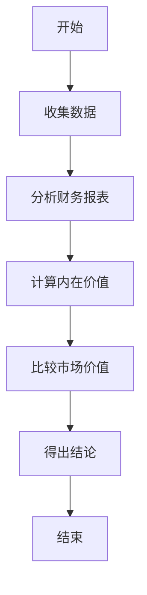

                 


# 托马斯·罗尼的价值投资审计：全面评估公司价值

## 关键词：托马斯·罗尼，价值投资，审计，公司价值，财务分析

## 摘要：  
托马斯·罗尼的价值投资理论强调通过深入分析公司的基本面来评估其内在价值。本文系统地介绍了价值投资审计的核心概念、方法和实际应用，通过详细的财务分析和案例研究，帮助投资者全面评估公司价值，做出明智的投资决策。

---

# 第一部分：价值投资审计的背景与核心概念

## 第1章：价值投资审计的背景与定义

### 1.1 价值投资的基本概念  
- **1.1.1 投资的基本概念与分类**  
  投资可以分为长期投资、短期投资、投机投资等，价值投资是一种基于公司基本面分析的长期投资策略。  
- **1.1.2 价值投资的定义与特点**  
  价值投资是通过分析公司的财务状况、行业地位和未来前景，寻找被市场低估的投资标的。其特点是注重长期收益，而非短期市场波动。  
- **1.1.3 价值投资审计的定义与作用**  
  价值投资审计是对公司财务报表、市场估值和内在价值进行全面分析的过程，旨在发现被低估的投资机会。

### 1.2 托马斯·罗尼的价值投资理论  
- **1.2.1 托马斯·罗尼的生平简介**  
  托马斯·罗尼是一位著名的价值投资者，以其严谨的分析方法和长期投资理念闻名。  
- **1.2.2 罗尼价值投资理论的核心思想**  
  罗尼强调，投资的本质是寻找那些具有强大竞争优势、良好财务状况和合理估值的公司。  
- **1.2.3 罗尼理论在现代投资中的应用**  
  罗尼的理论为现代价值投资提供了重要的理论基础，广泛应用于机构投资和个人投资中。

### 1.3 价值投资审计的核心要素  
- **1.3.1 公司基本面分析的重要性**  
  基本面分析包括对公司的财务状况、盈利能力、成长性和行业地位的全面评估。  
- **1.3.2 财务报表分析的关键指标**  
  包括净利润率、资产负债率、现金流等关键指标，这些指标是评估公司财务健康状况的重要依据。  
- **1.3.3 市场估值与内在价值的对比**  
  内在价值是指公司未来现金流的现值，市场估值则是指当前市场价格。通过对比两者，可以判断公司是否被低估或高估。

### 1.4 价值投资审计的边界与外延  
- **1.4.1 审计的适用范围与限制**  
  价值投资审计适用于那些具有稳定财务状况和明确竞争优势的公司，但对于高风险或周期性较强的行业可能不太适用。  
- **1.4.2 审计与投机投资的区别**  
  价值投资审计注重长期基本面分析，而投机投资则更关注短期市场波动。  
- **1.4.3 审计与其他投资策略的联系**  
  价值投资审计可以与其他策略（如成长投资）结合使用，以优化投资组合。

## 第2章：价值投资审计的核心概念与联系

### 2.1 核心概念原理  
- **2.1.1 内在价值与市场价值的关系**  
  内在价值是公司未来现金流的现值，市场价值则是由市场情绪和供需关系决定的短期价格。  
- **2.1.2 财务报表分析的逻辑框架**  
  通过对资产负债表、利润表和现金流量表的分析，可以全面评估公司的财务状况和盈利能力。  
- **2.1.3 资产负债表、利润表与现金流量表的关联**  
  资产负债表反映公司资产和负债的情况，利润表显示公司的收入和支出，而现金流量表则记录了公司的现金流入和流出。

### 2.2 核心概念属性特征对比表  
| 概念       | 属性特征                       |
|------------|-------------------------------|
| 内在价值   | 客观、长期、基于基本面         |
| 市场价值   | 主观、短期、基于市场情绪       |
| 财务报表   | 结构化、可量化、可验证         |

### 2.3 ER实体关系图  
```mermaid
erd
actor 投资者 {
  投资者 --> 公司: 分析
  投资者 --> 财务报表: 获取数据
  投资者 --> 市场: 监测
}
company 公司 {
  公司 --> 财务报表: 提供
  公司 --> 市场: 影响
}
market 市场 {
  市场 --> 投资者: 反馈
}
```

## 第3章：价值投资审计的算法原理

### 3.1 算法原理概述  
- **3.1.1 价值投资审计的基本流程**  
  收集数据 → 分析财务报表 → 计算内在价值 → 比较市场价值 → 得出结论。  
- **3.1.2 核心算法的数学模型**  
  内在价值的计算通常基于现金流折现模型（DCF模型）。

### 3.2 算法流程图  


### 3.3 算法实现代码  
```python
def calculate_intrinsic_value(financials):
    # 计算现金流
    free_cash_flow = financials.net_income + financials.depreciation - financials.capex
    # 计算加权平均资本成本
    wacc = (financials.equity_cost * financials.equity + financials.debt_cost * financials.debt) / (financials.equity + financials.debt)
    # 计算内在价值
    intrinsic_value = sum(future_cash_flows / (1 + wacc)^i for i in range(10))
    return intrinsic_value
```

## 第4章：数学模型与公式

### 4.1 现金流折现模型（DCF模型）  
- **内在价值公式**  
  $$ \text{内在价值} = \sum_{t=1}^{n} \frac{\text{自由现金流}_t}{(1 + r)^t} $$  
  其中，\( r \) 是折现率，通常使用加权平均资本成本（WACC）。

### 4.2 加权平均资本成本（WACC）公式  
  $$ \text{WACC} = \frac{E \cdot r_e + D \cdot r_d \cdot (1 - t)}{E + D} $$  
  其中，\( E \) 是权益，\( D \) 是债务，\( r_e \) 是权益成本，\( r_d \) 是债务成本，\( t \) 是税率。

## 第5章：系统分析与架构设计

### 5.1 问题场景介绍  
  价值投资审计需要一个高效的系统来处理大量数据和复杂的计算，确保分析的准确性和及时性。

### 5.2 系统功能设计  
- **领域模型类图**  
  ```mermaid
  classDiagram
  class 投资者 {
    - 公司: string
    - 财务报表: list
    - 市场数据: list
  }
  class 公司 {
    - 资产负债表: dict
    - 利润表: dict
    - 现金流量表: dict
  }
  class 市场数据 {
    - 市场价格: float
    - 市盈率: float
    - 市净率: float
  }
  投资者 --> 公司: 分析
  投资者 --> 市场数据: 获取
  公司 --> 市场数据: 影响
  ```

### 5.3 系统架构设计  
  ```mermaid
  architecture
  Client --> Server: 请求数据
  Server --> Database: 查询数据
  Server --> Analytic Engine: 处理数据
  Analytic Engine --> Database: 保存结果
  Server --> Client: 返回结果
  ```

### 5.4 系统接口设计  
  - 输入接口：财务报表数据、市场数据  
  - 输出接口：内在价值、市场估值、投资建议

### 5.5 系统交互序列图  
  ```mermaid
  sequenceDiagram
  投资者 -> Server: 请求分析
  Server -> Database: 查询公司数据
  Database -> Server: 返回公司数据
  Server -> Analytic Engine: 计算内在价值
  Analytic Engine -> Server: 返回结果
  Server -> 投资者: 返回分析结果
  ```

## 第6章：项目实战

### 6.1 环境安装  
  - 安装Python和必要的库（如Pandas、NumPy、Matplotlib）
  - 安装Jupyter Notebook用于数据分析和可视化

### 6.2 核心实现源代码  
  ```python
  import pandas as pd
  import numpy as np

  def calculate_intrinsic_value(financials):
      # 计算自由现金流
      free_cash_flow = financials.net_income + financials.depreciation - financials.capex
      # 计算加权平均资本成本
      wacc = (financials.equity * financials.equity_cost + financials.debt * financials.debt_cost * (1 - financials.tax_rate)) / (financials.equity + financials.debt)
      # 计算内在价值
      intrinsic_value = 0
      for i in range(10):
          intrinsic_value += free_cash_flow * (1 + financials.growth_rate)^i / (1 + wacc)^i
      return intrinsic_value

  # 示例数据
  financials = {
      'net_income': 100,
      'depreciation': 20,
      'capex': 30,
      'equity': 500,
      'debt': 200,
      'equity_cost': 0.1,
      'debt_cost': 0.05,
      'tax_rate': 0.2,
      'growth_rate': 0.05
  }

  iv = calculate_intrinsic_value(financials)
  print(f"内在价值: {iv}")
  ```

### 6.3 案例分析  
  - 以某公司为例，分析其财务报表，计算其内在价值，并与市场价格进行对比，得出投资建议。

## 第7章：最佳实践

### 7.1 小结  
  价值投资审计通过深入分析公司的基本面，帮助投资者发现被低估的投资机会。

### 7.2 注意事项  
  - 数据的准确性和完整性至关重要  
  - 考虑市场环境和行业周期的影响  
  - 长期持有，避免频繁交易

### 7.3 拓展阅读  
  - 《价值投资入门》  
  - 《财务报表分析》  
  - 《投资学》

---

# 作者：AI天才研究院/AI Genius Institute & 禅与计算机程序设计艺术 /Zen And The Art of Computer Programming

