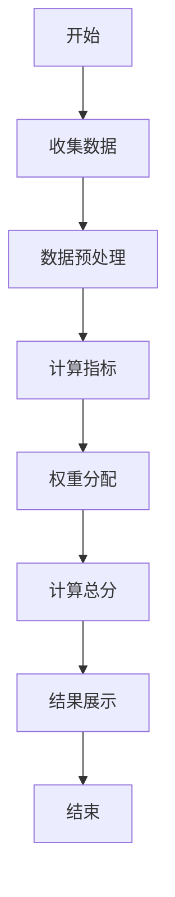
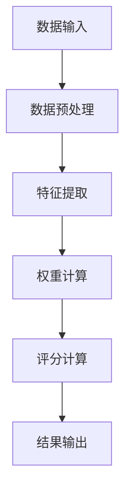
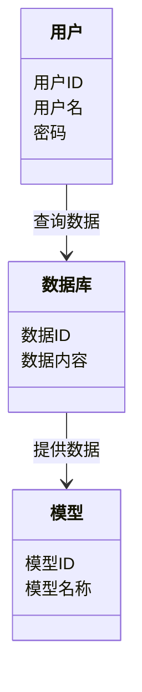

                 


# 托马斯·罗恩的公司治理评分系统

> 关键词：公司治理评分系统、托马斯·罗恩、治理评估模型、评分算法、企业治理优化

> 摘要：托马斯·罗恩的公司治理评分系统是一种创新的评估工具，旨在通过量化方法评估企业的治理状况。本文将从系统背景、核心概念、算法原理、架构设计、项目实战等多个维度详细阐述该评分系统，帮助读者深入了解其工作原理和实际应用。

---

## 第一部分: 托马斯·罗恩的公司治理评分系统概述

### 第1章: 公司治理的基本概念

#### 1.1 公司治理的定义与重要性
##### 1.1.1 公司治理的定义
公司治理是指公司如何被管理，包括董事会结构、管理层职责、股东权利等。它是确保公司高效运作、合规经营的核心机制。

##### 1.1.2 公司治理的重要性
良好的公司治理能够提升企业透明度，降低风险，增强投资者信心，进而提升企业价值。

##### 1.1.3 公司治理的核心要素
- 董事会结构
- 管理层职责
- 股东权利
- 监管机制
- 信息披露

#### 1.2 托马斯·罗恩的贡献
##### 1.2.1 托马斯·罗恩的背景介绍
托马斯·罗恩是公司治理领域的权威专家，以其创新的评分系统闻名。

##### 1.2.2 托马斯·罗恩在公司治理领域的成就
- 开发了首个基于量化指标的公司治理评分系统。
- 提出了动态权重分配模型。

##### 1.2.3 托马斯·罗恩评分系统提出背景
传统公司治理评估多为定性分析，缺乏量化标准。托马斯·罗恩系统填补了这一空白。

---

### 第2章: 公司治理评分系统的背景与问题

#### 2.1 公司治理评分系统的发展历程
##### 2.1.1 早期公司治理评估方法
早期方法多为定性分析，缺乏客观性。

##### 2.1.2 托马斯·罗恩评分系统出现的背景
随着企业规模扩大，定量评估需求增加。

##### 2.1.3 当前公司治理评分系统的现状
现有系统多为静态评估，难以动态调整。

#### 2.2 公司治理评分系统的核心问题
##### 2.2.1 公司治理评估的难点
- 数据收集困难
- 指标权重难以确定
- 动态调整复杂

##### 2.2.2 托马斯·罗恩评分系统解决的问题
通过动态权重分配模型，解决了传统系统的问题。

##### 2.2.3 公司治理评分系统的边界与外延
- 边界：仅评估公司治理状况
- 外延：可扩展至风险管理等领域

---

### 第3章: 托马斯·罗恩评分系统的概念框架

#### 3.1 评分系统的核心概念
##### 3.1.1 公司治理评分的核心要素
- 指标选择
- 数据采集
- 权重分配
- 评分计算

##### 3.1.2 托马斯·罗恩评分系统的框架
- 数据层：收集公司治理相关数据
- 计算层：进行数据处理和评分计算
- 展示层：提供可视化结果

##### 3.1.3 评分系统的核心属性特征对比表格
| 属性 | 托马斯·罗恩系统 | 传统系统 |
|------|----------------|----------|
| 数据源 | 多源异构数据 | 单一数据源 | 
| 指标权重 | 动态调整 | 静态固定 |
| 计算模型 | 综合评分模型 | 单一指标 |

#### 3.2 实体关系图与流程图
##### 3.2.1 公司治理评分系统的ER实体关系图
```mermaid
erDiagram
    actor 用户 {
        string 用户ID
        string 用户名
        string 密码
    }
    database 数据库 {
        integer 数据ID
        string 数据类型
        string 数据内容
    }
    model 模型 {
        integer 模型ID
        string 模型名称
        string 模型描述
    }
    用户 --> 数据库 : 查询数据
    数据库 --> 模型 : 提供数据
```

##### 3.2.2 托马斯·罗恩评分系统的流程图


---

### 第4章: 托马斯·罗恩评分系统的算法原理

#### 4.1 评分系统的算法概述
##### 4.1.1 数据预处理与特征提取
- 数据清洗
- 特征工程

##### 4.1.2 评分模型的构建
- 使用回归模型进行评分计算

##### 4.1.3 权重分配与评分计算
- 动态权重分配模型

#### 4.2 算法流程图


#### 4.3 数学模型与公式
##### 4.3.1 评分公式
$$
\text{总分} = \sum (\text{指标值} \times \text{权重})
$$

##### 4.3.2 权重分配公式
$$
\text{权重} = \frac{\text{指标的重要性}}{\sum \text{所有指标的重要性}}
$$

---

### 第5章: 托马斯·罗恩评分系统的系统分析与架构设计

#### 5.1 问题场景介绍
公司治理评分系统需要处理多源异构数据，实现动态调整。

#### 5.2 系统功能设计
##### 5.2.1 领域模型


#### 5.3 系统架构设计
##### 5.3.1 架构图
```mermaid
container 公司治理评分系统 {
    service 数据处理服务 {
        - 数据清洗
        - 特征提取
    }
    service 评分计算服务 {
        - 权重计算
        - 评分计算
    }
    service 结果展示服务 {
        - 结果可视化
    }
}
```

---

### 第6章: 托马斯·罗恩评分系统的项目实战

#### 6.1 环境安装
- 数据库：MySQL
- 开发语言：Python
- 工具：Jupyter Notebook

#### 6.2 核心代码实现
##### 6.2.1 数据预处理
```python
import pandas as pd
data = pd.read_csv('governance.csv')
data = data.dropna()
```

##### 6.2.2 评分计算
```python
def calculate_score(data, weights):
    return data.dot(weights)
```

#### 6.3 案例分析
以某公司为例，展示数据处理和评分计算过程。

---

## 作者：AI天才研究院 & 禅与计算机程序设计艺术

