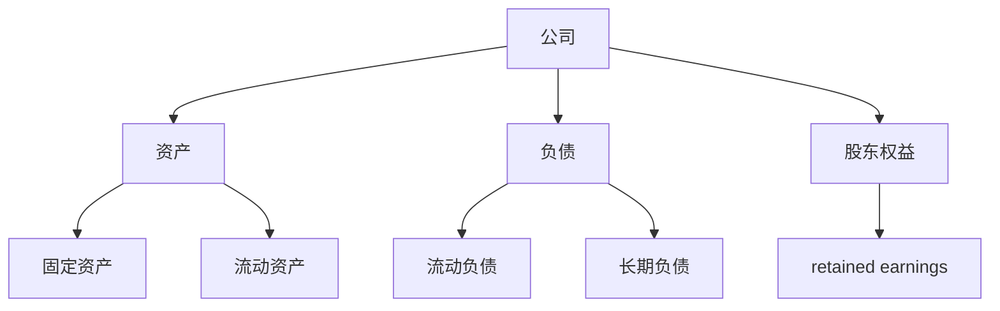
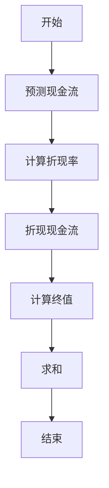

                 


# 托马斯罗的公司估值技巧

> 关键词：公司估值、DCF模型、财务分析、行业分析、投资决策

> 摘要：公司估值是投资决策中至关重要的一环，本文通过详细讲解公司估值的核心概念、算法原理、系统分析及项目实战，帮助读者掌握托马斯罗的公司估值技巧。从基础的估值方法到高级的现金流折现模型，本文将带您一步步深入理解公司估值的精髓。

---

# 目录

1. [背景介绍](#背景介绍)
2. [核心概念与联系](#核心概念与联系)
3. [算法原理](#算法原理)
4. [系统分析与架构设计](#系统分析与架构设计)
5. [项目实战](#项目实战)
6. [最佳实践](#最佳实践)
7. [小结](#小结)
8. [注意事项](#注意事项)
9. [附录](#附录)

---

## 第1章: 背景介绍

### 1.1 公司估值的基本概念

公司估值是评估一家公司内在价值的过程，旨在确定其股权或整体价值。这一过程对于投资者、企业家和管理层来说至关重要，因为它影响到投资决策、并购交易和公司战略。

#### 1.1.1 什么是公司估值

公司估值是通过分析公司财务状况、市场地位、盈利能力等因素，估算其在市场上的合理价格。常见的估值方法包括市盈率法、市净率法、现金流折现法（DCF）等。

#### 1.1.2 公司估值的重要性

- 投资决策：帮助投资者判断股票是否被高估或低估。
- 并购交易：确定收购目标公司的合理价格。
- 公司管理：评估公司绩效和制定战略目标。

#### 1.1.3 公司估值的常见应用场景

- 股权融资
- 股票投资
- 并购重组
- 初创企业估值

### 1.2 公司估值的常见方法

#### 1.2.1 市盈率法

市盈率（P/E）是股价与每股收益的比率，反映了市场对公司盈利能力的评价。

公式：
$$ P/E = \frac{\text{股价}}{\text{每股收益}} $$

#### 1.2.2 市净率法

市净率（P/B）是股价与每股净资产的比率，适用于资产密集型行业。

公式：
$$ P/B = \frac{\text{股价}}{\text{每股净资产}} $$

#### 1.2.3 股权自由现金流法

股权自由现金流（FCFE）是公司可用于股东的现金流。

公式：
$$ FCFE = NI + NDT - (CA - CL) $$

#### 1.2.4 重置成本法

重置成本法是通过重建公司所需资产的成本来估算公司价值。

#### 1.2.5 其他估值方法概述

- 现金流折现法（DCF）
- 相对估值法
- 账面价值法

---

## 第2章: 核心概念与联系

### 2.1 公司估值的核心要素

#### 2.1.1 收入与利润

收入是公司的营业收入，利润是净利润。

#### 2.1.2 资产与负债

资产是公司拥有的资源，负债是公司欠款。

#### 2.1.3 股东权益

股东权益是股东对公司净资产的要求权。

#### 2.1.4 现金流

现金流是公司现金的流入和流出。

### 2.2 估值方法的原理与特征对比

#### 2.2.1 不同估值方法的原理对比

- 市盈率法：基于盈利能力。
- 市净率法：基于资产价值。
- DCF模型：基于未来现金流。

#### 2.2.2 各种估值方法的优缺点对比

| 方法 | 优点 | 缺点 |
|------|------|------|
| 市盈率法 | 简单易用 | 受行业影响大 |
| 市净率法 | 适用于资产密集型行业 | 忽略盈利能力 |
| DCF模型 | 精确性高 | 计算复杂 |

#### 2.2.3 估值与实际价值的差异

估值是基于现有信息的预测，实际价值受市场情绪和突发事件影响。

### 2.3 公司估值的ER实体关系图



---

## 第3章: 算法原理

### 3.1 现金流折现模型（DCF模型）

#### 3.1.1 DCF模型的基本原理

DCF模型通过将未来现金流折现为现值来估算公司价值。

公式：
$$ V = \sum_{t=1}^{n} \frac{CF_t}{(1 + r)^t} + \frac{TV}{(1 + r)^n} $$

其中，\( r \) 是折现率，\( CF_t \) 是第t年的现金流，\( TV \) 是终值。

#### 3.1.2 自由现金流的计算公式

$$ FCF = NI + NDT - (CA - CL) $$

其中：
- \( NI \) 是净利润
- \( NDT \) 是非现金消耗
- \( CA \) 是资本性支出
- \( CL \) 是流动资本支出

#### 3.1.3 折现率的计算

$$ r = WACC = \frac{E}{V} \times R_e + \frac{D}{V} \times R_d \times (1 - T) $$

其中：
- \( E \) 是权益价值
- \( V \) 是公司价值
- \( R_e \) 是权益成本
- \( D \) 是债务价值
- \( R_d \) 是债务成本
- \( T \) 是税率

#### 3.1.4 DCF模型的步骤

1. 预测未来现金流
2. 计算折现率
3. 折现未来现金流
4. 计算终值
5. 求和得到公司价值



---

## 第4章: 系统分析与架构设计

### 4.1 系统架构图


---

## 第5章: 项目实战

### 5.1 环境安装

需要安装Python和相关库（如numpy、pandas）。

### 5.2 系统核心实现源代码

```python
import numpy as np
import pandas as pd

def calculate_dcf(cash_flows, discount_rate, terminal_value):
    return np.npv(discount_rate, cash_flows) + terminal_value / (1 + discount_rate)**len(cash_flows)

# 示例数据
cash_flows = [-100, 200, 200, 200]
discount_rate = 0.1
terminal_value = 1000

# 计算DCF
value = calculate_dcf(cash_flows, discount_rate, terminal_value)
print(f"公司价值：{value:.2f}")
```

### 5.3 实际案例分析

假设某公司未来5年的现金流分别为-100, 200, 200, 200, 200，折现率为10%，终值为1000。

计算结果：
$$ V = \frac{-100}{1.1} + \frac{200}{1.1^2} + \frac{200}{1.1^3} + \frac{200}{1.1^4} + \frac{200}{1.1^5} + \frac{1000}{1.1^5} $$

---

## 第6章: 最佳实践

### 6.1 小结

公司估值是投资决策中的关键步骤，掌握多种估值方法和理解其原理有助于提高估值准确性。

### 6.2 注意事项

- 数据准确性
- 方法适用性
- 市场风险

### 6.3 拓展阅读

- 《投资学》
- 《公司财务》

---

## 作者：AI天才研究院/AI Genius Institute & 禅与计算机程序设计艺术 /Zen And The Art of Computer Programming

