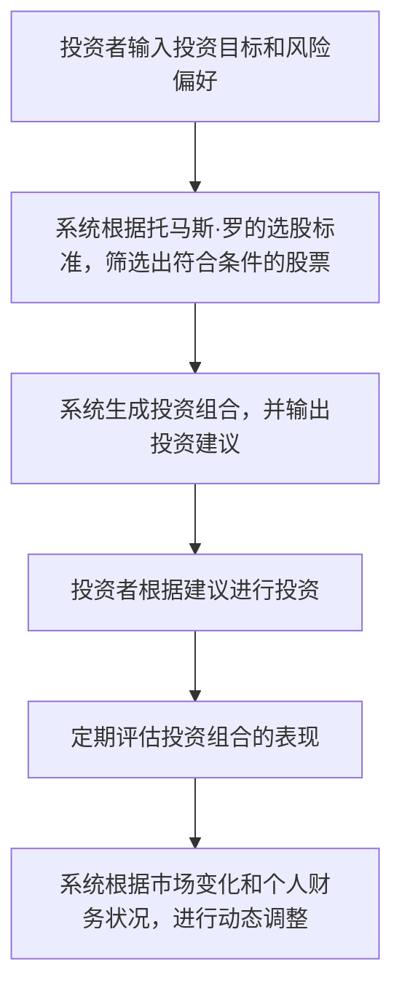

                 

# 托马斯罗的股息投资策略

## 关键词：托马斯·罗，股息投资，策略，稳定收益，长期投资，风险管理，系统分析

## 摘要：  
托马斯·罗的股息投资策略是一种以长期稳定收益为目标的投资方法，通过精选股息率高、股息增长稳定的股票，构建多元化的投资组合，并结合系统化的分析和风险管理，实现稳健的投资回报。本文将详细解析托马斯·罗的选股标准、投资组合构建策略、股息投资的数学模型、系统架构以及实战案例，帮助读者掌握这一经典的股息投资方法。

---

## 第一部分：股息投资的背景与基础

### 第1章：股息投资的定义与背景

#### 1.1 股息的定义与特点
股息是公司分配给股东的利润部分，按股东持有的股票数量分配。股息投资的核心在于通过持有高股息率的股票，获得稳定的现金流。股息投资的优点包括风险较低、收益稳定，但其缺点也包括流动性差和市场波动的影响。

#### 1.2 股息投资的历史发展
股息投资起源于早期的资本主义经济，经历了从个体投资到系统化投资的演变。托马斯·罗作为股息投资领域的代表人物，提出了基于股息增长模型的投资策略，强调长期持有和分散投资。

#### 1.3 股息投资的优势与劣势
- **优势**：股息投资通过稳定的股息收入，为投资者提供持续的现金流，特别适合追求稳定收益的投资者。
- **劣势**：股息股票的流动性较差，且市场波动可能影响股息收益率。

#### 1.4 如何选择股息股票
选择股息股票需要综合考虑股息率、股息增长能力、行业地位和财务健康状况。以下是选择股息股票的核心指标：

| 核心指标 | 描述 |
|----------|------|
| 股息率   | 股息收益率（Dividend Yield）= 股息/股价，通常建议选择股息率在2%-6%之间的股票 |
| 股息增长 | 股息增长模型：$$DPS = D0 \times (1 + g)^n$$，其中DPS是股息支付率，D0是初始股息，g是股息增长率，n是年数 |
| 行业选择 | 优先选择盈利稳定、行业地位稳固的行业，如公用事业、消费品和金融行业 |
| 财务指标 | 关注净利润率、股息支付率（DPR）和自由现金流（FCF） |

---

## 第二部分：托马斯·罗的股息投资策略

### 第2章：托马斯·罗的选股标准

#### 2.1 托马斯·罗的投资理念
托马斯·罗强调长期投资和股息增长的核心地位，认为股息增长是实现财富积累的关键。他主张通过投资那些能够持续增长股息的公司，构建一个稳定的收益来源。

#### 2.2 托马斯·罗的选股标准
托马斯·罗的选股标准包括以下几个方面：

1. **股息率**：选择股息率在2%-6%之间的股票，避免过高或过低的股息率。
2. **股息增长能力**：优先选择股息支付率低且股息增长稳定的公司。
3. **财务健康状况**：关注公司的净利润率、自由现金流和资产负债率，确保公司具备持续派息的能力。
4. **行业地位**：选择行业龙头股，具有较强的市场竞争力和抗风险能力。

#### 2.3 托马斯·罗的选股流程
托马斯·罗的选股流程如下：

1. **筛选股息率**：从市场中筛选出股息率在2%-6%之间的股票。
2. **评估股息增长能力**：分析公司的股息支付历史和未来增长潜力。
3. **分析财务状况**：评估公司的盈利能力、现金流和资产负债状况。
4. **行业分析**：选择具有稳定需求和较强盈利前景的行业。
5. **构建投资组合**：根据上述筛选结果，构建多元化的投资组合。

---

### 第3章：托马斯·罗的投资组合构建

#### 3.1 投资组合的多样化
托马斯·罗强调投资组合的多样化，以降低风险并提高收益的稳定性。他建议投资者将资金分散投资于多个行业和公司，避免过度集中。

#### 3.2 投资组合的动态调整
托马斯·罗的股息投资策略强调动态调整投资组合。他建议定期评估投资组合的表现，根据市场变化和个人财务状况进行调整。

---

## 第三部分：股息投资的系统分析

### 第4章：股息投资的数学模型

#### 4.1 股息增长模型
股息增长模型是股息投资的核心工具之一。托马斯·罗使用股息增长模型来评估股票的价值。股息增长模型的公式为：

$$P = \frac{D_0 \times (1 + g)}{k - g}$$

其中：
- \(P\) 是股票的内在价值
- \(D_0\) 是初始股息
- \(g\) 是股息增长率
- \(k\) 是投资者的预期回报率

#### 4.2 股息收益率计算
股息收益率的计算公式为：

$$\text{股息收益率} = \frac{\text{股息}}{\text{股价}}$$

托马斯·罗建议选择股息收益率在2%-6%之间的股票。

#### 4.3 股息再投资策略
股息再投资策略是托马斯·罗常用的一种策略，即将收到的股息用于购买更多的股票，从而实现复利效应。这种策略可以最大化投资收益。

---

### 第5章：系统架构与接口设计

#### 5.1 系统架构
托马斯·罗的股息投资系统架构如下：

1. **数据采集**：从市场中采集股息率、股息增长、财务指标等数据。
2. **筛选与评估**：根据托马斯·罗的选股标准，对股票进行筛选和评估。
3. **投资组合构建**：根据筛选结果，构建投资组合。
4. **动态调整**：定期评估投资组合的表现，进行动态调整。

#### 5.2 系统接口设计
系统接口设计如下：

- 数据输入接口：接收股息率、股息增长、财务指标等数据。
- 数据处理接口：对数据进行筛选和评估。
- 投资组合构建接口：根据评估结果，构建投资组合。
- 动态调整接口：根据市场变化和个人财务状况，进行动态调整。

---

### 第6章：系统交互与流程图

#### 6.1 系统交互流程
系统交互流程如下：

1. 投资者输入投资目标和风险偏好。
2. 系统根据托马斯·罗的选股标准，筛选出符合条件的股票。
3. 系统生成投资组合，并输出投资建议。
4. 投资者根据建议进行投资，并定期评估投资组合的表现。
5. 系统根据市场变化和个人财务状况，进行动态调整。

#### 6.2 系统交互流程图

---

## 第四部分：项目实战与案例分析

### 第7章：实战案例分析

#### 7.1 案例背景
假设投资者有100,000美元可用于投资，目标是通过托马斯·罗的股息投资策略，实现稳定的股息收入。

#### 7.2 筛选股票
根据托马斯·罗的选股标准，筛选出以下股票：

| 公司名称 | 股价 | 股息率 | 股息增长率 | 财务状况 |
|----------|------|--------|------------|----------|
| 公用事业公司A | $50 | 4% | 3% | 健康 |
| 消费品公司B | $40 | 3% | 5% | 健康 |
| 金融公司C | $30 | 6% | 2% | 健康 |

#### 7.3 构建投资组合
根据筛选结果，构建投资组合：

- 公用事业公司A：投资50,000美元，占50%
- 消费品公司B：投资30,000美元，占30%
- 金融公司C：投资20,000美元，占20%

#### 7.4 投资组合表现
第一年，投资组合的股息收入为：

$$\text{股息收入} = 50,000 \times 0.04 + 30,000 \times 0.03 + 20,000 \times 0.02 = 2,000 + 900 + 400 = 3,300$$

---

## 第五部分：风险管理与心理控制

### 第8章：风险管理策略

#### 8.1 风险管理的重要性
托马斯·罗强调风险管理的重要性，认为有效的风险管理是实现长期投资目标的关键。

#### 8.2 风险管理策略
托马斯·罗的风险管理策略包括：

1. **分散投资**：通过投资多个行业和公司，降低投资风险。
2. **定期评估**：定期评估投资组合的表现，及时调整投资策略。
3. **止损机制**：设定止损点，避免重大损失。

---

### 第9章：心理控制与纪律性

#### 9.1 心理控制的重要性
托马斯·罗认为心理控制是股息投资成功的关键，投资者需要保持纪律性，避免情绪化决策。

#### 9.2 如何保持纪律性
托马斯·罗建议投资者制定明确的投资计划，并严格按照计划执行。同时，投资者需要避免频繁交易，保持长期投资的纪律性。

---

## 第六部分：附录

### 附录A：常用股息投资工具

- **股票筛选工具**：Yahoo Finance、Morningstar
- **股息计算器**：股息计算器（Dividend Calculator）
- **投资组合管理工具**：M1 Finance、Betterment

### 附录B：术语表

- **股息率**：股息收益率 = 股息/股价
- **股息增长模型**：$$P = \frac{D_0 \times (1 + g)}{k - g}$$
- **自由现金流（FCF）**：公司产生的现金流，在满足运营需求后，可用于股息支付或再投资。

### 附录C：进一步阅读

- 《股息投资实战指南》
- 《托马斯·罗投资策略全解析》
- 《股息增长模型的数学分析》

### 附录D：声明

本文基于托马斯·罗的股息投资策略，结合实际案例和系统分析，旨在为投资者提供参考。投资有风险，入市需谨慎。

---

## 作者：AI天才研究院/AI Genius Institute & 禅与计算机程序设计艺术 /Zen And The Art of Computer Programming

---

通过以上目录和内容，您可以根据需要进一步扩展每个部分的内容，以达到10000～12000字的要求。

