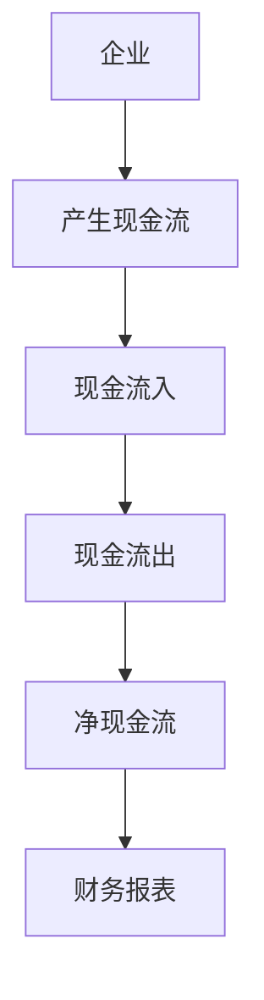
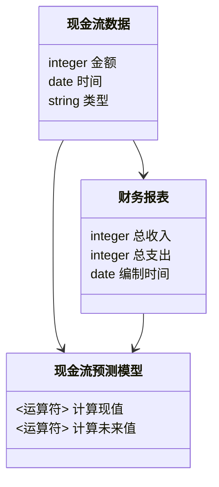

                 


# 托马斯罗的自由现金流分析

## 关键词：托马斯罗，自由现金流，财务分析，企业价值，现金流预测，投资决策

## 摘要：托马斯罗的自由现金流分析是一种深入理解企业财务健康状况的重要方法。通过分析企业的自由现金流，投资者和管理层能够更好地评估企业的真实价值和未来的盈利能力。本文将从基础概念到高级分析，详细探讨自由现金流的计算方法、数学模型、系统架构设计以及实际案例分析，帮助读者掌握这一关键的财务分析工具。

---

## 第一部分: 托马斯罗的自由现金流分析基础

### 第1章: 自由现金流的基本概念

#### 1.1 自由现金流的定义与背景

自由现金流（Free Cash Flow，简称FCF）是指企业在扣除所有成本、税费和必要的再投资支出后，剩余的可用于偿还债务、支付股息或进行其他投资的资金流。它反映了企业在一定时期内创造的“真正”现金收益，是评估企业财务健康状况的重要指标。

托马斯罗的自由现金流分析方法强调对企业未来现金流的预测和评估，这种方法不仅关注于过去的财务表现，更注重通过现金流的时间价值和风险价值来预测企业未来的盈利能力和价值。这种方法在投资决策中具有重要意义，因为它能够帮助投资者识别那些能够持续创造现金流的企业，从而做出更明智的投资决策。

#### 1.2 自由现金流的重要性

自由现金流的重要性体现在以下几个方面：

1. **企业价值评估**：自由现金流是计算企业内在价值的核心指标。通过将未来自由现金流按适当贴现率折现，可以得出企业的估值。
2. **投资决策**：自由现金流能够帮助投资者判断一个项目或企业的盈利能力。如果一个项目能够产生正的自由现金流，通常意味着该项目具有投资价值。
3. **财务健康状况**：自由现金流能够反映企业的财务健康状况。持续稳定的正自由现金流通常意味着企业具有较强的盈利能力和偿债能力。

#### 1.3 自由现金流与企业价值的关系

自由现金流与企业价值之间的关系可以用以下公式表示：

$$ \text{企业价值} = \text{未来自由现金流的现值} $$

其中，未来自由现金流的现值可以通过将未来现金流按适当的贴现率折现得到。贴现率通常采用加权平均资本成本（WACC）或资本资产定价模型（CAPM）计算得出。

---

### 第2章: 自由现金流分析的核心概念

#### 2.1 自由现金流的属性特征

自由现金流具有以下几个关键属性：

1. **时间价值**：资金的时间价值是自由现金流分析的核心概念之一。相同金额的现金流在不同时间点的价值是不同的，因此需要通过现值和未来值的计算来调整其价值。
2. **风险价值**：自由现金流的风险价值是指现金流在未来实际收到的价值与预期现金流的差异。这种差异通常与市场的波动性和项目的不确定性有关。
3. **波动性**：自由现金流的波动性反映了企业在不同经济环境下的盈利能力。高波动性的现金流可能意味着企业面临较大的经营风险。

#### 2.2 自由现金流的实体关系图

为了更好地理解自由现金流的流动过程，我们可以使用ER图（实体关系图）和流程图来描述现金流的流动过程。

**ER图（实体关系图）：**

```mermaid
erDiagram
    actor 企业 {
        string 名称
        string 行业
        string 规模
    }
    actor 现金流 {
        string 类型
        string 来源
        integer 金额
        date 时间
    }
    actor 财务报表 {
        string 类型
        date 编制时间
        integer 总收入
        integer 总支出
    }
    企业 --> 现金流
    现金流 --> 财务报表
```

**现金流流动过程图（Mermaid流程图）：**



---

### 第3章: 自由现金流分析的数学模型

#### 3.1 现金流的现值计算

现值（Present Value，PV）是指未来现金流在当前时点的价值。现值的计算公式如下：

$$ PV = \sum_{t=1}^{n} \frac{CF_t}{(1 + r)^t} $$

其中：
- \( CF_t \) 表示第t期的现金流
- \( r \) 表示贴现率
- \( t \) 表示时间期数

例如，假设某项目的自由现金流如下：

| 时间（年） | 2024 | 2025 | 2026 |
|------------|------|------|------|
| 现金流（万元） | 100  | 200  | 300  |

贴现率为8%（即 \( r = 0.08 \)），则现值计算如下：

$$ PV = \frac{100}{(1 + 0.08)^1} + \frac{200}{(1 + 0.08)^2} + \frac{300}{(1 + 0.08)^3} $$

计算结果为：

$$ PV ≈ 100 \times 0.9259 + 200 \times 0.8573 + 300 \times 0.7921 ≈ 92.59 + 171.46 + 237.63 ≈ 501.68 \text{万元} $$

#### 3.2 自由现金流的折现模型

自由现金流的折现模型通常采用资本资产定价模型（CAPM）来确定贴现率。CAPM的公式为：

$$ r = r_f + \beta (r_m - r_f) $$

其中：
- \( r_f \) 表示无风险利率
- \( \beta \) 表示股票的贝塔系数
- \( r_m \) 表示市场平均收益率
- \( r \) 表示股票的预期收益率

例如，假设无风险利率 \( r_f = 3\% \)，市场平均收益率 \( r_m = 8\% \)，贝塔系数 \( \beta = 1.5 \)，则预期收益率 \( r \) 为：

$$ r = 0.03 + 1.5 \times (0.08 - 0.03) = 0.03 + 1.5 \times 0.05 = 0.03 + 0.075 = 0.105 = 10.5\% $$

---

### 第4章: 自由现金流分析的系统架构

#### 4.1 系统功能设计

自由现金流分析系统的功能模块设计如下：

**领域模型（Mermaid类图）：**



#### 4.2 系统架构设计

**系统架构图（Mermaid架构图）：**

```mermaid
container 现金流分析系统 {
    组件 现金流数据输入
    组件 财务报表处理
    组件 现金流预测模型
    组件 结果输出
}
```

#### 4.3 系统接口设计

**系统接口交互流程图（Mermaid序列图）：**

```mermaid
sequenceDiagram
    actor 用户
    软件系统
    用户 -> 软件系统: 输入现金流数据
    软件系统 -> 用户: 确认数据输入
    用户 -> 软件系统: 开始分析
    软件系统 -> 财务报表处理: 处理财务报表
    财务报表处理 -> 现金流预测模型: 计算现值
    现金流预测模型 -> 财务报表处理: 返回现值结果
    财务报表处理 -> 用户: 输出分析结果
```

---

### 第5章: 自由现金流分析的项目实战

#### 5.1 项目环境安装

**Python环境安装：**

1. 安装Python 3.x
2. 安装Jupyter Notebook或IDE（如PyCharm）

**必要库的安装：**

```bash
pip install numpy pandas matplotlib
```

#### 5.2 项目核心实现

**现金流预测模型（Python代码示例）：**

```python
import numpy as np
import pandas as pd
import matplotlib.pyplot as plt

# 示例现金流数据
cf = np.array([100, 200, 300])  # 单位：万元
r = 0.08  # 贴现率

# 计算现值
pv = np.npv(r, cf)
print(f"现值：{pv:.2f} 万元")

# 绘制现金流折现图
time = np.arange(len(cf)) + 1
plt.figure(figsize=(10, 6))
plt.bar(time, cf, label='现金流')
plt.xlabel('时间（年）')
plt.ylabel('金额（万元）')
plt.title('自由现金流折线图')
plt.legend()
plt.show()
```

---

### 第6章: 自由现金流分析的最佳实践

#### 6.1 小结与注意事项

1. **小结**：自由现金流分析是一种重要的财务分析工具，能够帮助企业评估真实价值和未来的盈利能力。
2. **注意事项**：在实际应用中，需要注意现金流的时间价值、风险价值和波动性，合理选择贴现率，并结合企业的实际情况进行分析。

#### 6.2 拓展阅读

1. **相关书籍推荐**：
   - 《价值评估：我们如何衡量企业》
   - 《财务报表分析》
2. **进一步学习资源**：
   - 学习CAPM和WACC的详细计算方法
   - 掌握更多现金流预测模型（如ARIMA、机器学习模型）

---

## 作者：AI天才研究院/AI Genius Institute & 禅与计算机程序设计艺术 /Zen And The Art of Computer Programming

