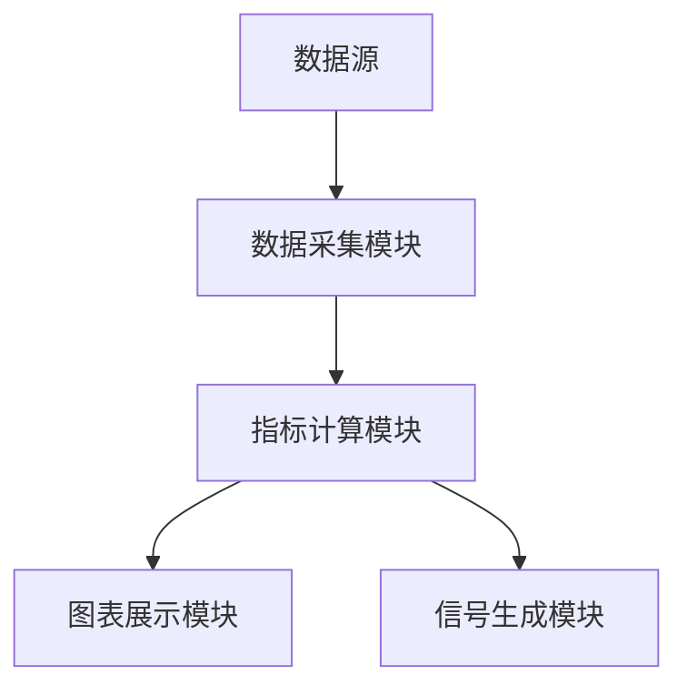
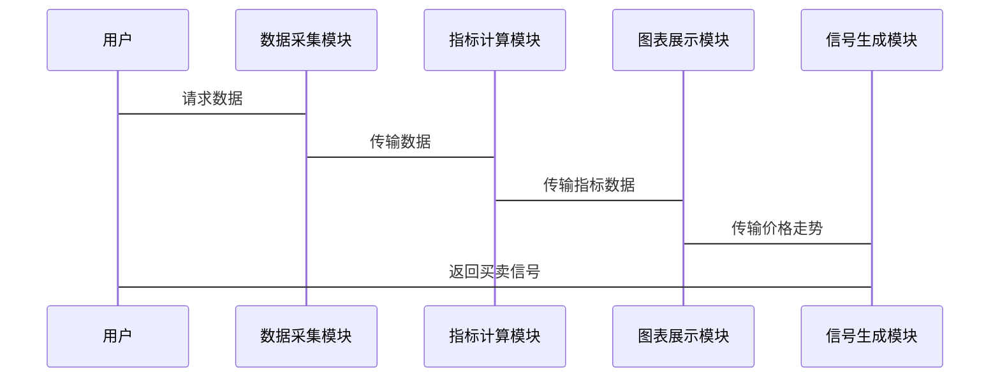

                 


# 技术分析在全球股市估值中的作用

> 关键词：技术分析，股市估值，技术指标，数学模型，系统设计

> 摘要：本文深入探讨了技术分析在全球股市估值中的应用，通过分析技术分析的核心概念、数学模型、系统设计以及实际案例，揭示了技术分析在全球股市中的重要性和实际价值。文章从基础理论出发，结合具体的算法和系统架构，为读者提供了全面的技术分析视角，帮助投资者更好地理解并应用技术分析工具进行股市估值。

---

## 第一部分: 技术分析与全球股市估值基础

### 第1章: 技术分析的基本概念与背景

#### 1.1 技术分析的定义与核心要素

##### 1.1.1 技术分析的定义
技术分析是一种通过研究历史价格数据和市场行为，预测未来市场价格走势的方法。它基于以下假设：
1. 市场价格反映所有信息（有效市场假说）。
2. 历史价格模式会重复出现（模式重复假设）。
3. 市场价格具有趋势性（趋势延续假设）。

##### 1.1.2 技术分析的核心要素
- **价格**：市场价格是技术分析的核心，通过价格走势预测未来价格。
- **成交量**：成交量是价格变动的确认指标，反映市场参与者的热情。
- **时间**：技术分析关注价格在特定时间周期内的表现。

##### 1.1.3 技术分析与基本面分析的对比
| 对比维度 | 技术分析 | 基本面分析 |
|----------|----------|------------|
| 研究对象 | 历史价格、成交量 | 公司基本面、行业趋势 |
| 方法 | 图表分析、指标计算 | 财务报表分析、行业研究 |
| 时间跨度 | 短期至中期 | 长期 |

---

#### 1.2 全球股市估值的基本原理

##### 1.2.1 股市估值的定义
股市估值是对上市公司价值的评估，通常通过市盈率（P/E）、市净率（P/B）等指标进行衡量。

##### 1.2.2 影响股市估值的主要因素
1. **宏观经济因素**：GDP、利率、通货膨胀等。
2. **行业因素**：行业发展趋势、政策影响。
3. **公司因素**：盈利能力、财务状况、管理团队。
4. **市场情绪**：投资者情绪、市场流动性。

##### 1.2.3 全球股市的特点与差异
- 全球股市受不同国家经济政策、法律法规和市场结构的影响。
- 不同市场的波动性、流动性差异显著。

---

#### 1.3 技术分析在全球股市估值中的作用

##### 1.3.1 技术分析在股市估值中的应用范围
- 短期价格预测。
- 识别市场趋势。
- 辅助投资决策。

##### 1.3.2 技术分析的优势与局限性
| 对比维度 | 优势 | 局限性 |
|----------|------|--------|
| 实时性 | 高 | 易受市场情绪影响 |
| 可操作性 | 强 | 依赖历史数据 |
| 灵活性 | 高 | 需结合其他分析方法 |

##### 1.3.3 全球化视角下的技术分析发展
- 技术分析工具的全球化应用。
- 不同市场技术分析的特点。

---

## 第二部分: 技术分析的核心概念与联系

### 第2章: 技术分析的核心概念与联系

#### 2.1 技术分析的核心概念

##### 2.1.1 趋势与趋势线
- 趋势是价格运动的主要方向。
- 趋势线用于标记价格的主要趋势。

##### 2.1.2 支撑位与阻力位
- **支撑位**：价格下跌时的支撑点。
- **阻力位**：价格上涨时的阻力点。

##### 2.1.3 交易量与成交量分析
- 成交量是价格变动的确认指标。

#### 2.2 技术分析的核心原理

##### 2.2.1 技术分析的假设前提
- 价格反映所有信息。
- 历史价格模式重复。
- 价格具有趋势性。

##### 2.2.2 市场参与者行为分析
- 投资者行为影响市场价格。

##### 2.2.3 市场价格与交易量的关系
- 成交量是价格变动的确认指标。

#### 2.3 技术分析与市场心理的关系

##### 2.3.1 技术分析对市场心理的反映
- 技术分析通过价格和成交量反映市场情绪。

##### 2.3.2 市场情绪与技术指标的关系
- 情绪影响指标，指标反映情绪。

##### 2.3.3 技术分析对投资者决策的影响
- 技术分析帮助投资者做出买卖决策。

---

## 第三部分: 技术分析的数学模型与算法原理

### 第3章: 技术分析的数学模型与算法原理

#### 3.1 技术分析的常见指标

##### 3.1.1 移动平均线（MA）
- 简单移动平均线（SMA）和指数移动平均线（EMA）。

##### 3.1.2 相对强弱指数（RSI）
- RSI用于衡量资产的超买或超卖状态。

##### 3.1.3 威尔德相对强度（RS）
- RS用于比较资产与市场指数的相对强度。

##### 3.1.4 麦卡勒姆指标（MACD）
- MACD用于衡量资产价格的动量。

#### 3.2 技术指标的数学模型

##### 3.2.1 移动平均线的计算公式
$$ MA_n = \frac{1}{n} \sum_{i=1}^{n} P_i $$

##### 3.2.2 相对强弱指数的计算公式
$$ RSI = \frac{100}{1 + \frac{A}{B}} $$
其中，A为n天内的平均上涨幅度，B为n天内的平均下跌幅度。

#### 3.3 技术指标的算法实现

##### 3.3.1 移动平均线的实现步骤
1. 收集n天的价格数据。
2. 计算n天的平均价格。

##### 3.3.2 相对强弱指数的实现步骤
1. 计算n天内的平均上涨幅度A。
2. 计算n天内的平均下跌幅度B。
3. 计算RSI = 100 / (1 + A/B)。

---

## 第四部分: 技术分析的系统分析与架构设计

### 第4章: 技术分析的系统分析与架构设计

#### 4.1 技术分析系统的功能设计

##### 4.1.1 数据采集模块
- 收集全球股市的实时价格数据。

##### 4.1.2 指标计算模块
- 计算各种技术指标（MA、RSI等）。

##### 4.1.3 图表展示模块
- 可视化价格走势和指标数据。

##### 4.1.4 信号生成模块
- 根据指标数据生成买卖信号。

#### 4.2 技术分析系统的架构设计

##### 4.2.1 系统架构图


#### 4.3 系统接口设计

##### 4.3.1 数据接口
- REST API接口用于数据传输。

##### 4.3.2 图表接口
- 图表展示模块提供API接口。

##### 4.3.3 信号接口
- 信号生成模块提供买卖信号接口。

#### 4.4 系统交互流程图


---

## 第五部分: 技术分析的项目实战

### 第5章: 技术分析的项目实战

#### 5.1 环境安装

##### 5.1.1 安装Python
- 使用Anaconda安装Python 3.8以上版本。

##### 5.1.2 安装技术分析库
- 使用`pip install pandas`和`pip install matplotlib`安装必要的库。

#### 5.2 系统核心实现源代码

##### 5.2.1 数据采集模块
```python
import pandas as pd
import requests

def get_stock_data(ticker, start_date, end_date):
    url = f'https://api.example.com/stock_data? ticker={ticker}&start={start_date}&end={end_date}'
    response = requests.get(url)
    data = response.json()
    return pd.DataFrame(data)
```

##### 5.2.2 指标计算模块
```python
import pandas as pd

def calculate_sma(data, n):
    return data['Close'].rolling(n).mean()

def calculate_rsi(data, n):
    diff = data['Close'].diff()
    up = diff.where(diff > 0, 0)
    down = diff.where(diff < 0, 0)
    rs = up.rolling(n).mean() / down.rolling(n).mean()
    return 100 / (1 + (up.rolling(n).sum() / down.rolling(n).sum()))
```

##### 5.2.3 图表展示模块
```python
import matplotlib.pyplot as plt
import pandas as pd

def plot_price_and_indicator(data, indicator, window):
    plt.figure(figsize=(12, 6))
    plt.subplot(2, 1, 1)
    plt.plot(data['Close'], label='Price')
    plt.title('Price and ' + indicator + ' with window ' + str(window))
    plt.xlabel('Date')
    plt.ylabel('Price')
    plt.legend()

    plt.subplot(2, 1, 2)
    plt.plot(data[indicator], label=indicator)
    plt.xlabel('Date')
    plt.ylabel(indicator)
    plt.legend()
    plt.show()
```

##### 5.2.4 信号生成模块
```python
import pandas as pd

def generate_signals(data, indicator, threshold):
    data['Signal'] = 0
    data['Signal'][data[indicator] > threshold] = 1
    data['Signal'][data[indicator] < threshold] = -1
    return data
```

#### 5.3 案例分析

##### 5.3.1 案例背景
- 选择一个全球股票指数，如标普500指数（SPY）。

##### 5.3.2 数据采集
```python
data = get_stock_data('SPY', '2020-01-01', '2022-12-31')
```

##### 5.3.3 指标计算
```python
sma_20 = calculate_sma(data, 20)
rsi_14 = calculate_rsi(data, 14)
```

##### 5.3.4 图表展示
```python
plot_price_and_indicator(data, 'SMA_20', 20)
plot_price_and_indicator(data, 'RSI_14', 14)
```

##### 5.3.5 信号生成
```python
signal_data = generate_signals(data, 'RSI_14', 70)
```

#### 5.4 项目小结

##### 5.4.1 项目总结
- 成功实现了技术分析系统的各个模块。
- 系统能够实时采集数据、计算指标、生成图表和信号。

##### 5.4.2 实践经验
- 技术分析需要结合市场环境和投资者经验。
- 系统设计需要考虑数据的实时性和稳定性。

##### 5.4.3 遇到的问题与解决方案
- 数据延迟问题：通过使用实时API解决。
- 计算性能问题：通过并行计算优化。

---

## 第六部分: 技术分析的总结与展望

### 第6章: 技术分析的总结与展望

#### 6.1 最佳实践 tips

##### 6.1.1 技术分析工具的使用建议
- 结合基本面分析使用技术分析工具。
- 选择适合自己的技术指标。

##### 6.1.2 系统设计的优化建议
- 引入机器学习算法优化技术分析。
- 增强系统的实时性和稳定性。

#### 6.2 小结

##### 6.2.1 技术分析的核心价值
- 技术分析通过历史价格数据预测未来价格走势。
- 技术分析是投资者决策的重要工具。

##### 6.2.2 全球化视角下的技术分析应用
- 技术分析在全球股市中的应用日益广泛。
- 不同市场的技术分析需要结合当地市场特点。

#### 6.3 注意事项

##### 6.3.1 风险提示
- 技术分析存在局限性，需结合其他分析方法。
- 市场波动可能导致技术分析失效。

##### 6.3.2 操作建议
- 投资者应根据自身风险承受能力选择合适的技术分析工具。
- 系统设计需考虑数据来源的可靠性和系统的稳定性。

#### 6.4 拓展阅读

##### 6.4.1 推荐书籍
- 《股票技术分析实战》
- 《金融市场技术分析》

##### 6.4.2 推荐网站
- TradingView：在线技术分析工具。
- Yahoo Finance：提供实时数据和技术分析图表。

---

## 结语

技术分析在全球股市估值中的作用不可忽视，它通过历史价格数据和市场行为帮助投资者做出决策。然而，技术分析并非完美，需结合其他分析方法使用。未来，随着人工智能和大数据技术的发展，技术分析将更加智能化和精准化。

---

## 作者：AI天才研究院/AI Genius Institute & 禅与计算机程序设计艺术 /Zen And The Art of Computer Programming

