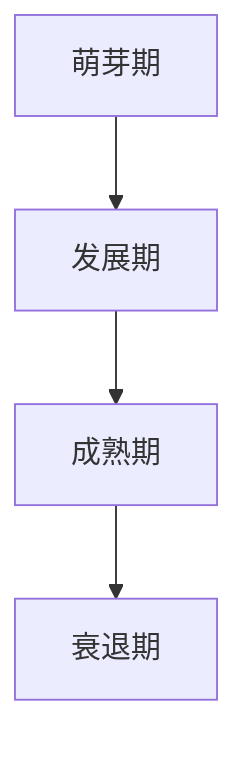
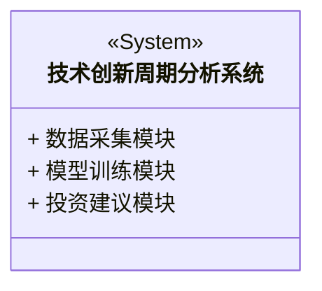
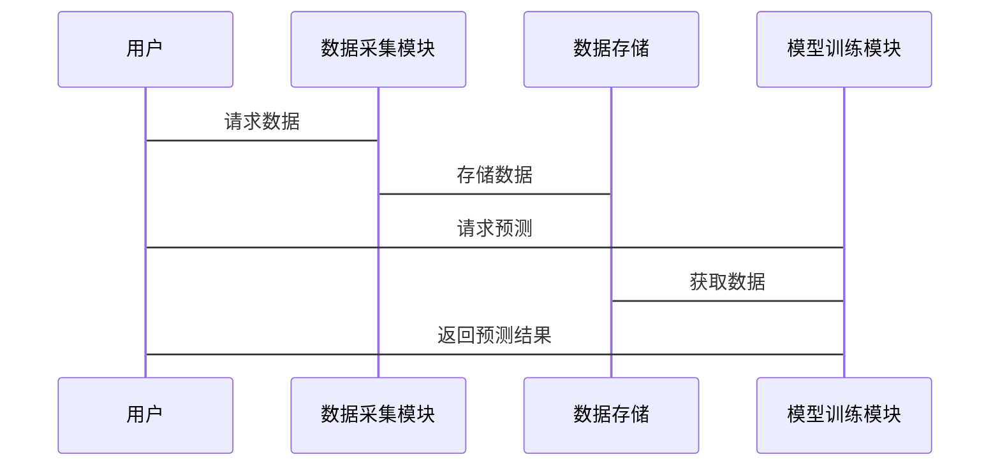

                 


# 技术创新周期与行业投资机会

## 关键词：技术创新周期、投资机会、技术驱动、行业分析、经济周期

## 摘要：  
技术创新周期是技术发展和应用的重要规律，其与行业投资机会密切相关。本文从技术创新周期的定义、阶段划分、驱动因素入手，结合投资机会的评估标准，构建了技术创新周期与投资机会的理论模型，并通过数学方法和案例分析，揭示了两者之间的动态关系。文章还提供了系统架构设计和实战指导，帮助读者理解和把握技术创新周期中的投资机会。

---

# 第一部分: 技术创新周期与行业投资机会的背景与基础

## 第1章: 技术创新周期概述

### 1.1 技术创新周期的定义与特点
技术创新周期是指从技术萌芽到成熟再到衰退的完整过程。其特点包括阶段性和周期性，每个阶段的技术特征和投资机会不同。

#### 1.1.1 技术创新的基本概念
技术创新是技术进步的核心，通常涉及新技术的开发、应用和商业化。

#### 1.1.2 技术创新周期的阶段划分
技术创新周期通常分为萌芽期、发展期、成熟期和衰退期。

#### 1.1.3 技术创新周期的特点与规律
- 技术创新周期具有周期性，技术的成熟和衰退是必然趋势。

### 1.2 技术创新与投资机会的关系
技术创新为投资者提供了新机会，而投资反过来推动技术创新。

#### 1.2.1 技术创新对投资机会的影响
技术创新带来新市场和新商业模式，增加了投资机会。

#### 1.2.2 投资机会对技术创新的促进作用
资金支持和技术研发密切相关，投资推动技术进步。

#### 1.2.3 技术创新周期与投资周期的互动
技术创新周期影响投资周期，投资周期又反馈到技术创新周期。

### 1.3 技术创新周期的驱动因素
技术创新的内在动力、市场需求和政策环境共同驱动技术创新周期。

#### 1.3.1 技术进步的内在动力
技术本身的积累和突破是主要动力。

#### 1.3.2 市场需求的推动作用
市场需求推动技术创新，加速周期进程。

#### 1.3.3 政策环境的影响
政策支持和法规影响技术创新的速度和方向。

### 1.4 技术创新周期的边界与外延
技术创新周期与其他经济周期的关系需要明确，避免混淆。

#### 1.4.1 技术创新周期的边界
技术创新周期与其他周期的界限。

#### 1.4.2 技术创新周期的外延
技术创新周期涉及的技术领域和行业。

#### 1.4.3 技术创新周期与其他经济周期的关系
技术创新周期与商业周期、经济周期的互动。

### 1.5 本章小结
技术创新周期是技术发展的重要规律，与投资机会密切相关，需综合考虑技术、市场和政策因素。

---

## 第2章: 技术创新周期与行业投资机会的理论模型

### 2.1 技术创新周期的理论模型
技术创新周期的阶段模型展示了技术从萌芽到衰退的过程。

#### 2.1.1 技术创新周期的阶段模型
使用Mermaid流程图展示阶段模型：



### 2.2 投资机会的定义与分类
投资机会分为高风险高回报和技术驱动型。

#### 2.2.1 投资机会的定义
投资机会是技术商业化带来的投资可能性。

#### 2.2.2 投资机会的分类
分为技术创新型和市场驱动型。

#### 2.2.3 投资机会的评估标准
评估标准包括市场规模、竞争程度和技术成熟度。

### 2.3 技术创新周期与投资机会的联系
技术创新周期影响投资机会，投资机会推动技术创新。

#### 2.3.1 技术创新周期对投资机会的影响
技术创新周期决定了投资机会的出现和变化。

#### 2.3.2 投资机会对技术创新的促进作用
投资推动技术研发和商业化。

### 2.4 技术创新周期与投资机会的对比分析
技术创新周期与投资周期的异同点分析。

#### 2.4.1 技术创新周期与投资周期的异同
两者都是周期性变化，但驱动因素不同。

#### 2.4.2 技术创新周期与经济周期的异同
技术创新周期是经济周期的重要组成部分。

#### 2.4.3 技术创新周期与行业生命周期的异同
两者都涉及行业变化，但关注点不同。

### 2.5 本章小结
技术创新周期与投资机会密切相关，需综合分析技术和市场因素。

---

## 第3章: 技术创新周期的数学模型

### 3.1 技术创新周期的阶段划分模型
阶段划分模型帮助识别投资机会。

#### 3.1.1 阶段划分的数学表达
使用线性回归模型预测阶段位置。

#### 3.1.2 阶段划分的算法流程
算法步骤包括数据收集、模型训练和阶段预测。

#### 3.1.3 阶段划分的案例分析
以人工智能为例，分析其在不同阶段的投资机会。

### 3.2 技术创新周期的驱动因素分析模型
驱动因素分析模型评估技术成熟度。

#### 3.2.1 驱动因素的权重计算
使用层次分析法确定各因素的权重。

#### 3.2.2 驱动因素的综合评估
综合评估技术成熟度，确定投资机会。

#### 3.2.3 驱动因素的动态变化分析
技术驱动因素随时间变化，需动态调整。

### 3.3 技术创新周期的预测模型
预测模型帮助识别未来投资机会。

#### 3.3.1 时间序列预测模型
使用ARIMA模型预测技术创新周期。

#### 3.3.2 预测模型的数学公式
ARIMA模型公式：

$$
ARIMA(p, d, q)
$$

---

## 第4章: 系统分析与架构设计方案

### 4.1 问题场景介绍
分析技术创新周期中的投资机会，设计系统进行预测和评估。

### 4.2 系统功能设计
功能模块包括数据采集、模型训练和投资建议。

#### 4.2.1 系统功能设计
使用Mermaid类图展示功能模块：



### 4.3 系统架构设计
系统架构采用分层设计，确保高扩展性和维护性。

#### 4.3.1 系统架构设计
使用Mermaid架构图展示系统架构：


### 4.4 系统接口设计
接口设计包括数据接口、模型接口和用户接口。

#### 4.4.1 数据接口
数据接口负责采集技术创新周期数据。

#### 4.4.2 模型接口
模型接口负责训练和预测。

#### 4.4.3 用户接口
用户接口提供交互界面，展示投资建议。

### 4.5 系统交互设计
系统交互流程包括数据采集、模型训练和投资建议生成。

#### 4.5.1 系统交互设计
使用Mermaid序列图展示交互流程：



---

## 第5章: 项目实战

### 5.1 环境安装
安装必要的工具和库，如Python、Pandas、Scikit-learn。

### 5.2 核心实现
编写代码实现技术创新周期的预测和投资建议生成。

#### 5.2.1 核心代码实现
```python
import pandas as pd
from sklearn.linear_model import LinearRegression

# 数据加载
data = pd.read_csv('technological_innovation.csv')

# 模型训练
model = LinearRegression()
model.fit(data[['year']], data['stage'])

# 预测阶段
predicted_stage = model.predict([[2024]])
```

### 5.3 代码应用解读与分析
解读代码功能，分析模型输出结果。

#### 5.3.1 代码解读
解释每行代码的作用和意义。

#### 5.3.2 模型输出分析
分析预测结果，评估投资机会。

### 5.4 实际案例分析
以人工智能行业为例，分析其技术创新周期和投资机会。

#### 5.4.1 案例分析
详细分析人工智能行业的技术创新周期和投资机会。

### 5.5 项目小结
总结项目成果，提出改进建议。

---

## 第6章: 总结与展望

### 6.1 总结
技术创新周期与投资机会密切相关，需综合分析技术、市场和政策因素。

### 6.2 未来展望
未来研究可以进一步探索人工智能对技术创新周期的影响。

---

## 作者：AI天才研究院/AI Genius Institute & 禅与计算机程序设计艺术 /Zen And The Art of Computer Programming

