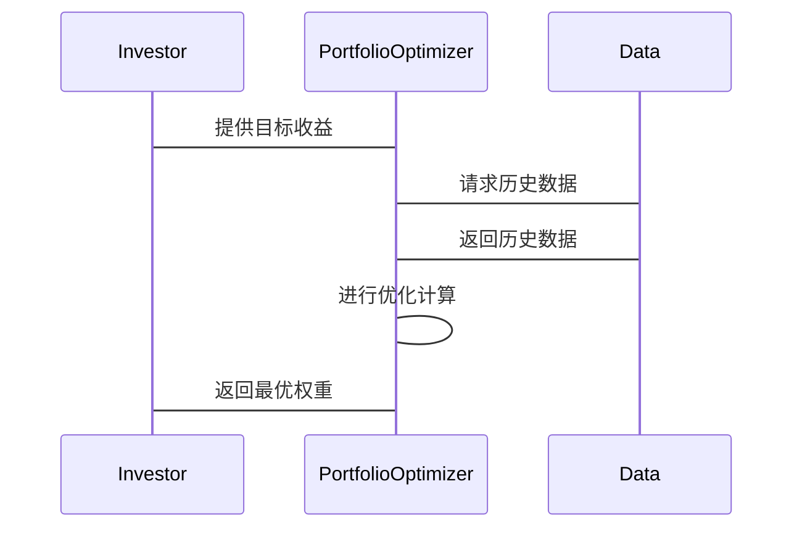

                 


# 投资组合优化模型：现代投资理论的实际应用

> 关键词：投资组合优化，现代投资组合理论，均值-方差模型，优化算法，数学模型，系统架构，项目实战

> 摘要：本文系统地介绍了投资组合优化模型的核心概念、数学模型、优化算法及其在实际投资管理中的应用。通过详细分析均值-方差模型、风险调整后的收益模型等主流模型，结合实际案例和代码实现，深入探讨了投资组合优化的理论基础与实践技巧。文章还从系统架构设计的角度，展示了如何将投资组合优化模型应用于实际项目中，并提供了丰富的最佳实践和拓展阅读建议。

---

# 第一部分: 投资组合优化模型的背景与核心概念

# 第1章: 投资组合优化模型概述

## 1.1 投资组合优化的背景与问题背景
### 1.1.1 投资组合优化问题的提出
- 投资组合的概念与重要性
- 投资者风险偏好与收益目标的平衡
- 投资组合优化的边界与外延

### 1.1.2 投资组合优化的核心要素
- 资产分配
- 风险与收益的衡量
- 优化目标的设定

### 1.1.3 投资组合优化的现实意义
- 降低投资风险
- 提高投资收益
- 实现资产配置的科学化

## 1.2 现代投资组合理论的核心概念
### 1.2.1 投资组合的定义与属性
- 单个资产的风险与收益
- 投资组合的风险与收益
- 投资组合的有效前沿

### 1.2.2 风险与收益的衡量指标
- 方差与标准差
- 风险调整后的收益（夏普比率）
- 最大回撤

### 1.2.3 投资组合优化的核心要素
- 投资目标
- 风险承受能力
- 市场条件

## 1.3 投资组合优化模型的分类与联系
### 1.3.1 主流投资组合优化模型对比
- 均值-方差模型
- 风险调整后的收益模型
- 基于因子模型的优化
- 基于场景的优化

### 1.3.2 模型的属性特征对比表格
| 模型类型       | 优化目标       | 输入参数       | 输出结果       |
|----------------|----------------|----------------|----------------|
| 均值-方差模型   | 最小化风险       | 预期收益、协方差矩阵 | 最优权重、最小方差 |
| 风险调整后的收益模型 | 最大化夏普比率 | 预期收益、协方差矩阵、无风险利率 | 最优权重、最大夏普比率 |

### 1.3.3 ER实体关系图架构的Mermaid流程图
```mermaid
erd
    investor --|有| investment_goal
    investment_goal --|有| risk_tolerance
    risk_tolerance --|有| return_target
```

---

# 第2章: 投资组合优化模型的数学基础

## 2.1 投资组合优化的数学模型
### 2.1.1 优化问题的数学表达
$$ \text{目标函数：} f(x) = \text{风险或收益的函数} $$
$$ \text{约束条件：} g(x) = 0 \text{ 或 } g(x) \leq 0 $$

### 2.1.2 均值-方差模型的公式推导
$$ \text{目标：最小化} \sigma^2 $$
$$ \text{约束：} \sum_{i=1}^n w_i = 1, \sum_{i=1}^n w_i r_i = \mu $$

### 2.1.3 数学公式与模型的对应关系
- 方差的计算公式：
$$ \sigma^2 = w^T \Sigma w $$
- 预期收益的计算公式：
$$ \mu = w^T \mu $$

## 2.2 优化算法的数学原理
### 2.2.1 拉格朗日乘数法的数学推导
$$ \mathcal{L} = f(x) + \lambda (g(x)) $$

### 2.2.2 凸优化问题的几何解释
- 凸函数的性质
- 最优化问题的几何解

### 2.2.3 数学公式与算法流程的对应关系
- 算法步骤：
1. 构建拉格朗日函数
2. 求导并解方程组
3. 验证解的最优性

---

# 第3章: 投资组合优化模型的算法实现

## 3.1 均值-方差模型的算法实现
### 3.1.1 模型的数学公式
$$ \text{目标：} \min_w w^T \Sigma w $$
$$ \text{约束：} w^T \mu = \mu_{target}, \sum_{i=1}^n w_i = 1 $$

### 3.1.2 算法的步骤分解
1. 输入参数：预期收益、协方差矩阵
2. 构建优化问题
3. 使用优化算法求解
4. 输出结果：最优权重

### 3.1.3 代码实现与案例分析
```python
import numpy as np
from scipy.optimize import minimize

# 示例数据
mu = np.array([0.1, 0.2])
Sigma = np.array([[0.05, 0.02], [0.02, 0.1]])
target_return = 0.15

def objective(w):
    return np.dot(w.T, Sigma.dot(w))[0, 0]

def constraint1(w, mu, target_return):
    return np.dot(w, mu) - target_return

# 初始权重
initial_guess = np.array([0.5, 0.5])

# 约束条件
constraints = {'type': 'eq', 'fun': constraint1, 'args': (mu, target_return)}

# 约束权重的和为1
bounds = [(0, None), (0, None)]
sum_constraint = {'type': 'eq', 'fun': lambda w: np.sum(w) - 1}

# 优化问题
result = minimize(objective, initial_guess, method='SLSQP', constraints=[constraints, sum_constraint], bounds=bounds)

print(result.x)
```

---

# 第4章: 投资组合优化模型的系统架构设计

## 4.1 系统分析与架构设计方案
### 4.1.1 问题场景介绍
- 输入：历史收益率数据、目标收益
- 输出：最优投资组合权重

### 4.1.2 系统功能设计（领域模型Mermaid类图）
```mermaid
classDiagram
    class Investor {
        risk_tolerance
        return_target
    }
    class Data {
        historical_returns
    }
    class PortfolioOptimizer {
        optimize(weights)
    }
    class Output {
        optimal_weights
        performance_metrics
    }
    Investor -> Data: 提供输入数据
    Data -> PortfolioOptimizer: 数据输入
    PortfolioOptimizer -> Output: 输出优化结果
```

### 4.1.3 系统架构设计（Mermaid架构图）


## 4.2 系统接口与交互设计
### 4.2.1 系统接口设计
- 输入接口：历史收益率数据、目标收益
- 输出接口：最优权重、绩效指标

### 4.2.2 系统交互Mermaid序列图


---

# 第5章: 投资组合优化模型的项目实战

## 5.1 项目环境安装与配置
### 5.1.1 Python环境的安装与配置
- 安装Python 3.8+

### 5.1.2 必要库的安装
```bash
pip install numpy scipy pandas matplotlib
```

## 5.2 系统核心实现源代码
### 5.2.1 均值-方差模型的代码实现
```python
# 示例代码：均值-方差模型
import numpy as np
from scipy.optimize import minimize

def portfolio_variance(weights, covariance_matrix):
    return np.dot(weights.T, np.dot(covariance_matrix, weights))[0, 0]

def target_return(weights, expected_returns):
    return np.dot(weights, expected_returns)

# 示例数据
n_assets = 3
expected_returns = np.array([0.05, 0.1, 0.15])
covariance_matrix = np.array([
    [0.02, 0.01, 0.01],
    [0.01, 0.03, 0.02],
    [0.01, 0.02, 0.04]
])

# 约束条件
constraints = [
    {'type': 'eq', 'fun': lambda w: np.sum(w) - 1},
    {'type': 'eq', 'fun': lambda w: target_return(w, expected_returns) - 0.1}
]

# 初始猜测
initial_guess = np.array([1/3, 1/3, 1/3])

# 优化问题
result = minimize(portfolio_variance, initial_guess, method='SLSQP', constraints=constraints)

# 输出结果
print("Optimal weights:", result.x)
```

### 5.2.2 风险调整后的收益模型的代码实现
```python
# 示例代码：风险调整后的收益模型
import numpy as np
from scipy.optimize import minimize

def sharpe_ratio(weights, expected_returns, covariance_matrix, risk_free_rate):
    portfolio_variance = np.dot(weights.T, np.dot(covariance_matrix, weights))[0, 0]
    portfolio_std = np.sqrt(portfolio_variance)
    sharpe = (np.dot(weights, expected_returns) - risk_free_rate) / portfolio_std
    return -sharpe  # 最小化问题中最大化夏普比率

# 示例数据
n_assets = 3
expected_returns = np.array([0.05, 0.1, 0.15])
covariance_matrix = np.array([
    [0.02, 0.01, 0.01],
    [0.01, 0.03, 0.02],
    [0.01, 0.02, 0.04]
])
risk_free_rate = 0.02

# 约束条件
constraints = [
    {'type': 'eq', 'fun': lambda w: np.sum(w) - 1},
    {'type': 'eq', 'fun': lambda w: np.dot(w, expected_returns) - 0.1}
]

# 初始猜测
initial_guess = np.array([1/3, 1/3, 1/3])

# 优化问题
result = minimize(sharpe_ratio, initial_guess, method='SLSQP', constraints=constraints, args=(expected_returns, covariance_matrix, risk_free_rate))

# 输出结果
print("Optimal weights:", result.x)
```

### 5.2.3 其他优化模型的代码实现
- 风险中性组合优化
- 最小化回撤优化
- 基于因子模型的优化

## 5.3 代码应用解读与分析
### 5.3.1 代码实现的逻辑分析
- 数据输入与预处理
- 约束条件的设定
- 优化算法的选择
- 结果的解释与分析

### 5.3.2 代码的优化与改进
- 参数优化
- 算法选择
- 计算效率的提升

---

# 第6章: 投资组合优化模型的最佳实践

## 6.1 最佳实践与经验总结
### 6.1.1 数据质量的重要性
- 数据清洗与预处理
- 数据的代表性与可靠性

### 6.1.2 模型选择的策略
- 根据目标选择模型
- 根据数据特征选择模型

## 6.2 小结与注意事项
### 6.2.1 模型的局限性
- 假设的简化可能导致结果偏差
- 市场条件的变化影响模型的有效性

### 6.2.2 模型的可扩展性
- 如何应对资产数量增加的情况
- 如何处理实时数据

## 6.3 拓展阅读与学习资源
### 6.3.1 经典文献推荐
- Markowitz的《Portfolio Selection》
- Sharpe的《The Sharpe Ratio》

### 6.3.2 在线学习资源
- Coursera上的投资组合优化课程
- 量化投资相关的书籍推荐

---

# 作者：AI天才研究院/AI Genius Institute & 禅与计算机程序设计艺术 /Zen And The Art of Computer Programming

