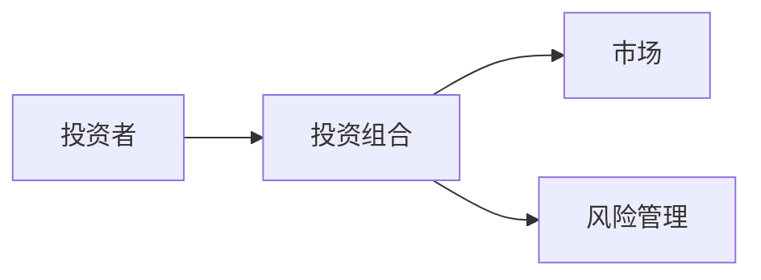
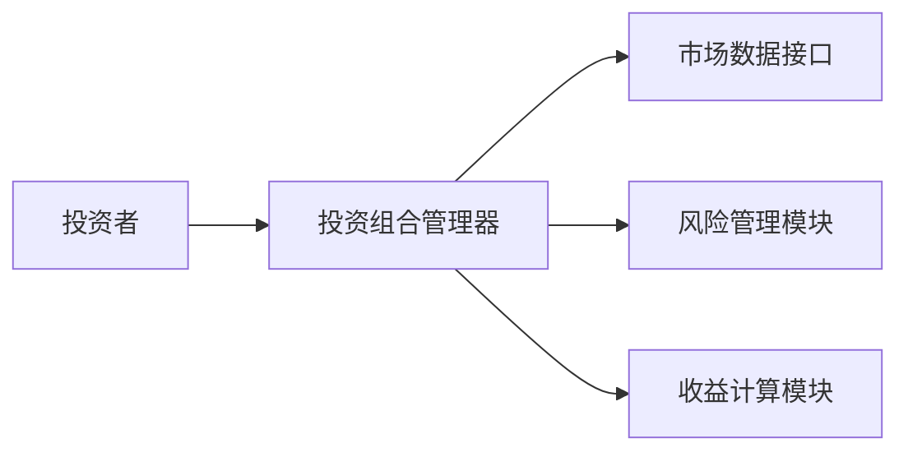

                 


# 投资组合保险策略：保护收益的方法

## 关键词：投资组合保险，风险管理，收益保护，资产配置，现代投资组合理论，风险调整收益

## 摘要：投资组合保险是一种通过优化资产配置和风险管理来保护投资收益的策略。本文详细探讨了投资组合保险的核心概念、数学模型、算法原理、系统架构以及实际案例，帮助读者理解如何在不同市场环境下有效保护投资收益。

---

## 第一部分：投资组合保险策略概述

### 第1章：投资组合保险策略的背景与概念

#### 1.1 投资组合保险的基本概念

- **1.1.1 投资组合保险的定义**
  投资组合保险是指通过优化资产配置和风险管理，确保投资组合在不同市场环境下的稳定性和收益性。它结合了现代投资组合理论和风险管理技术，旨在在控制风险的前提下最大化收益。

- **1.1.2 投资组合保险的重要性**
  投资组合保险的重要性体现在以下几个方面：
  - **风险控制**：通过分散投资降低单一资产的风险。
  - **收益稳定**：在不同市场环境下保持稳定的收益。
  - **个性化配置**：根据投资者的风险承受能力和收益目标进行定制化配置。

- **1.1.3 投资组合保险与传统风险管理的区别**
  - 投资组合保险注重整体资产配置的优化，而传统风险管理侧重于单个资产的风险控制。
  - 投资组合保险结合了收益目标和风险约束，而传统风险管理通常只关注风险的降低。

#### 1.2 投资组合保险的核心目标

- **1.2.1 保护本金安全**
  投资组合保险的核心目标之一是确保本金的安全，避免在市场波动中出现大幅亏损。

- **1.2.2 稳定投资收益**
  通过合理的资产配置和风险管理，投资组合保险能够在不同市场环境下保持稳定的收益。

- **1.2.3 风险与收益的平衡**
  投资组合保险的目标是在风险可控的前提下，实现收益的最大化。这需要在资产配置中找到风险和收益的最佳平衡点。

#### 1.3 投资组合保险的适用场景

- **1.3.1 个人投资者**
  对于个人投资者来说，投资组合保险可以帮助他们在没有专业投资知识的情况下实现稳健的投资收益。

- **1.3.2 机构投资者**
  机构投资者可以通过投资组合保险优化其资产配置，降低整体风险，同时实现收益目标。

- **1.3.3 不同市场环境下的应用**
  投资组合保险在牛市、熊市和震荡市等不同市场环境下都有其独特的应用方式。例如，在牛市中，可以通过增加高收益资产的比例来捕捉市场上涨的机会；在熊市中，可以通过增加低风险资产的比例来保护本金。

---

### 第2章：投资组合保险策略的核心原理

#### 2.1 投资组合保险的数学模型

- **2.1.1 现代投资组合理论（MPT）**
  现代投资组合理论由哈里·马科维茨在1952年提出，是投资组合保险的核心理论基础。MPT认为，投资者可以通过合理配置不同资产来实现风险的最小化，同时实现收益的最大化。

- **2.1.2 风险调整后的收益模型**
  风险调整后的收益模型（RAR）通过考虑资产的风险水平，调整其收益，从而为投资者提供一个更全面的收益评估指标。

- **2.1.3 投资组合的最优配置**
  通过数学优化方法，投资者可以在给定的风险承受能力下找到最优的资产配置，以实现收益的最大化。

#### 2.2 投资组合保险的算法原理

- **2.2.1 均值-方差优化算法**
  均值-方差优化算法是投资组合优化的核心算法之一。它通过最小化投资组合的方差（即风险）来实现收益的最大化。

- **2.2.2 风险平价策略**
  风险平价策略是一种基于风险贡献的投资组合优化方法，旨在使投资组合中的每种资产对整体风险的贡献相等。

- **2.2.3 等权重投资策略**
  等权重投资策略是将投资组合中的资产按照相等的比例进行配置，以避免过于集中投资于某一种资产带来的风险。

#### 2.3 投资组合保险的ER实体关系图



---

### 第3章：投资组合保险策略的系统分析与架构设计

#### 3.1 投资组合保险系统的功能设计

- **3.1.1 投资者需求分析**
  投资者的需求包括：风险控制、收益最大化、资产配置优化等。

- **3.1.2 投资组合构建模块**
  该模块负责根据投资者的需求和市场数据构建最优的投资组合。

- **3.1.3 风险管理模块**
  该模块负责监控和管理投资组合的风险，确保其在允许的风险范围内。

#### 3.2 投资组合保险系统的架构设计



#### 3.3 投资组合保险系统的接口设计

- **3.3.1 输入接口**
  包括投资者的风险承受能力、收益目标等。

- **3.3.2 输出接口**
  包括投资组合配置建议、风险评估报告等。

- **3.3.3 数据接口**
  包括市场数据接口、资产价格数据接口等。

---

### 第4章：投资组合保险策略的项目实战

#### 4.1 环境安装与配置

- **4.1.1 Python环境安装**
  安装Python 3.x及以上版本。

- **4.1.2 数据分析库安装**
  使用pip安装numpy、pandas、scipy等库。

- **4.1.3 金融数据接口配置**
  使用第三方库如yfinance获取市场数据。

#### 4.2 系统核心实现源代码

```python
import numpy as np
import pandas as pd
from scipy.optimize import minimize

# 示例数据
returns = pd.DataFrame({
    '资产A': [0.1, 0.05, 0.02, -0.03, 0.08],
    '资产B': [0.08, 0.04, -0.01, -0.06, 0.07],
    '资产C': [0.06, 0.03, 0.02, -0.04, 0.05]
})

# 目标函数：最小化方差
def portfolio_var(weights, returns):
    return np.var(returns.dot(weights))

# 约束条件：权重之和为1
def weight_sum(weights):
    return np.sum(weights) - 1

# 初始权重
initial_weights = [1/3, 1/3, 1/3]

# 使用 scipy.optimize.minimize 进行优化
result = minimize(
    portfolio_var,
    initial_weights,
    method='SLSQP',
    constraints={'type': 'eq', 'fun': weight_sum}
)

# 优化后的权重
optimal_weights = result.x
print("最优权重：", optimal_weights)
print("最小方差：", result.fun)
```

#### 4.3 案例分析与详细解读

- **4.3.1 案例分析**
  假设我们有三种资产，分别的收益率如上所示。我们希望找到一个权重组合，使得投资组合的方差最小。

- **4.3.2 代码实现**
  如上代码所示，我们使用scipy.optimize.minimize函数进行优化，目标是最小化投资组合的方差，约束是权重之和为1。

- **4.3.3 结果解读**
  优化后的权重表示每种资产在投资组合中的比例，最小方差表示在给定约束下投资组合的风险最小。

#### 4.4 项目小结

- **4.4.1 最佳实践**
  在实际应用中，投资者可以根据自己的风险承受能力和收益目标调整权重和约束条件。

- **4.4.2 注意事项**
  - 数据的准确性和及时性对投资组合优化至关重要。
  - 需要定期监控和调整投资组合以应对市场变化。

---

## 第五部分：总结与展望

### 5.1 总结

- 本文详细介绍了投资组合保险的核心概念、数学模型、算法原理、系统架构以及实际案例。
- 投资组合保险是一种有效的风险管理策略，可以帮助投资者在不同市场环境下保护本金并实现稳定收益。

### 5.2 展望

- 随着人工智能和大数据技术的发展，投资组合保险策略将更加智能化和个性化。
- 未来的研究可以进一步探讨如何将机器学习算法应用于投资组合优化，以提高收益和降低风险。

---

## 作者：AI天才研究院/AI Genius Institute & 禅与计算机程序设计艺术 /Zen And The Art of Computer Programming

