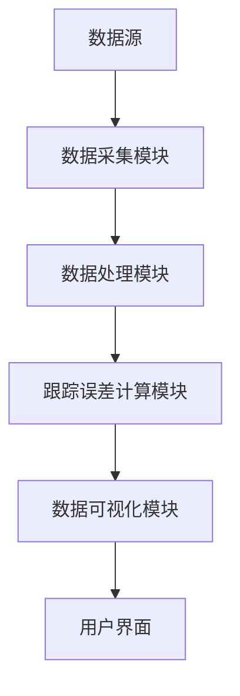
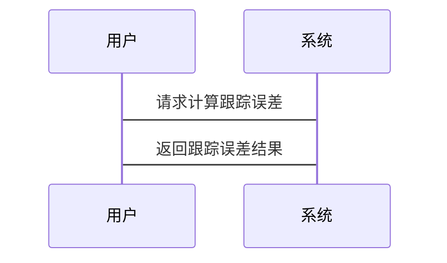

                 


# 投资组合跟踪误差：如何衡量并控制偏离基准的风险

> 关键词：投资组合，跟踪误差，基准指数，风险控制，投资策略，系统架构，项目实战

> 摘要：本文深入探讨了投资组合跟踪误差的概念、计算方法、影响因素及其与投资风险的关系。通过系统分析与架构设计，结合实际案例和项目实战，详细讲解了如何衡量和控制投资组合偏离基准的风险，为投资者提供了有效的策略和工具。

---

## 第1章: 跟踪误差的背景与概念

### 1.1 投资组合跟踪误差的定义

#### 1.1.1 什么是投资组合跟踪误差
投资组合跟踪误差是指投资组合的实际收益与选定的基准指数收益之间的差异。它是衡量投资组合偏离基准风险的重要指标，反映了投资组合与基准之间的吻合程度。

#### 1.1.2 跟踪误差的产生原因
跟踪误差的产生主要源于以下几个方面：
1. **资产配置差异**：投资组合的资产配置与基准指数的资产配置不一致。
2. **个股选择差异**：投资组合中个股的权重与基准指数中个股的权重不同。
3. **交易成本**：买卖证券时产生的交易成本会影响投资组合的收益。
4. **市场波动**：市场波动性导致投资组合和基准指数的收益差异。

#### 1.1.3 跟踪误差的重要性
跟踪误差是衡量投资组合风险的重要指标，帮助投资者评估投资组合与基准之间的偏离程度，从而制定有效的投资策略。

### 1.2 投资组合与基准的定义

#### 1.2.1 投资组合的定义与组成
投资组合是由多种资产（股票、债券、基金等）组成的资产组合，旨在通过多样化投资降低风险并实现收益最大化。

#### 1.2.2 基准的定义与选择
基准指数是衡量投资组合表现的标准，通常选择与投资组合风险和行业相关的指数。

#### 1.2.3 跟踪误差的核心概念
跟踪误差的核心在于衡量投资组合与基准之间的收益差异，是投资组合风险管理的重要工具。

---

## 第2章: 跟踪误差的衡量方法

### 2.1 跟踪误差的计算公式

#### 2.1.1 跟踪误差的数学定义
$$\text{跟踪误差} = \sqrt{\text{投资组合方差} - \text{基准方差}}$$

#### 2.1.2 基于标准差的计算方法
投资组合的收益与基准收益之间的差异的标准差即为跟踪误差。

#### 2.1.3 基于残差的计算方法
使用回归分析计算投资组合收益与基准收益之间的残差，再计算残差的标准差。

### 2.2 跟踪误差的衡量指标

#### 2.2.1 跟踪误差的标准差
标准差是衡量跟踪误差的重要指标，反映了投资组合偏离基准的波动性。

#### 2.2.2 跟踪误差的均值
均值是跟踪误差的中心点，反映了投资组合与基准之间的平均偏离程度。

#### 2.2.3 跟踪误差的最大值与最小值
最大值和最小值是跟踪误差的极端值，反映了投资组合与基准之间的最大偏离程度。

---

## 第3章: 跟踪误差的影响因素

### 3.1 投资组合的构成因素

#### 3.1.1 资产配置的影响
资产配置的不同会导致投资组合与基准之间的偏离程度不同。

#### 3.1.2 个股选择的影响
个股选择的差异会影响投资组合与基准之间的收益差异。

#### 3.1.3 交易成本的影响
交易成本会降低投资组合的净收益，从而影响跟踪误差。

### 3.2 市场环境的影响

#### 3.2.1 市场波动性的影响
市场波动性越大，投资组合与基准之间的偏离程度越高。

#### 3.2.2 经济周期的影响
经济周期的变化会影响投资组合和基准的收益，从而影响跟踪误差。

#### 3.2.3 政策环境的影响
政策变化会影响市场环境，从而影响投资组合与基准的收益差异。

---

## 第4章: 跟踪误差与投资风险

### 4.1 跟踪误差与投资风险的关系

#### 4.1.1 跟踪误差是投资风险的重要组成部分
跟踪误差反映了投资组合与基准之间的收益差异，是投资风险的重要组成部分。

#### 4.1.2 跟踪误差对投资组合收益的影响
跟踪误差越大，投资组合的收益与基准的偏离程度越高，投资风险越大。

#### 4.1.3 跟踪误差对投资者心理的影响
跟踪误差会影响投资者的心理预期，较大的跟踪误差可能会导致投资者对投资组合的不信任。

### 4.2 跟踪误差的控制与优化

#### 4.2.1 跟踪误差的最小化方法
通过优化资产配置和个股选择，减少投资组合与基准之间的偏离程度。

#### 4.2.2 跟踪误差的主动管理策略
主动管理策略通过积极调整投资组合来降低跟踪误差。

#### 4.2.3 跟踪误差的被动管理策略
被动管理策略通过复制基准指数来降低跟踪误差。

---

## 第5章: 跟踪误差的系统分析与架构设计

### 5.1 系统分析

#### 5.1.1 系统目标
设计一个能够实时计算和监控投资组合跟踪误差的系统。

#### 5.1.2 系统功能需求
- 实时计算投资组合的跟踪误差。
- 监控投资组合与基准之间的偏离程度。
- 提供可视化界面展示跟踪误差。

#### 5.1.3 系统性能需求
- 高效计算能力。
- 实时数据处理能力。
- 稳定的系统运行环境。

### 5.2 系统架构设计

#### 5.2.1 系统模块划分
- 数据采集模块。
- 数据处理模块。
- 跟踪误差计算模块。
- 数据可视化模块。

#### 5.2.2 系统数据流图


#### 5.2.3 系统交互设计


---

## 第6章: 跟踪误差的项目实战

### 6.1 环境安装与配置

#### 6.1.1 系统环境要求
- 操作系统：Windows/Mac/Linux
- Python版本：3.6+

#### 6.1.2 软件工具安装
- 安装Python和相关库（如NumPy、Pandas、Matplotlib）。
- 安装Jupyter Notebook。

#### 6.1.3 数据源获取与处理
- 从金融数据供应商获取基准指数和投资组合的数据。
- 数据清洗和预处理。

### 6.2 核心代码实现

#### 6.2.1 数据读取与清洗
```python
import pandas as pd
import numpy as np

# 读取数据
data = pd.read_csv('data.csv')

# 数据清洗
data.dropna()
data = data.reset_index(drop=True)
```

#### 6.2.2 跟踪误差计算
```python
def tracking_error(returns, benchmark_returns):
    # 计算残差
    residuals = returns - benchmark_returns
    # 计算残差的标准差
    te = residuals.std()
    return te

# 示例计算
returns = data['投资组合收益']
benchmark_returns = data['基准收益']
te = tracking_error(returns, benchmark_returns)
print(f"跟踪误差: {te}")
```

#### 6.2.3 结果可视化与分析
```python
import matplotlib.pyplot as plt

# 绘制跟踪误差的分布图
plt.hist(residuals, bins=20)
plt.title('跟踪误差分布图')
plt.xlabel('误差值')
plt.ylabel('频数')
plt.show()
```

---

## 第7章: 总结与展望

### 7.1 总结
本文详细探讨了投资组合跟踪误差的概念、计算方法、影响因素及其与投资风险的关系。通过系统分析与架构设计，结合实际案例和项目实战，为投资者提供了有效的策略和工具。

### 7.2 展望
未来的研究可以进一步探讨跟踪误差的动态变化、多因子模型在跟踪误差中的应用，以及人工智能技术在跟踪误差预测中的潜力。

---

作者：AI天才研究院/AI Genius Institute & 禅与计算机程序设计艺术 /Zen And The Art of Computer Programming

