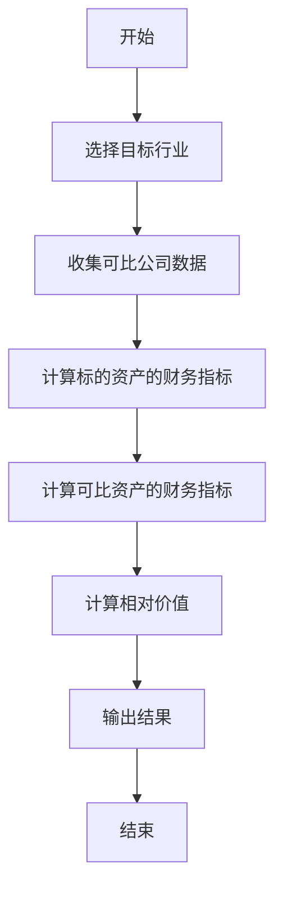
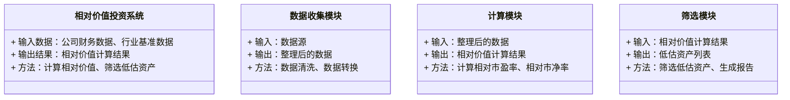

                 


# 拉尔夫·旺格的相对价值投资：在同行中寻找最佳标的

> **关键词**：相对价值投资、投资策略、价值评估、市场分析、投资标的  
> **摘要**：本文深入探讨了相对价值投资的核心理念、方法及其在实际投资中的应用。通过分析行业基准、可比公司数据，结合数学模型和算法，揭示如何在同行中寻找最佳投资标的。文章还提供了系统架构设计和实际案例，帮助读者更好地理解和应用相对价值投资策略。

---

## 正文

### 第一部分：相对价值投资的背景与核心概念

#### 1. 背景介绍

**1.1 相对价值投资的定义与核心理念**

相对价值投资是一种基于可比资产的分析方法，旨在通过比较同类资产的价值，寻找被市场低估或高估的投资标的。其核心理念在于，**投资标的的价值不仅取决于其自身的财务状况，还取决于其在行业或市场中的相对位置**。

**1.2 相对价值投资与其他投资策略的对比**

| 投资策略       | 定义                                                                 | 重点分析对象                          | 适用场景                              |
|----------------|----------------------------------------------------------------------|---------------------------------------|---------------------------------------|
| 价值投资       | 侧重于寻找市场价格低于内在价值的资产                         | 公司基本面（如市盈率、市净率）          | 长期投资，寻找被市场低估的资产        |
| 成长投资       | 侧重于投资具有高增长潜力的公司                               | 公司成长性（如收入增长率、利润增长率）  | 中长期投资，寻找高增长的公司          |
| 相对价值投资   | 侧重于比较同类资产的相对价值，寻找被市场低估或高估的资产     | 可比公司数据、行业基准                 | 短中长期投资，适用于市场波动较大时    |

**1.3 相对价值投资的数学模型与公式**

相对价值的计算公式为：
$$
\text{相对价值} = \frac{\text{标的资产价值}}{\text{可比资产价值}}
$$

其中，可比资产价值可以通过行业平均值或基准指数来衡量。例如，相对市盈率的计算公式为：
$$
\text{相对市盈率} = \frac{\text{标的公司市盈率}}{\text{行业平均市盈率}}
$$

如果相对市盈率小于1，则标的资产可能被市场低估；如果大于1，则可能被高估。

---

### 第二部分：相对价值投资的核心概念与联系

#### 2. 核心概念与联系

**2.1 相对价值投资的核心原理**

- **比较基准的选择**：选择合适的行业基准或可比公司是相对价值投资的关键。例如，可以选择同一行业内的竞争对手，或同一市场的同类资产作为比较对象。
- **波动性分析**：通过分析标的资产和可比资产的波动性，判断其相对价值是否偏离正常范围。
- **周期性特征**：相对价值在经济周期中的变化具有一定的规律性。例如，在经济衰退期，某些行业的相对价值可能显著低估。

**2.2 相对价值投资的ER实体关系图**

以下是相对价值投资的ER实体关系图：

```mermaid
er
  actor 投资者
  actor 行业基准
  actor 可比公司
  actor 相关数据源
  actor 财务指标
  actor 调整系数
  relation 相对价值计算
  relation 数据输入
  relation 结果输出
```

---

### 第三部分：相对价值投资的算法原理

#### 3. 算法原理讲解

**3.1 相对价值计算的流程图**

以下是相对价值计算的流程图：



**3.2 相对价值计算的Python代码示例**

以下是计算相对市盈率的Python代码示例：

```python
import pandas as pd

# 假设df是包含公司财务数据的DataFrame，包括市盈率和行业平均市盈率
# 计算相对市盈率
df['相对市盈率'] = df['市盈率'] / df['行业平均市盈率']

# 找出相对市盈率小于0.8的公司
低估公司 = df[df['相对市盈率'] < 0.8]
```

**3.3 相对价值的数学模型与公式**

相对价值的数学模型可以表示为：
$$
\text{调整后的相对价值} = \text{相对价值} \times \text{行业调整系数}
$$

其中，行业调整系数用于考虑行业特定因素的影响，例如行业周期性或政策变化。

---

### 第四部分：相对价值投资的系统分析与架构设计

#### 4. 系统分析与架构设计

**4.1 问题场景介绍**

在实际投资中，投资者需要处理大量数据，包括公司财务数据、行业基准数据等。为了提高效率，可以构建一个相对价值投资分析系统。

**4.2 系统功能设计**

以下是系统功能设计的类图：



**4.3 系统架构设计**

以下是系统架构设计的架构图：

```mermaid
archi
    作用范围：相对价值投资系统
    角色：投资者、数据源
    主要组件：数据收集模块、计算模块、筛选模块
    通信机制：数据传输、结果输出
```

---

### 第五部分：相对价值投资的项目实战

#### 5. 项目实战

**5.1 环境安装**

为了运行相对价值投资分析系统，需要安装以下工具和库：
- Python 3.8+
- Pandas、NumPy、Matplotlib
- Jupyter Notebook

**5.2 系统核心实现源代码**

以下是相对价值投资分析系统的Python代码实现：

```python
import pandas as pd
import numpy as np
import matplotlib.pyplot as plt

# 数据收集模块
def collect_data():
    # 假设从数据库中获取数据
    df = pd.read_sql("SELECT * FROM company_data", con='数据库连接')
    return df

# 计算模块
def calculate_rel_value(df):
    df['相对市盈率'] = df['市盈率'] / df['行业平均市盈率']
    df['相对市净率'] = df['市净率'] / df['行业平均市净率']
    return df

# 筛选模块
def screen_undervalued(df, threshold=0.8):
    df['是否低估'] = df['相对市盈率'] < threshold
    return df

# 主程序
def main():
    df = collect_data()
    df = calculate_rel_value(df)
    df = screen_undervalued(df)
    print("低估公司列表：")
    print(df[df['是否低估'] == True])

if __name__ == "__main__":
    main()
```

**5.3 代码应用解读与分析**

通过上述代码，我们可以实现以下功能：
1. **数据收集**：从数据库中获取公司财务数据和行业基准数据。
2. **相对价值计算**：计算相对市盈率和相对市净率。
3. **资产筛选**：根据设定的阈值（默认为0.8），筛选出被市场低估的资产。

**5.4 实际案例分析**

以某行业为例，假设我们收集了以下数据：

| 公司名称 | 市盈率 | 行业平均市盈率 |
|----------|--------|----------------|
| 公司A    | 12     | 15              |
| 公司B    | 10     | 15              |
| 公司C    | 18     | 15              |

计算相对市盈率：
- 公司A：12/15 = 0.8（低估）
- 公司B：10/15 = 0.6667（低估）
- 公司C：18/15 = 1.2（高估）

根据上述分析，公司A和公司B被市场低估，可能是较好的投资标的。

---

### 总结

相对价值投资是一种有效的投资策略，通过比较同类资产的相对价值，可以帮助投资者发现被市场低估或高估的投资标的。在实际应用中，可以结合数学模型和系统架构设计，构建高效的分析系统，进一步提升投资决策的科学性和准确性。

**注意事项**：
- 相对价值投资需要结合市场环境和行业特点进行调整。
- 数据质量和准确性对相对价值计算结果有直接影响，需谨慎选择数据源。
- 相对价值投资是一种长期策略，需耐心持有优质标的。

**拓展阅读**：
- 《投资学基础》
- 《相对价值套利》
- 《Python金融数据分析》

---

**作者：AI天才研究院/AI Genius Institute & 禅与计算机程序设计艺术 /Zen And The Art of Computer Programming**

