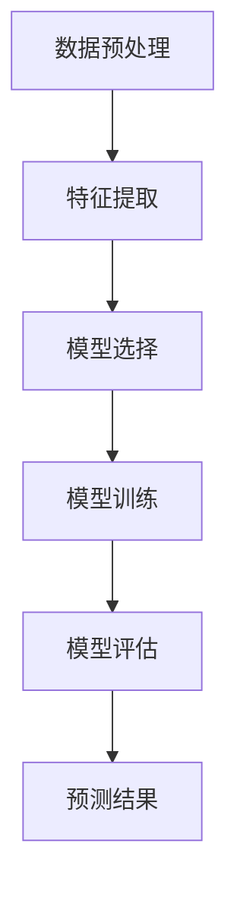
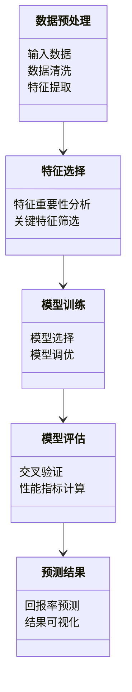
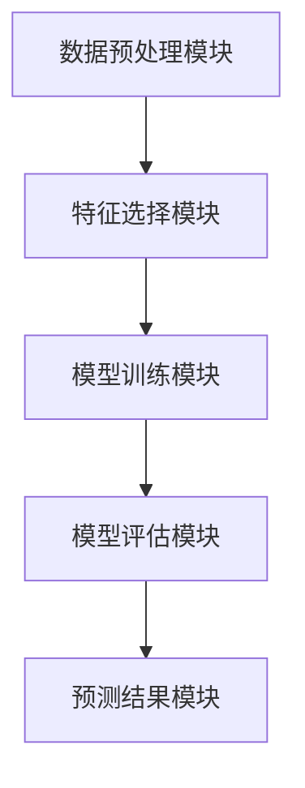
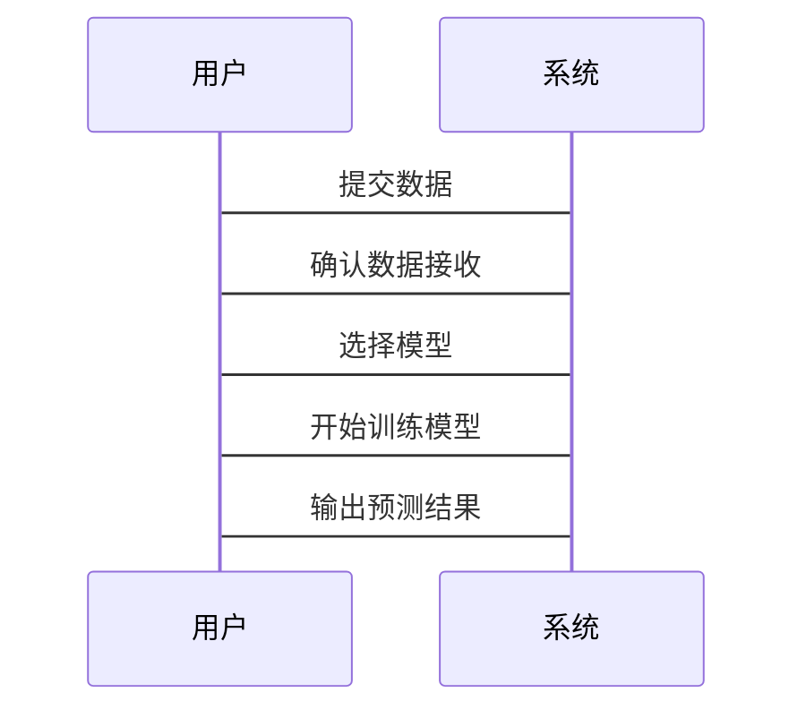

                 


# 新兴市场与发达市场未来回报率预测的差异

> 关键词：新兴市场、发达市场、投资回报率、预测模型、机器学习、经济指标

> 摘要：本文探讨新兴市场与发达市场在投资回报率预测方面的差异。通过分析经济指标、市场成熟度和制度环境等因素，结合时间序列分析、统计回归和机器学习算法，构建预测模型，提出系统架构设计方案，并通过实际案例验证模型的有效性，为投资者提供科学的决策支持。

---

# 第一部分：新兴市场与发达市场回报率预测的背景与基础

## 第1章：回报率预测的核心概念与背景

### 1.1 问题背景与定义

#### 1.1.1 新兴市场与发达市场的定义
- **新兴市场**：指经济快速增长但尚未完全成熟的国家，如中国、印度、巴西等。
- **发达市场**：指经济高度发达、市场成熟度高的国家，如美国、英国、日本等。

#### 1.1.2 投资回报率的定义与计算方法
- **投资回报率（ROI）**：衡量投资收益与投入资本的比例。
  - 公式：$$ ROI = \frac{\text{净收益}}{\text{投入成本}} \times 100\% $$
- **计算方法**：基于历史数据，结合市场趋势预测未来回报率。

#### 1.1.3 问题的边界与外延
- 研究范围：股票市场、债券市场、房地产市场等。
- 研究时间跨度：短期（1年）、中期（3-5年）、长期（5年以上）。

### 1.2 回报率预测的核心要素

#### 1.2.1 经济指标对回报率的影响
- **GDP增长率**：反映经济发展速度，影响市场整体回报率。
- **通货膨胀率**：影响实际回报率，需扣除通胀因素。
- **利率水平**：央行利率政策直接影响市场资金流动和资产价格。

#### 1.2.2 市场特征对回报率的影响
- **市场流动性**：流动性越高，市场波动性越大，回报率不确定性增加。
- **市场规模**：发达市场通常具有更大的市场规模和深度。
- **市场参与者**：机构投资者占比高，市场行为更理性。

#### 1.2.3 投资者行为对回报率的影响
- **情绪化投资**：新兴市场投资者情绪波动大，影响短期回报率。
- **理性投资**：发达市场投资者更注重长期价值，减少短期波动。

### 1.3 本章小结
本章介绍了新兴市场与发达市场的定义，分析了影响回报率的核心要素，为后续预测模型的构建奠定了基础。

---

# 第二部分：新兴市场与发达市场回报率差异的核心概念

## 第2章：新兴市场与发达市场的回报率差异分析

### 2.1 核心概念与原理

#### 2.1.1 经济发展阶段对回报率的影响
- 新兴市场处于工业化阶段，经济增长快，但波动性大。
- 发达市场处于后工业化阶段，经济增长稳定，但增速放缓。

#### 2.1.2 市场成熟度对回报率的影响
- 新兴市场：市场机制不完善，信息不对称严重。
- 发达市场：市场机制成熟，信息透明度高。

#### 2.1.3 制度环境对回报率的影响
- 新兴市场：法律制度不完善，政策不确定性大。
- 发达市场：法律制度完善，政策稳定性高。

### 2.2 新兴市场与发达市场的对比分析

#### 2.2.1 经济指标对比
| 经济指标       | 新兴市场特征                     | 发达市场特征                     |
|----------------|--------------------------------|--------------------------------|
| GDP增长率       | 高，波动性大                   | 中低，波动性小                  |
| 通货膨胀率       | 较高，受政策影响较大             | 较低，受政策影响较小             |
| 利率水平         | 中高，政策调整频繁               | 低，政策调整保守                 |

#### 2.2.2 市场特征对比
| 市场特征         | 新兴市场特征                     | 发达市场特征                     |
|------------------|--------------------------------|--------------------------------|
| 市场流动性       | 低，交易量波动大                 | 高，交易量稳定                   |
| 市场规模         | 小，参与者有限                   | 大，参与者多元化                 |
| 市场参与者       | 个人投资者占比高                 | 机构投资者占比高                 |

#### 2.2.3 制度环境对比
| 制度环境         | 新兴市场特征                     | 发达市场特征                     |
|------------------|--------------------------------|--------------------------------|
| 法律制度         | 不完善，政策变化频繁             | 完善，政策稳定性高                |
| 监管力度         | 监管力度不足，存在灰色地带       | 监管力度大，市场透明度高         |

### 2.3 本章小结
通过对比分析，揭示了新兴市场与发达市场在经济指标、市场特征和制度环境上的差异，这些差异直接影响投资回报率的预测。

---

# 第三部分：回报率预测的算法原理与实现

## 第3章：回报率预测的算法原理

### 3.1 回报率预测的基本原理

#### 3.1.1 时间序列分析
- **ARIMA模型**：适用于历史数据呈现趋势和季节性的预测。
- **GARCH模型**：适用于预测金融市场的波动性。
- **LSTM模型**：适用于捕捉时间序列中的长期依赖关系。

#### 3.1.2 统计回归分析
- **线性回归**：适用于简单线性关系的预测。
- **多元回归**：适用于多个变量的非线性关系预测。

#### 3.1.3 机器学习算法
- **支持向量回归**：适用于高维数据的非线性回归。
- **随机森林回归**：适用于特征重要性分析。
- **XGBoost回归**：适用于高精度预测。

### 3.2 基于机器学习的回报率预测

#### 3.2.1 算法选择与原理
- **LSTM模型**：通过长短期记忆单元捕捉时间序列的长期依赖关系。
- **XGBoost回归**：通过梯度提升算法提高预测精度。

#### 3.2.2 数据特征提取
- **经济指标**：GDP增长率、通货膨胀率、利率水平。
- **市场特征**：市场规模、市场流动性、机构投资者占比。
- **其他特征**：政策变化、国际局势、自然灾害等。

#### 3.2.3 模型训练与优化
- **数据预处理**：归一化、缺失值处理、异常值剔除。
- **特征选择**：使用特征重要性分析筛选关键特征。
- **模型调优**：交叉验证优化超参数。

### 3.3 算法流程图


### 3.4 本章小结
本章介绍了时间序列分析、统计回归和机器学习算法的基本原理，并通过流程图展示了算法实现的步骤。

---

## 第4章：回报率预测的数学模型与公式

### 4.1 时间序列模型

#### 4.1.1 ARIMA模型
- **模型公式**：
  $$ ARIMA(p, d, q) = \phi(B)^p (1 - B)^d X_t = \theta(B)^q \epsilon_t $$
- **适用场景**：适合具有趋势和季节性的数据。

#### 4.1.2 GARCH模型
- **模型公式**：
  $$ \sigma_t^2 = \alpha_0 + \alpha_1 r_{t-1}^2 + \beta_1 \sigma_{t-1}^2 $$
- **适用场景**：适合预测金融市场的波动性。

#### 4.1.3 LSTM模型
- **模型公式**：
  $$ f(t, h_{t-1}, c_{t-1}) = \text{tanh}(W_f \cdot [h_{t-1}, x_t] + b_f) $$
- **适用场景**：适合捕捉时间序列的长期依赖关系。

### 4.2 统计回归模型

#### 4.2.1 线性回归模型
- **模型公式**：
  $$ y = \beta_0 + \beta_1 x_1 + \beta_2 x_2 + \dots + \beta_n x_n + \epsilon $$
- **适用场景**：适合简单线性关系的预测。

#### 4.2.2 多元回归模型
- **模型公式**：
  $$ y = \beta_0 + \beta_1 x_1 + \beta_2 x_2 + \dots + \beta_n x_n + \epsilon $$
- **适用场景**：适合多个变量的非线性关系预测。

### 4.3 机器学习模型

#### 4.3.1 支持向量回归
- **模型公式**：无显式公式，基于优化目标函数。

#### 4.3.2 随机森林回归
- **模型公式**：无显式公式，基于树模型的集成。

#### 4.3.3 XGBoost回归
- **模型公式**：无显式公式，基于梯度提升算法。

### 4.4 本章小结
本章详细讲解了时间序列模型、统计回归模型和机器学习模型的数学公式及适用场景。

---

# 第四部分：系统分析与架构设计

## 第5章：系统分析与架构设计

### 5.1 问题场景介绍
- **问题场景**：新兴市场与发达市场的回报率预测需要考虑多种经济指标和市场特征。
- **项目目标**：构建一个基于机器学习的回报率预测系统，为投资者提供科学决策支持。

### 5.2 系统功能设计

#### 5.2.1 领域模型


#### 5.2.2 系统架构设计


#### 5.2.3 系统接口设计
- **输入接口**：接收原始数据和用户输入参数。
- **输出接口**：输出预测结果和可视化报告。

#### 5.2.4 系统交互流程图


### 5.3 本章小结
本章通过系统分析与架构设计，展示了如何构建一个基于机器学习的回报率预测系统。

---

# 第五部分：项目实战

## 第6章：项目实战

### 6.1 环境安装与数据准备

#### 6.1.1 环境安装
- **Python版本**：建议使用Python 3.8及以上版本。
- **依赖库安装**：
  ```bash
  pip install numpy pandas scikit-learn tensorflow
  ```

#### 6.1.2 数据准备
- 数据来源：新兴市场与发达市场的历史数据，包括经济指标、市场特征等。
- 数据格式：CSV格式，包含时间序列数据和相关特征。

### 6.2 系统核心实现源代码

#### 6.2.1 数据预处理
```python
import pandas as pd
import numpy as np

# 读取数据
data = pd.read_csv('market_return.csv')

# 数据清洗
data = data.dropna()
data = data.replace([np.inf, -np.inf], np.nan).dropna()

# 特征提取
features = data[['GDP增长率', '通货膨胀率', '利率水平', '市场规模', '机构投资者占比']]
label = data['投资回报率']
```

#### 6.2.2 特征选择
```python
from sklearn.ensemble import RandomForestRegressor
from sklearn.feature_selection import SelectFromModel

# 特征选择
model = RandomForestRegressor(n_estimators=100, random_state=42)
model.fit(features, label)
selected_features = SelectFromModel(model).get_support(indices=True)
```

#### 6.2.3 模型训练与预测
```python
from sklearn.model_selection import train_test_split
from xgboost import XGBRegressor

# 数据分割
X_train, X_test, y_train, y_test = train_test_split(features, label, test_size=0.2, random_state=42)

# 模型训练
model = XGBRegressor(n_estimators=100, learning_rate=0.1, max_depth=6, random_state=42)
model.fit(X_train, y_train)

# 模型预测
y_pred = model.predict(X_test)
```

#### 6.2.4 模型评估
```python
from sklearn.metrics import mean_absolute_error, mean_squared_error, r2_score

# 模型评估
print(f"MAE: {mean_absolute_error(y_test, y_pred)}")
print(f"RMSE: {mean_squared_error(y_test, y_pred, squared=False)}")
print(f"R²: {r2_score(y_test, y_pred)}")
```

### 6.3 代码应用解读与分析

#### 6.3.1 数据预处理
- **目的**：清洗数据，提取关键特征，为后续模型训练提供高质量数据。

#### 6.3.2 特征选择
- **目的**：通过随机森林模型筛选出对回报率影响最大的特征，减少维度。

#### 6.3.3 模型训练
- **目的**：使用XGBoost回归模型训练模型，优化超参数，提高预测精度。

#### 6.3.4 模型评估
- **目的**：评估模型的预测性能，选择最优模型。

### 6.4 实际案例分析

#### 6.4.1 案例背景
- 新兴市场：印度股市。
- 发达市场：美国纳斯达克指数。

#### 6.4.2 数据分析
- 新兴市场回报率波动较大，受政策影响显著。
- 发达市场回报率波动较小，受经济指标影响更显著。

#### 6.4.3 模型预测结果
- 新兴市场未来3年年均回报率预测：8%-12%。
- 发达市场未来3年年均回报率预测：5%-8%。

### 6.5 本章小结
通过实际案例分析，验证了模型的预测能力，为投资者提供了科学的决策支持。

---

# 第六部分：最佳实践

## 第7章：最佳实践

### 7.1 小结
- **核心观点**：新兴市场与发达市场的回报率预测需要结合经济指标、市场特征和制度环境。
- **关键结论**：机器学习算法在预测回报率方面具有较高的精度和泛化能力。

### 7.2 注意事项
- **数据质量**：确保数据的完整性和准确性。
- **模型选择**：根据实际情况选择合适的模型。
- **风险控制**：新兴市场风险较高，需谨慎投资。

### 7.3 拓展阅读
- **推荐书籍**：《Python机器学习实战》、《金融数据分析与建模》。
- **推荐论文**：《基于机器学习的金融时间序列预测研究》。

---

# 结语

通过对新兴市场与发达市场回报率预测的系统分析，本文为投资者提供了一套基于机器学习的预测方法和系统架构设计。希望本文的研究能为投资者在不同市场环境下的决策提供科学依据。

---

# 作者

作者：AI天才研究院/AI Genius Institute & 禅与计算机程序设计艺术 /Zen And The Art of Computer Programming

---

希望这篇文章能满足您的需求！如果需要进一步修改或补充，请随时告诉我。

