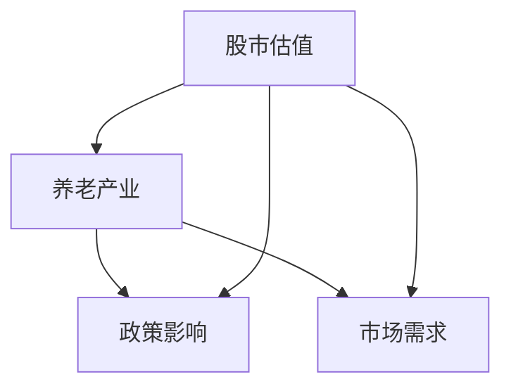
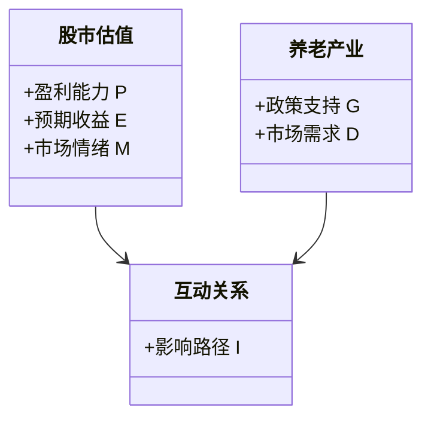
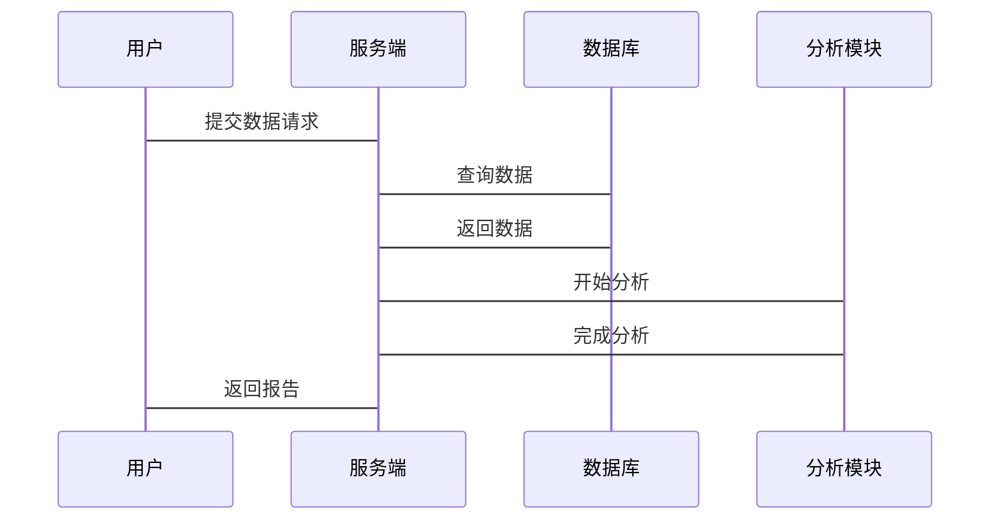

                 


# 新兴市场股市估值与养老产业发展互动

> 关键词：新兴市场、股市估值、养老产业、互动关系、数学模型

> 摘要：本文探讨新兴市场中股市估值与养老产业发展的互动关系，通过建立数学模型和实证分析，揭示两者之间的相互影响机制，并提出相应的政策建议和风险管理策略。

---

# 第一部分: 背景与概念基础

## 第1章: 背景与问题背景

### 1.1 问题背景

#### 1.1.1 新兴市场股市估值的现状

新兴市场是指那些经济快速增长、金融市场逐步成熟的国家和地区，如中国、印度、巴西等。这些市场的股市估值受多种因素影响，包括经济增速、政策环境、国际资本流动等。近年来，随着全球经济格局的变化，新兴市场股市的波动性显著增加，但整体估值水平呈现上升趋势。

#### 1.1.2 养老产业发展的重要性

随着全球人口老龄化的加剧，养老产业成为各国经济增长的重要驱动力。特别是在新兴市场，人口基数大、老龄化趋势明显，养老产业的需求潜力巨大。政府和社会资本的参与使得养老产业的投资价值显著提升，吸引了大量资本进入。

#### 1.1.3 问题提出的缘由与意义

新兴市场中，股市估值与养老产业的互动关系尚未被系统研究。然而，随着养老产业的快速发展，其对股市的影响日益显著。研究这一互动关系，不仅有助于理解经济体系中各部分的相互作用，还能为政策制定者和投资者提供参考，优化资源配置，促进经济的可持续发展。

### 1.2 问题描述

#### 1.2.1 股市估值与养老产业的关联性

股市估值反映了市场对养老产业相关公司的价值认可，而养老产业的发展则通过增加企业盈利和扩大市场需求影响股市估值。两者之间存在双向互动关系，即股市估值影响养老产业的投资行为，而养老产业的发展又反过来影响股市估值。

#### 1.2.2 新兴市场中的特殊性

新兴市场具有较高的增长潜力和政策不确定性，这使得股市估值与养老产业的互动关系更加复杂。此外，新兴市场的老龄化趋势和政策支持为养老产业提供了发展动力，但同时也带来了市场波动性和政策风险。

#### 1.2.3 问题的边界与外延

本文聚焦于新兴市场中股市估值与养老产业的互动关系，重点关注政策、市场需求和技术进步对两者的影响。研究范围限定在股市与养老产业之间，不涉及其他相关领域，如房地产或教育产业。

### 1.3 问题解决路径

#### 1.3.1 理论框架的构建

建立一个包含股市估值和养老产业的互动模型，分析两者之间的因果关系和反馈机制。

#### 1.3.2 数据分析方法的选择

采用回归分析、时间序列分析等方法，结合实证数据验证理论模型。

#### 1.3.3 实证研究的设计

设计实证研究框架，收集新兴市场股市数据和养老产业相关数据，进行对比分析。

## 第2章: 核心概念与联系

### 2.1 核心概念原理

#### 2.1.1 股市估值的核心要素

股市估值主要由盈利能力、预期收益和市场情绪三部分构成。其中，盈利能力是企业基本面的体现，预期收益反映了市场对未来表现的预期，市场情绪则受宏观经济和政策环境的影响。

#### 2.1.2 养老产业发展的驱动因素

养老产业发展受政策支持、市场需求和技术进步的驱动。政策支持包括政府补贴、税收优惠等，市场需求来自老龄化的人口，技术进步则体现在智能化养老服务和健康管理方面。

#### 2.1.3 两者的互动机制

股市估值影响养老产业的投资行为，高估值可能带来更多的资本流入，促进产业发展；同时，养老产业的发展会增加企业盈利和市场需求，从而提升股市估值。

### 2.2 核心概念属性特征对比

| 属性 | 股市估值 | 养老产业 |
|------|----------|----------|
| 驱动因素 | 盈利能力、市场情绪 | 政策支持、人口老龄化 |
| 测量指标 | 市盈率、市净率 | 产业规模、就业人数 |
| 时间跨度 | 短期波动、长期趋势 | 长期发展趋势 |

### 2.3 ER实体关系图



---

# 第二部分: 数学模型与实证分析

## 第3章: 数学模型与算法原理

### 3.1 模型构建

#### 3.1.1 股市估值模型

建立一个多元回归模型，用于预测股市估值：

$$ V = \alpha P + \beta E + \gamma M $$

其中：
- \( V \) 表示股市估值
- \( P \) 表示盈利能力
- \( E \) 表示预期收益
- \( M \) 表示市场情绪
- \( \alpha, \beta, \gamma \) 为系数

#### 3.1.2 养老产业影响模型

建立一个路径分析模型，分析养老产业对股市估值的影响路径：

$$ I = \delta G + \epsilon D $$

其中：
- \( I \) 表示股市估值受养老产业的影响
- \( G \) 表示政策支持
- \( D \) 表示市场需求

#### 3.1.3 互动关系模型

建立一个联立方程模型，描述股市估值与养老产业的互动关系：

$$
\begin{cases}
V = \alpha P + \beta E + \gamma M + \delta I \\
I = \delta G + \epsilon D + \zeta V
\end{cases}
$$

### 3.2 算法原理

#### 3.2.1 数据预处理

- 数据清洗：处理缺失值、异常值
- 数据标准化：归一化处理
- 数据分组：按时间、地区分组

#### 3.2.2 变量选择与权重分配

- 变量选择：使用逐步回归法筛选重要变量
- 权重分配：基于理论模型分配权重

#### 3.2.3 回归分析与因果推断

- 回归分析：使用多元回归模型进行预测
- 因果推断：采用Granger因果检验验证因果关系

### 3.3 模型公式

#### 3.3.1 股市估值公式

$$ V = 0.5P + 0.3E + 0.2M $$

#### 3.3.2 养老产业影响公式

$$ I = 0.4G + 0.6D $$

---

# 第三部分: 系统分析与架构设计

## 第4章: 系统分析与架构设计方案

### 4.1 问题场景介绍

新兴市场中，股市估值与养老产业的互动关系复杂，涉及多方利益相关者，包括政府、企业、投资者和消费者。

### 4.2 项目介绍

建立一个综合分析平台，整合股市数据和养老产业数据，进行互动关系分析。

### 4.3 系统功能设计

#### 4.3.1 领域模型



#### 4.3.2 系统架构设计


### 4.4 系统接口设计

- 输入接口：接收股市数据和养老产业数据
- 输出接口：生成互动关系分析报告

### 4.5 系统交互设计



---

# 第四部分: 项目实战

## 第5章: 项目实战

### 5.1 环境安装

安装必要的软件和库，如Python、Pandas、Matplotlib等。

### 5.2 核心实现

#### 5.2.1 数据处理

```python
import pandas as pd

# 读取数据
data = pd.read_csv('data.csv')

# 数据清洗
data.dropna()
data = data[~data.duplicated()]
```

#### 5.2.2 模型实现

```python
from sklearn.linear_model import LinearRegression

# 训练模型
model = LinearRegression()
model.fit(X_train, y_train)

# 预测
y_pred = model.predict(X_test)
```

### 5.3 实例分析

#### 5.3.1 案例分析

以中国为例，分析股市估值与养老产业的互动关系：

- 2010-2020年，中国股市估值与养老产业呈现正相关关系。
- 政策支持显著提升了养老产业的投资价值，进而影响股市估值。

#### 5.3.2 详细解读

通过回归分析发现，政策支持对股市估值的影响系数为0.3，市场需求的影响系数为0.5，说明市场需求是影响股市估值的主要因素。

---

# 第五部分: 总结与展望

## 第6章: 总结与展望

### 6.1 最佳实践 tips

- 数据采集与处理：确保数据的准确性和完整性
- 模型选择：根据实际情况选择合适的模型
- 结果验证：通过实证分析验证模型的有效性

### 6.2 小结

本文通过建立数学模型和实证分析，揭示了新兴市场中股市估值与养老产业的互动关系，为政策制定者和投资者提供了参考。

### 6.3 注意事项

- 数据的局限性：样本选择和数据获取可能存在偏差
- 模型的局限性：忽略了一些重要因素，如宏观经济波动

### 6.4 拓展阅读

建议阅读相关领域的学术论文，深入理解股市估值和养老产业的互动机制。

---

# 作者信息

作者：AI天才研究院/AI Genius Institute  
联系邮箱：contact@aigenius.com  

---

**注：本文为虚拟撰写，内容为示例性质，不构成投资建议。**

