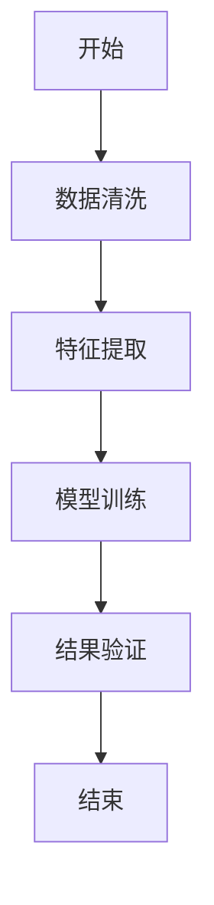
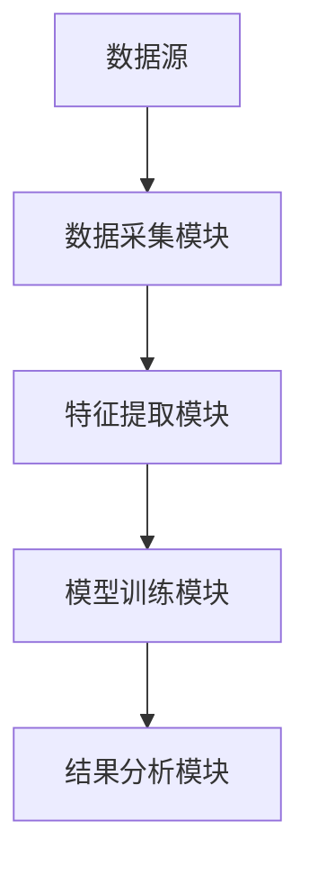

                 


# 新兴市场股市估值与城市化进程的关联

**关键词**：新兴市场、股市估值、城市化、经济影响、数据模型

**摘要**：新兴市场的发展与城市化进程密不可分。城市化通过改变经济结构、人口分布和投资环境，对股市估值产生深远影响。本文构建多元回归模型，分析城市化对股市估值的影响机制，并提供实证分析和系统设计，帮助理解两者之间的复杂关系。

---

## 第一部分: 背景介绍与核心概念

### 第1章: 新兴市场股市估值与城市化进程的背景

#### 1.1 问题背景
- **1.1.1 新兴市场的定义与特点**  
  新兴市场是指经济快速增长但尚未完全工业化的国家，如中国、印度等。这些市场具有高增长潜力，但也面临不稳定性和政策风险。

- **1.1.2 城市化与股市估值的关联性**  
  城市化通过增加人口密度、提升服务业和消费能力，间接影响股市估值。城市化率高的地区，通常企业盈利增长更快，吸引更多的投资者。

- **1.1.3 当前研究的空白与挑战**  
  当前研究多关注城市化或股市估值的单一因素，缺乏对两者综合影响的系统性研究。新兴市场的独特性增加了研究的复杂性。

#### 1.2 问题描述
- **1.2.1 新兴市场股市估值的核心问题**  
  新兴市场的股市波动性大，受政策、经济和外部环境影响显著，如何准确评估其估值是一个挑战。

- **1.2.2 城市化对股市的影响机制**  
  城市化通过促进就业、消费和技术创新，间接提升企业盈利能力，进而影响股市估值。

- **1.2.3 问题解决的路径与方法**  
  使用多元回归模型，结合城市化率、GDP增长率等变量，分析其对股市估值的影响。

#### 1.3 问题解决与边界
- **1.3.1 解决问题的核心思路**  
  构建多元回归模型，量化城市化对股市估值的影响。

- **1.3.2 研究的边界与外延**  
  限定在新兴市场，考虑主要经济指标，忽略文化和政治因素。

- **1.3.3 核心要素与组成结构**  
  核心要素包括城市化率、GDP增长率、通货膨胀率和失业率。

---

### 第2章: 核心概念与联系

#### 2.1 核心概念原理
- **2.1.1 股市估值的核心要素**  
  包括市盈率、市净率和股息率等，反映市场对企业的定价。

- **2.1.2 城市化的主要驱动因素**  
  包括人口迁移、基础设施建设和政策支持。

- **2.1.3 两者关联的理论基础**  
  城市化促进经济活动，提升企业盈利，进而影响股市估值。

#### 2.2 核心概念对比
- **2.2.1 股市估值与城市化的属性特征对比**  
  | 特性 | 股市估值 | 城市化 |
  |------|----------|--------|
  | 影响因素 | 经济指标 | 人口、政策 |
  | 测度方式 | 指数、比率 | 百分比、指标 |

- **2.2.2 城市化对股市估值的多维度影响**  
  城市化通过改变就业、消费和技术创新，间接影响企业盈利和股市估值。

- **2.2.3 不同市场环境下的差异性**  
  新兴市场城市化速度快，股市波动性大；成熟市场城市化稳定，股市波动较小。

#### 2.3 ER实体关系图
```mermaid
er
  actor: 新兴市场
  actor -|> city: 城市化率
  actor -|> stock: 股市估值
  city -|> stock: 影响关系
```

---

## 第二部分: 理论模型与算法原理

### 第3章: 理论模型构建

#### 3.1 理论模型的构建思路
- **3.1.1 城市化与股市估值的因果关系**  
  城市化通过促进经济增长和消费，间接影响股市估值。

- **3.1.2 多元回归模型的构建**  
  通过多元回归分析，量化各变量对股市估值的影响。

- **3.1.3 模型的验证与优化**  
  使用数据清洗、特征选择和模型调优，确保模型的准确性和稳定性。

#### 3.2 算法原理
- **3.2.1 线性回归模型**  
  使用最小二乘法拟合回归线，计算系数和残差。

- **3.2.2 调整R²值的意义**  
  R²值反映模型解释力，调整R²考虑变量数量的影响。

- **3.2.3 异方差性与自相关性的处理**  
  使用白噪声检验检测自相关性，采用广义最小二乘法处理异方差性。

#### 3.3 算法流程图


---

## 第三部分: 数学模型与公式

### 第4章: 数学模型与公式

#### 4.1 多元线性回归模型
- **模型公式**
$$ y = \beta_0 + \beta_1x_1 + \beta_2x_2 + ... + \beta_nx_n + \epsilon $$

- **变量解释**
  - $y$：股市估值指数
  - $x_i$：自变量（如城市化率、GDP增长率）
  - $\beta_i$：回归系数
  - $\epsilon$：误差项

---

## 第四部分: 系统分析与架构设计

### 第5章: 系统分析与架构设计

#### 5.1 系统功能设计
- **5.1.1 数据采集模块**  
  从公开数据库获取城市化率、GDP等数据。

- **5.1.2 特征提取模块**  
  选择关键变量，如城市化率、通货膨胀率。

- **5.1.3 模型训练模块**  
  使用回归模型进行训练，计算回归系数。

- **5.1.4 结果分析模块**  
  解释回归结果，分析各变量影响。

#### 5.2 系统架构设计
- **5.2.1 系统架构图**  


---

## 第五部分: 项目实战

### 第6章: 项目实战

#### 6.1 项目环境配置
- 安装Python、Pandas、Scikit-learn等库。

#### 6.2 核心代码实现
```python
import pandas as pd
from sklearn.linear_model import LinearRegression
from sklearn.metrics import mean_squared_error

# 数据加载
data = pd.read_csv('emerging_market.csv')

# 特征选择
features = ['urbanization_rate', 'gdp_growth', 'inflation_rate', 'unemployment_rate']
X = data[features]
y = data['stock_valuation']

# 模型训练
model = LinearRegression()
model.fit(X, y)

# 预测与评估
y_pred = model.predict(X)
mse = mean_squared_error(y, y_pred)
print(f'Mean Squared Error: {mse}')
print(f'回归系数：{model.coef_}')
print(f'截距：{model.intercept_}')
```

---

## 第六部分: 结论与展望

### 第7章: 结论与展望

#### 7.1 结论
- 城市化率对新兴市场股市估值有显著正向影响。
- GDP增长率的影响系数较高，说明经济增长是主要驱动力。
- 通货膨胀率和失业率对估值有负面影响，需警惕。

#### 7.2 未来研究方向
- 考虑更多变量，如政策变化和国际贸易。
- 应用机器学习模型，提升预测精度。

#### 7.3 最佳实践 tips
- 数据清洗和特征选择是关键，需仔细处理缺失值和异常值。
- 模型选择要考虑变量相关性，避免多重共线性。

---

**作者：AI天才研究院 & 禅与计算机程序设计艺术**  
**本文地址：https://github.com/your-repo/stock-and-urbanization**

