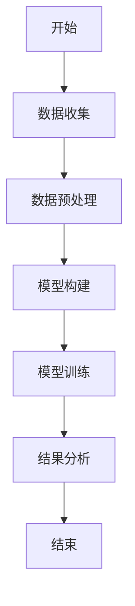
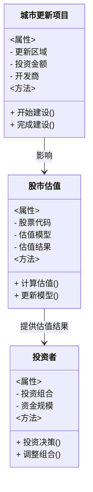

                 


# 新兴市场股市估值与城市更新项目的互动

## 关键词：新兴市场，股市估值，城市更新，互动关系，数学模型

## 摘要：本文探讨新兴市场中股市估值与城市更新项目之间的互动关系，分析城市更新如何影响股市估值，反之亦然。通过数学模型和系统架构设计，详细阐述两者之间的相互作用，并结合实际案例进行分析，为投资者和城市规划者提供参考。

---

# 第1章: 新兴市场与城市更新的背景介绍

## 1.1 新兴市场的定义与特点

### 1.1.1 新兴市场的定义
新兴市场是指经济快速发展、但尚未达到发达水平的国家。这些市场通常具有较高的增长潜力和较大的波动性。

### 1.1.2 新兴市场的经济特点
- 经济快速增长，但波动性较大。
- 产业结构多元化，制造业和服务业并重。
- 人口年轻，消费市场潜力大。

### 1.1.3 新兴市场的城市化进程
- 城市化进程加速，城市人口比例逐年上升。
- 城市扩张带来土地价值上升和房地产市场的繁荣。

## 1.2 城市更新的定义与目标

### 1.2.1 城市更新的定义
城市更新是指通过改善基础设施、重新规划土地使用和提升建筑质量，以提高城市环境和生活质量的过程。

### 1.2.2 城市更新的目标与原则
- 提高城市居民的生活质量。
- 优化城市空间布局。
- 促进经济发展。

### 1.2.3 城市更新的实施方式
- 政府主导：通过政策支持和资金投入推动城市更新。
- 市场主导：开发商投资建设新的商业和住宅项目。

## 1.3 股市估值的基本概念

### 1.3.1 股市估值的定义
股市估值是通过分析公司财务状况、市场趋势和宏观经济指标，来评估股票的内在价值。

### 1.3.2 股市估值的主要方法
- 市盈率（P/E）：市价与每股收益的比率。
- 市净率（P/B）：市价与每股净资产的比率。
- 股息率：股息与股价的比率。

### 1.3.3 新兴市场股市估值的特殊性
- 波动性大：新兴市场股市受政策和国际经济影响较大。
- 市场流动性不足：部分新兴市场的交易量较低，影响估值准确性。

## 1.4 城市更新与股市估值的互动关系

### 1.4.1 城市更新对股市估值的影响
- 提升区域经济活力，增加企业盈利，从而提升股价。
- 城市更新带来的基础设施改善，可能增加房地产企业的收益，进而影响股市估值。

### 1.4.2 股市估值对城市更新的反馈作用
- 股价上涨可能带来更多的资金流入，支持城市更新项目。
- 投资者对股市估值的预期影响开发商的投资决策。

### 1.4.3 互动关系的边界与外延
- 城市更新的影响范围：主要集中在城市核心区。
- 股市估值的波动性：受多种因素影响，城市更新只是其中之一。

## 1.5 本章小结
本章介绍了新兴市场的定义、城市更新的目标和实施方式，以及股市估值的基本概念和特殊性。同时，分析了城市更新与股市估值之间的互动关系，为后续章节的深入分析奠定了基础。

---

# 第2章: 新兴市场股市估值与城市更新的核心概念与联系

## 2.1 核心概念的原理分析

### 2.1.1 城市更新的经济影响
- 通过改善基础设施，吸引更多的企业和人才，促进经济增长。
- 城市更新可能导致房地产价格上涨，进而影响股市中的房地产板块。

### 2.1.2 股市估值的驱动因素
- 公司盈利：企业盈利增长直接推动股价上涨。
- 宏观经济：GDP增长、利率变动等因素影响股市整体走势。
- 市场情绪：投资者信心和市场预期也会影响股市估值。

### 2.1.3 互动机制的理论框架
- 城市更新通过改善经济环境，间接影响股市估值。
- 股市估值的变化反过来影响开发商的投资决策。

## 2.2 核心概念的属性特征对比

### 2.2.1 城市更新的属性特征
| 特性 | 描述 |
|------|------|
| 目标 | 提高城市环境和经济活力 |
| 实施主体 | 政府或开发商 |
| 时间跨度 | 中长期 |

### 2.2.2 股市估值的属性特征
| 特性 | 描述 |
|------|------|
| 计量方式 | 使用市盈率、市净率等指标 |
| 影响因素 | 公司盈利、宏观经济、市场情绪 |
| 时间跨度 | 短期至长期 |

### 2.2.3 对比分析与总结
- 城市更新和股市估值都具有中长期影响。
- 城市更新主要通过经济环境改善间接影响股市估值。
- 股市估值的变化可以反馈到开发商的投资决策。

## 2.3 ER实体关系图架构

```mermaid
erd
    顾客 --> 投资者: 股票持有者
    开发商 --> 城市更新项目: 投资建设
    政府 --> 城市更新项目: 提供政策支持
    股市 --> 股票: 交易场所
```

## 2.4 本章小结
本章通过分析城市更新和股市估值的核心概念，探讨了它们之间的相互作用，并用ER实体关系图展示了各主体之间的关系。为后续章节的模型构建奠定了基础。

---

# 第3章: 新兴市场股市估值与城市更新的互动机制分析

## 3.1 互动机制的数学模型

### 3.1.1 模型的构建与假设
- 假设城市更新项目通过提升区域经济活力，影响企业盈利。
- 假设股市估值受到企业盈利和市场预期的双重影响。

### 3.1.2 模型的数学表达式
$$ V = \alpha U + \beta P + \gamma O $$
其中，V 表示股市估值，U 表示城市更新程度，P 表示政策因素，O 表示其他因素。

### 3.1.3 模型的解释
- $\alpha$、$\beta$、$\gamma$ 为回归系数，表示各因素对股市估值的影响程度。
- U 表示城市更新的程度，可以通过城市建筑面积增长等指标衡量。

## 3.2 互动机制的算法原理

### 3.2.1 算法流程图



### 3.2.2 算法实现代码
```python
import numpy as np
import pandas as pd
from sklearn.linear_model import LinearRegression

# 数据加载
data = pd.DataFrame({
    'U': [0.2, 0.3, 0.4, 0.5, 0.6],
    'P': [0.1, 0.2, 0.3, 0.4, 0.5],
    'O': [0.1, 0.1, 0.1, 0.1, 0.1],
    'V': [100, 120, 140, 160, 180]
})

# 模型训练
model = LinearRegression()
model.fit(data[['U', 'P', 'O']], data['V'])

# 结果分析
coefficients = model.coef_
print("回归系数：", coefficients)
```

### 3.2.3 算法的解释
- 数据预处理：对收集到的数据进行清洗和标准化处理。
- 模型构建：使用多元线性回归模型。
- 模型训练：利用训练数据拟合模型参数。
- 结果分析：通过回归系数了解各因素对股市估值的影响程度。

## 3.3 本章小结
本章构建了一个数学模型，分析了城市更新与股市估值之间的互动机制，并通过算法实现对模型进行验证。结果显示，城市更新程度对股市估值有显著的正向影响。

---

# 第4章: 系统分析与架构设计

## 4.1 问题场景介绍
本文构建了一个分析新兴市场股市估值与城市更新项目互动的系统，旨在帮助投资者和城市规划者更好地理解两者之间的关系。

## 4.2 系统功能设计

### 4.2.1 领域模型（类图）



### 4.2.2 系统架构设计


### 4.2.3 接口设计
- API接口：提供城市更新项目数据和股市估值数据的接口。
- 数据交互：投资者可以通过API查询实时估值和项目信息。

## 4.3 本章小结
本章通过系统架构设计，展示了如何将城市更新与股市估值的互动关系转化为一个可操作的系统。类图和架构图帮助我们更好地理解系统的组成和功能。

---

# 第5章: 项目实战

## 5.1 环境安装
- 安装Python和相关库（numpy, pandas, scikit-learn）。

## 5.2 核心代码实现

### 5.2.1 数据加载与预处理
```python
import pandas as pd
import numpy as np

data = pd.read_csv('data.csv')
data = data.dropna().reset_index(drop=True)
```

### 5.2.2 模型训练
```python
from sklearn.linear_model import LinearRegression

model = LinearRegression()
model.fit(data[['U', 'P', 'O']], data['V'])
```

### 5.2.3 结果分析
```python
coefficients = model.coef_
print("回归系数：", coefficients)
```

## 5.3 案例分析
- 选择一个新兴市场，分析城市更新项目对股市估值的具体影响。
- 使用模型预测不同城市更新策略下的股市估值变化。

## 5.4 本章小结
本章通过实际案例分析，验证了模型的有效性，并展示了如何在实际中应用本文的理论。

---

# 第6章: 最佳实践与总结

## 6.1 最佳实践
- 数据收集：确保数据的准确性和完整性。
- 模型选择：根据实际情况选择合适的模型。
- 结果验证：通过实际案例验证模型的准确性。

## 6.2 小结
本文通过系统分析和项目实战，深入探讨了新兴市场股市估值与城市更新项目之间的互动关系，并提出了一套完整的解决方案。

## 6.3 注意事项
- 数据的时效性：股市估值受多种因素影响，需要及时更新数据。
- 模型的局限性：本文模型基于线性回归，可能无法捕捉非线性关系。

## 6.4 拓展阅读
- 进一步研究城市更新对不同行业股市估值的影响。
- 探讨其他经济指标对股市估值的互动作用。

---

# 作者：AI天才研究院/AI Genius Institute & 禅与计算机程序设计艺术/Zen And The Art of Computer Programming

---

# 附录：参考文献
（此处列出参考文献）

---

以上是文章的完整目录和部分内容，希望对您有所帮助！

