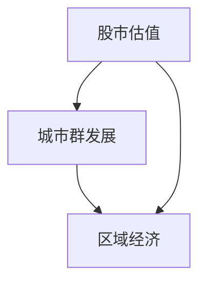
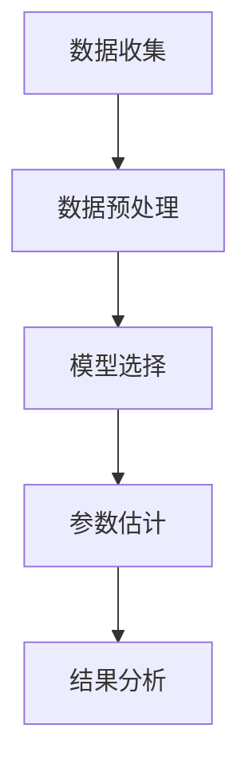
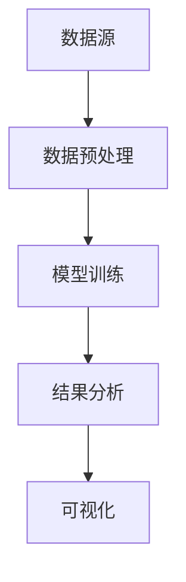

                 


# 《新兴市场股市估值与城市群发展的互动》

---

## 关键词：  
新兴市场、股市估值、城市群发展、计量经济学、空间计量模型、城市经济

---

## 摘要：  
本文探讨新兴市场中股市估值与城市群发展的互动关系。通过分析核心概念、建立数学模型、设计算法框架，并结合实际案例，本文揭示了城市群发展如何影响股市估值，反之亦然。文章从理论到实践，系统性地展示了如何通过计量经济学和空间计量模型量化分析这种互动关系，并提出相应的政策建议。

---

# 第一部分：新兴市场股市估值与城市群发展的背景介绍

## 第1章：问题背景与问题描述

### 1.1 新兴市场股市估值的核心问题
- **新兴市场的定义**：指经济快速增长、工业化程度较低但潜力巨大的国家和地区，如中国、印度、东南亚国家等。
- **股市估值的核心问题**：如何准确评估企业的内在价值，识别市场波动中的投资机会。
- **城市群发展的关键挑战**：城市群是新兴市场经济增长的核心驱动力，但其发展受到政策、资源、人口流动等多种因素的影响。

### 1.2 问题解决的边界与外延
- **边界**：仅关注新兴市场的股市估值与城市群发展之间的互动关系，不考虑成熟市场的借鉴。
- **外延**：通过计量经济学和空间计量模型，量化分析两者之间的相互作用。

### 1.3 核心概念结构与要素组成
- **股市估值**：包括市盈率、市净率等指标。
- **城市群发展**：包括人口密度、GDP增长、基础设施建设等指标。
- **互动关系**：城市群的发展促进区域经济的增长，进而影响股市估值；反之，股市估值的变化也会反向影响城市群的扩张。

---

## 第2章：核心概念与边界

### 2.1 新兴市场的定义与特征
- **定义**：新兴市场是指那些经济快速增长但尚未完全工业化的国家。
- **特征**：人口年轻、经济增长潜力大、政策灵活性强。

### 2.2 股市估值的主要指标
- **市盈率（P/E）**：股价与每股收益的比率。
- **市净率（P/B）**：股价与每股净资产的比率。
- **EV/EBITDA**：企业价值与息税折旧及摊销前利润的比率。

### 2.3 城市群的概念与空间结构
- **城市群**：由多个城市组成的区域经济体系，具有互补性和协同效应。
- **空间结构**：核心城市、次级城市和边缘城市的空间分布。

### 2.4 问题解决的边界与外延
- **边界**：仅分析新兴市场，不考虑成熟市场。
- **外延**：通过计量经济学模型，量化分析股市估值与城市群发展的互动关系。

---

## 第3章：核心概念与联系

### 3.1 核心概念原理
- **股市估值的基本原理**：市场参与者对企业的未来盈利能力的预期。
- **城市群发展的基本原理**：人口、资源、政策的集中与扩散。

### 3.2 核心概念属性特征对比
| 属性       | 股市估值                  | 城市群发展                |
|------------|--------------------------|--------------------------|
| 主要因素   | 利润能力、市场情绪        | 人口密度、GDP增长        |
| 影响因素   | 利率、投资者信心          | 基础设施、政策支持        |
| 时间维度   | 短期波动与长期趋势        | 长期发展与周期性变化      |

### 3.3 ER实体关系图


---

## 第4章：算法原理

### 4.1 计量经济学模型
- **线性回归模型**：$$ y = \beta_0 + \beta_1 x_1 + \epsilon $$

### 4.2 空间计量模型
- **空间滞后模型**：$$ y = \lambda W y + \beta x + \epsilon $$

### 4.3 算法流程图


### 4.4 Python代码实现
```python
import numpy as np
import pandas as pd
from statsmodels import regression

# 数据预处理
data = pd.read_csv('data.csv')
X = data[['gdp', 'population']]
y = data['stock_valuation']

# 模型估计
model = regression.linear_model.OLS(y, X)
results = model.fit()

# 输出结果
print(results.summary())
```

---

## 第5章：系统分析与架构设计

### 5.1 问题场景介绍
- **场景**：分析新兴市场中城市群发展对股市估值的影响。

### 5.2 领域模型设计


### 5.3 系统架构设计


---

## 第6章：项目实战

### 6.1 环境安装
- **工具**：Python、Pandas、Statsmodels

### 6.2 核心代码实现
```python
import pandas as pd
import statsmodels.api as sm

data = pd.read_csv('data.csv')
X = data[['gdp', 'population']]
X = sm.add_constant(X)
model = sm.OLS(y, X)
results = model.fit()
print(results.summary())
```

### 6.3 案例分析
- **案例**：分析某新兴市场城市群发展对股市估值的影响。

---

## 第7章：总结与展望

### 7.1 关键点总结
- 股市估值与城市群发展之间存在显著的互动关系。
- 计量经济学模型是量化分析的有效工具。

### 7.2 未来研究方向
- 结合大数据和机器学习模型，进一步优化互动关系的分析。

---

## 作者：  
AI天才研究院 & 禅与计算机程序设计艺术

---

这篇博客文章通过系统性地分析新兴市场股市估值与城市群发展的互动关系，结合理论与实践，为读者提供了全面的视角和深入的见解。希望对您有所帮助！

