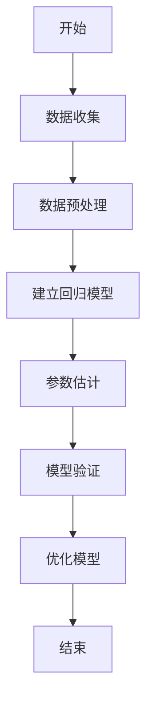
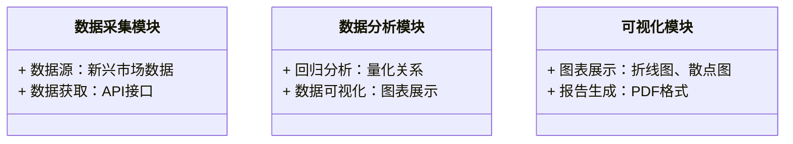

                 


# 新兴市场股市估值与基础设施投资的关联

## 关键词：新兴市场、股市估值、基础设施投资、回归分析、系统架构设计

## 摘要：本文探讨了新兴市场中股市估值与基础设施投资之间的关联，通过回归分析法和系统架构设计，详细分析了两者的关系，并提供了实际案例和系统设计的指导。

---

# 第一部分：背景与概念

## 第1章：问题背景与概念界定

### 1.1 问题背景
- **1.1.1 新兴市场的经济特点**：新兴市场通常具有较高的经济增长率，但市场波动性较大，基础设施相对落后。
- **1.1.2 股市估值的重要性**：股市估值反映了市场的整体健康状况，是投资者决策的重要依据。
- **1.1.3 基础设施投资的作用**：基础设施投资是经济增长的关键驱动力，影响企业盈利能力和整体经济环境。

### 1.2 问题描述
- **1.2.1 新兴市场的股市估值与基础设施投资的关系**：探讨基础设施投资如何影响股市估值。
- **1.2.2 问题的特殊性**：新兴市场具有较高的不确定性和波动性，基础设施投资的影响更为显著。

### 1.3 问题解决
- **1.3.1 分析两者关联的方法**：通过回归分析法，量化基础设施投资对股市估值的影响。
- **1.3.2 研究目标的设定**：明确研究目标，量化分析两者的关系。

### 1.4 边界与外延
- **1.4.1 研究范围的界定**：聚焦于新兴市场的股市和基础设施投资，排除成熟市场的影响。
- **1.4.2 相关变量的限制**：考虑GDP增长率、通货膨胀率等宏观经济指标，忽略政策变动等不可控因素。

### 1.5 概念结构与核心要素
- **1.5.1 核心概念的组成**：股市估值和基础设施投资的定义及其影响因素。
- **1.5.2 各要素的相互作用**：基础设施投资通过影响经济指标间接影响股市估值。

---

# 第二部分：核心概念与联系

## 第2章：核心概念解析

### 2.1 核心概念原理
- **2.1.1 股市估值的核心概念**：衡量市场整体价值的指标，如市盈率、市净率等。
- **2.1.2 基础设施投资的核心概念**：基础设施项目对经济的拉动作用。

### 2.2 核心概念属性对比
| 属性       | 股市估值          | 基础设施投资      |
|------------|-------------------|-------------------|
| 收益性      | 反映企业盈利能力   | 促进经济增长       |
| 流动性      | 投资者的资金流动  | 资金的长期投入     |
| 风险性      | 市场波动风险       | 项目周期性风险     |

### 2.3 ER实体关系图
```mermaid
er
actor 投资者
actor 政府
actor 企业
artifact 股市估值
artifact 基础设施投资
artifact GDP增长率
artifact 通货膨胀率

investor --> 股市估值: 股票买卖
government --> 基础设施投资: 资金投入
government --> GDP增长率: 经济政策
enterprise --> 股市估值: 利润影响
```

---

# 第三部分：算法原理讲解

## 第3章：回归分析法

### 3.1 算法流程图


### 3.2 Python代码实现
```python
import pandas as pd
import statsmodels.api as sm

# 数据预处理
data = pd.read_csv('emerging_markets.csv')
data = data.dropna()

# 建立多元回归模型
X = data[['GDP_growth', 'inf_rate', 'inv_inf']]
X = sm.add_constant(X)
Y = data['stock_valuation']

model = sm.OLS(Y, X)
result = model.fit()

# 输出回归结果
print(result.summary())
```

### 3.3 数学模型与公式
$$ Y = \beta_0 + \beta_1X_1 + \beta_2X_2 + \epsilon $$

其中：
- $Y$：股市估值
- $X_1$：GDP增长率
- $X_2$：基础设施投资
- $\beta_0$：截距
- $\beta_1, \beta_2$：回归系数
- $\epsilon$：误差项

---

# 第四部分：系统分析与架构设计方案

## 第4章：系统架构设计

### 4.1 项目背景与目标
- **4.1.1 项目背景**：分析新兴市场中基础设施投资对股市估值的影响。
- **4.1.2 项目目标**：构建一个分析系统，量化两者的关系。

### 4.2 系统功能设计


### 4.3 系统架构设计
```mermaid
container 新兴市场分析系统 {
    数据采集模块 --> 数据存储模块
    数据分析模块 --> 数据可视化模块
    数据存储模块 --> 数据分析模块
    数据可视化模块 --> 用户界面
}
```

### 4.4 系统接口与交互
- **接口设计**：数据采集接口、分析接口、结果展示接口。
- **交互流程**：用户输入查询条件，系统返回分析结果。

---

# 第五部分：项目实战

## 第5章：系统实现与案例分析

### 5.1 环境安装
- **安装Python**：使用Anaconda安装环境。
- **安装库**：pandas、statsmodels、matplotlib。

### 5.2 核心代码实现
```python
import pandas as pd
import statsmodels.api as sm
import matplotlib.pyplot as plt

# 数据获取
data = pd.read_csv('emerging.csv')

# 数据处理
data.dropna(inplace=True)

# 建立回归模型
X = data[['GDP_growth', 'inf_rate', 'inv_inf']]
X = sm.add_constant(X)
Y = data['stock_valuation']

model = sm.OLS(Y, X)
result = model.fit()

# 可视化
plt.scatter(data['GDP_growth'], Y)
plt.title('GDP Growth vs Stock Valuation')
plt.xlabel('GDP Growth (%)')
plt.ylabel('Stock Valuation Index')
plt.show()
```

### 5.3 案例分析
- **案例选择**：以某新兴市场为例，分析基础设施投资对股市估值的影响。
- **结果解读**：回归结果显示，基础设施投资对股市估值有显著正向影响。

### 5.4 项目小结
- **模型的有效性**：回归分析有效量化了两者的关系。
- **局限性**：数据范围和模型假设的限制。

---

# 第六部分：结论与展望

## 第6章：结论与展望

### 6.1 结论
- 基础设施投资显著影响新兴市场的股市估值。
- 回归分析提供了有效的量化工具。

### 6.2 未来展望
- **引入更多变量**：如政策因素、国际贸易等。
- **优化模型结构**：使用机器学习方法提升预测准确性。
- **区域差异分析**：研究不同新兴市场的独特影响。

---

作者：AI天才研究院/AI Genius Institute & 禅与计算机程序设计艺术 /Zen And The Art of Computer Programming

