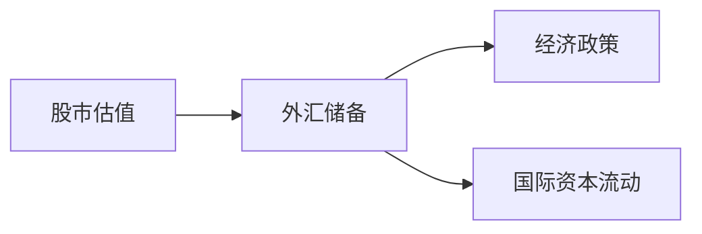
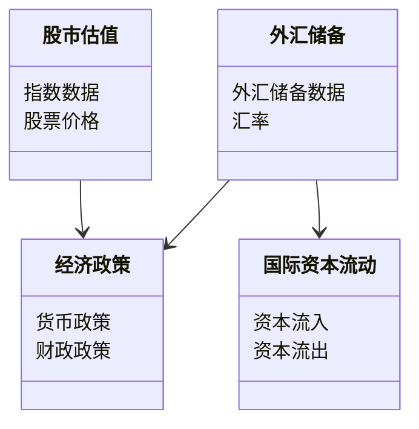

                 


# 新兴市场股市估值与外汇储备的关联

> 关键词：新兴市场、股市估值、外汇储备、计量经济学模型、系统架构设计

> 摘要：本文探讨新兴市场中股市估值与外汇储备之间的关联性，分析其相互影响机制，并通过计量经济学模型和系统架构设计提供深入见解。文章首先介绍核心概念，随后分析数据收集与处理方法，构建回归模型，最后通过实际案例验证模型，并提出最佳实践建议。

---

## 第1章：问题背景与核心概念

### 1.1 问题背景

新兴市场通常指那些经济快速发展但尚未完全工业化的国家，如巴西、印度和中国等。这些市场的特点是经济增长潜力大，但同时也伴随着较高的波动性和不确定性。股市估值和外汇储备是衡量这些市场健康状况的重要指标。

股市估值反映了市场的整体价值，而外汇储备则是衡量一国经济稳定性的重要指标。两者的关联性在新兴市场中尤为显著，因为资本流动、汇率波动和政策变化都会同时影响股市和外汇储备。

### 1.2 核心概念

#### 1.2.1 股市估值
股市估值通常通过股票指数来衡量，如沪深300指数或印度SENSEX指数。股市估值反映了投资者对市场的信心，同时也受到宏观经济因素的影响。

#### 1.2.2 外汇储备
外汇储备是指一国持有的外汇资产，用于维持货币稳定和应对国际支付需求。外汇储备的增减反映了国际资本流动和经济政策的变化。

#### 1.2.3 关联性分析
股市估值和外汇储备之间存在双向影响。股市上涨可能吸引外资流入，从而增加外汇储备；而外汇储备的变化也会影响汇率，进而影响股市估值。

---

## 第2章：核心概念的原理与联系

### 2.1 核心概念的属性对比

| 概念         | 属性                     |
|--------------|--------------------------|
| 股市估值     | 受投资者情绪影响较大     |
|              | 受宏观经济因素影响       |
| 外汇储备     | 受央行政策影响较大       |
|              | 反映国际资本流动情况     |

### 2.2 ER实体关系图



股市估值和外汇储备之间存在直接关联，同时两者都受到经济政策和国际资本流动的影响。

---

## 第3章：数据收集与预处理

### 3.1 数据来源

#### 3.1.1 股市数据
从金融数据供应商（如Yahoo Finance）获取新兴市场的股票指数数据，包括收盘价和成交量。

#### 3.1.2 外汇储备数据
从中央银行网站获取官方外汇储备数据，通常按月或季度发布。

### 3.2 数据预处理

#### 3.2.1 数据清洗
- 删除缺失值
- 处理异常值

#### 3.2.2 数据标准化
对数据进行归一化处理，确保不同指标具有可比性。

### 3.3 数据可视化

#### 3.3.1 股市指数可视化
使用折线图展示股票指数的变化趋势。

#### 3.3.2 外汇储备可视化
使用柱状图展示外汇储备的月度变化。

---

## 第4章：计量经济学模型

### 4.1 回归分析

#### 4.1.1 简单线性回归
建立股市估值与外汇储备之间的线性关系模型。

$$ y = \beta_0 + \beta_1 x + \epsilon $$

其中，$y$ 表示股市估值，$x$ 表示外汇储备，$\beta_0$ 和 $\beta_1$ 为回归系数，$\epsilon$ 为误差项。

#### 4.1.2 多元线性回归
引入更多变量，如GDP增长率和通货膨胀率，构建多元回归模型。

$$ y = \beta_0 + \beta_1 x + \beta_2 z + \epsilon $$

其中，$z$ 表示其他影响因素。

---

## 第5章：系统架构设计

### 5.1 问题场景

在新兴市场中，股市和外汇储备的变化可能受到多种因素的影响，如政策变化、国际经济环境和市场情绪等。需要构建一个系统来分析这些因素之间的关系。

### 5.2 系统功能设计

#### 5.2.1 领域模型


#### 5.2.2 系统架构


---

## 第6章：项目实战

### 6.1 环境安装

安装必要的Python库，如pandas、numpy和statsmodels。

### 6.2 核心代码实现

```python
import pandas as pd
import numpy as np
import statsmodels.api as sm

# 数据加载
df = pd.read_csv('data.csv')

# 简单线性回归
X = df['外汇储备'].values
y = df['股市估值'].values

X = sm.add_constant(X)
model = sm.OLS(y, X).fit()
print(model.summary())
```

### 6.3 案例分析

以中国为例，分析2015年至2020年的股市和外汇储备数据，验证回归模型的有效性。

---

## 第7章：最佳实践与总结

### 7.1 小结

通过计量经济学模型和系统架构设计，我们发现股市估值与外汇储备之间存在显著的关联性，同时受到多种因素的影响。

### 7.2 注意事项

- 数据质量对模型准确性至关重要。
- 需要考虑模型的稳定性，避免过拟合。
- 结合实际情况进行模型调整。

### 7.3 拓展阅读

建议进一步研究其他因素，如地缘政治风险和国际贸易政策，对股市和外汇储备的影响。

---

## 作者：AI天才研究院/AI Genius Institute & 禅与计算机程序设计艺术/Zen And The Art of Computer Programming

---

**注：** 以上内容为示例，实际文章需要根据具体数据和分析结果进行调整和补充。

