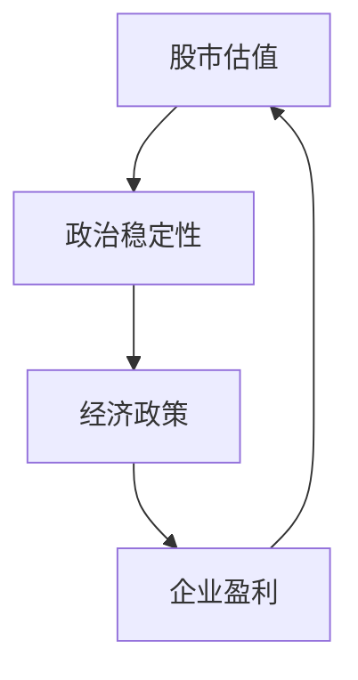
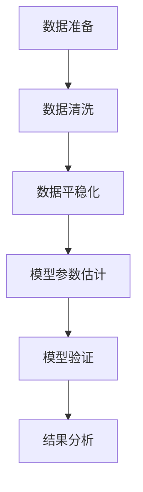
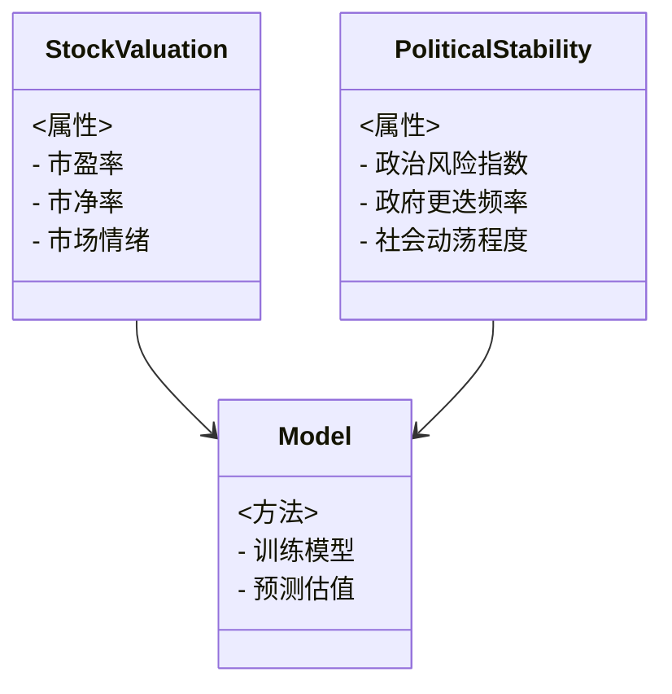
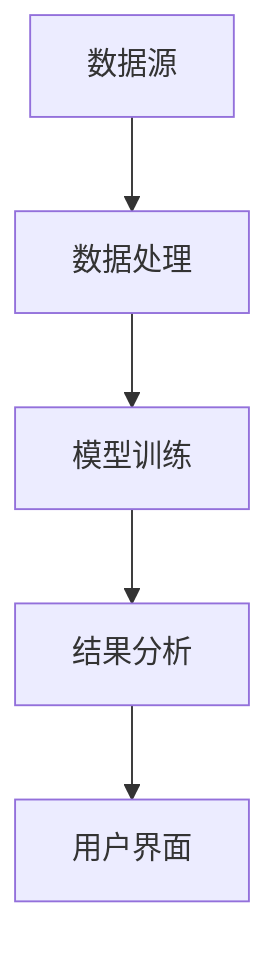
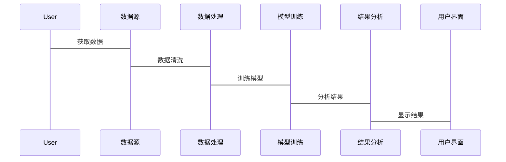

                 


# 《新兴市场股市估值与政治稳定性的关联》

> 关键词：新兴市场，股市估值，政治稳定性，时间序列分析，ARIMA模型

> 摘要：本文旨在探讨新兴市场股市估值与政治稳定性的关联。通过分析股市估值的核心指标、政治稳定性的定义与衡量，以及两者之间的相互作用，本文试图揭示政治稳定性对股市估值的直接影响和间接影响。基于时间序列分析的ARIMA模型，本文构建了一个量化分析框架，并通过实证分析验证了模型的有效性。本文还结合实际案例，详细讲解了如何将理论应用于实践，为投资者和政策制定者提供了有价值的参考。

---

# 第一部分: 背景介绍与核心概念

## 第1章: 背景介绍

### 1.1 问题背景

#### 1.1.1 新兴市场股市的特殊性  
新兴市场的股市往往具有较高的波动性和不确定性。与成熟市场相比，新兴市场的股市更容易受到政治、经济和社会因素的影响。这些市场的特点是：  
1. 市场规模较小，容易受到外部冲击。  
2. 投资者结构多元化，包括散户和机构投资者。  
3. 法律法规不够完善，市场透明度较低。  

#### 1.1.2 政治稳定性对经济的影响  
政治稳定性是影响一个国家或地区经济发展的重要因素。政治不稳定可能导致经济政策变化、外资撤离和市场信心下降，从而对股市估值产生重大影响。  

#### 1.1.3 研究的意义  
研究新兴市场股市估值与政治稳定性的关联，可以帮助投资者更好地理解市场波动的原因，从而做出更明智的投资决策。此外，这也可以为政策制定者提供参考，帮助他们制定更有效的经济政策。

### 1.2 问题描述

#### 1.2.1 股市估值的核心指标  
股市估值的核心指标包括：  
1. 市盈率（P/E）：股价与每股收益的比率。  
2. 市净率（P/B）：股价与每股净资产的比率。  
3. 市销率（P/S）：股价与每股收入的比率。  

#### 1.2.2 政治稳定性的定义与衡量  
政治稳定性可以定义为一个国家或地区政治环境的稳定程度。衡量政治稳定性的指标包括：  
1. 政治风险指数：由国际评级机构发布的指标。  
2. 政府更迭频率：政府更迭的频繁程度。  
3. 社会动荡程度：包括抗议、骚乱等事件的频率。  

#### 1.2.3 新兴市场中的特殊挑战  
新兴市场在政治稳定性方面面临特殊挑战，例如：  
1. 政治体制的不稳定性。  
2. 外部势力的干预。  
3. 经济政策的不确定性。  

### 1.3 问题解决

#### 1.3.1 研究目标的设定  
本研究旨在探索新兴市场股市估值与政治稳定性的关联，具体目标包括：  
1. 分析政治稳定性对股市估值的直接影响。  
2. 探讨经济政策在两者之间的中介作用。  
3. 提供实证分析以验证理论假设。  

#### 1.3.2 研究方法的选择  
本文采用时间序列分析方法，选择ARIMA模型作为主要工具。该方法适用于分析具有趋势和周期性的数据，能够捕捉到政治稳定性对股市估值的动态影响。  

#### 1.3.3 数据来源与处理  
数据来源包括：  
1. 股市估值数据：选取新兴市场的指数数据，如MSCI新兴市场指数。  
2. 政治稳定性数据：使用国际评级机构发布的政治风险指数。  
3. 数据处理：对数据进行清洗、标准化和平稳化处理，确保符合时间序列分析的要求。  

### 1.4 边界与外延

#### 1.4.1 研究范围的界定  
本研究仅关注新兴市场，不包括成熟市场。此外，本文主要分析政治稳定性对股市估值的影响，不涉及其他因素（如经济政策、市场情绪等）的影响。  

#### 1.4.2 相关概念的区分  
政治稳定性与经济政策、市场情绪等概念密切相关，但本文仅探讨政治稳定性对股市估值的直接影响。  

#### 1.4.3 可能的局限性  
由于数据的局限性，本文仅分析了部分新兴市场，未来研究可以扩展到更多市场。此外，本文仅考虑了政治稳定性的影响，未涉及其他因素的综合影响。  

### 1.5 核心要素组成

#### 1.5.1 股市估值的关键因素  
股市估值的关键因素包括：  
1. 企业盈利水平。  
2. 市场情绪。  
3. 利率水平。  

#### 1.5.2 政治稳定性的关键因素  
政治稳定性的关键因素包括：  
1. 政府更迭频率。  
2. 社会动荡程度。  
3. 政治风险指数。  

#### 1.5.3 两者之间的关联机制  
政治稳定性通过以下机制影响股市估值：  
1. 直接影响：政治不稳定可能导致股市估值下降。  
2. 间接影响：政治不稳定可能影响经济政策，从而影响股市估值。  

---

## 第2章: 核心概念与联系

### 2.1 股市估值的理论基础

#### 2.1.1 市盈率与市净率的计算  
市盈率（P/E）= 股价 / 每股收益  
市净率（P/B）= 股价 / 每股净资产  

#### 2.1.2 股东权益与企业价值的关系  
股东权益是企业价值的重要组成部分，企业价值=股东权益 + 债务价值。  

#### 2.1.3 市场情绪对估值的影响  
市场情绪可以通过投资者的行为反映出来，例如：  
1. 投资者信心指数。  
2. 交易量。  

### 2.2 政治稳定性的理论基础

#### 2.2.1 政治风险的定义与衡量  
政治风险是指政治不稳定对企业经营的影响，可以通过政治风险指数来衡量。  

#### 2.2.2 政治稳定性与经济政策的关系  
政治稳定性较高的国家，经济政策较为稳定，反之则容易出现政策波动。  

#### 2.2.3 政治事件对市场的影响  
政治事件（如政变、选举等）可能对股市产生短期或长期影响。  

### 2.3 两者之间的联系

#### 2.3.1 政治稳定性对股市估值的直接影响  
政治不稳定可能导致投资者信心下降，进而导致股市估值下降。  

#### 2.3.2 通过经济政策的中介作用  
政治不稳定可能导致经济政策变化，例如货币贬值或资本管制，从而影响股市估值。  

#### 2.3.3 市场情绪的桥梁作用  
政治稳定性通过影响市场情绪，间接影响股市估值。  

---

## 第3章: 核心概念对比与实体关系图

### 3.1 核心概念属性特征对比

| **属性**       | **股市估值**             | **政治稳定性**           |
|----------------|--------------------------|--------------------------|
| 定义           | 股市估值是市场对企业的定价。 | 政治稳定性是指政治环境的稳定程度。 |
| 核心指标       | 市盈率、市净率等         | 政治风险指数等           |
| 影响因素       | 企业盈利、市场情绪等     | 政治事件、政策变化等     |
| 测度方法       | 股票价格、指数数据       | 调查问卷、评级机构数据   |

### 3.2 实体关系图（Mermaid）



---

## 第4章: 算法原理讲解

### 4.1 算法选择与原理

#### 4.1.1 时间序列分析的选择  
时间序列分析适用于分析具有趋势和周期性的数据，能够捕捉到政治稳定性对股市估值的动态影响。  

#### 4.1.2 ARIMA模型的选择  
ARIMA（自回归积分滑动平均模型）是一种常用的时间序列分析方法，适用于非平稳数据。  

### 4.2 算法流程图（Mermaid）



### 4.3 Python代码实现

```python
from statsmodels.tsa.arima.model import ARIMA
import pandas as pd
import numpy as np

# 数据准备
data = pd.read_csv('emerging_markets.csv')
data = data['stock_valuation'].values

# 数据平稳化
diff_data = np.diff(data)

# 模型训练
model = ARIMA(diff_data, order=(5, 1, 0))
model_fit = model.fit()

# 模型预测
forecast = model_fit.forecast(steps=10)
```

### 4.4 数学模型与公式

#### 4.4.1 ARIMA模型公式  
ARIMA模型的数学公式为：  
$$ y_t = \phi_1 y_{t-1} + \phi_2 y_{t-2} + \theta_1 e_{t-1} + e_t $$  

其中，$y_t$ 是平稳化后的数据，$\phi_i$ 是自回归系数，$\theta_i$ 是滑动平均系数，$e_t$ 是误差项。  

#### 4.4.2 协方差与相关系数  
协方差公式：  
$$ \text{Cov}(X, Y) = E[(X - \mu_X)(Y - \mu_Y)] $$  

相关系数公式：  
$$ \rho_{XY} = \frac{\text{Cov}(X, Y)}{\sigma_X \sigma_Y} $$  

---

## 第5章: 系统分析与架构设计

### 5.1 问题场景介绍

#### 5.1.1 问题场景描述  
本文研究的问题场景是新兴市场股市估值与政治稳定性的关联。通过构建一个量化分析框架，我们希望能够揭示政治稳定性对股市估值的影响。  

#### 5.1.2 项目介绍  
本项目的目标是构建一个时间序列分析模型，用于预测新兴市场股市估值的变化。  

### 5.2 系统功能设计

#### 5.2.1 领域模型（Mermaid 类图）



#### 5.2.2 系统架构设计（Mermaid 架构图）



### 5.3 系统接口设计

#### 5.3.1 数据接口  
数据接口用于获取新兴市场股市估值和政治稳定性数据，数据格式为CSV。  

#### 5.3.2 模型接口  
模型接口用于调用ARIMA模型进行预测，返回预测结果。  

### 5.4 系统交互设计（Mermaid 序列图）



---

## 第6章: 项目实战

### 6.1 环境安装

#### 6.1.1 安装Python环境  
安装Python 3.8及以上版本，并安装以下库：  
1. statsmodels  
2. pandas  
3. numpy  

#### 6.1.2 安装开发工具  
安装Jupyter Notebook或其他代码编辑器。  

### 6.2 系统核心实现

#### 6.2.1 数据准备

```python
import pandas as pd

data = pd.read_csv('emerging_markets.csv')
print(data.head())
```

#### 6.2.2 数据处理

```python
from statsmodels.tsa.arima.model import ARIMA
import numpy as np

diff_data = np.diff(data['stock_valuation'])
model = ARIMA(diff_data, order=(5, 1, 0))
model_fit = model.fit()
```

#### 6.2.3 模型预测

```python
forecast = model_fit.forecast(steps=10)
print(forecast)
```

### 6.3 实际案例分析

#### 6.3.1 案例介绍  
以某新兴市场为例，分析政治稳定性对股市估值的影响。  

#### 6.3.2 数据分析  
通过ARIMA模型，分析政治稳定性对股市估值的动态影响。  

### 6.4 代码应用解读

#### 6.4.1 数据准备与清洗  
数据清洗包括处理缺失值、异常值等。  

#### 6.4.2 模型训练与验证  
通过训练数据验证模型的准确性。  

#### 6.4.3 结果分析与解读  
解读模型预测结果，分析政治稳定性对股市估值的影响。  

---

## 第7章: 最佳实践与总结

### 7.1 小结

#### 7.1.1 核心发现  
政治稳定性对新兴市场股市估值有显著影响，可以通过时间序列分析模型进行预测。  

#### 7.1.2 方法总结  
本文采用ARIMA模型，通过时间序列分析揭示了政治稳定性对股市估值的影响。  

### 7.2 注意事项

#### 7.2.1 数据质量  
数据质量对模型的准确性影响重大，需要确保数据的完整性和准确性。  

#### 7.2.2 模型选择  
选择合适的模型是关键，需要根据数据特征选择合适的分析方法。  

### 7.3 拓展阅读

#### 7.3.1 相关领域  
1. 时间序列分析的其他方法（如GARCH模型）。  
2. 政治稳定性对其他经济指标的影响。  

---

# 第三部分: 结论

## 第8章: 结论与展望

### 8.1 研究结论  
本文研究了新兴市场股市估值与政治稳定性的关联，揭示了政治稳定性对股市估值的直接影响和间接影响。  

### 8.2 未来展望  
未来研究可以进一步扩展到更多市场，并结合其他因素（如经济政策、市场情绪）进行综合分析。  

---

# 作者：AI天才研究院/AI Genius Institute & 禅与计算机程序设计艺术 /Zen And The Art of Computer Programming

