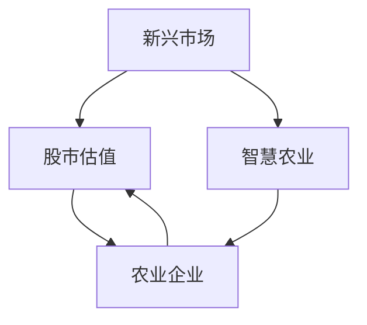
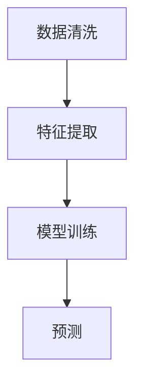
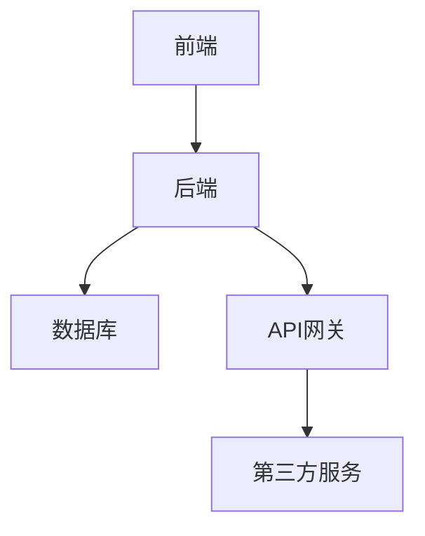

                 


```markdown
# 新兴市场股市估值与智慧农业产销对接平台的互动

> 关键词：新兴市场，股市估值，智慧农业，产销对接，互动关系

> 摘要：本文探讨新兴市场中股市估值与智慧农业产销对接平台之间的互动关系，通过分析数据处理、算法原理、系统设计和项目实战，揭示两者如何协同作用，为农业企业和投资者提供新的视角。

---

# 第一部分: 背景介绍与核心概念

## 第1章: 新兴市场股市估值与智慧农业产销对接平台的背景

### 1.1 问题背景
#### 1.1.1 新兴市场的经济特点与发展现状
新兴市场通常指那些经济增长迅速、金融市场逐渐成熟的国家。这些市场具有高波动性、高增长性和高风险性的特点。股市在新兴市场中扮演着重要角色，反映了经济的健康状况和企业的发展潜力。

#### 1.1.2 农业产销对接的痛点与挑战
在传统农业中，产销对接存在信息不对称、流通效率低、价格波动大等问题。农民和企业难以及时获取市场信息，导致生产与需求脱节，影响收益和效率。

#### 1.1.3 股市估值在新兴市场中的特殊性
与发达国家市场相比，新兴市场的股市估值受政策、经济波动和外部环境影响较大。投资者需要更精准的估值方法来评估企业的实际价值。

### 1.2 问题描述
#### 1.2.1 农业产销对接平台的核心问题
信息不对称导致生产与需求脱节，影响效率和收益。

#### 1.2.2 股市估值对农业企业的影响
股市波动直接影响企业的融资成本和投资决策，进而影响农业产销对接。

#### 1.2.3 互动关系的初步探讨
通过智慧农业平台，数据流可以优化生产，进而影响企业的业绩，反过来影响股市估值。

### 1.3 问题解决思路
#### 1.3.1 数据驱动的解决方案
利用大数据分析优化产销对接和企业运营，提升效率和透明度。

#### 1.3.2 技术赋能的实现路径
通过智慧农业平台，实现信息共享、精准营销和供应链优化。

#### 1.3.3 互动机制的设计框架
建立数据流和信息反馈机制，实现产销与资本市场的动态互动。

### 1.4 边界与外延
#### 1.4.1 新兴市场的边界条件
关注特定国家或地区的市场特征，避免全球化视角。

#### 1.4.2 智慧农业的定义域扩展
从单纯的数据收集扩展到智能决策支持。

#### 1.4.3 股市估值的适用范围
聚焦于农业企业的估值，而非整个市场的波动。

### 1.5 概念结构与核心要素
#### 1.5.1 核心概念的层次结构
- 新兴市场
- 股市估值
- 智慧农业
- 产销对接平台

#### 1.5.2 核心要素的对比分析
| 要素 | 特性         | 互动关系     |
|------|--------------|--------------|
| 股市估值 | 数据驱动、波动性高 | 受产销效率影响，影响企业融资 |
| 智慧农业 | 信息共享、精准对接 | 提高效率，优化企业业绩 |

#### 1.5.3 概念间的关系图


---

# 第二部分: 核心概念与联系

## 第2章: 核心概念原理与对比分析

### 2.1 核心概念原理
#### 2.1.1 股市估值的计算方法
股市估值通常采用市盈率（P/E）、市净率（P/B）等指标，结合企业财务数据和市场预期进行评估。

#### 2.1.2 智慧农业产销对接的实现机制
通过平台收集和分析供需信息，优化资源配置，降低交易成本。

#### 2.1.3 互动关系的核心原理
数据流从产销对接平台流向股市估值，影响企业的市场表现。

### 2.2 概念属性特征对比
| 属性       | 股市估值               | 智慧农业产销对接平台       |
|------------|-----------------------|---------------------------|
| 数据来源    | 公司财报、市场交易数据 | 农产品供需信息、交易数据 |
| 主要目标    | 评估企业价值           | 优化产销效率               |
| 技术支撑    | 量化分析、机器学习     | 数据挖掘、实时通信         |

### 2.3 ER实体关系图
```mermaid
erd
    章节3
    章节3
```

---

# 第三部分: 算法原理讲解

## 第3章: 数据处理与分析算法

### 3.1 数据处理流程
#### 3.1.1 数据清洗与预处理
去除重复数据、处理缺失值、标准化格式。

#### 3.1.2 数据特征提取
提取关键特征，如产量、价格、交易量等。

#### 3.1.3 数据标准化与归一化
使用标准化方法（z-score）或归一化方法（min-max）处理数据。

### 3.2 算法原理
#### 3.2.1 线性回归模型
预测变量与自变量之间存在线性关系，用于趋势分析。

#### 3.2.2 时间序列分析
分析数据的时序特性，捕捉趋势和周期性。

#### 3.2.3 机器学习算法的应用
使用随机森林、支持向量机等算法进行分类和预测。

### 3.3 算法实现
#### 3.3.1 Python代码实现
```python
import pandas as pd
from sklearn.linear_model import LinearRegression

# 数据处理
data = pd.read_csv('data.csv')
X = data[['feature1', 'feature2']]
y = data['target']

# 线性回归模型
model = LinearRegression()
model.fit(X, y)
```

#### 3.3.2 算法流程的Mermaid图


#### 3.3.3 数学模型和公式
线性回归模型：$$y = \beta_0 + \beta_1x + \epsilon$$

---

## 第4章: 算法实现与案例分析

### 4.1 算法实现
#### 4.1.1 环境安装
安装Python、Pandas、Scikit-learn等库。

#### 4.1.2 核心代码
```python
import pandas as pd
from sklearn.metrics import mean_squared_error

# 加载数据
data = pd.read_csv('data.csv')

# 数据分割
train_data = data[:700]
test_data = data[700:]

# 训练模型
model.fit(train_data[['feature1', 'feature2']], train_data['target'])

# 预测与评估
预测结果 = model.predict(test_data[['feature1', 'feature2']])
评估指标 = mean_squared_error(test_data['target'], 预测结果)
```

### 4.2 案例分析
#### 4.2.1 数据预处理
处理缺失值和异常值，确保数据质量。

#### 4.2.2 模型训练与评估
使用训练数据训练模型，用测试数据评估性能。

#### 4.2.3 结果解读
分析预测结果与实际值的差异，优化模型参数。

### 4.3 总结与注意事项
- 数据质量直接影响模型性能。
- 模型选择需根据具体问题调整。

---

# 第四部分: 系统分析与架构设计

## 第5章: 系统分析与架构设计

### 5.1 问题场景介绍
新兴市场中的农业企业面临产销对接困难和股市估值不准确的问题。

### 5.2 系统功能设计
#### 5.2.1 领域模型
```mermaid
classDiagram
    class 农业企业 {
        名称：String
        收入：Float
        成本：Float
    }
    class 产销平台 {
        供应信息：List
        需求信息：List
    }
    农业企业 --> 产销平台：提交数据
    产销平台 --> 农业企业：提供反馈
```

#### 5.2.2 系统架构设计


### 5.3 系统接口设计
定义API接口，实现数据的上传、查询和反馈。

### 5.4 系统交互设计
```mermaid
sequenceDiagram
    农业企业->产销平台：提交数据
    产销平台->数据库：存储数据
    产销平台->农业企业：返回反馈
```

---

# 第五部分: 项目实战

## 第6章: 项目实战与案例分析

### 6.1 环境安装
安装Python、Flask、MySQL等工具。

### 6.2 核心代码实现
```python
from flask import Flask, request, jsonify

app = Flask(__name__)

@app.route('/api', methods=['POST'])
def process_data():
    data = request.json
    # 处理数据
    return jsonify({'result': 'success'})

if __name__ == '__main__':
    app.run(debug=True)
```

### 6.3 案例分析
分析实际案例，展示平台如何优化产销对接和提升股市估值。

### 6.4 总结与经验分享
总结项目经验，提出改进建议。

---

# 第六部分: 结论与展望

## 第7章: 结论与展望

### 7.1 结论
本文探讨了新兴市场中股市估值与智慧农业产销对接平台的互动关系，提出了数据驱动的解决方案，为农业企业优化产销和提升估值提供了新思路。

### 7.2 未来展望
进一步研究动态数据流和多模型融合，提升预测精度和系统稳定性。

---

# 作者信息

作者：AI天才研究院/AI Genius Institute & 禅与计算机程序设计艺术 /Zen And The Art of Computer Programming
```

