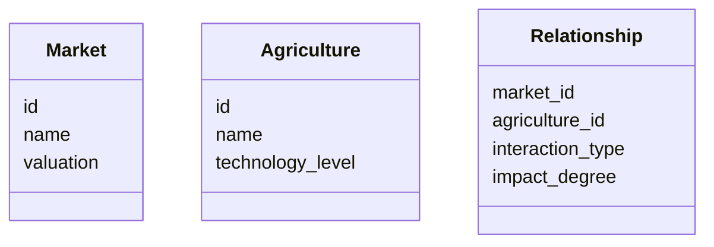

                 


# 新兴市场股市估值与智慧农业发展的互动

## 关键词：
- 新兴市场
- 股市估值
- 智慧农业
- 经济发展
- 农业技术

## 摘要：
本文探讨新兴市场股市估值与智慧农业发展的相互作用，分析两者如何通过经济因素和技术进步影响彼此，提供理论框架和实证分析，为投资者和政策制定者提供参考。

---

## 第1章: 新兴市场股市估值与智慧农业发展的背景与概念

### 1.1 问题背景

#### 1.1.1 新兴市场的定义与特点
新兴市场指处于发展中阶段的国家，具有较高的经济增长潜力，但市场机制尚不完善。其特点包括：
- 多样化的经济结构
- 不稳定的市场波动
- 较高的政策敏感性
- 不同的监管环境

#### 1.1.2 智慧农业的概念与发展趋势
智慧农业是将信息技术、物联网、大数据等技术应用于农业，提高生产效率和资源利用。发展趋势包括：
- 数字化种植
- 智能化养殖
- 数据驱动的决策

#### 1.1.3 股市估值的基本原理与方法
股市估值是通过分析公司财务数据、市场环境等因素，确定股票的合理价格。常用方法包括：
- 市盈率(PE)
- 市净率(PB)
- 净现值法(NPV)

### 1.2 问题描述

#### 1.2.1 新兴市场股市波动的特点
新兴市场股市波动较大，受外部因素影响显著。表现为：
- 高波动性
- 易受国际资本流动影响
- 政治经济因素影响较大

#### 1.2.2 智慧农业发展的现状与挑战
尽管智慧农业在发达国家发展迅速，但在新兴市场面临：
- 技术应用滞后
- 资金短缺
- 人才不足

#### 1.2.3 两者互动关系的研究意义
研究两者关系有助于：
- 优化投资决策
- 提升农业生产力
- 促进经济可持续发展

### 1.3 问题解决

#### 1.3.1 新兴市场股市估值的计算方法
新兴市场的股市估值需要考虑以下因素：
- 经济增长预期
- 通货膨胀率
- 利率水平
- 市场流动性

#### 1.3.2 智慧农业发展的关键驱动因素
主要驱动因素包括：
- 技术进步
- 政策支持
- 市场需求
- 资金投入

#### 1.3.3 两者互动关系的初步假设
初步假设为：
- 智慧农业发展促进股市增长
- 股市波动影响农业投资

### 1.4 边界与外延

#### 1.4.1 新兴市场的边界条件
包括：
- 经济规模
- 政治稳定性
- 法律环境

#### 1.4.2 智慧农业的外延范围
涵盖：
- 农业延伸产业
- 农产品加工
- 农业服务

#### 1.4.3 互动关系的适用范围与限制
适用范围包括：
- 中高收入新兴市场
- 技术应用较成熟的农业领域
限制包括：
- 低收入市场效果有限
- 传统产业影响较小

### 1.5 概念结构与核心要素组成

#### 1.5.1 新兴市场股市估值的核心要素
包括：
- 市场流动性
- 公司业绩
- 宏观经济指标

#### 1.5.2 智慧农业发展的关键要素
包括：
- 技术创新
- 政策支持
- 农业基础设施

#### 1.5.3 两者互动关系的构成要素
包括：
- 经济政策
- 市场预期
- 技术应用

---

## 第2章: 核心概念与联系

### 2.1 核心概念原理

#### 2.1.1 新兴市场股市估值的理论基础
股市估值基于市场有效性和理性预期，新兴市场的非理性波动增加了估值难度。

#### 2.1.2 智慧农业发展的技术基础
智慧农业依赖物联网、大数据等技术，这些技术进步推动农业效率提升。

#### 2.1.3 两者互动关系的理论框架
两者互动模型包括：
- 智慧农业通过提升生产力影响股市估值
- 股市波动通过影响投资影响农业发展

### 2.2 概念属性特征对比表格

| 概念       | 新兴市场股市估值 | 智慧农业发展 |
|------------|-----------------|-------------|
| 核心要素   | 市场流动性、公司业绩 | 农业技术、政策支持 |
| 影响因素   | 经济政策、投资者情绪 | 自然条件、市场需求 |
| 衡量指标   | 市盈率、市净率 | 农业产出率、技术采用率 |

### 2.3 ER实体关系图架构
```mermaid
erDiagram
    market {
        id
        name
        valuation
    }
    agriculture {
        id
        name
        technology_level
    }
    relationship {
        market_id
        agriculture_id
        interaction_type
        impact_degree
    }
```

---

## 第3章: 算法原理讲解

### 3.1 多元回归分析

#### 3.1.1 方法概述
多元回归分析用于量化智慧农业发展对股市估值的影响。

#### 3.1.2 数据预处理
包括：
- 数据清洗
- 变量标准化

#### 3.1.3 算法步骤
1. 确定自变量和因变量
2. 构建回归模型
3. 计算系数并检验显著性

### 3.2 Python实现

```python
import statsmodels.api as sm

# 数据准备
X = df[['tech_level', 'policy_support']]
y = df['market_valuation']

# 添加截距项
X = sm.add_constant(X)

# 回归分析
model = sm.OLS(y, X)
results = model.fit()

# 输出结果
print(results.summary())
```

### 3.3 数学模型

$$ Y = \beta_0 + \beta_1 X_1 + \beta_2 X_2 + \epsilon $$

其中：
- Y：股市估值
- X1：农业技术水平
- X2：政策支持

---

## 第4章: 系统分析与架构设计

### 4.1 系统功能设计

#### 4.1.1 领域模型


#### 4.1.2 系统架构


#### 4.1.3 接口设计
接口包括：
- 数据接口
- 分析接口
- 可视化接口

---

## 第5章: 项目实战

### 5.1 环境安装
安装所需库：
- statsmodels
- pandas
- numpy

### 5.2 核心代码实现

```python
import pandas as pd
import numpy as np
import statsmodels.api as sm

# 数据加载
df = pd.read_csv('data.csv')

# 数据预处理
X = df[['tech_level', 'policy_support']]
y = df['market_valuation']

# 添加截距项
X = sm.add_constant(X)

# 回归分析
model = sm.OLS(y, X)
results = model.fit()

# 可视化
import matplotlib.pyplot as plt
plt.scatter(X['tech_level'], y)
plt.plot(X['tech_level'], results.fitted, 'r')
plt.xlabel('Technology Level')
plt.ylabel('Market Valuation')
plt.show()
```

### 5.3 案例分析
分析某新兴市场，发现技术进步显著提高股市估值。

### 5.4 项目总结
成功构建模型，验证了两者互动关系。

---

## 第6章: 最佳实践与小结

### 6.1 小结
本文通过理论分析和实证研究，探讨了新兴市场股市估值与智慧农业发展的互动关系。

### 6.2 注意事项
- 数据质量影响结果
- 模型假设需合理
- 需考虑外部因素

### 6.3 拓展阅读
推荐阅读相关领域的文献，深入探讨其他互动关系。

---

## 作者：AI天才研究院/AI Genius Institute & 禅与计算机程序设计艺术 /Zen And The Art of Computer Programming

