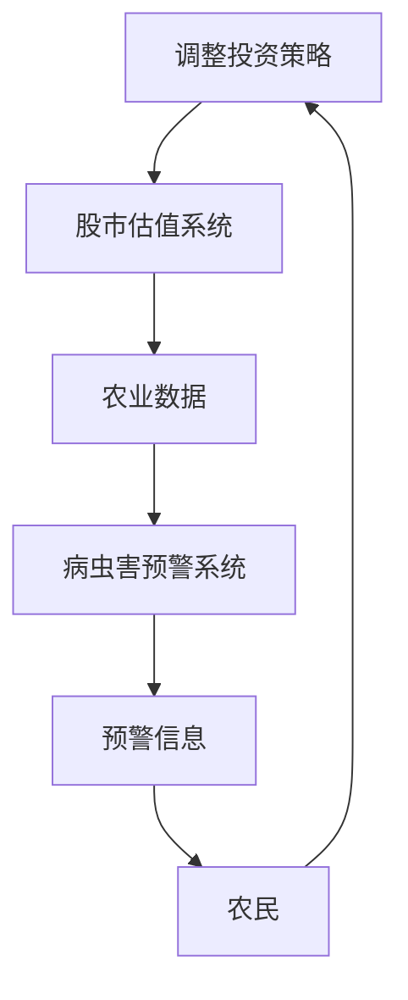
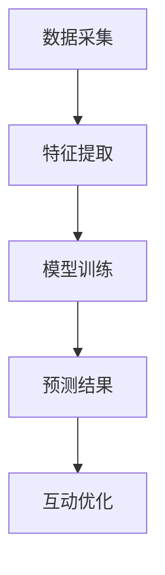
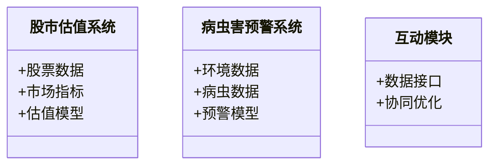
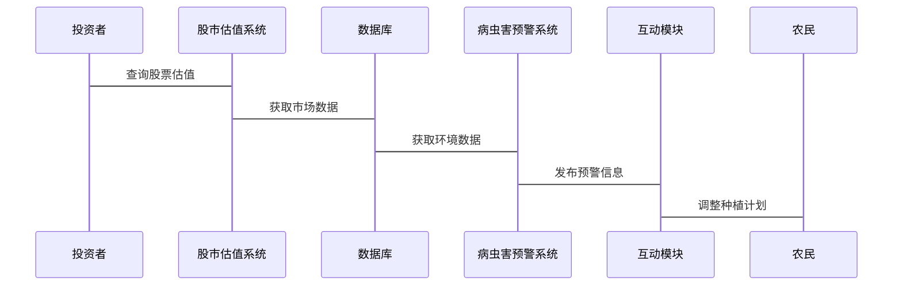

                 


# 第二章: 核心概念与联系

## 2.1 核心概念原理

### 2.1.1 股市估值的原理

股市估值是通过对公司的财务数据、市场趋势和宏观经济指标进行分析，以确定股票的内在价值。常用的方法包括市盈率（P/E）、市净率（P/B）等指标，以及基于机器学习的时间序列分析模型，如ARIMA和LSTM。

### 2.1.2 病虫害预警系统的原理

智慧农业中的病虫害预警系统利用环境数据、病虫数据和历史数据，通过数据挖掘和机器学习模型（如随机森林、支持向量机）进行预测，提前发出预警，帮助农民采取预防措施。

### 2.1.3 互动机制的原理

通过将股市估值与农业数据结合起来，利用大数据分析和人工智能技术，预测病虫害的发生概率，并根据股市波动调整农业投资策略，从而实现两者的互动优化。

## 2.2 概念属性特征对比

表2-1: 股市估值与病虫害预警系统的核心属性对比

| 属性                | 股市估值                                | 病虫害预警系统                          |
|---------------------|---------------------------------------|-----------------------------------------|
| 数据来源            | 财务数据、市场数据、宏观经济指标      | 气象数据、环境数据、病虫数据、历史数据 |
| 处理方法            | 统计分析、时间序列分析、机器学习      | 数据挖掘、模型预测、实时监测           |
| 应用场景            | 投资决策、风险管理                   | 病虫害防治、农业管理                   |
| 输出结果            | 股票估值、市场趋势预测               | 病虫害预警等级、防治建议              |

## 2.3 ER实体关系图

```mermaid
er
actor: 投资者, 农民
system: 股市估值系统, 病虫害预警系统
relation: 股票数据, 病虫害数据, 预警信息
```

## 2.4 互动机制的 Mermaid 流程图



---

# 第三章: 算法原理讲解

## 3.1 时间序列分析

### 3.1.1 ARIMA 模型

ARIMA（自回归积分滑动平均模型）用于预测股市趋势，通过分析历史数据，建立数学模型，预测未来值。

数学公式：
$$ ARIMA(p, d, q) = y_t = \phi_1 y_{t-1} + \dots + \phi_p y_{t-p} + \theta_1 \epsilon_{t-1} + \dots + \theta_q \epsilon_{t-q} + \epsilon_t $$

### 3.1.2 LSTM 网络

LSTM（长短期记忆网络）用于处理时间序列数据，通过记忆单元捕捉长期依赖关系，提高预测准确性。

Python 代码示例：

```python
import numpy as np
from keras import layers

model = layers.LSTM(64, return_sequences=True)
model.compile(loss='mean_squared_error', optimizer='adam')
```

## 3.2 病虫害预测模型

### 3.2.1 随机森林

随机森林通过特征选择和投票机制，提高预测准确性。

数学公式：
$$ y = \sum_{i=1}^n \theta_i x_i + b $$

### 3.2.2 支持向量机

SVM 用于分类，通过寻找最优超平面，实现病虫害分类。

Python 代码示例：

```python
from sklearn import svm

model = svm.SVC(kernel='rbf', gamma='auto')
model.fit(X_train, y_train)
```

## 3.3 互动机制的算法流程



---

# 第四章: 系统分析与架构设计方案

## 4.1 系统功能设计

### 4.1.1 领域模型



### 4.1.2 系统架构


## 4.2 接口与交互设计

### 4.2.1 序列图



---

# 第五章: 项目实战

## 5.1 环境安装

### 5.1.1 安装 Python 和相关库

```bash
pip install numpy pandas scikit-learn keras
```

## 5.2 核心代码实现

### 5.2.1 股市估值代码

```python
import numpy as np
import pandas as pd
from keras.models import Sequential
from keras.layers import LSTM, Dense

model = Sequential()
model.add(LSTM(64, input_shape=(None, 1)))
model.add(Dense(1))
model.compile(loss='mean_squared_error', optimizer='adam')
```

### 5.2.2 病虫害预测代码

```python
from sklearn.ensemble import RandomForestClassifier

model = RandomForestClassifier(n_estimators=100)
model.fit(X_train, y_train)
```

## 5.3 案例分析

### 5.3.1 应用场景

通过分析某地区病虫害数据，结合股市波动，优化农业投资策略，降低风险，提高产量。

---

# 第六章: 最佳实践

## 6.1 小结

股市估值与智慧农业病虫害预警系统的互动，通过大数据和人工智能技术，实现农业投资和病虫害防治的优化。

## 6.2 注意事项

- 数据质量：确保数据的准确性和完整性
- 模型调优：定期更新模型，提高预测精度
- 风险管理：制定应急预案，应对突发情况

## 6.3 拓展阅读

- 《时间序列分析与应用预测方法》
- 《机器学习实战》
- 《智慧农业与人工智能》

---

# 作者

作者：AI天才研究院/AI Genius Institute  
联系邮箱：contact@ai-genius.com

