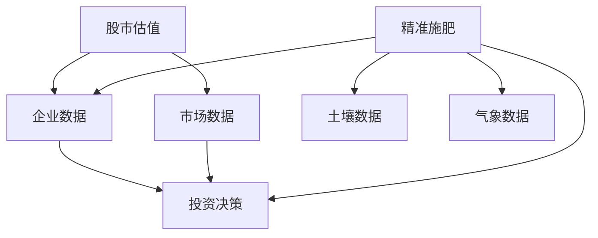

                 

# 第二章: 核心概念与联系

## 2.1 股市估值的核心概念与原理

### 2.1.1 股市估值的基本原理

股市估值是通过对企业的财务数据、市场状况和行业趋势进行分析，以确定其股票的合理价格。常用的方法包括市盈率（P/E）、市净率（P/B）、股息率等。市盈率反映了市场对公司未来盈利能力的预期，市净率则关注资产的实际价值。新兴市场由于信息不透明、波动性大，估值更具挑战性。

### 2.1.2 新兴市场的特点与挑战

新兴市场通常具有高增长潜力，但同时也面临政策不稳定性、数据不完整等挑战。这些因素会影响股市估值的准确性，要求投资者更加依赖技术创新和数据驱动的方法。

### 2.1.3 股市估值在经济中的作用

股市估值不仅影响个人投资决策，还反映了整体经济状况，为企业融资提供支持，促进资本流动和资源优化配置。

## 2.2 智慧农业精准施肥的核心概念与原理

### 2.2.1 精准施肥的定义与目标

精准施肥通过传感器、无人机等技术，收集土壤、气候、作物生长阶段等数据，制定最佳施肥方案，提高肥料利用率，减少环境影响。

### 2.2.2 精准施肥的关键技术与工具

主要技术包括土壤传感器监测、气象数据采集、无人机遥感、农业知识图谱和决策支持系统。这些技术帮助农民实时获取数据，优化施肥策略。

### 2.2.3 农业数据的采集与分析

精准施肥依赖于多源数据的采集和分析，包括土壤pH值、温度、湿度、光照等。这些数据通过物联网设备实时传输，利用机器学习模型进行分析，生成施肥建议。

## 2.3 股市估值与精准施肥的联系

### 2.3.1 数据驱动的互动机制

精准施肥产生的农业数据可以用于评估企业的生产效率和成本控制能力，进而影响其股票估值。例如，采用精准施肥技术的企业可能表现出更高的盈利能力和可持续发展性，吸引投资者关注。

### 2.3.2 农业技术对股市的影响

农业科技的进步，如精准施肥技术的推广，会提高农业产量和质量，降低生产成本，从而影响农产品价格和相关上市公司的业绩。这些变化会反映在股市估值中，影响投资者决策。

### 2.3.3 股市资金对农业发展的支持

股市为农业科技公司提供融资渠道，支持技术创新和推广。例如，投资于精准施肥技术的企业可能获得更高的市场估值，吸引更多投资，促进农业技术的进一步发展。

## 2.4 核心概念对比与ER实体关系图

### 2.4.1 核心概念属性特征对比表

| 特性          | 股市估值                  | 精准施肥                  |
|---------------|--------------------------|---------------------------|
| 数据来源      | 公司财务数据、市场数据    | 土壤、气候、作物数据      |
| 目标          | 确定股票合理价格          | 优化施肥方案              |
| 技术手段      | 机器学习、时间序列分析    | 物联网、传感器、决策支持系统 |
| 影响因素      | 利润率、行业趋势          | 土壤条件、天气、作物阶段   |

### 2.4.2 实体关系图（Mermaid）

### 2.4.3 ER实体关系图的解释

在上述图中，股市估值（A）依赖企业数据（B）和市场数据（C），这些数据共同影响投资决策（G）。同时，精准施肥（D）依赖企业数据（B）、土壤数据（E）和气象数据（F），并同样影响投资决策（G）。这表明股市估值和精准施肥在数据源和决策影响上存在交集，体现了两者的互动关系。

## 2.5 本章小结

### 2.5.1 核心概念回顾

通过本章，我们了解了股市估值的基本原理、新兴市场的挑战，以及智慧农业精准施肥的技术和目标。我们还探讨了两者之间的互动机制，强调数据驱动在连接股市和农业中的关键作用。

### 2.5.2 互动机制的初步框架

我们提出了数据驱动的互动机制，解释了农业技术如何影响股市，以及股市资金如何支持农业发展。通过对比表和ER图，明确了两者在数据源、目标和技术手段上的联系。

### 2.5.3 下一章的铺垫

下一章将深入探讨股市估值与精准施肥的算法原理和数学模型，结合具体的机器学习方法和优化算法，进一步分析两者的互动关系。

