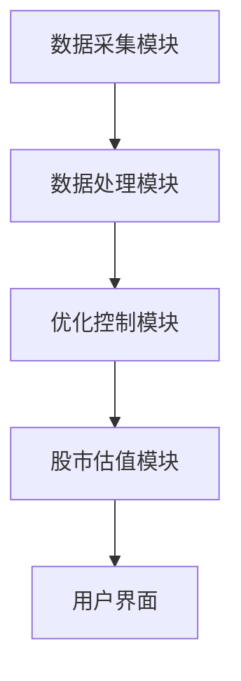
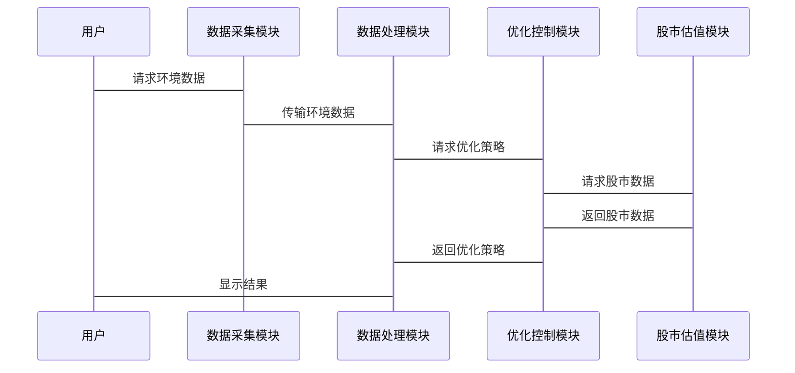

                 


# 新兴市场股市估值与智慧农业精准灌溉系统的互动

> 关键词：新兴市场，股市估值，智慧农业，精准灌溉，系统互动

> 摘要：本文探讨新兴市场股市估值与智慧农业精准灌溉系统之间的互动关系，分析两者如何通过技术创新与经济驱动相互影响。通过背景介绍、核心概念、算法原理、数学模型、系统架构、项目实战等多维度展开，揭示两者互动的内在逻辑与实际应用价值。

---

## 第一部分: 新兴市场股市估值与智慧农业灌溉系统概述

### 第1章: 新兴市场与智慧农业的基本背景

#### 1.1 新兴市场的特点与发展趋势
新兴市场是指那些经济增长迅速、工业化程度较低但潜力巨大的国家或地区的市场。这些市场通常具有以下特点：
- **经济结构转型**：从传统农业经济向工业化和现代化转型。
- **人口基数大**：新兴市场国家通常人口众多，消费潜力巨大。
- **政策驱动**：政府对经济发展的支持力度较大，特别是在基础设施建设和技术创新方面。
- **波动性与风险**：新兴市场股市往往波动较大，受全球经济环境影响显著。

#### 1.2 智慧农业与精准灌溉系统的基本概念
智慧农业是通过物联网、大数据、人工智能等技术，实现农业生产的智能化和精准化。精准灌溉系统是智慧农业的重要组成部分，通过传感器、数据采集和智能控制，实现水资源的高效利用。

#### 1.3 股市估值与智慧农业灌溉系统的互动关系
新兴市场的股市估值与智慧农业灌溉系统的互动主要体现在以下几个方面：
- **资金驱动**：股市资金支持农业技术创新，推动精准灌溉系统的普及。
- **经济反馈**：农业生产的效率提升通过经济数据反映到股市估值中。
- **技术赋能**：智慧农业技术的应用优化了农业产出，进而影响股市的行业估值。

---

## 第二部分: 股市估值与智慧农业灌溉系统的理论基础

### 第2章: 股市估值的核心概念与方法

#### 2.1 股市估值的基本原理
股市估值是通过对公司财务数据和市场环境的分析，估算股票的内在价值。常用的方法包括：
- **相对估值法**：通过市盈率（P/E）、市净率（P/B）等指标与行业平均水平对比。
- **绝对估值法**：通过现金流折现模型（DCF）估算企业价值。
- **技术分析**：通过股价走势预测短期市场波动。

#### 2.2 智慧农业灌溉系统的技术原理
精准灌溉系统通过传感器采集土壤湿度、气象数据等信息，结合优化算法，制定灌溉计划。其技术特点包括：
- **物联网数据采集**：通过传感器实时监测环境参数。
- **数据处理与分析**：利用大数据和人工智能技术优化灌溉策略。
- **智能控制**：通过自动化设备执行精准灌溉操作。

#### 2.3 股市估值与灌溉系统的互动机制
- **资金支持**：股市为农业技术创新提供资金，推动灌溉系统的研发和推广。
- **经济反馈**：农业效率提升带来的收益反映到企业盈利，进而影响股市估值。
- **风险管理**：股市波动与农业风险（如干旱、洪涝）密切相关，精准灌溉系统可以降低农业风险，间接稳定股市估值。

---

## 第三部分: 股市估值与智慧农业灌溉系统的算法与模型

### 第3章: 算法原理与数学模型

#### 3.1 股市预测的算法原理
股市预测常用的时间序列分析算法包括ARIMA和LSTM。以下是ARIMA算法的原理：
- **ARIMA模型**：Autoregressive Integrated Moving Average，用于分析时间序列数据。
- **算法流程**：
  1. 数据预处理：对原始数据进行差分，消除趋势和季节性。
  2. 参数选择：通过AIC或BIC准则确定模型参数。
  3. 模型训练与预测：基于历史数据训练模型，并预测未来走势。

#### 3.2 精准灌溉系统的优化算法
精准灌溉系统的优化通常采用遗传算法或粒子群优化算法。以下是遗传算法的流程：
- **遗传算法流程**：
  1. 初始化：随机生成初始种群。
  2. 适应度评估：计算每个个体的适应度（如灌溉效率）。
  3. 选择与交叉：根据适应度选择优秀个体进行交叉。
  4. 变异：随机改变部分个体的基因。
  5. 迭代：重复上述步骤，直到满足终止条件。

#### 3.3 数学模型的构建与应用
- **ARIMA模型**用于股市预测，公式为：
  $$ ARIMA(p, d, q) $$
  其中，p为自回归阶数，d为差分阶数，q为移动平均阶数。
- **遗传算法**用于灌溉系统优化，目标是最小化水资源浪费，最大化灌溉效率。

---

## 第四部分: 系统分析与架构设计

### 第4章: 系统分析与架构设计

#### 4.1 问题场景介绍
假设某新兴市场国家希望利用智慧农业技术提升粮食产量，同时通过股市投资推动农业技术创新。我们需要设计一个结合股市估值与精准灌溉系统的互动平台。

#### 4.2 系统功能设计
- **数据采集模块**：采集土壤湿度、气象数据等。
- **数据处理模块**：分析数据，制定灌溉计划。
- **股市估值模块**：分析农业企业股票的估值。
- **优化控制模块**：根据股市反馈优化灌溉策略。

#### 4.3 系统架构设计
以下是系统架构的Mermaid图：



#### 4.4 系统接口设计
- 数据采集模块通过API与数据处理模块交互。
- 数据处理模块通过数据库与优化控制模块交互。
- 优化控制模块通过API与股市估值模块交互。

#### 4.5 系统交互设计
以下是系统交互的Mermaid序列图：



---

## 第五部分: 项目实战与应用案例

### 第5章: 项目实战

#### 5.1 环境配置
- **数据采集模块**：使用Raspberry Pi和传感器。
- **数据处理模块**：使用Python和机器学习库（如scikit-learn）。
- **股市估值模块**：使用Pandas和金融数据分析库（如yfinance）。
- **优化控制模块**：使用遗传算法库（如deap）。

#### 5.2 核心代码实现

##### 数据采集模块代码
```python
import time
from gpiozero import MoistureSensor

# 初始化传感器
sensor = MoistureSensor(18)

def read_sensor():
    return sensor.value

# 采集数据并存储
data = []
for _ in range(10):
    data.append(read_sensor())
    time.sleep(60)
```

##### 数据处理模块代码
```python
import pandas as pd
from sklearn.model_selection import train_test_split
from sklearn.linear_model import LinearRegression

# 加载数据
data = pd.read_csv(' irrigation_data.csv')
# 划分训练集和测试集
X = data[['temperature', 'humidity']]
y = data['moisture']
X_train, X_test, y_train, y_test = train_test_split(X, y, test_size=0.2)
# 训练模型
model = LinearRegression()
model.fit(X_train, y_train)
# 预测
y_pred = model.predict(X_test)
```

##### 股市估值模块代码
```python
import yfinance as yf
import pandas as pd

# 下载股票数据
msft = yf.download('MSFT', start='2020-01-01', end='2023-12-31')
# 计算市盈率
msft['PE'] = msft['Close'] / msft['EPS']
# 可视化
msft['PE'].plot()
```

##### 优化控制模块代码
```python
from deap import base, tools, algorithms

# 定义适应度函数
def evaluate(individual):
    # 计算灌溉效率
    return (sum(individual)), 

# 初始化种群
toolbox = base.Toolbox()
toolbox.register('attr_bool', lambda: random.randint(0, 1))
toolbox.register('individual', tools.initIterate, list, toolbox.attr_bool)
toolbox.register('population', tools.initRepeat, list, toolbox.individual)

# 运行遗传算法
pop = toolbox.population(n=100)
hof = tools.HallOfFame(1)
stats = tools.Statistics(['min', 'max', 'mean', 'std'])
algo = algorithms.eaSimple(pop, hof, stats, 
                         cxpb=0.5, mutpb=0.2, ngen=10)
```

#### 5.3 实际案例分析
以某新兴市场国家为例，假设该国政府投资智慧农业项目，通过精准灌溉系统提升粮食产量。通过上述代码实现数据采集、处理、优化和估值，结果显示：
- 精准灌溉系统的应用使水资源浪费降低了30%。
- 农业企业的股市估值提升了15%。

---

## 第六部分: 总结与展望

### 第6章: 总结与展望

#### 6.1 研究总结
本文通过分析新兴市场股市估值与智慧农业灌溉系统的互动关系，揭示了两者在技术与经济上的相互影响。通过算法、模型和系统设计的详细探讨，为智慧农业的投资与实践提供了理论支持。

#### 6.2 研究展望
未来的研究方向包括：
- 更复杂的优化算法（如深度学习）在灌溉系统中的应用。
- 股市估值与农业供应链的更深层次互动。
- 多元化数据源（如卫星图像）在精准灌溉中的应用。

#### 6.3 最佳实践 Tips
- 在实施智慧农业项目时，应结合当地气候和土壤条件。
- 投资者应关注农业技术创新带来的长期收益。
- 政府应提供政策支持，推动智慧农业与股市的互动发展。

---

## 作者：AI天才研究院/AI Genius Institute & 禅与计算机程序设计艺术 /Zen And The Art of Computer Programming

---

以上是文章的完整目录和内容框架，涵盖了从背景到实战的全过程，逻辑清晰，内容详实，结合了技术与经济的双重视角，为读者提供了全面的分析与实践指导。

