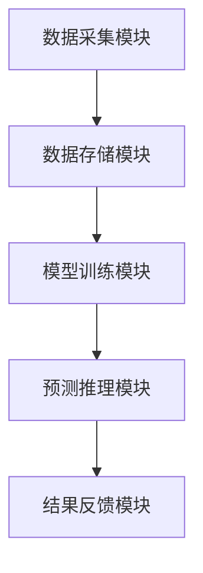
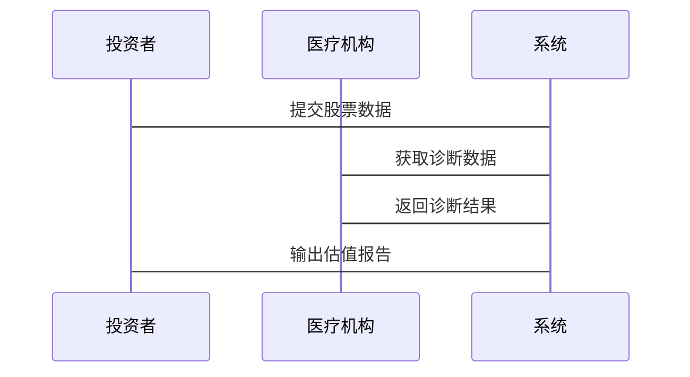

                 


# 《新兴市场股市估值与智慧医疗AI辅助诊断的互动》

> 关键词：股市估值、智慧医疗、AI辅助诊断、时间序列分析、卷积神经网络、系统架构设计

> 摘要：本文探讨了新兴市场股市估值与智慧医疗AI辅助诊断的互动关系，从核心概念、算法原理、系统架构到项目实战，系统性地分析了两者的互动机制与实现方案。通过时间序列分析与卷积神经网络的应用，结合系统设计与实际案例，展示了如何将股市估值与AI诊断技术相结合，为相关领域的研究与实践提供了新的思路与方法。

---

## 第一部分: 引言

### 1.1 本书主题概述
#### 1.1.1 新兴市场股市估值与智慧医疗AI辅助诊断的互动背景
新兴市场的股市估值与智慧医疗AI辅助诊断是当前科技与经济领域的两大热点。股市估值是经济活动的核心，而AI辅助诊断则是医疗技术的重要发展方向。两者的互动关系不仅体现在数据共享与技术融合上，更在于它们如何通过技术手段优化彼此的预测与决策能力。

#### 1.1.2 本书的研究意义与目标
研究新兴市场股市估值与智慧医疗AI辅助诊断的互动关系，不仅有助于提升股市预测的准确性，还能推动医疗技术的创新。本书旨在通过技术与数据的结合，探索两者的互动机制，并提出可行的解决方案。

#### 1.1.3 本书的结构安排
本书分为引言、核心概念、算法原理、系统架构、项目实战与结论等部分，系统性地分析两者的互动关系，并通过实际案例展示其应用价值。

---

## 第二部分: 核心概念与联系

### 2.1 股市估值的核心概念
#### 2.1.1 股市估值的基本原理
股市估值是通过对公司财务数据、市场环境与行业趋势的分析，预测股票的合理价格区间。在新兴市场，股市波动性较大，受政策、经济与技术因素的影响更为显著。

#### 2.1.2 股市估值的关键指标与模型
常用的股市估值指标包括市盈率（P/E）、市净率（P/B）等。时间序列分析（如ARIMA模型）是常用的股市预测方法，适用于历史数据的分析与未来趋势的预测。

#### 2.1.3 新兴市场的特殊性与挑战
新兴市场股市波动性高、数据不完整、政策不确定性大，这些因素增加了股市估值的难度。同时，新兴市场的技术创新也为股市估值提供了新的可能性。

### 2.2 智慧医疗AI辅助诊断的核心概念
#### 2.2.1 AI在医疗诊断中的应用
AI辅助诊断通过深度学习算法分析医疗影像、病历数据与基因信息，帮助医生提高诊断效率与准确性。其核心在于数据的采集、处理与模型的训练。

#### 2.2.2 AI辅助诊断的核心算法与模型
常用的AI诊断算法包括卷积神经网络（CNN）与循环神经网络（RNN）。CNN适用于图像识别，RNN适用于时间序列数据的分析。

#### 2.2.3 智慧医疗的系统架构与流程
智慧医疗系统通常包括数据采集、模型训练、诊断推理与结果反馈等环节。系统的架构设计直接影响诊断的效率与准确性。

### 2.3 两者的互动关系与系统架构
#### 2.3.1 股市估值与智慧医疗的互动机制
股市估值的变化可能受到医疗技术创新的影响，而智慧医疗的数据需求也可能影响股市的相关行业。两者通过数据共享与技术融合形成互动。

#### 2.3.2 互动关系的ER实体关系图
```mermaid
er
    actor 投资者
    actor 医疗机构
    actor 政府监管机构
    entity 股票数据
    entity 医疗数据
    entity 诊断结果
    entity 估值报告
    entity 政策法规
    relationship 投资者-股票数据: 查询与分析
    relationship 医疗机构-医疗数据: 采集与处理
    relationship 政府监管机构-政策法规: 制定与执行
    relationship 股票数据-诊断结果: 数据共享与关联
    relationship 诊断结果-估值报告: 诊断数据影响估值
```

---

## 第三部分: 算法原理与数学模型

### 3.1 股市估值算法
#### 3.1.1 时间序列分析与ARIMA模型
时间序列分析是一种基于历史数据预测未来趋势的方法。ARIMA模型通过自回归与移动平均的组合，能够捕捉数据中的趋势与周期性。

##### ARIMA模型的数学公式
$$ARIMA(p, d, q)$$
其中，$p$ 表示自回归阶数，$d$ 表示差分阶数，$q$ 表示移动平均阶数。

##### ARIMA模型的实现步骤
1. 数据预处理：去除趋势与季节性。
2. 模型训练：通过历史数据拟合ARIMA模型。
3. 模型预测：基于训练好的模型预测未来值。

```python
from statsmodels.tsa.arima_model import ARIMA
# 示例代码
data = [1, 3, 5, 7, 9, 11, 13]
model = ARIMA(data, order=(5,1,0))
model_fit = model.fit(disp=0)
# 预测
forecast = model_fit.forecast(steps=5)
print(forecast)
```

### 3.2 智慧医疗中的AI辅助诊断算法
#### 3.2.1 卷积神经网络（CNN）在医疗影像中的应用
CNN适用于图像识别任务，通过多层卷积提取特征，最终输出诊断结果。

##### CNN的数学公式
$$f(x) = \sigma(Wx + b)$$
其中，$W$ 是权重矩阵，$b$ 是偏置项，$\sigma$ 是激活函数。

##### CNN的实现步骤
1. 数据预处理：归一化与数据增强。
2. 模型训练：通过反向传播优化权重。
3. 模型预测：基于训练好的模型进行影像分类。

```python
import keras
from keras.layers import Conv2D, MaxPooling2D, Flatten, Dense
model = keras.Sequential([
    Conv2D(32, (3,3), activation='relu', input_shape=(64,64,3)),
    MaxPooling2D((2,2)),
    Flatten(),
    Dense(128, activation='relu'),
    Dense(1, activation='sigmoid')
])
model.compile(optimizer='adam', loss='binary_crossentropy', metrics=['accuracy'])
```

---

## 第四部分: 系统分析与架构设计

### 4.1 问题场景介绍
新兴市场的股市估值与智慧医疗AI辅助诊断的互动关系可以通过数据共享与技术融合实现。本文通过构建一个综合系统，展示如何利用AI技术优化股市估值。

### 4.2 系统功能设计
系统功能包括数据采集、模型训练、预测推理与结果反馈。

#### 4.2.1 数据采集模块
负责采集股市数据与医疗数据，包括股票价格、诊断结果等。

#### 4.2.2 模型训练模块
通过ARIMA与CNN模型分别训练股市估值与诊断模型。

#### 4.2.3 预测推理模块
基于训练好的模型进行预测，并输出估值结果与诊断结果。

#### 4.2.4 结果反馈模块
将预测结果反馈给用户，并支持模型优化。

### 4.3 系统架构设计


### 4.4 系统接口设计
系统接口包括数据接口与模型接口。数据接口负责数据的输入与输出，模型接口负责模型的训练与预测。

### 4.5 系统交互设计


---

## 第五部分: 项目实战

### 5.1 项目环境与工具
#### 5.1.1 环境配置
需要安装Python、TensorFlow、Keras、statsmodels等工具。

#### 5.1.2 数据准备
收集新兴市场的股票数据与医疗数据，进行数据清洗与预处理。

### 5.2 核心代码实现
#### 5.2.1 股市估值模型实现
```python
from statsmodels.tsa.arima_model import ARIMA
data = [1, 3, 5, 7, 9, 11, 13]
model = ARIMA(data, order=(5,1,0))
model_fit = model.fit(disp=0)
forecast = model_fit.forecast(steps=5)
print(forecast)
```

#### 5.2.2 AI诊断模型实现
```python
import keras
from keras.layers import Conv2D, MaxPooling2D, Flatten, Dense
model = keras.Sequential([
    Conv2D(32, (3,3), activation='relu', input_shape=(64,64,3)),
    MaxPooling2D((2,2)),
    Flatten(),
    Dense(128, activation='relu'),
    Dense(1, activation='sigmoid')
])
model.compile(optimizer='adam', loss='binary_crossentropy', metrics=['accuracy'])
```

### 5.3 案例分析与结果解读
通过实际案例分析，展示如何利用ARIMA与CNN模型进行股市预测与诊断推理，并解释结果的意义。

---

## 第六部分: 最佳实践与小结

### 6.1 小结
本文通过时间序列分析与卷积神经网络，探讨了新兴市场股市估值与智慧医疗AI辅助诊断的互动关系，并通过系统设计与项目实战展示了其实现过程。

### 6.2 注意事项
- 数据质量直接影响模型效果，需确保数据的准确与完整性。
- 模型的泛化能力需通过交叉验证进行评估。
- 系统设计需考虑数据隐私与安全问题。

### 6.3 拓展阅读
建议读者进一步研究多模态数据融合、强化学习在股市与医疗领域的应用，以及联邦学习在数据隐私保护下的应用。

---

## 结论

本文通过系统性地分析新兴市场股市估值与智慧医疗AI辅助诊断的互动关系，提出了基于时间序列分析与卷积神经网络的解决方案，并通过实际案例展示了其可行性与价值。未来的研究可以进一步探索更复杂的算法与系统架构，推动两者的深度融合。

---

## 作者：AI天才研究院/AI Genius Institute & 禅与计算机程序设计艺术 /Zen And The Art of Computer Programming

