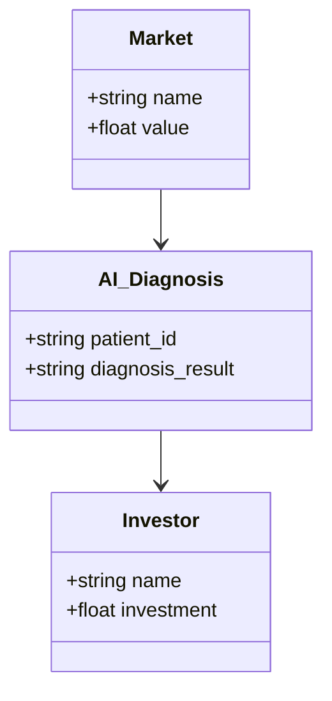
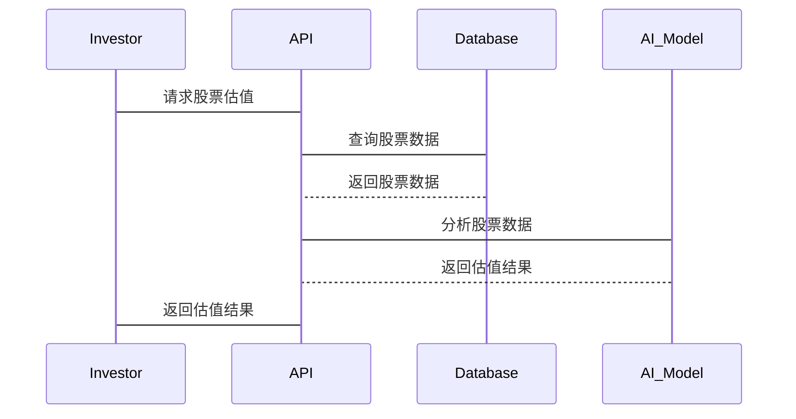

                 


# 新兴市场股市估值与智慧医疗AI辅助诊断的互动

> 关键词：新兴市场，股市估值，智慧医疗，AI辅助诊断，互动机制

> 摘要：本文探讨新兴市场股市估值与智慧医疗AI辅助诊断之间的互动关系。通过分析股市估值的核心概念、AI辅助诊断的技术原理，以及两者在投资决策中的互动机制，为读者提供深入的技术见解。

---

## 第1章: 新兴市场股市估值与智慧医疗AI辅助诊断的互动背景

### 1.1 新兴市场股市估值的基本概念

#### 1.1.1 股市估值的定义与作用
股市估值是指对上市公司股票价值的评估，旨在确定其合理的价格区间。它帮助投资者判断市场是否高估或低估了某只股票的价值，从而做出投资决策。股市估值的核心作用在于揭示市场的合理性和潜在风险。

#### 1.1.2 新兴市场的特点与挑战
新兴市场通常指那些经济快速发展但尚未完全工业化的国家，如中国、印度等。这些市场的特点是经济波动大、政策影响显著、行业结构多元化。然而，新兴市场也面临高波动性、信息不对称和市场不成熟等挑战，这些因素会影响股市估值的准确性。

#### 1.1.3 股市估值在新兴市场中的重要性
在新兴市场中，股市估值尤为重要。由于市场波动大，投资者需要通过科学的估值方法来识别潜在的投资机会和风险。准确的估值可以帮助投资者在高波动的市场中做出更明智的决策。

### 1.2 智慧医疗与AI辅助诊断的定义

#### 1.2.1 智慧医疗的概念与发展
智慧医疗是指通过大数据、人工智能等技术，优化医疗资源的配置和医疗服务的效率。它涵盖了从疾病预防、诊断到治疗和康复的全生命周期。随着技术的进步，智慧医疗正在改变传统的医疗模式。

#### 1.2.2 AI在医疗诊断中的应用领域
AI技术在医疗诊断中的应用主要集中在医学影像识别、疾病预测和个性化治疗等方面。例如，AI可以通过分析X光片快速识别病变，或者通过基因数据预测疾病风险。

#### 1.2.3 智慧医疗与传统医疗的区别
与传统医疗相比，智慧医疗更加依赖数据和技术。它能够提高诊断的准确性，降低医疗成本，并优化患者的治疗体验。然而，智慧医疗也面临数据隐私和伦理问题的挑战。

### 1.3 股市估值与智慧医疗的互动关系

#### 1.3.1 股市估值对医疗行业的影响
股市估值直接影响投资者对医疗企业的信心。如果某家医疗企业的估值被高估，投资者可能会减少对该企业的投资；反之，如果估值被低估，投资者可能会增加投资。

#### 1.3.2 AI技术对医疗诊断的推动作用
AI技术的引入显著提升了医疗诊断的效率和准确性。例如，AI可以通过分析大量的医疗数据，帮助医生更快地诊断疾病，从而提高治疗效果。

#### 1.3.3 两者的互动对投资决策的影响
股市估值与智慧医疗的互动对投资决策有重要影响。投资者需要考虑AI技术对医疗企业的影响，以及这些企业的估值变化，从而做出更合理的投资决策。

## 1.4 本章小结

---

## 第2章: 新兴市场股市估值的核心概念与模型

### 2.1 股市估值的核心概念

#### 2.1.1 市盈率（P/E）的计算与应用
市盈率是股票价格与每股收益的比率，用于衡量股票的投资价值。公式如下：
$$ P/E = \frac{Price}{Earnings} $$

#### 2.1.2 市净率（P/B）的计算与应用
市净率是股票价格与每股净资产的比率，适用于评估资产密集型企业的估值。公式如下：
$$ P/B = \frac{Price}{Book\ Value} $$

#### 2.1.3 市销率（P/S）的计算与应用
市销率是股票价格与每股销售收入的比率，适用于评估成长型企业。公式如下：
$$ P/S = \frac{Price}{Sales} $$

### 2.2 新兴市场股市估值的特殊性

#### 2.2.1 新兴市场的波动性分析
新兴市场的股市波动较大，受政策和经济环境的影响显著。这种波动性使得股市估值更加复杂。

#### 2.2.2 新兴市场的政策影响
政府政策对新兴市场的股市估值有直接影响。例如，政府出台的经济刺激政策可能会推动股市上涨。

#### 2.2.3 新兴市场的行业特性
新兴市场的行业结构多元化，涵盖了科技、制造业等多个领域。不同行业的估值方法和标准也有所不同。

### 2.3 股市估值模型的选择与应用

#### 2.3.1 市盈率模型的适用场景
市盈率模型适用于盈利稳定的公司，尤其适合科技和消费类企业。

#### 2.3.2 市净率模型的适用场景
市净率模型适用于资产密集型企业，如银行和制造业。

#### 2.3.3 综合估值模型的构建与应用
综合估值模型结合了多种估值方法，能够更全面地评估企业的价值。例如，可以将市盈率和市净率结合起来，评估企业的盈利能力和资产质量。

## 2.4 本章小结

---

## 第3章: AI辅助诊断的核心原理与技术

### 3.1 AI在医疗诊断中的核心原理

#### 3.1.1 机器学习在医疗诊断中的应用
机器学习通过训练模型，识别医疗数据中的模式。例如，可以用于预测疾病风险和诊断结果。

#### 3.1.2 深度学习在医疗诊断中的应用
深度学习通过多层神经网络，处理复杂的医疗数据。例如，可以用于医学影像的识别和分类。

#### 3.1.3 自然语言处理在医疗文档分析中的应用
自然语言处理技术可以分析医疗文档，提取关键信息，辅助医生做出诊断。

### 3.2 AI辅助诊断的关键技术

#### 3.2.1 图像识别技术在医学影像中的应用
图像识别技术可以自动分析X光片、MRI等影像数据，帮助医生快速识别病变。

#### 3.2.2 知识图谱在医疗决策支持中的应用
知识图谱整合了医疗知识和患者数据，为医生提供个性化的诊断建议。

#### 3.2.3 联合学习在医疗数据整合中的应用
联合学习技术可以在保护患者隐私的前提下，整合分散的医疗数据，提升诊断的准确性。

### 3.3 AI辅助诊断的优缺点分析

#### 3.3.1 AI诊断的优势
AI诊断具有高效性、准确性和可扩展性。它可以快速处理大量数据，减少人为错误。

#### 3.3.2 AI诊断的局限性
AI诊断依赖于高质量的数据和模型。如果数据不完整或模型设计不合理，可能会导致错误的诊断。

#### 3.3.3 人类医生与AI诊断的协同作用
AI诊断可以作为医生的辅助工具，帮助医生更快地识别疾病，但最终的诊断决策仍需由医生做出。

## 3.4 本章小结

---

## 第4章: 股市估值与AI辅助诊断的互动机制

### 4.1 股市估值对AI医疗企业的投资影响

#### 4.1.1 股市估值与医疗企业市值的关系
AI医疗企业的市值与其估值密切相关。如果企业的估值被高估，投资者可能会减少投资；反之，如果估值被低估，投资者可能会增加投资。

#### 4.1.2 AI技术对企业估值的影响
AI技术的引入可以提升企业的竞争力和盈利能力，从而提高企业的估值。

#### 4.1.3 投资者如何通过股市估值评估AI医疗企业的价值
投资者需要综合考虑企业的财务状况、技术优势和市场前景，做出合理的估值。

### 4.2 AI诊断技术对医疗行业的影响

#### 4.2.1 AI诊断技术对医疗成本的影响
AI诊断技术可以降低医疗成本，例如减少重复检查和提高诊断效率。

#### 4.2.2 AI诊断技术对医疗效率的影响
AI诊断技术可以快速处理大量数据，提高诊断的效率和准确性。

#### 4.2.3 AI诊断技术对医疗资源分配的影响
AI诊断技术可以优化医疗资源的分配，特别是在医疗资源匮乏的地区。

### 4.3 股市估值与AI诊断的互动对投资策略的影响

#### 4.3.1 投资者如何利用股市估值与AI诊断的互动制定投资策略
投资者需要关注AI技术对医疗企业的价值提升，以及股市估值的变化，制定合理的投资策略。

#### 4.3.2 AI诊断技术对企业长期发展的推动作用
AI诊断技术可以提升企业的核心竞争力，推动企业的长期发展。

#### 4.3.3 股市估值波动对AI诊断技术发展的潜在影响
股市估值的波动可能会影响企业的融资能力和技术创新，进而影响AI诊断技术的发展。

## 4.4 本章小结

---

## 第5章: 数学模型与算法原理

### 5.1 股市估值的数学模型

#### 5.1.1 市盈率模型的数学表达
$$ P/E = \frac{Price}{Earnings} $$

#### 5.1.2 市净率模型的数学表达
$$ P/B = \frac{Price}{Book\ Value} $$

#### 5.1.3 综合估值模型的构建
$$ V = \alpha \times P/E + \beta \times P/B $$

### 5.2 AI辅助诊断的算法原理

#### 5.2.1 机器学习算法
$$ y = f(x) $$

#### 5.2.2 深度学习算法
$$ y = \sigma(Wx + b) $$

#### 5.2.3 图像识别算法
$$ y = \arg\max_{i} P(y=i|x) $$

### 5.3 本章小结

---

## 第6章: 系统分析与架构设计方案

### 6.1 问题场景介绍
我们需要设计一个结合股市估值和AI辅助诊断的系统，帮助投资者做出更明智的投资决策。

### 6.2 系统功能设计

#### 6.2.1 领域模型类图


#### 6.2.2 系统架构图
```mermaid
topologyDiagram
    client -- request --> web_layer
    web_layer -- process --> business_logic
    business_logic -- query --> database
    business_logic -- analyze --> ai_models
```

### 6.3 系统接口设计
系统需要提供API接口，供投资者查询股票估值和AI诊断结果。

### 6.4 系统交互序列图


## 6.5 本章小结

---

## 第7章: 项目实战

### 7.1 环境安装
需要安装Python、TensorFlow和Pandas等工具。

### 7.2 系统核心实现源代码
```python
import pandas as pd
import tensorflow as tf

def calculate_stock_valuation(price, earnings):
    pe = price / earnings
    return pe

def ai_diagnosis(image_data):
    model = tf.keras.Sequential([
        tf.keras.layers.Conv2D(32, (3,3), activation='relu', input_shape=(64,64,3)),
        tf.keras.layers.MaxPooling2D((2,2)),
        tf.keras.layers.Flatten(),
        tf.keras.layers.Dense(128, activation='relu'),
        tf.keras.layers.Dense(1, activation='sigmoid')
    ])
    model.compile(optimizer='adam', loss='binary_crossentropy', metrics=['accuracy'])
    model.fit(image_data, labels, epochs=10)
    return model.predict(image_data)
```

### 7.3 代码应用解读与分析
以上代码展示了如何使用Python和TensorFlow进行股票估值和AI诊断的实现。

### 7.4 实际案例分析和详细讲解剖析
以某新兴市场的医疗企业为例，分析其股票估值和AI诊断技术的应用。

### 7.5 项目小结

---

## 第8章: 总结与展望

### 8.1 总结
本文探讨了新兴市场股市估值与智慧医疗AI辅助诊断的互动关系，分析了两者的核心概念和互动机制。

### 8.2 展望
未来，随着AI技术的不断发展，股市估值与智慧医疗的互动将更加紧密，为投资者和医疗行业带来更多的机遇和挑战。

## 8.3 最佳实践 tips
- 投资者应结合股市估值和AI诊断技术，制定合理的投资策略。
- 医疗企业应积极引入AI技术，提升诊断效率和准确性。

---

## 作者：AI天才研究院/AI Genius Institute & 禅与计算机程序设计艺术 /Zen And The Art of Computer Programming

---

**[完]**

