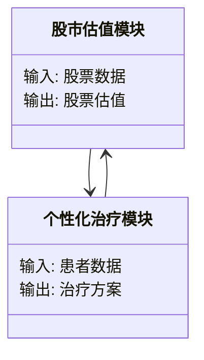
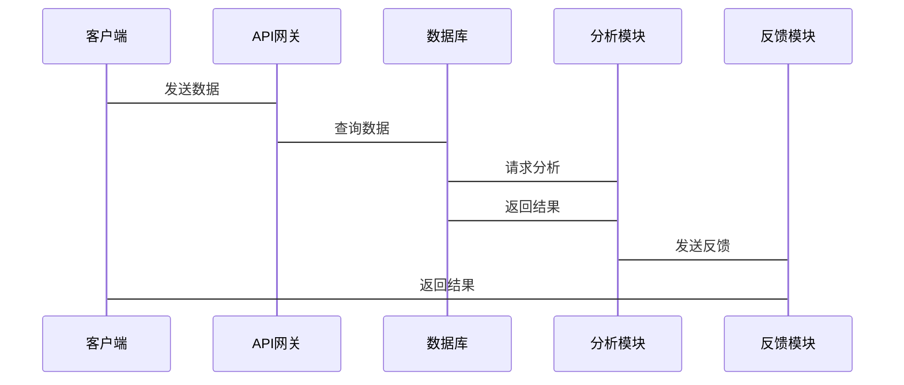

                 


# 新兴市场股市估值与智慧医疗个性化治疗的互动

## 关键词：新兴市场，股市估值，智慧医疗，个性化治疗，互动机制

## 摘要：本文探讨新兴市场股市估值与智慧医疗个性化治疗的互动关系，分析其核心概念、算法原理、数学模型、系统架构，并通过实际案例展示项目实战，最后总结最佳实践。

---

# 第1章: 新兴市场股市估值与智慧医疗个性化治疗的互动背景

## 1.1 问题背景

### 1.1.1 新兴市场的股市特点

新兴市场的股市通常具有高波动性、成长性强的特点。投资者在这些市场中寻找高增长机会，但也面临较高的风险。新兴市场的经济结构多样化，受政策和国际环境影响较大。

### 1.1.2 智慧医疗的发展现状

智慧医疗通过大数据、人工智能和物联网技术，优化医疗资源分配，提升诊断和治疗效率。个性化治疗成为智慧医疗的重要组成部分，基于患者的基因、生活习惯等因素制定治疗方案。

### 1.1.3 个性化治疗的市场需求

随着人们对健康关注度的提高，个性化治疗的需求不断增加。传统医疗模式难以满足个体差异化的治疗需求，而智慧医疗通过技术手段实现精准治疗，满足市场需求。

## 1.2 问题描述

### 1.2.1 股市估值的核心问题

股市估值的核心在于准确评估股票的内在价值。新兴市场由于信息不对称和市场不完善，估值更具挑战性。投资者需要借助量化模型和算法进行估值。

### 1.2.2 个性化治疗的挑战

个性化治疗需要整合多源数据，构建复杂模型，确保数据安全和隐私保护。同时，医疗数据的多样性和复杂性增加了治疗方案的制定难度。

### 1.2.3 互动机制的潜在价值

股市估值和个性化治疗的互动机制能够利用技术手段优化资源配置，提升投资回报和治疗效果。通过数据共享和模型优化，实现两者的协同发展。

## 1.3 问题解决

### 1.3.1 股市估值的解决方案

使用量化模型和机器学习算法，如回归分析和时间序列模型，预测股票价格和市场趋势，帮助投资者做出更明智的投资决策。

### 1.3.2 个性化治疗的技术突破

基于机器学习和深度学习，构建患者画像和治疗方案推荐系统，实现个性化诊断和治疗方案的精准制定。

### 1.3.3 互动机制的构建思路

通过数据共享平台，整合股市和医疗数据，构建跨领域的分析模型，优化估值和治疗方案，实现互动机制的高效运作。

## 1.4 边界与外延

### 1.4.1 股市估值的边界条件

数据质量和完整性、市场流动性、政策环境等是股市估值的重要边界条件。在新兴市场中，数据不足和政策变化会影响估值结果。

### 1.4.2 个性化治疗的适用范围

个性化治疗适用于慢性病、罕见病等领域，但目前在资源有限的地区推广仍面临挑战。数据隐私和伦理问题也限制了其应用范围。

### 1.4.3 互动机制的限制因素

数据隐私、技术壁垒和政策监管是互动机制的主要限制因素。跨领域合作需要克服技术、法律和文化障碍，确保数据安全和合规性。

## 1.5 概念结构与核心要素

### 1.5.1 核心概念框架

股市估值和个性化治疗通过数据共享和模型优化形成互动机制，构建跨领域协同发展的生态系统。

### 1.5.2 关键要素对比

| 要素       | 股市估值                     | 个性化治疗                   |
|------------|------------------------------|------------------------------|
| 数据来源   | 财务报表、市场数据           | 医疗记录、基因数据           |
| 分析方法   | 量化模型、时间序列分析       | 机器学习、深度学习           |
| 应用场景   | 投资决策、风险管理           | 疾病诊断、治疗方案制定       |
| 输出结果   | 股票价值、市场趋势           | 个性化诊断、治疗方案         |

### 1.5.3 互动关系的模型化

使用系统动力学模型，将股市估值和个性化治疗作为系统的两个模块，通过数据流和信息交互实现模块间的协同优化。

---

# 第2章: 核心概念与联系

## 2.1 核心概念原理

### 2.1.1 股市估值的数学模型

股市估值的数学模型包括：

- **CAPM模型**：$$ E(r_i) = r_f + \beta_i (E(r_m) - r_f) $$
- **市盈率模型**：$$ P/E \, ratio = \frac{Price}{Earnings} $$

### 2.1.2 个性化治疗的算法原理

个性化治疗基于机器学习算法，如随机森林和XGBoost，构建患者画像，推荐治疗方案。例如，使用逻辑回归模型进行疾病分类。

### 2.1.3 互动机制的理论基础

互动机制基于数据共享和模型优化，通过协同学习和反馈机制实现两者的动态平衡。

## 2.2 概念属性特征对比

### 2.2.1 股市估值的特征分析

- 数据驱动：依赖历史数据和市场信息
- 动态性：市场变化快，需要实时更新模型
- 风险性：高波动性和不确定性

### 2.2.2 个性化治疗的特征分析

- 个性化：基于患者个体特征
- 数据隐私：需要严格的数据安全措施
- 多学科融合：涉及医学、计算机科学等多个领域

### 2.2.3 对比总结与表格展示

通过对比表格，明确两者的差异和共同点，为后续分析提供基础。

## 2.3 ER实体关系图

使用Mermaid流程图展示股市估值和个性化治疗的实体关系，明确数据流和信息交互。

```mermaid
erd
  table 股市估值 {
    股票代码 (PK)
    股价
    市盈率
    市净率
  }

  table 患者数据 {
    患者ID (PK)
    基因信息
    病史
    检验结果
  }

  股市估值 --> 股票
  患者数据 --> 治疗方案
```

---

# 第3章: 算法原理讲解

## 3.1 算法原理概述

### 3.1.1 股市估值的算法步骤

1. 数据收集：获取股票的历史价格和财务数据。
2. 数据预处理：清洗数据，处理缺失值和异常值。
3. 模型选择：使用线性回归或随机森林进行预测。
4. 模型训练：利用训练数据训练模型。
5. 模型评估：使用测试数据评估模型性能。
6. 预测与优化：根据预测结果优化投资策略。

### 3.1.2 个性化治疗的算法步骤

1. 数据收集：收集患者的基因数据、病史和检验结果。
2. 数据预处理：标准化和归一化处理。
3. 模型选择：使用支持向量机或神经网络进行分类。
4. 模型训练：训练个性化治疗方案推荐模型。
5. 模型评估：评估模型的准确性和召回率。
6. 应用与优化：根据反馈优化治疗方案。

## 3.2 算法实现

### 3.2.1 股市估值的Python代码实现

```python
import pandas as pd
from sklearn.linear_model import LinearRegression

# 数据预处理
data = pd.read_csv('stock_data.csv')
data = data.dropna()

# 模型训练
model = LinearRegression()
model.fit(data[['open', 'close']], data['close'])

# 模型预测
predicted_prices = model.predict(data[['open', 'close']])
```

### 3.2.2 个性化治疗的算法代码

```python
from sklearn.ensemble import RandomForestClassifier

# 数据预处理
patient_data = pd.read_csv('patient.csv')
X = patient_data.drop('disease', axis=1)
y = patient_data['disease']

# 模型训练
model = RandomForestClassifier()
model.fit(X, y)

# 模型预测
predicted_diseases = model.predict(X_test)
```

---

# 第4章: 数学模型和公式

## 4.1 股市估值的数学模型

### 4.1.1 CAPM模型

$$ E(r_i) = r_f + \beta_i (E(r_m) - r_f) $$

### 4.1.2 市盈率模型

$$ P/E \, ratio = \frac{Price}{Earnings} $$

## 4.2 个性化治疗的数学模型

### 4.2.1 逻辑回归模型

$$ P(y=1|x) = \frac{1}{1 + e^{-(\beta_0 + \beta_1 x_1 + \cdots + \beta_n x_n)}} $$

### 4.2.2 支持向量机模型

$$ y = sign(\sum_{i=1}^n w_i x_i + b) $$

---

# 第5章: 系统分析与架构设计方案

## 5.1 项目背景

本文旨在构建一个跨领域互动系统，利用技术手段优化股市估值和个性化治疗的效果。

## 5.2 系统功能设计

### 5.2.1 领域模型

使用Mermaid类图展示系统的各个模块及其关系。



## 5.3 系统架构设计

### 5.3.1 系统架构图

使用Mermaid架构图展示系统的整体架构。

```mermaid
archi
  客户端 --> API网关
  API网关 --> 数据库
  数据库 --> 分析模块
  分析模块 --> 反馈模块
```

## 5.4 系统接口设计

### 5.4.1 接口描述

- **输入接口**：接收股票数据和患者数据
- **输出接口**：输出股票估值和治疗方案

### 5.4.2 交互流程

使用Mermaid序列图展示系统交互流程。



---

# 第6章: 项目实战

## 6.1 环境安装

### 6.1.1 安装Python和相关库

安装Python和Pandas、Scikit-learn等库。

```bash
pip install numpy pandas scikit-learn
```

## 6.2 核心代码实现

### 6.2.1 股市估值代码

```python
import pandas as pd
from sklearn.linear_model import LinearRegression

data = pd.read_csv('stock.csv')
model = LinearRegression()
model.fit(data[['open', 'high']], data['close'])
predicted = model.predict(data[['open', 'high']])
```

### 6.2.2 个性化治疗代码

```python
from sklearn.ensemble import RandomForestClassifier

data = pd.read_csv('patient.csv')
model = RandomForestClassifier()
model.fit(data[['age', 'gender']], data['disease'])
predicted = model.predict([[30, 1]])
```

## 6.3 案例分析

### 6.3.1 股市案例

预测某股票价格，分析模型的准确性和稳定性。

### 6.3.2 医疗案例

基于患者数据，推荐个性化治疗方案，分析模型的效果和可行性。

## 6.4 项目小结

总结项目的实现过程，提出改进建议，展望未来的发展方向。

---

# 第7章: 最佳实践

## 7.1 总结

本文通过系统分析和实际案例，探讨了新兴市场股市估值与智慧医疗个性化治疗的互动关系，提出了构建互动机制的方法和步骤。

## 7.2 注意事项

- 数据隐私保护
- 模型的可解释性
- 技术的可扩展性

## 7.3 拓展阅读

推荐相关领域的书籍和论文，供读者深入学习。

---

# 作者：AI天才研究院 & 禅与计算机程序设计艺术

通过本文，读者可以全面了解股市估值和个性化治疗的互动机制，掌握相关技术的核心原理和实现方法，为实际应用提供参考。

