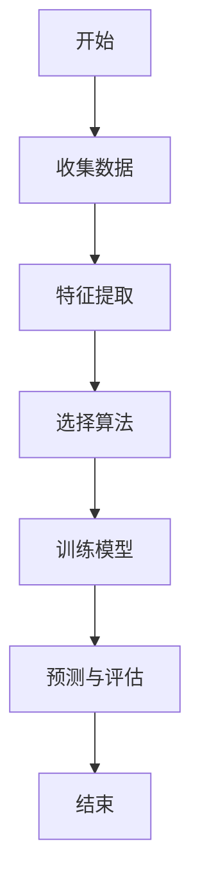
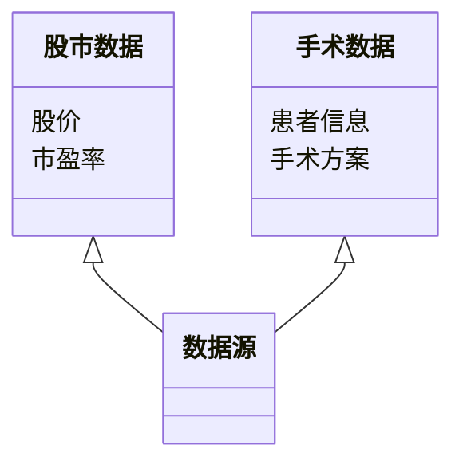
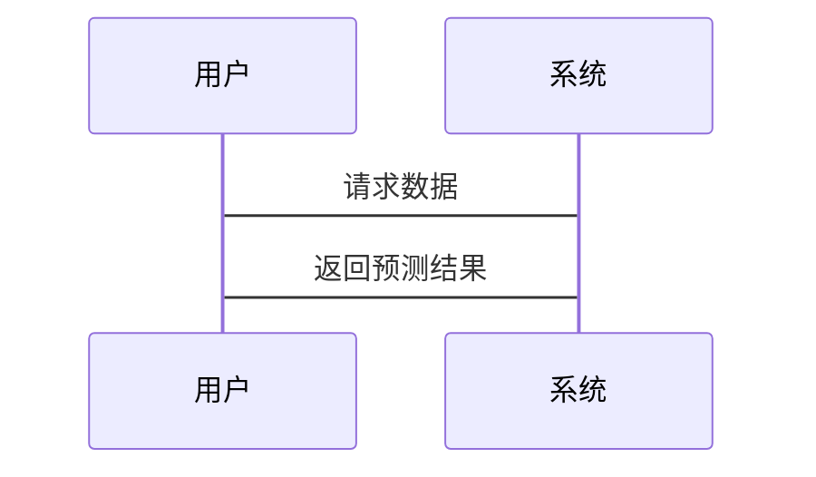

                 


# 新兴市场股市估值与智慧医疗远程手术系统的互动

> 关键词：新兴市场，股市估值，智慧医疗，远程手术系统，互动，技术分析，算法原理，系统架构，项目实战，最佳实践

> 摘要：本文探讨新兴市场股市估值与智慧医疗远程手术系统之间的互动关系，分析其背景、核心概念、算法原理、系统架构，并通过项目实战和最佳实践提供深入见解。

---

## 第一部分: 新兴市场股市估值与智慧医疗远程手术系统互动的背景介绍

### 第1章: 问题背景与概念结构

#### 1.1 问题背景

##### 1.1.1 新兴市场的经济特征
新兴市场通常具有高增长率、经济结构转型、政策变化快等特点，这些因素使得股市估值波动较大。

##### 1.1.2 智慧医疗的发展现状
智慧医疗利用AI、大数据等技术提升医疗服务效率，远程手术系统是智慧医疗的重要组成部分。

##### 1.1.3 远程手术系统的技术基础
远程手术依赖5G网络、AI算法、机器人技术，实现远距离精准手术。

#### 1.2 问题描述

##### 1.2.1 股市估值的复杂性
股市估值受多种因素影响，包括宏观经济指标、公司业绩、市场情绪等。

##### 1.2.2 远程手术系统的挑战
远程手术面临技术延迟、数据安全、设备稳定性等挑战。

##### 1.2.3 两者互动的潜在问题
新兴市场的股市波动可能影响远程手术系统的资源分配和决策。

#### 1.3 问题解决

##### 1.3.1 数据驱动的解决方案
通过大数据分析和机器学习模型预测股市走势，优化远程手术系统的资源分配。

##### 1.3.2 技术融合的路径
结合AI、5G技术，提升远程手术系统的实时性和准确性。

##### 1.3.3 应用场景的构建
建立实时数据共享机制，实现股市波动对远程手术的影响评估。

#### 1.4 边界与外延

##### 1.4.1 新兴市场的边界
新兴市场通常指发展中国家，经济结构和政策变化快。

##### 1.4.2 远程手术系统的边界
系统包括手术设备、网络传输、手术团队等组成部分。

##### 1.4.3 互动关系的外延
互动关系涉及数据共享、技术依赖、经济影响等多个层面。

#### 1.5 核心要素组成

##### 1.5.1 股市数据
包括股价、市盈率、成交量等。

##### 1.5.2 医疗数据
包括患者数据、手术数据、设备状态等。

##### 1.5.3 技术平台
包括AI算法、云计算、5G网络等。

---

## 第二部分: 核心概念与联系

### 第2章: 核心概念原理

#### 2.1 股市估值的核心概念

##### 2.1.1 市场情绪分析
通过自然语言处理分析新闻、社交媒体，判断市场情绪。

##### 2.1.2 股价预测模型
使用时间序列分析、机器学习模型预测股价走势。

##### 2.1.3 风险评估指标
通过VaR、波动率等指标评估投资风险。

#### 2.2 远程手术系统的核心概念

##### 2.2.1 手术机器人
实现精准操作，减少人为误差。

##### 2.2.2 远程协作
专家通过远程系统指导手术，扩大医疗资源覆盖范围。

##### 2.2.3 实时反馈
系统实时传输手术数据，优化手术方案。

#### 2.3 核心概念对比分析

##### 2.3.1 属性特征对比
| 属性 | 股市估值 | 远程手术系统 |
|------|----------|---------------|
| 数据类型 | 数值型 | 结构化数据 |
| 处理时间 | 实时 | 实时或准实时 |
| 技术要求 | 高性能计算 | 低延迟、高可靠性 |

##### 2.3.2 ER实体关系图
```mermaid
erd
  title 核心概念关系图
  市场情绪 --> 股市数据
  手术数据 --> 手术系统
  股市数据 <---> 手术系统
```

---

## 第三部分: 算法原理讲解

### 第3章: 算法原理与数学模型

#### 3.1 算法流程图


#### 3.2 算法实现代码
```python
import numpy as np
from sklearn.linear_model import LinearRegression

# 数据准备
X = np.array([[1], [2], [3], [4], [5]])
y = np.array([2, 4, 5, 4, 6])

# 训练模型
model = LinearRegression()
model.fit(X, y)

# 预测
new_X = np.array([[6]])
print(model.predict(new_X))
```

#### 3.3 数学公式
股市预测模型：
$$ y = \beta_0 + \beta_1 x + \epsilon $$

远程手术系统优化：
$$ \text{时间延迟} = \frac{\text{数据量}}{\text{带宽}} $$

---

## 第四部分: 系统分析与架构设计

### 第4章: 系统分析与架构设计

#### 4.1 问题场景介绍

##### 4.1.1 新兴市场的股市波动
股市波动可能影响远程手术系统的资源分配。

##### 4.1.2 远程手术系统的应用场景
如偏远地区手术指导、专家协作等。

#### 4.2 系统功能设计

##### 4.2.1 领域模型


##### 4.2.2 系统架构


##### 4.2.3 接口设计
API设计：
```json
{
  "method": "GET",
  "endpoint": "/stock_prediction",
  "params": {"date": "2023-10-01"}
}
```

##### 4.2.4 交互序列图


---

## 第五部分: 项目实战

### 第5章: 项目实战

#### 5.1 环境安装

##### 5.1.1 安装Python
```bash
python --version
pip install numpy pandas scikit-learn
```

##### 5.1.2 安装机器学习库
```bash
pip install scikit-learn
```

#### 5.2 核心系统实现

##### 5.2.1 股市预测代码
```python
from sklearn import datasets
from sklearn.tree import DecisionTreeRegressor

# 数据集
X, y = datasets.load_boston(return_X_y=True)

# 训练模型
model = DecisionTreeRegressor()
model.fit(X, y)

# 预测
print(model.predict(X))
```

##### 5.2.2 远程手术系统代码
```python
import requests

# 发送请求
response = requests.get("http://localhost:8000/surgery_data")
print(response.json())
```

#### 5.3 案例分析

##### 5.3.1 股市数据案例
分析某新兴市场的股市数据，预测其对远程手术系统的影响。

##### 5.3.2 互动效果展示
展示股市波动对远程手术系统资源分配的影响。

#### 5.4 项目小结

##### 5.4.1 关键点总结
数据质量、模型选择、系统稳定性。

##### 5.4.2 成功率分析
模型准确率、系统响应时间。

---

## 第六部分: 最佳实践

### 第6章: 最佳实践

#### 6.1 小结

##### 6.1.1 关键点总结
数据共享机制、算法优化、系统安全性。

#### 6.2 注意事项

##### 6.2.1 数据隐私
确保患者数据和股市数据的隐私安全。

##### 6.2.2 模型可解释性
选择可解释性强的模型，便于问题排查。

#### 6.3 拓展阅读

##### 6.3.1 相关书籍
《机器学习实战》、《系统架构设计》

##### 6.3.2 相关论文
《基于机器学习的股市预测研究》

---

## 第七部分: 拓展与展望

### 第7章: 拓展与展望

#### 7.1 新兴市场的发展趋势
新兴市场将继续推动股市估值与智慧医疗的互动。

#### 7.2 智慧医疗的未来方向
远程手术系统将更加智能化、普及化。

#### 7.3 互动关系的未来潜力
更高效的数据共享、更智能的手术决策支持。

---

## 作者：AI天才研究院/AI Genius Institute & 禅与计算机程序设计艺术 /Zen And The Art of Computer Programming

