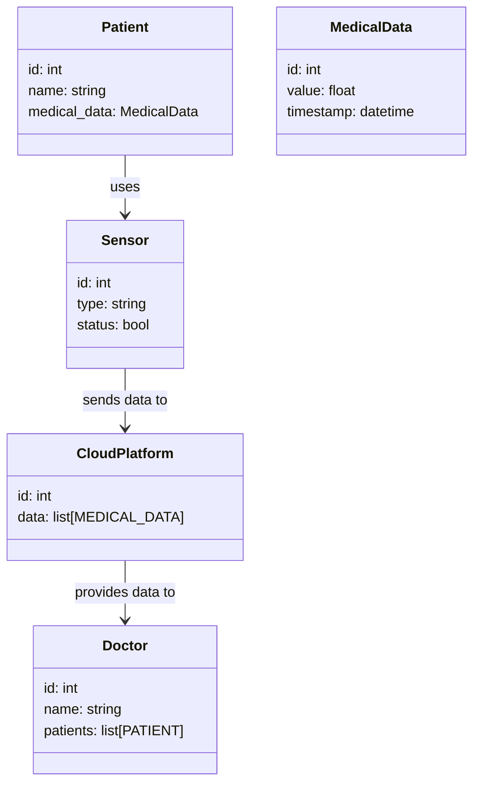

                 


# 新兴市场股市估值与智慧医疗远程监护系统的互动

---

## 关键词

- 新兴市场
- 股市估值
- 智慧医疗
- 远程监护系统
- 物联网
- 人工智能
- 数据分析

---

## 摘要

本文探讨新兴市场股市估值与智慧医疗远程监护系统之间的互动关系。通过分析股市估值的核心概念与算法，结合智慧医疗远程监护系统的技术特点，揭示两者如何通过数据共享、技术创新和市场反馈实现互动。文章详细介绍了股市估值的数学模型、智慧医疗系统的架构设计，以及两者在实际项目中的互动案例，为读者提供全面的技术视角。

---

## 第一部分：背景介绍

### 第1章：新兴市场与智慧医疗的互动背景

#### 1.1 新兴市场的经济特征与股市发展

新兴市场是指那些经济增长迅速、但市场机制尚不完善的国家或地区的市场。这些市场通常具有较高的波动性和不确定性，但同时也蕴含着巨大的增长潜力。新兴市场的经济特征包括：

- **高增长率**：新兴市场的GDP增速通常高于发达市场。
- **年轻人口**：新兴市场的人口结构较年轻，消费潜力大。
- **政策支持**：政府通常会通过政策引导市场发展方向。

股市在新兴市场中扮演着重要角色，是企业融资和投资者财富增长的重要渠道。然而，新兴市场股市也面临诸多挑战，如市场流动性不足、信息透明度较低、政策风险高等。

---

#### 1.2 智慧医疗的发展现状与趋势

智慧医疗是指通过物联网、大数据、人工智能等技术，实现医疗资源的优化配置和医疗服务的智能化。智慧医疗远程监护系统是其中的重要组成部分，它通过传感器、智能设备和云平台，实时监测患者的生理指标，并将数据传输到医疗机构，帮助医生进行远程诊断和治疗。

智慧医疗的发展趋势包括：

- **远程监护系统的普及**：随着物联网技术的成熟，远程监护系统在医院和家庭中的应用越来越广泛。
- **人工智能的应用**：AI技术在医疗数据分析、疾病预测和诊断中的应用日益增多。
- **数据共享与隐私保护**：如何在保证患者隐私的前提下，实现医疗数据的高效共享，是智慧医疗发展中的关键问题。

---

#### 1.3 股市估值与智慧医疗的互动关系

股市估值是衡量企业价值的重要指标，而智慧医疗企业的表现直接影响股市的波动。两者之间的互动关系主要体现在以下几个方面：

1. **市场反馈机制**：股市对智慧医疗企业的业绩表现敏感，企业的技术创新和市场拓展会直接反映在股价上。
2. **技术驱动**：智慧医疗技术的进步推动了相关企业的成长，进而影响股市估值。
3. **政策影响**：政府政策的调整（如医疗行业的政策支持或监管加强）会对智慧医疗企业的经营和股市估值产生重大影响。

---

## 第二部分：核心概念与联系

### 第2章：新兴市场股市估值的核心概念

#### 2.1 股市估值的基本原理

股市估值是通过对企业的财务数据、市场环境和行业趋势进行分析，估算其股票的合理价格。常用的方法包括：

- **相对估值法**：通过比较可比公司的市盈率、市净率等指标，估算目标公司的股票价值。
- **绝对估值法**：通过DCF模型（现金流折现法）等方法，估算公司的内在价值。

在新兴市场中，由于信息不对称和市场波动较大，相对估值法通常更受青睐。

---

#### 2.2 新兴市场股市估值的影响因素

新兴市场股市估值受多种因素影响，主要包括：

- **宏观经济因素**：如GDP增长率、通货膨胀率、利率水平等。
- **行业因素**：如医疗行业的政策支持、技术创新等。
- **公司基本面**：如企业的盈利能力、成长性、财务状况等。

---

### 第3章：智慧医疗远程监护系统的核心概念

#### 3.1 远程监护系统的定义与组成

智慧医疗远程监护系统由以下几个部分组成：

1. **传感器**：用于采集患者的生理指标，如心率、体温、血压等。
2. **数据传输**：通过物联网技术，将采集到的数据传输到云平台。
3. **分析平台**：对数据进行处理和分析，生成诊断报告。
4. **用户终端**：医生和患者可以通过终端设备查看数据和报告。

#### 3.2 远程监护系统的技术特点

智慧医疗远程监护系统的技术特点包括：

- **实时性**：数据采集和传输实时进行，确保医生能够及时了解患者的状况。
- **智能化**：通过AI技术，系统可以自动识别异常数据并发出警报。
- **可扩展性**：系统可以根据需求进行扩展，支持更多的患者和更多的数据类型。

---

## 第三部分：算法原理与数学模型

### 第4章：新兴市场股市估值的算法与模型

#### 4.1 股市估值的回归分析模型

回归分析是一种常用的统计方法，用于预测股票价格。以下是回归分析模型的步骤：

1. **数据收集**：收集目标公司的历史股价、财务数据等。
2. **变量选择**：选择影响股价的关键变量，如收入增长率、市盈率等。
3. **模型建立**：通过最小二乘法等方法，建立回归模型。
4. **模型验证**：通过历史数据验证模型的准确性。

回归模型的公式如下：

$$ y = \beta_0 + \beta_1 x_1 + \beta_2 x_2 + \ldots + \beta_n x_n + \epsilon $$

其中，$y$是股票价格，$x_i$是自变量，$\beta_i$是回归系数，$\epsilon$是误差项。

---

#### 4.2 时间序列分析在股市预测中的应用

时间序列分析是一种用于预测未来股票价格的方法。常用的模型包括ARIMA（自回归积分滑动平均模型）和LSTM（长短期记忆网络）。

以下是ARIMA模型的步骤：

1. **数据预处理**：对股票价格数据进行平稳化处理。
2. **模型选择**：确定ARIMA的参数（p, d, q）。
3. **模型训练**：使用历史数据训练模型。
4. **模型预测**：基于训练好的模型，预测未来的价格。

LSTM模型适用于处理时间序列数据中的长期依赖关系，适合用于股票价格的短期预测。

---

### 第5章：智慧医疗远程监护系统的算法与模型

#### 5.1 基于机器学习的医疗数据分析

机器学习在医疗数据分析中的应用包括分类、回归和聚类。以下是基于机器学习的医疗数据分析的步骤：

1. **数据收集**：收集患者的生理数据和病历数据。
2. **数据预处理**：对数据进行清洗和标准化。
3. **特征选择**：选择对诊断有重要影响的特征。
4. **模型训练**：使用训练数据训练机器学习模型。
5. **模型验证**：通过测试数据验证模型的准确性。

以下是随机森林分类器的Python代码示例：

```python
from sklearn.ensemble import RandomForestClassifier
from sklearn.model_selection import train_test_split

# 数据预处理
X = data.drop(columns=['label'])
y = data['label']

X_train, X_test, y_train, y_test = train_test_split(X, y, test_size=0.2)

# 模型训练
model = RandomForestClassifier(n_estimators=100)
model.fit(X_train, y_train)

# 模型预测
y_pred = model.predict(X_test)
```

---

## 第四部分：系统分析与架构设计方案

### 第6章：智慧医疗远程监护系统的架构设计

#### 6.1 领域模型类图

以下是智慧医疗远程监护系统的领域模型类图：



---

#### 6.2 系统架构设计

以下是智慧医疗远程监护系统的架构设计：


---

## 第五部分：项目实战

### 第7章：智慧医疗远程监护系统的实现

#### 7.1 环境安装

以下是Python环境的安装步骤：

1. 安装Python：从官网下载并安装最新版本的Python。
2. 安装依赖库：使用pip安装所需的库，如pandas、numpy、scikit-learn等。

#### 7.2 系统核心实现源代码

以下是远程监护系统的Python代码示例：

```python
import pandas as pd
import numpy as np
from sklearn.ensemble import RandomForestClassifier
from sklearn.model_selection import train_test_split

# 数据加载
data = pd.read_csv('medical_data.csv')

# 数据预处理
X = data.drop(columns=['label'])
y = data['label']

# 数据划分
X_train, X_test, y_train, y_test = train_test_split(X, y, test_size=0.2)

# 模型训练
model = RandomForestClassifier(n_estimators=100)
model.fit(X_train, y_train)

# 模型预测
y_pred = model.predict(X_test)

# 模型评估
print("Accuracy:", accuracy_score(y_test, y_pred))
```

---

## 第六部分：最佳实践

### 第8章：小结与展望

通过本文的探讨，我们深入分析了新兴市场股市估值与智慧医疗远程监护系统之间的互动关系。我们不仅介绍了股市估值的核心概念和技术，还详细讲解了智慧医疗远程监护系统的架构设计和实现方法。未来，随着技术的不断发展，两者之间的互动将更加紧密，智慧医疗在股市中的影响也将更加显著。

---

## 作者：AI天才研究院/AI Genius Institute & 禅与计算机程序设计艺术 /Zen And The Art of Computer Programming

