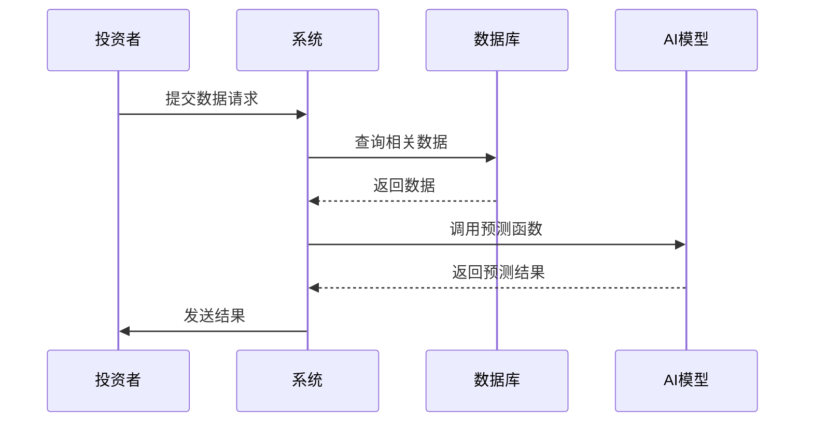

                 


# 新兴市场股市估值与智慧城市5G+AI应用的互动

> 关键词：股市估值，智慧城市，5G，AI，互动，技术博客，IT领域

> 摘要：本文探讨新兴市场股市估值与智慧城市5G+AI应用之间的互动关系，分析技术如何影响股市估值，并反哺智慧城市建设。通过背景介绍、核心概念、算法原理、系统架构、项目实战和最佳实践等部分，系统阐述两者互动的技术细节和实际应用。

---

## 第一部分: 背景介绍

### 第1章: 问题背景

#### 1.1 新兴市场股市的特点与挑战
新兴市场的股市通常波动较大，受政策、经济和国际环境影响显著。股市估值的准确性对投资者至关重要，但传统方法难以捕捉复杂动态。

#### 1.2 智慧城市的发展现状与趋势
智慧城市整合5G、AI、物联网等技术，提升城市运营效率。5G提供高速数据传输，AI优化城市管理，两者结合推动城市智能化发展。

#### 1.3 5G与AI技术的融合及其应用前景
5G低延迟和高速度支持AI算法实时运行，AI提升数据处理效率，两者协同促进智慧交通、医疗、安防等领域发展。

### 第2章: 问题描述

#### 2.1 股市估值的复杂性与不确定性
股市受多因素影响，传统模型难以精准估值，新兴市场波动更大，加大挑战。

#### 2.2 智慧城市中5G+AI应用的互动关系
5G数据支持AI分析，AI优化城市管理，两者相互作用，形成动态反馈机制。

#### 2.3 两者互动对经济发展的影响
互动机制提升城市效率，优化资源配置，促进经济繁荣，推动股市增长。

### 第3章: 问题解决

#### 3.1 通过AI技术优化股市估值模型
AI分析海量数据，识别市场趋势，提高估值准确性。

#### 3.2 利用5G技术提升智慧城市数据处理能力
5G支持实时数据传输，AI优化城市管理，提升效率。

#### 3.3 互动机制的构建与实现
构建反馈系统，实时调整模型参数，优化资源配置。

### 第4章: 边界与外延

#### 4.1 新兴市场股市估值的边界条件
数据来源、模型假设和市场环境限制估值模型的适用性。

#### 4.2 智慧城市5G+AI应用的边界条件
技术限制、数据隐私和城市规划影响应用范围。

#### 4.3 互动关系的外延与扩展
跨领域合作和技术融合扩展互动应用，推动更广泛的影响。

## 第二部分: 核心概念与联系

### 第2章: 核心概念原理

#### 2.1 股市估值的核心原理
数据驱动模型和AI技术优化估值，通过特征提取和模型训练实现精准预测。

#### 2.2 智慧城市5G+AI应用的核心原理
5G提供数据传输，AI处理数据，协同优化城市管理和服务。

### 第3章: 核心概念属性特征对比

#### 3.1 股市估值与智慧城市5G+AI应用的对比分析
目标、数据和技术创新点对比，展示两者的异同。

#### 3.2 概念结构与核心要素对比表格
展示核心要素对比，如目标、数据来源、技术实现等。

### 第4章: ER实体关系图架构

#### 4.1 股市估值与智慧城市5G+AI应用的实体关系
投资者、政府、企业与数据的关系，展示互动机制。

#### 4.2 用Mermaid流程图展示实体关系
```mermaid
erDiagram
    actor 投资者
    actor 政府机构
    actor 企业
    database 股市数据
    database 城市数据
    database 5G网络数据
    database AI算法模型
    投资者 --> 股市数据
    政府机构 --> 城市数据
```

---

## 第三部分: 算法原理讲解

### 第3章: AI算法在股市估值中的应用

#### 3.1 基于机器学习的估值模型
使用Python代码实现线性回归或随机森林模型，展示数据预处理、特征选择和模型训练流程。

```python
import pandas as pd
from sklearn.ensemble import RandomForestRegressor
from sklearn.model_selection import train_test_split
from sklearn.metrics import mean_squared_error

# 数据加载与处理
data = pd.read_csv('stock_data.csv')
features = data.drop('target', axis=1)
target = data['target']

# 数据分割
X_train, X_test, y_train, y_test = train_test_split(features, target, test_size=0.2, random_state=42)

# 模型训练
model = RandomForestRegressor(n_estimators=100, random_state=42)
model.fit(X_train, y_train)

# 预测与评估
y_pred = model.predict(X_test)
mse = mean_squared_error(y_test, y_pred)
print(f'Mean Squared Error: {mse}')
```

#### 3.2 5G数据处理算法
用Python代码展示5G数据预处理和AI分析，优化城市管理。

## 第四部分: 系统分析与架构设计方案

### 第4章: 问题场景介绍

#### 4.1 系统功能设计
领域模型类图展示投资者、政府、企业关系，数据流展示互动机制。

### 第5章: 系统架构设计

#### 5.1 系统架构图
展示分层架构，包括数据层、AI层、应用层和用户层。

### 第6章: 系统接口设计

#### 6.1 接口设计
REST API接口设计，展示数据获取、模型调用和结果返回流程。

### 第7章: 系统交互序列图



---

## 第五部分: 项目实战

### 第8章: 环境安装

#### 8.1 安装Python和相关库
安装scikit-learn、pandas、mermaid等工具。

### 第9章: 核心实现

#### 9.1 股市估值模型实现
编写代码，加载数据，训练模型，评估性能。

#### 9.2 智慧城市5G+AI系统实现
实现数据处理、模型调用和结果展示功能。

### 第10章: 案例分析

#### 10.1 实际案例分析
分析新兴市场案例，展示互动机制的实际效果。

---

## 第六部分: 最佳实践

### 第11章: 小结

互动机制提升股市估值和智慧城市管理效率，推动经济与技术双向发展。

### 第12章: 注意事项

数据隐私、模型泛化能力和实时性是应用中的关键挑战。

### 第13章: 拓展阅读

建议深入研究分布式系统和边缘计算，提升互动机制的扩展性和实时性。

---

## 作者

作者：AI天才研究院 & 禅与计算机程序设计艺术

---

通过以上步骤，系统阐述了新兴市场股市估值与智慧城市5G+AI应用的互动关系，提供了技术实现和实际应用的详细指导，帮助读者全面理解并应用于实践。

