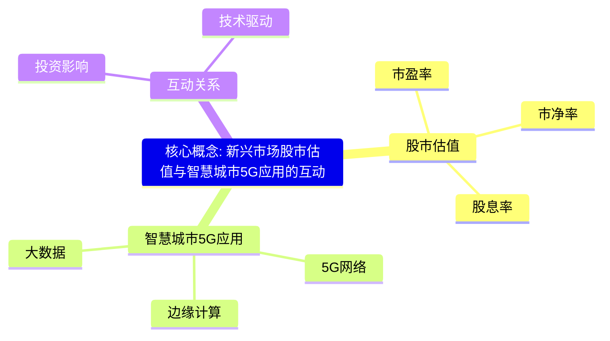
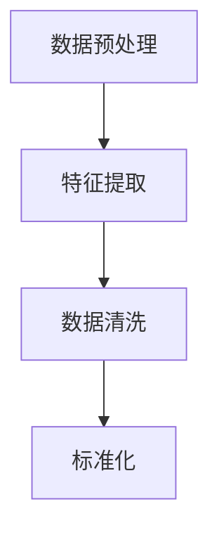
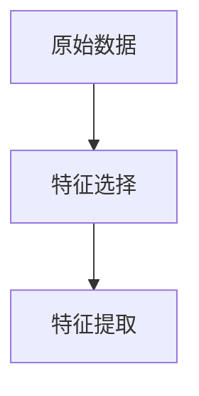
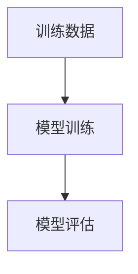
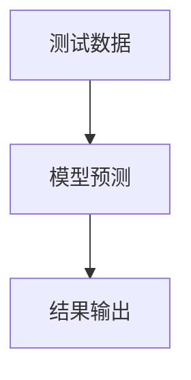
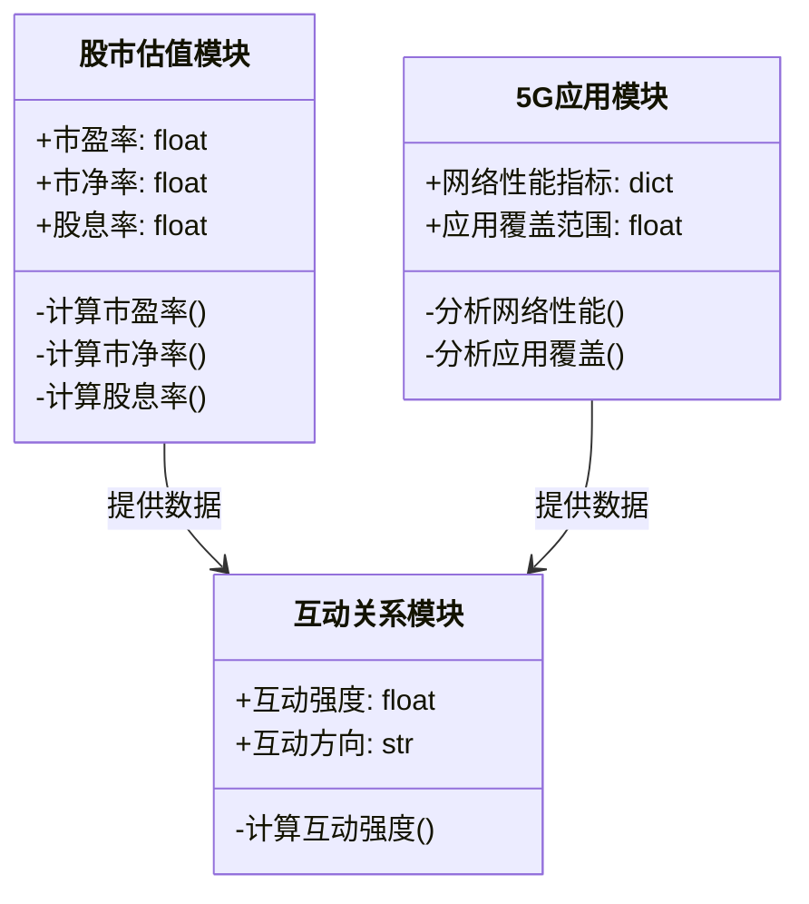

                 


# 新兴市场股市估值与智慧城市5G应用的互动

## 关键词：新兴市场，股市估值，智慧城市，5G应用，互动关系

## 摘要：本文探讨新兴市场股市估值与智慧城市5G应用之间的互动关系，分析其背后的机制和影响。通过背景介绍、核心概念、算法原理、系统分析、项目实战和总结，深入剖析两者互动的数学模型、系统架构及实际案例，为读者提供全面的理解和应用指导。

---

## 第一部分: 背景与概念

### 第1章: 新兴市场股市估值与智慧城市5G应用的互动概述

#### 1.1 问题背景与定义

##### 1.1.1 新兴市场的定义与特点
新兴市场通常指那些经济快速增长、产业结构转型中的国家，如中国、印度等。这些市场具有较高的增长潜力，但也伴随着较高的风险。

##### 1.1.2 智慧城市与5G应用的定义
智慧城市是利用先进技术优化城市资源配置、提高居民生活质量的城市发展模式。5G应用则是指在智慧交通、医疗、教育等领域的5G技术应用。

##### 1.1.3 股市估值与智慧城市5G应用的互动关系
股市估值受5G技术发展的影响，而5G应用的推广又依赖于股市的资金支持，两者相互促进，形成互动。

---

#### 1.2 核心概念与边界

##### 1.2.1 股市估值的核心要素
- 市盈率（P/E）
- 市净率（P/B）
- 股息率（Dividend Yield）

##### 1.2.2 智慧城市5G应用的关键技术
- 5G网络切片
- 边缘计算
- 大数据与人工智能

##### 1.2.3 互动关系的边界与外延
- 股市估值影响5G应用的投资规模
- 5G应用推动股市相关产业的增长

---

## 第二部分: 核心概念与联系

### 第2章: 核心概念与联系

#### 2.1 股市估值与智慧城市5G应用的属性对比

##### 2.1.1 股市估值的属性特征
- 数量化：用具体指标衡量
- 动态性：受市场变化影响
- 风险性：高波动性

##### 2.1.2 智慧城市5G应用的属性特征
- 技术依赖性：依赖5G等先进技术
- 系统性：涉及多个系统协同
- 可扩展性：可扩展至更大范围

##### 2.1.3 属性对比分析
通过对比表格，明确两者的异同点。

| 属性 | 股市估值 | 智慧城市5G应用 |
|------|----------|----------------|
| 数量化 | 是       | 是             |
| 动态性 | 是       | 是             |
| 风险性 | 是       | 否             |

---

#### 2.2 实体关系模型

##### 2.2.1 实体关系图（ER图）
使用Mermaid绘制ER图，展示股市、5G应用、市场参与者之间的关系。

```mermaid
erDiagram
    actor 投资者
    actor 政府
    actor 企业
    database 股市估值
    database 5G应用数据
    database 经济指标
    investor --> 股市估值: 投资
    government --> 股市估值: 政策影响
    企业 --> 5G应用数据: 提供数据
    股市估值 --> 5G应用数据: 影响
```

---

#### 2.3 概念结构与核心要素

##### 2.3.1 概念结构图
使用Mermaid绘制概念图，展示核心要素的层次结构。



---

## 第三部分: 算法原理与流程

### 第3章: 算法原理与流程

#### 3.1 算法选择与原理

##### 3.1.1 机器学习算法的选择
选择随机森林算法，因其适合处理多特征数据，且具有较强的鲁棒性。

##### 3.1.2 算法原理概述
随机森林通过构建多个决策树，并通过投票机制得出最终结果。

---

#### 3.2 算法流程图

##### 3.2.1 数据预处理流程


##### 3.2.2 特征提取流程


##### 3.2.3 模型训练流程


##### 3.2.4 结果预测流程


---

#### 3.3 算法实现代码

##### 3.3.1 数据加载与预处理
```python
import pandas as pd
from sklearn.ensemble import RandomForestRegressor
from sklearn.metrics import mean_squared_error

# 加载数据
data = pd.read_csv('data.csv')

# 特征工程
features = data.drop('target', axis=1)
target = data['target']

# 标准化处理
from sklearn.preprocessing import StandardScaler
scaler = StandardScaler()
features_scaled = scaler.fit_transform(features)

# 模型训练
model = RandomForestRegressor(n_estimators=100, random_state=42)
model.fit(features_scaled, target)

# 预测与评估
predictions = model.predict(features_scaled)
mse = mean_squared_error(target, predictions)
print(f'MSE: {mse}')
```

---

## 第四部分: 系统分析与架构设计

### 第4章: 系统分析与架构设计方案

#### 4.1 问题场景介绍
分析新兴市场中，股市估值与5G应用互动的具体场景，如政策变化对股市和5G应用的影响。

#### 4.2 项目介绍
设计一个系统，用于实时监测股市估值和5G应用的互动关系。

#### 4.3 系统功能设计

##### 4.3.1 领域模型
使用Mermaid类图展示系统功能模块。



---

#### 4.4 系统架构设计

##### 4.4.1 系统架构图
使用Mermaid架构图展示系统的整体架构。


---

## 第五部分: 项目实战

### 第5章: 项目实战

#### 5.1 环境安装

##### 5.1.1 安装Python与依赖
```bash
pip install pandas scikit-learn mermaid4jupyter
```

#### 5.2 系统核心实现源代码

##### 5.2.1 数据加载与预处理
```python
import pandas as pd
import numpy as np

# 加载数据
data = pd.read_csv('data.csv')

# 删除缺失值
data = data.dropna()

# 标准化处理
from sklearn.preprocessing import StandardScaler
scaler = StandardScaler()
data[['feature1', 'feature2']] = scaler.fit_transform(data[['feature1', 'feature2']])

# 模型训练
from sklearn.ensemble import RandomForestRegressor
model = RandomForestRegressor(n_estimators=100)
model.fit(data[['feature1', 'feature2']], data['target'])
```

---

#### 5.3 代码应用解读与分析

##### 5.3.1 代码功能解读
- 数据加载：读取CSV文件
- 数据预处理：删除缺失值，标准化处理
- 模型训练：使用随机森林回归模型

##### 5.3.2 实际案例分析
分析具体案例，如某新兴市场在政策变化后的股市估值与5G应用互动情况。

---

## 第六部分: 总结

### 第6章: 总结

#### 6.1 最佳实践 tips
- 定期更新模型，以反映市场变化
- 结合多种算法，提高预测准确性

#### 6.2 小结
本文通过背景介绍、核心概念、算法原理、系统分析和项目实战，全面探讨了新兴市场股市估值与智慧城市5G应用的互动关系，为相关领域的研究和实践提供了参考。

#### 6.3 注意事项
- 数据来源的可靠性
- 模型的适用性
- 风险提示

#### 6.4 拓展阅读
推荐相关领域的书籍和论文，供读者深入学习。

---

## 作者信息

作者：AI天才研究院/AI Genius Institute & 禅与计算机程序设计艺术 /Zen And The Art of Computer Programming

