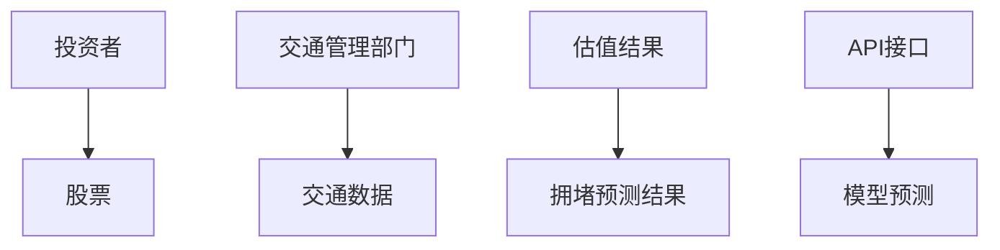

                 


# 新兴市场股市估值与智慧城市交通拥堵预测系统的互动

**关键词：** 新兴市场股市估值、智慧城市、交通拥堵预测、数据共享、模型互动、系统架构

**摘要：**  
本文探讨了新兴市场股市估值与智慧城市交通拥堵预测系统之间的互动关系。通过分析股市估值的核心算法、交通拥堵预测的模型，以及两者的互动机制，提出了一个基于数据共享和模型交互的系统架构。文章详细介绍了系统的功能设计、架构设计、接口设计和交互流程，并通过项目实战展示了如何实现这一系统。最后，总结了研究的意义和未来的研究方向。

---

## 第1章: 背景介绍与核心概念

### 1.1 问题背景与研究意义

#### 1.1.1 新兴市场股市估值的基本概念
股市估值是通过对股票价格的评估来判断其合理性和潜在收益的过程。常用的估值指标包括市盈率（P/E）、市净率（P/B）和现金流折现模型（DCF）。在新兴市场，股市波动性较大，估值模型需要考虑更多的不确定性和外部因素。

#### 1.1.2 智慧城市交通拥堵预测的核心问题
智慧城市交通拥堵预测旨在通过实时数据分析和模型建模，预测交通流量状态，从而优化交通管理。常用的数据来源包括交通传感器、GPS数据和社交媒体信息。

#### 1.1.3 两者的互动关系与研究价值
尽管股市估值和交通拥堵预测看似无关，但它们都依赖于大数据和模型预测。通过共享数据和模型，可以实现两者的互动，例如利用交通数据优化股市估值模型，或利用股市波动预测交通需求变化。

### 1.2 问题描述与边界

#### 1.2.1 股市估值的指标体系
| 指标 | 定义 | 示例 |
|------|------|------|
| 市盈率 | 价格与每股收益的比值 | P/E = 20 |
| 市净率 | 价格与每股净资产的比值 | P/B = 1.5 |
| DCF | 现金流折现模型 | DCF = $100 \text{M} $ |

#### 1.2.2 交通拥堵预测的场景定义
| 场景 | 描述 | 数据来源 |
|------|------|----------|
| 实时预测 | 预测当前交通状态 | 交通传感器、GPS数据 |
| 预测未来拥堵 | 预测未来交通流量 | 历史数据、天气数据 |

#### 1.2.3 互动机制的边界与外延
互动机制主要集中在数据共享和模型交互上，例如：
- 利用交通数据优化股市估值模型。
- 利用股市波动预测交通需求变化。

### 1.3 核心概念与系统框架

#### 1.3.1 核心概念对比表格
| 概念 | 定义 | 属性 | 示例 |
|------|------|------|------|
| 股市估值 | 对股票价格的评估 | 市盈率、市净率、ROE | 上证指数 |
| 交通拥堵预测 | 预测交通流量状态 | 拥挤度、速度、密度 | 城市主干道 |

#### 1.3.2 ER实体关系图
```mermaid
er
  actor(投资者)
  actor(交通管理部门)
  entity(股票)
  entity(交通数据)
  entity(拥堵预测结果)
  entity(股市估值结果)
  relation(投资者 -> 股票: 交易行为)
  relation(交通数据 -> 拥堵预测结果: 数据输入)
  relation(股市估值结果 <-> 拥堵预测结果: 互动关系)
```

---

## 第2章: 股市估值的核心算法

### 2.1 常用估值模型

#### 2.1.1 市盈率模型
市盈率模型通过比较股票的市盈率与行业平均水平，判断其估值是否合理。公式如下：
$$ P/E = \frac{Price}{Earnings} $$

#### 2.1.2 市净率模型
市净率模型通过比较股票的市净率与行业平均水平，判断其估值是否合理。公式如下：
$$ P/B = \frac{Price}{Book\ Value} $$

#### 2.1.3 现金流折现模型
现金流折现模型通过折现未来现金流来评估股票的内在价值。公式如下：
$$ DCF = \sum_{t=1}^{n} \frac{CF_t}{(1+r)^t} + \frac{TV}{(1+r)^n} $$

### 2.2 股市估值的数学公式

#### 2.2.1 市盈率公式
$$ P/E = \frac{Price}{Earnings} $$

#### 2.2.2 现金流折现公式
$$ DCF = \sum_{t=1}^{n} \frac{CF_t}{(1+r)^t} + \frac{TV}{(1+r)^n} $$

### 2.3 估值模型的实现代码

```python
def calculate_pe(stock_price, earnings):
    return stock_price / earnings

def calculate_pb(stock_price, book_value):
    return stock_price / book_value

def calculate_dcf(cash_flows, discount_rate, terminal_value):
    dcf = 0
    for t in range(len(cash_flows)):
        dcf += cash_flows[t] / (1 + discount_rate) ** t
    dcf += terminal_value / (1 + discount_rate) ** len(cash_flows)
    return dcf
```

---

## 第3章: 智慧城市交通拥堵预测的核心算法

### 3.1 常用预测模型

#### 3.1.1 时间序列模型
时间序列模型通过分析历史数据，预测未来的交通流量。常用算法包括ARIMA和LSTM。

#### 3.1.2 空间模型
空间模型通过分析交通网络的空间关系，预测拥堵情况。常用算法包括空间自相关模型。

#### 3.1.3 综合模型
综合模型结合时间序列和空间模型，考虑多因素影响。常用算法包括深度学习模型和贝叶斯网络。

### 3.2 交通拥堵预测的数学公式

#### 3.2.1 时间序列模型公式
$$ y_t = \alpha y_{t-1} + \beta \epsilon_t $$

#### 3.2.2 综合模型公式
$$ y_t = \sum_{i=1}^{n} \theta_i x_i + \beta \epsilon_t $$

### 3.3 交通拥堵预测的实现代码

```python
def calculate_arima(data, order):
    model = ARIMA(data, order=order)
    model_fit = model.fit(disp=0)
    forecast = model_fit.forecast(steps=1)
    return forecast[0]

def calculate_lstm(data, units):
    model = Sequential()
    model.add(LSTM(units, input_shape=(1, 1)))
    model.add(Dense(1))
    model.compile(loss='mean_squared_error', optimizer='adam')
    model.fit(data, epochs=100, batch_size=32)
    return model
```

---

## 第4章: 互动机制与系统架构

### 4.1 互动机制的实现

#### 4.1.1 数据共享
通过API接口共享交通数据和股市数据，例如：
- 交通传感器数据
- 股票价格数据

#### 4.1.2 模型交互
通过模型接口进行模型预测和结果反馈，例如：
- 利用交通数据优化股市估值模型
- 利用股市波动预测交通需求变化

### 4.2 系统架构设计

#### 4.2.1 系统功能设计
| 功能模块 | 描述 |
|----------|------|
| 数据采集 | 采集交通数据和股市数据 |
| 数据处理 | 对数据进行清洗和预处理 |
| 模型预测 | 使用估值模型和拥堵模型进行预测 |
| 结果交互 | 输出预测结果并进行反馈 |

#### 4.2.2 系统架构图


---

## 第5章: 项目实战

### 5.1 环境安装

#### 5.1.1 安装Python环境
使用Anaconda安装Python 3.8及以上版本。

#### 5.1.2 安装依赖库
安装以下库：
- numpy
- pandas
- scikit-learn
- keras
- tensorflow

### 5.2 系统核心实现源代码

#### 5.2.1 数据采集代码
```python
import requests
import json

def get_stock_data(api_key):
    url = f"https://api.example.com/stock?api_key={api_key}"
    response = requests.get(url)
    return json.loads(response.text)

def get_traffic_data(api_key):
    url = f"https://api.example.com/traffic?api_key={api_key}"
    response = requests.get(url)
    return json.loads(response.text)
```

#### 5.2.2 数据处理代码
```python
import pandas as pd

def process_stock_data(data):
    df = pd.DataFrame(data)
    df['PE'] = df['Price'] / df['Earnings']
    return df

def process_traffic_data(data):
    df = pd.DataFrame(data)
    df['Speed'] = df['Speed'] / df['Density']
    return df
```

#### 5.2.3 模型预测代码
```python
from sklearn.

