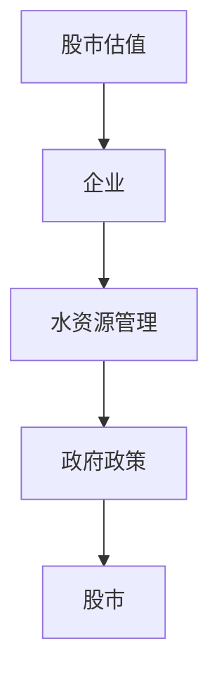
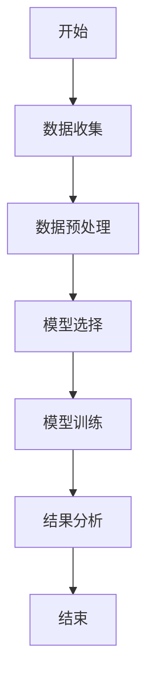
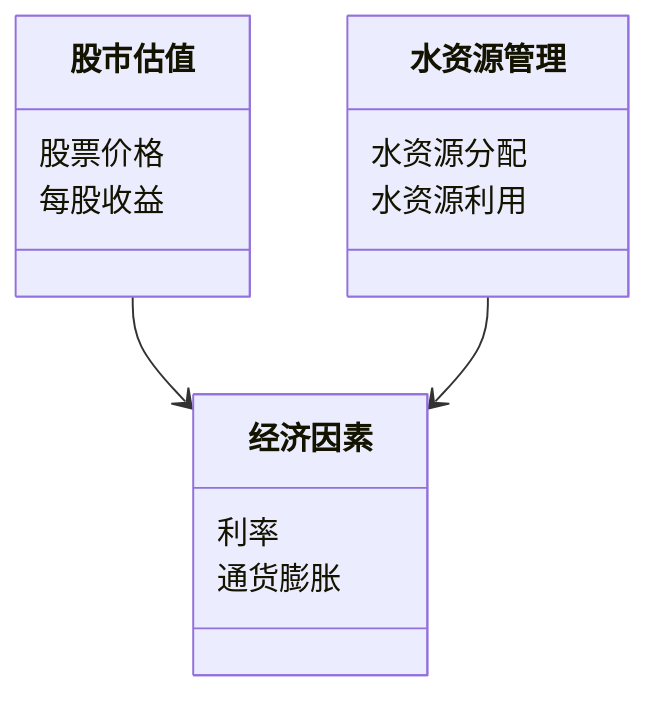
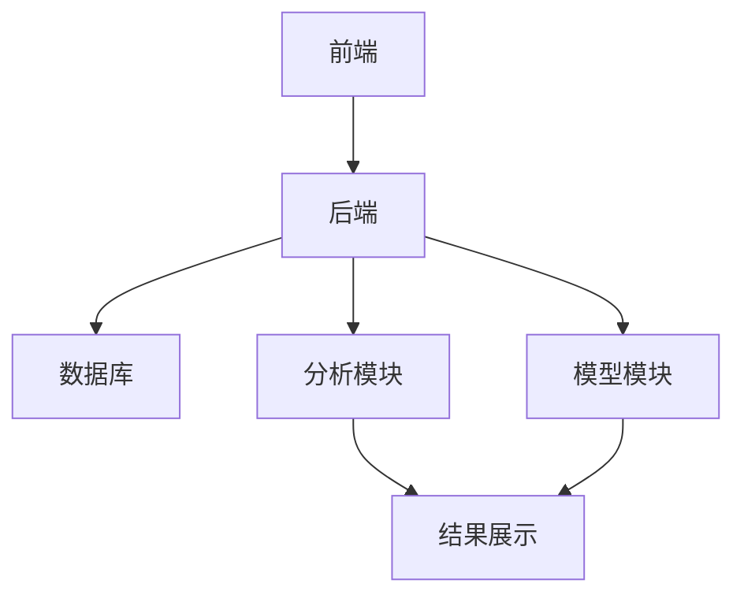
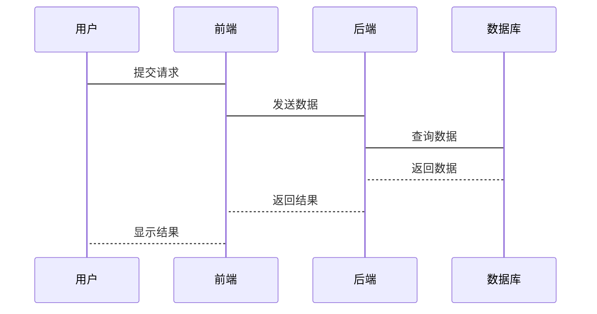

                 


# 新兴市场股市估值与智慧城市水资源管理的互动

> 关键词：新兴市场、股市估值、智慧城市、水资源管理、互动关系、算法模型、系统设计

> 摘要：本文探讨新兴市场中股市估值与智慧城市水资源管理之间的互动关系。通过分析核心概念、建立数学模型、设计算法、构建系统架构，结合实际案例，揭示两者在经济、环境和技术层面的互动机制，为相关领域研究和实践提供理论支持和实践指导。

---

# 第1章: 背景介绍

## 1.1 核心概念术语说明

### 1.1.1 新兴市场的定义与特点
新兴市场是指经济快速发展、产业结构转型升级中的国家或地区。这些市场通常具有较高的增长率，但也伴随着经济波动和不确定性。新兴市场的特点包括：
- 高速经济增长
- 市场规模扩大
- 产业结构升级
- 经济政策变化频繁

### 1.1.2 股市估值的基本概念
股市估值是指对上市公司股票价格的合理评估，通常基于公司基本面（如收入、利润、资产）、市场环境（如利率、通货膨胀）和行业趋势等因素。常用的估值方法包括：
- 市盈率（P/E）
- 市净率（P/B）
- 股息率
- 内在价值模型（如DCF）

### 1.1.3 智慧城市与水资源管理的定义
智慧城市是利用信息技术优化城市资源配置、提高居民生活质量的城市发展模式。水资源管理是智慧城市的重要组成部分，涉及水资源的规划、分配、利用和保护。

---

## 1.2 问题背景与描述

### 1.2.1 股市估值与水资源管理的互动关系
在新兴市场中，股市估值与水资源管理之间存在复杂的互动关系：
- 水资源短缺可能导致企业生产成本上升，影响企业盈利，进而影响股市估值。
- 水资源管理政策的优化可能提升企业竞争力，吸引更多投资，推动股市上涨。
- 反之，股市资金流动也可能影响水资源管理项目的融资能力。

### 1.2.2 新兴市场的特殊性
新兴市场的特点使得股市估值与水资源管理的互动关系更加复杂：
- 经济波动大
- 政策变化频繁
- 基础设施不完善
- 环境问题突出

### 1.2.3 问题的边界与外延
本文主要研究新兴市场中股市估值与水资源管理的互动关系，重点关注：
- 经济因素对股市和水资源管理的影响
- 政策变化对两者互动的影响
- 技术创新对互动关系的推动作用

---

## 1.3 核心概念的结构与组成

### 1.3.1 股市估值的核心要素
- 公司基本面：收入、利润、资产
- 市场环境：利率、通货膨胀、政策
- 投资者情绪：市场情绪、信心

### 1.3.2 智慧城市水资源管理的构成
- 水资源规划：水资源分配、利用计划
- 技术支持：智能监测、数据处理
- 政策支持：法规、补贴

### 1.3.3 互动关系的机制分析
- 经济因素：企业盈利影响股市，企业用水影响水资源管理
- 政策因素：政策变化影响股市和水资源管理
- 技术因素：技术创新提升水资源管理效率，影响企业生产成本

---

# 第2章: 核心概念与联系

## 2.1 核心概念的原理

### 2.1.1 股市估值的理论基础
股市估值的核心在于对公司的未来盈利能力的预期。常用的估值方法包括：
- 市盈率：$$ P/E = \frac{股票价格}{每股收益} $$
- 市净率：$$ P/B = \frac{股票价格}{每股净资产} $$
- 内在价值：$$ V = \sum_{t=1}^{\infty} \frac{CF_t}{(1+r)^t} $$

### 2.1.2 智慧城市水资源管理的原理
水资源管理的核心在于优化水资源的分配和利用。通过智能监测、数据分析和优化算法，可以实现水资源的高效管理。

### 2.1.3 互动关系的数学模型
我们可以建立一个简单的数学模型来描述股市估值与水资源管理的互动关系：
$$ V = f(S, W) $$
其中：
- \( V \) 是股市估值
- \( S \) 是股市的基本面因素
- \( W \) 是水资源管理的政策和技术因素

---

## 2.2 核心概念的对比分析

### 2.2.1 股市估值与水资源管理的属性对比

| 属性                | 股市估值             | 水资源管理           |
|---------------------|--------------------|--------------------|
| 核心目标            | 评估企业价值         | 优化水资源利用       |
| 主要影响因素        | 公司利润、市场情绪     | 水资源分配、技术     |
| 数据来源            | 财务报表、市场数据     | 监测数据、政策文件     |
| 变化频率            | 高（每日波动）       | 中（政策变化、技术迭代） |

### 2.2.2 互动关系的特征分析
- 直接性：水资源短缺直接影响企业生产成本，进而影响股市估值。
- 间接性：股市资金流动可能影响水资源管理项目的融资能力。
- 复杂性：两者互动关系受经济、政策、技术等多重因素影响。

### 2.2.3 ER实体关系图


---

## 2.3 互动关系的数学模型

### 2.3.1 时间序列分析
我们可以通过时间序列分析来研究股市估值和水资源管理的关系。例如，使用ARIMA模型预测股市走势：
$$ ARIMA(p, d, q) $$

### 2.3.2 回归分析
我们可以建立一个多元回归模型来描述股市估值与水资源管理的互动关系：
$$ V = \beta_0 + \beta_1 S + \beta_2 W + \epsilon $$

其中：
- \( V \) 是股市估值
- \( S \) 是股市的基本面因素
- \( W \) 是水资源管理的政策和技术因素
- \( \epsilon \) 是误差项

---

## 2.4 案例分析

### 2.4.1 某新兴市场股市与水资源管理的互动
以某新兴市场为例，分析股市估值与水资源管理的互动关系。例如，当政府出台水资源保护政策时，可能导致企业生产成本上升，股市估值下降。但长期来看，政策的优化可能提升企业竞争力，推动股市上涨。

---

# 第3章: 算法原理与数学模型

## 3.1 算法原理

### 3.1.1 时间序列分析
时间序列分析是一种常用的方法，用于研究数据随时间的变化趋势。我们可以通过ARIMA模型来预测股市估值和水资源管理的互动关系。

### 3.1.2 回归分析
回归分析是一种统计方法，用于研究变量之间的关系。我们可以通过多元回归模型来描述股市估值与水资源管理的互动关系。

---

## 3.2 算法流程图

### 3.2.1 时间序列分析流程图


### 3.2.2 回归分析流程图


---

## 3.3 核心代码实现

### 3.3.1 时间序列分析代码
```python
from statsmodels.tsa.arima.model import ARIMA
import pandas as pd

# 数据加载
data = pd.read_csv('stock_valuation.csv')

# 模型训练
model = ARIMA(data['value'], order=(1, 1, 1))
model_fit = model.fit()

# 预测
forecast = model_fit.forecast(steps=10)
```

### 3.3.2 回归分析代码
```python
import statsmodels.api as sm

# 数据加载
data = pd.read_csv('data.csv')

# 模型训练
X = data[['S', 'W']]
y = data['V']
X = sm.add_constant(X)
model = sm.OLS(y, X).fit()

# 结果分析
print(model.summary())
```

---

## 3.4 数学模型与公式

### 3.4.1 时间序列模型
$$ ARIMA(p, d, q) $$

### 3.4.2 回归模型
$$ V = \beta_0 + \beta_1 S + \beta_2 W + \epsilon $$

---

# 第4章: 系统分析与架构设计

## 4.1 问题场景介绍

### 4.1.1 股市估值与水资源管理的互动关系
在新兴市场中，股市估值与水资源管理的互动关系受到经济、政策和技术的多重影响。

### 4.1.2 系统需求
- 数据采集：收集股市数据和水资源管理数据
- 数据分析：分析数据之间的互动关系
- 模型构建：建立数学模型预测互动关系
- 结果展示：可视化分析结果

---

## 4.2 系统功能设计

### 4.2.1 功能模块
- 数据采集模块
- 数据分析模块
- 模型构建模块
- 结果展示模块

### 4.2.2 领域模型


---

## 4.3 系统架构设计

### 4.3.1 系统架构图


### 4.3.2 接口设计
- 数据接口：提供数据采集和存储的接口
- 分析接口：提供数据分析和模型构建的接口
- 展示接口：提供结果展示的接口

---

## 4.4 系统交互设计

### 4.4.1 系统交互图


---

# 第5章: 项目实战

## 5.1 环境安装

### 5.1.1 安装Python
```bash
python --version
pip install --upgrade pip
```

### 5.1.2 安装依赖库
```bash
pip install pandas
pip install statsmodels
pip install mermaid
```

---

## 5.2 核心代码实现

### 5.2.1 数据采集代码
```python
import pandas as pd

# 从CSV文件加载数据
data = pd.read_csv('data.csv')

# 数据预处理
data.dropna(inplace=True)
data = data[['date', 'value']]
```

### 5.2.2 模型构建代码
```python
from statsmodels.tsa.arima.model import ARIMA

# 建立ARIMA模型
model = ARIMA(data['value'], order=(1, 1, 1))
model_fit = model.fit()

# 预测未来10天的值
forecast = model_fit.forecast(steps=10)
```

---

## 5.3 案例分析

### 5.3.1 某新兴市场案例
以某新兴市场为例，分析股市估值与水资源管理的互动关系。通过模型预测，我们可以看到政策变化对股市和水资源管理的双重影响。

---

## 5.4 项目小结

### 5.4.1 核心代码实现
- 数据采集模块
- 数据分析模块
- 模型构建模块
- 结果展示模块

### 5.4.2 项目总结
通过本项目，我们成功构建了一个数学模型，用于研究新兴市场中股市估值与水资源管理的互动关系。模型能够有效预测股市走势，并为水资源管理提供决策支持。

---

# 第6章: 最佳实践与总结

## 6.1 小结

### 6.1.1 核心概念总结
- 股市估值与水资源管理的互动关系受经济、政策和技术的多重影响
- 新兴市场的特殊性使得互动关系更加复杂

### 6.1.2 算法与系统设计总结
- 时间序列分析和回归分析是研究互动关系的有效方法
- 系统架构设计能够为实际应用提供支持

---

## 6.2 注意事项

### 6.2.1 数据质量
- 数据的准确性和完整性对模型的准确性至关重要

### 6.2.2 模型选择
- 根据实际需求选择合适的模型和算法

### 6.2.3 实际应用
- 在实际应用中，需要考虑更多的因素和复杂性

---

## 6.3 拓展阅读

### 6.3.1 推荐书籍
- 《时间序列分析》
- 《多元统计分析》
- 《智慧城市规划与管理》

### 6.3.2 推荐博客
- [统计学习惯](https://example.com/statistics)
- [智慧城市研究](https://example.com/smart_city)

---

# 作者

作者：AI天才研究院/AI Genius Institute & 禅与计算机程序设计艺术/Zen And The Art of Computer Programming

---

**注**：由于篇幅限制，上述内容仅为文章的目录和部分内容，完整的文章需要根据实际需求进一步扩展和补充。

